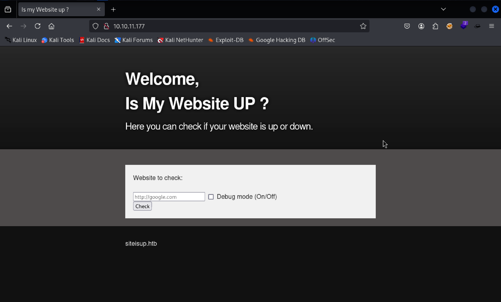
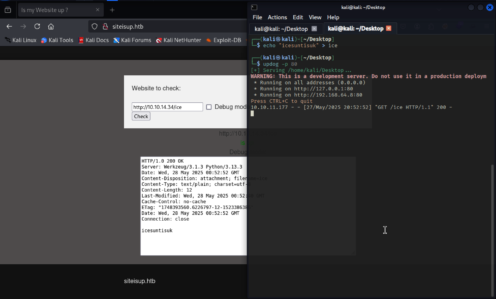
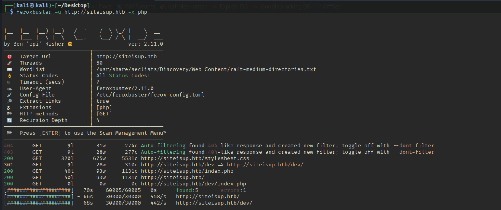
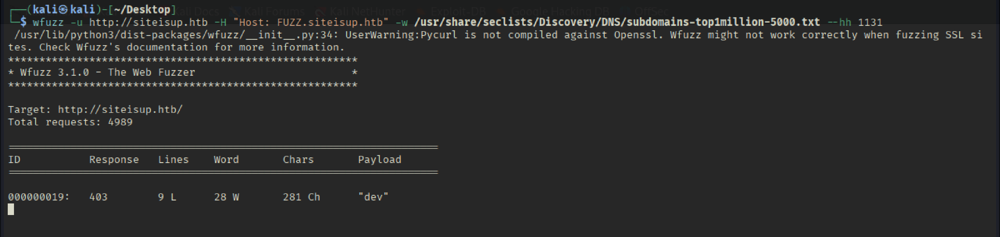

# Recon

```bash
sudo ../Tools/scan.sh 10.10.11.177
[sudo] password for kali: 
[*] Running rustscan...
[*] Running nmap on ports: 22,80
Starting Nmap 7.95 ( https://nmap.org ) at 2025-05-27 08:42 EDT
Nmap scan report for 10.10.11.177
Host is up (0.036s latency).

PORT   STATE SERVICE VERSION
22/tcp open  ssh     OpenSSH 8.2p1 Ubuntu 4ubuntu0.5 (Ubuntu Linux; protocol 2.0)
| ssh-hostkey: 
|   3072 9e:1f:98:d7:c8:ba:61:db:f1:49:66:9d:70:17:02:e7 (RSA)
|   256 c2:1c:fe:11:52:e3:d7:e5:f7:59:18:6b:68:45:3f:62 (ECDSA)
|_  256 5f:6e:12:67:0a:66:e8:e2:b7:61:be:c4:14:3a:d3:8e (ED25519)
80/tcp open  http    Apache httpd 2.4.41 ((Ubuntu))
|_http-title: Is my Website up ?
|_http-server-header: Apache/2.4.41 (Ubuntu)
Service Info: OS: Linux; CPE: cpe:/o:linux:linux_kernel

Service detection performed. Please report any incorrect results at https://nmap.org/submit/ .
Nmap done: 1 IP address (1 host up) scanned in 7.99 seconds
                                                                             
```


## TCP 80 



ทดสอบโดยนการสร้างไฟล์และเปิด http ให้ดาวโหลดได้ 

```bash
echo "icesuntisuk" > ice
updog -p 80 
```



จากภาพเราจะพบว่ามี connection ไปเครื่องผู้โจมตีได้ อีกทั้งยังสามารถส่งข้อความดังกล่าวไปยังเครื่องเป้าหมายได้เช่นกัน แต่เราก็ยังไม่ได้ข้อมูลที่มีความสำคัญมากนัก 

## Directory Brute force 

```bash
feroxbuster -u http://siteisup.htb -x php
```



จากการทำ Directory Brute force จะพบว่ามี /dev ซึ่งพอเปิดเข้าไปก็ไม่มีอะไร 

## Sub Domain Brute force 

```bash

wfuzz -u http://siteisup.htb -H "Host: FUZZ.siteisup.htb" -w /usr/share/seclists/Discovery/DNS/subdomains-top1million-5000.txt


wfuzz -u http://siteisup.htb -H "Host: FUZZ.siteisup.htb" -w /usr/share/seclists/Discovery/DNS/subdomains-top1million-5000.txt --hh 1131 
```


ก่อนอื่น wfuzz โดยไม่มีตัวกรองใดๆ และเราจะพบว่า reponse มีขนาด 1131 ตัวอักษรจำนวนมาก จึงดำเนินการ ctrl-c เพื่อล้างสิ่งที่ไม่สนใจ และเพิ่ม --hh 1131 และเรียกใช้อีกครั้งจะพบว่ามี dev อยู่และเราสามารถเพิ่ม dev.siteisup.htb เข้าไปในไฟล์ /etc/hosts 

# Get Source Code

## Identify .git Repo

```bash
feroxbuster -u http://siteisup.htb/dev --depth 2 -x git
```

จากตัวอย่างด้านบนจะทำให้เราทราบว่าภายใต้ /dev/.git เราสามารถ dump ออกมาได้ 

## Git Dump
```bash
git clone https://github.com/internetwache/GitTools.git 
cd GitTools

./../Tools/GitTools/Dumper/gitdumper.sh http://siteisup.htb/dev/.git . 
git checkout .
git status 
```


