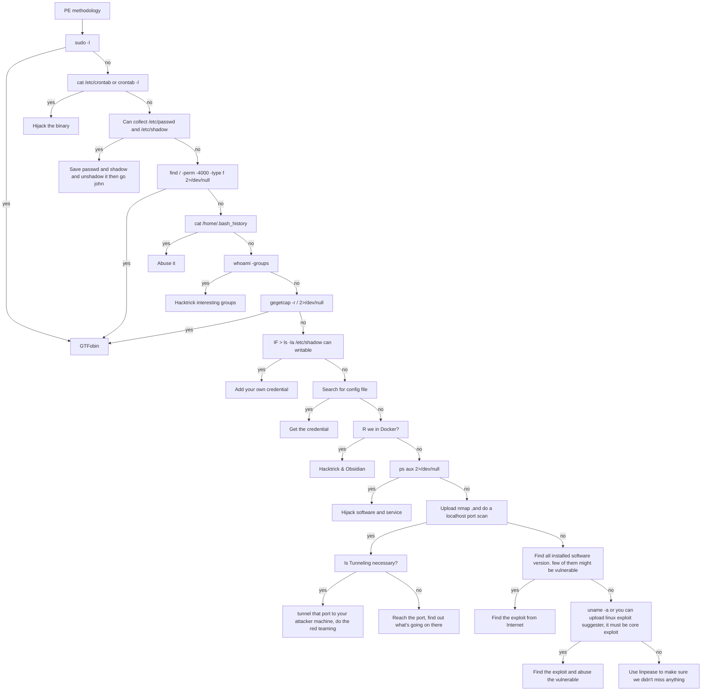

# บทบันทึกการเดินทางไปสู่ OSCP ของ IceSuntisuk

# Indexing 
- [บทบันทึก](#บทบันทึด)
- [OSCP Overview](#oscp-overview)
- [Linux Priv](#linux-privilege-escalation)

# บทบันทึก
Day 1 @ 13 Jan 2025 

## เล่าไปเรื่อย
ในที่สุดก็ถึงเวลาที่จะเริ่มเตรียมตัวสำหรับการสอบ OSCP เสียที หลังจากที่รอคอยโอกาสและพยายามหางบประมาณหรืออีเวนต์ที่เปิดโอกาสให้เรียนและสอบมาเป็นเวลานาน ส่วนตัวได้รับโอกาสอันล้ำค่าในการเข้าร่วมงาน The Red Guardian Capture The Flag 2025 ซึ่งจัดโดยสำนักข่าวกรองแห่งชาติ โดยเงื่อนไขของการแข่งขันนี้คือ ผู้ที่สามารถทำคะแนนได้ในลำดับที่ 1-15 จะได้รับสิทธิ์ในการเรียนและสอบ OSCP โชคดีที่ทีมของเราเป็นหนึ่งในผู้ที่ผ่านเข้ารอบ และในรอบสุดท้าย ทีมของเรายังสามารถคว้าลำดับที่ 2 และ 3 มาได้ ซึ่งเป็นจุดเริ่มต้นที่ทำให้เส้นทาง OSCP Journey ของเราวันนี้เป็นจริงได้ ถือว่าเป็นโอกาสสำคัญที่ช่วยผลักดันความฝันให้กลายเป็นความจริง!

# OSCP Overview 

จากข้อมูลที่ได้ศึกษามา การสอบ OSCP (Offensive Security Certified Professional) มีระยะเวลาการสอบ 24 ชั่วโมง โดยผู้สอบจะต้องทำคะแนนให้ได้ไม่น้อยกว่า 70 คะแนน เพื่อผ่านเกณฑ์ หลังจากนั้นผู้สอบจะมีเวลาอีก 24 ชั่วโมง ในการจัดทำรายงานเพื่อส่งให้กับทาง Offensive Security เป็นส่วนหนึ่งของการประเมินผล สิ่งที่น่าสนใจเกี่ยวกับการสอบ OSCP รุ่นปัจจุบันนั้นให้ความสำคัญกับ Buffer Overflow (BoF) ลดลง แต่จะเน้นไปที่ การเจาะระบบ Active Directory (AD) แทน โดยคะแนนในส่วนนี้สูงถึง 40 คะแนน จากคะแนนรวมทั้งหมด นั่นหมายความว่า การสามารถเจาะระบบ Active Directory ได้สำเร็จ จะเพิ่มโอกาสอย่างมากในการผ่านการสอบ OSCP เนื่องจากคะแนนในส่วนนี้มีความสำคัญและสามารถช่วยให้ผู้สอบผ่านเกณฑ์ได้อย่างมั่นใจ

---
## หัวข้อความรู้ที่สำคัญก่อนนำไปสอบ
- Windows Basic
    - System Administration
    - User Account Management 
    - Commandline 
    - Powershell command 
    - Group policy in AD 
    - Services Management 
- Linux Basic 
    - File and Direcrtory Structure 
    - System Admin
    - User and Group Management 
    - File Management and Access Control 
    - Service Management 
    - Basic Bash shell 
- Networking Basic 
    - TCP/IP
    - Basic network communication
    - OSI Model 
    - Subnetting ad NAT 
    - Proxy and Tunneling 
- Web App Basic 
    - Client Server Architecture 
    - HTTP and HTTPS 
    - Request/Response 
    - HTTP Headers 
    - Status code and error
- Programming 
    - Basic programming 
    - Ability to read and modify code 
    - Python
    - Error and Exception handling 
- Cryptography 
    - Encryp/Decrypt, Encode/Decode and Hasging 
    - PKI (Public key Infrastructure)
    - Crypto Application: SSH, VPN, NTLM 

--- 

เนื่องจากว่าความรู้ที่มีเกี่ยวกับ Windows Hacking เรามีน้อยมากจึงไปหาช่องทางธรรมชาติที่เหมาะสมกับการเรียนรู้มาดู ได้ช่อง Youtube ของ [IppSec](https://youtu.be/2DqdPcbYcy8?si=K7W00jVowK47y5IW) มาก็ลองลุยเพิ่มเติมดู​ โดยต่อจากนี้จะอิงจาก methodology การโจมตีต่างๆ ที่เกี่ยวข้อง 

# เตรียมเครื่องมือให้พร้อม 

- CherryTree ใช้สำหรับจดบันทึกการโจมตีต่างๆ ที่เราได้ดำเนินการไป 

```bash
# macos install cherrytree
brew install cherrytree

```


# Linux Privilege escalation

